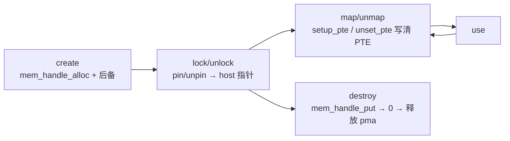

# KMD 内存与页表

> 这一区讲 kmd 怎么管理 GPU 可见内存：内存模型与分配生命周期，以及给每个 GPU 虚拟地址做后备的多级页表。

## 本区页面

- 本页：内存模型（堆 / NUMA-UMA / DSMEM / cache 策略）+ [[mem_handle]] 生命周期。
- [[aigc_page_table]]：4 级页表遍历、引用计数、TLB 失效、dump。
- [[aigc_devm]]：显存堆与 gen_pool/NUMA 池分配器。

---

## 内存模型：堆

每次分配用 `enum MemHeap`（`aigc_mem_handle.h`）选后备存储：

| 堆 | 含义 |
|---|---|
| `MH_HOST` | 系统（host）内存；设备不能直接访问。 |
| `MH_DEVICE` | 设备本地内存（显存 VRAM）。 |
| `MH_OTHER_DEVICE` | 另一个 PCI 设备（peer）上的内存。 |

堆同时决定「页从哪来」和页表保护基位（`__heap_to_pte_prot()`：`AIP_MP_SYS_MEM` / `AIP_MP_DEV_MEM` / `AIP_MP_PCI_MEM`）。

- **设备（VRAM）**：从每 cluster 的显存 gen_pool 取，由 `mem_handle_dev_mem_alloc()` 服务（见 [[aigc_devm]]）。
- **Host/系统**：要么登记一个已有用户指针，要么分配并 pin 页（`mem_handle_pin_sys_mem()` / `mem_handle_sys_mem_alloc()`），再 DMA-map。

## mem_handle 生命周期

由 `AIP_MEM_*` ioctl（见 [[wiki/grace/kmd/ioctl/ioctl-abi]]）和 `mem_handle_*` API 驱动：

1. **Create** — `mem_handle_alloc()` 后给句柄后备：设备内存 `mem_handle_dev_mem_alloc()`，或 host 页 `mem_handle_pin_sys_mem()` / `mem_handle_sys_mem_alloc()`。（`AIP_MEM_CREATE`）
2. **Lock/unlock** — `aigc_mem_lock`/`aigc_mem_unlock` pin/unpin 并交回 host 指针；`AIGC_MLF_PIN` 让设备内存常驻直到 unpin。（`AIP_MEM_LOCK`/`AIP_MEM_UNLOCK`）
3. **Map/unmap** — 用 `aigc_mem_handle_map_pte()` / `aigc_mem_handle_setup_pte()` 在 GPU VA 处写 PTE，`mem_handle_unset_pte()` 清掉。（`AIP_MEM_MAP`/`AIP_MEM_UNMAP`）
4. **Destroy** — `mem_handle_close()` / `mem_handle_put()` 减 kref，归零时释放后备 `aigc_vm_pma`（`vm_pma_free`）。（`AIP_MEM_DESTROY`）

> 关键区分：描述符 [[mem_handle]] 和物理后备 `struct aigc_vm_pma` 各自引用计数。软件 VA 区间在
> `struct aigc_vm_vma` / `aigc_vm_vma_va`。

## NUMA 放置与 UMA 交织

设备内存放置由 `enum MemNuma` 选：

- **`DEV_NUMA`** — 绑到一个设备 NUMA 节点（`numa_node`），从该节点 gen_pool 取；映射带 `AIP_MP_NUMA` 位。
- **`DEV_UMA`** — 跨所有设备节点交织（条带化）；`pma->numa_node == 0xff` 标记 UMA，后备均分到 `NUMA_NUM` 个池（各按 `size/NUMA_NUM` 释放）；映射带 `AIP_MP_UMA` 位。

UMA 交织粒度（VA 如何在 channel 间条带化）是 `struct aigc_vm_pgt_attr.interleave_mode`
（`AIGC_VA_INTERLEAVE_*`：none/256B/1KB/2KB/4KB），由 `interleave_gran` 模块参数设定（见 [[wiki/grace/kmd/env|环境]]）。

## DSMEM（设备共享 / peer 内存）

`AIGC_MHT_DSMEM` 类型让一个设备寻址另一个设备的本地内存。它的 GPU VA 不从池里分，而是**从目标
`gpu_id`/`die_id` 和封装模式算出来**，锚定在 `DSMEM_ADDR_START`（`0x800000000000`）：

- **2-die**（`PACKAGE_2DIE`）：bit 37 = `die_id`（1 位），bit 38–47 = `gpu_id`。
- **4-die**（`PACKAGE_4DIE`）：bit 37–38 = `die_id`（2 位），bit 39–47 = `gpu_id`。

`DSMEM_VA()` / `DSMEM_DPA()` 宏负责编码。DSMEM 句柄跳过 VA 分配器（它已自带 `dva`），匹配 DPA 在
`mem_handle_dev_mem_alloc()` 时推导。

## Cache 与访问策略

`mem_handle.flags`（`AIGC_MF_*`）经 `aigc_calc_pte_prot()` 翻成硬件 PTE 保护字，OR 组合：堆基位、NUMA/UMA、
只读（`AIGC_MF_RO`→`AIP_MP_RO`）、可执行（`AIGC_MF_EXECUTABLE`→`AIP_MP_EXE`）、原子（`AIGC_MF_ATO`→`AIP_MP_ATO`）。
peer AIP id 可用 `AIP_MP_SET_AIP_ID()` 盖进保护字最高字节，使映射路由到正确的 peer 设备。

## 延伸

- [[aigc_page_table]]：把 `dva` 翻成物理页的 4 级遍历。
- [[aigc_devm]]：显存堆与 gen_pool。
- [[mem_handle]] | [[aigc_vm]]
