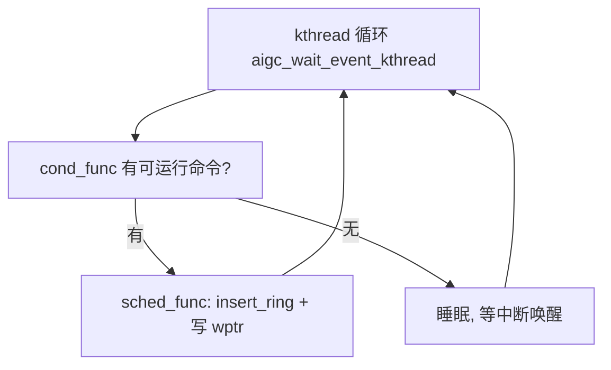

# aigc_sched — 命令调度器

**文件**: `kmd/aigc/kmdlib/aigc_sched.c`（每环 kthread）、`aigc_default_scheduler.c`（默认策略）
**关联**: [[aigc_cp_ring]] | [[wiki/grace/kmd/queue/index|命令队列与调度]]

> 派发由「每环一个内核线程」+「可插拔策略」驱动。线程负责循环，策略负责「下一条跑哪个」。

---

## 每环 kthread（`aigc_sched.c`）

`aigc_sched_init()` 选活动调度器（`lib_dev_select_scheduler()` 恒选 `DEFAULT_SCHEDULER`）并拉起
`COMPUTE_ENGINE` 环。`init_eng_scheduler()` 做每引擎初始化：

1. 分配每引擎队列自旋锁/互斥锁，以及队列和 run-command 列表；
2. 经引擎的 `ring_create` op 创建硬件命令环；
3. 起一个 kthread（`aigc_wait_event_kthread`），跑活动调度器的 `cond_func` / `sched_func` 对。

kthread 循环：`cond_func` 偷看下一条可运行命令；有就 `sched_func` 把它插进环并推进写指针。存在但未使能的环
（如未用的 codec 环）跳过建线程。

## 默认策略（`aigc_default_scheduler.c`）

- `aigc_default_sched_cond_func()` 把下一条可运行命令锁存到 `sched->current_cmd`，并报告是否有活待办。
- `aigc_peek_cmd()` 按优先级选下一条：先上一轮带过来的（`current_cmd`），再高优队列（`hi_queue`），再从
  `cached_queue_head` 起对所有队列轮询（round-robin）。`aigc_queue_peek_cmd()` 在每队列自旋锁下弹出队头（FIFO）。
- `aigc_default_sched_func()` 取锁存的命令，调 `aigc_insert_ring()`（把包拷进 CP 环），记为 running，再
  `aigc_ring_update_wptr()` 按 doorbell。`aigc_insert_ring()` 成功返回 0，所以成功分支是 `!aigc_insert_ring(...)`；
  非 0（如满环 `-EAGAIN`）则保留 `current_cmd`，下一轮重试。

当 `ITR_KERNEL_MOD_FENCE` 使能时，`aigc_insert_ring()` 还会在插入前把命令的预期完成时间戳盖进 CP 包
（`aigc_ts_copy()`），插入失败则回滚软时间戳。

> 唤醒模型：kthread 由进度中断唤醒后重扫队列，所以新入队的命令、以及上次因满环没塞进去的命令，会在下一趟被捡起。

## 给应届生：为什么要一个内核线程来调度？

ioctl 提交命令时只是把命令挂进队列就返回了（不阻塞用户）。真正「往环里塞 + 按 doorbell」是异步的，由
kthread 在合适时机做——这样用户态提交快、硬件忙不过来时命令在队列里排着、环满了能重试，三者解耦。这正是
GPU 驱动「提交」与「执行」分离的经典做法。

## 延伸

- [[aigc_cp_ring]]：`insert_ring` / 写 wptr 的环细节。
- [[wiki/grace/kmd/interrupt/index|中断与 Fence]]：进度中断怎么唤醒 kthread、完成怎么通知。
- [[wiki/grace/kmd/queue/index|命令队列与调度]]
