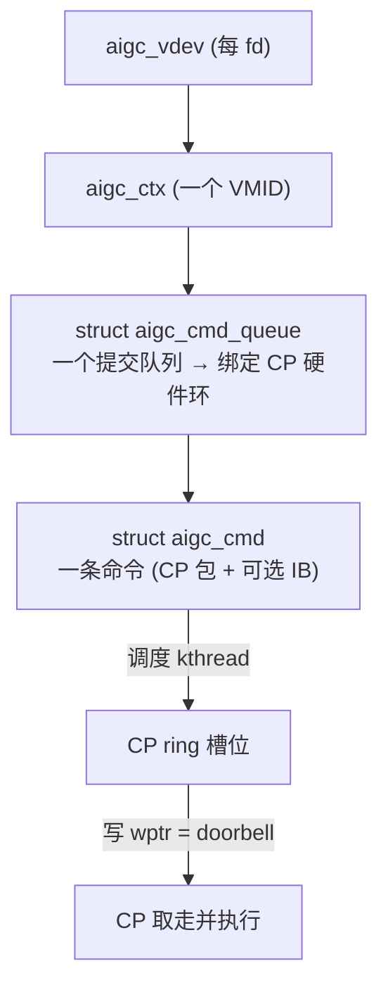

# KMD 命令队列与调度

> 这一区跟着一个工作单元，从用户态提交一路走到硬件：命令怎么到命令处理器（CP）、驱动怎么调度它、
> 怎么按下 doorbell 让 CP 取走执行。

## 本区页面

- 本页：提交链路全景 + 上下文/队列/队列管理器（aqm）+ 命令与 CP 包的构建。
- [[aigc_cp_ring]]：CP 硬件环的 wptr/rptr 机制与 doorbell。
- [[aigc_sched]]：每环 kthread 调度线程与默认调度策略。

## 提交链路全景

所有权链：`aigc_vdev → aigc_ctx → aigc_cmd_queue → aigc_cmd`。一个上下文拥有一或多个命令队列；每个队列绑到
一个 CP 硬件环。命令在队列上创建、CP 包构建好，之后调度 kthread 把包拷进环、按 doorbell，CP 取走执行。

---

## 1. 上下文、队列与队列管理器

[[aigc_ctx]] 是执行域，拥有 VMID/地址空间、每上下文 qid 池、映进进程的 doorbell 窗口、命令队列列表。创建队列
经**设备队列管理器**（`aigc_queue_manager.c`，简称 aqm）：把一个 queue-create 请求变成硬件队列，方法是填一个
**MCQD**（显存里的 CP 队列描述符）并注册给硬件。

两种策略，在 `aigc_queue_manager_init()` 里按 `lib_dev->sched_policy` 选：

| 策略 | create op | 队列怎么到硬件 |
|---|---|---|
| `SCHED_POLICY_HWS`（硬件调度） | `create_queue_cpsche` | 在上下文 `KCACHE_MD` 区填 MCQD，再发 *create-queue* IPC 给 CP 固件（`aigc_hal_add_queue`），由固件调度该队列。 |
| `SCHED_POLICY_NO_HWS`（直接绑） | `create_queue_no_cpsche` | 从上下文 gslab 分 MCQD，用 `allocate_hqd()` 选一个硬件队列槽（当前恒 pipe 0/queue 0），用 `aigc_hal_bind_queue` 直接把 MCQD 绑到该 `(pipe, queue)`。 |

`fill_mcqd_info()` 填 MCQD：doorbell id（`vmid * 32 + qid`）、ASID（=VMID）、ring base 高/低、ring size、
清零的指针、wptr-shadow 地址、`active = 1`，用 IO 拷贝（`os_mem_copy_to_io`）写入。HWS 销毁发 *destroy-queue*
IPC；no-HWS 销毁路径无事可撤。

## 2. 构建一条命令和它的 CP 包

命令是 `struct aigc_cmd`（`aigc_cmd.h`），由 `aigc_cmd_create()` 按节点类型在队列上分配：

| 类型 | 含义 |
|---|---|
| `INDIRECT_CMD_NODE` | 间接命令缓冲（IB）——常用路径。 |
| `DIRECT_CMD_NODE` | 直接（内联）命令缓冲。 |
| `KMD_WAIT_CMD_NODE` | 内核侧等待。 |
| `TS_UPDATE_CMD_NODE` | 时间戳/fence 更新。 |
| `NOP_CMD_NODE` | 空操作。 |

命令携带构建好的 CP 包（`struct cmd_packet pkt`），间接提交时还附一个 IB（`struct aigc_cnr_cmd_buf cmd_buf`）
和一个用户 fence。`aigc_cmd_add_cmd_buf()` 附上 IB（后备内存句柄、内核 VA、大小、guest PA）；
`aigc_cmd_set_cmd_buf_va()` 记录 CP 将从之 fetch 的 CP-facing GPU VA。

CP 包由 `aigc_cp_cmd_pkt.c` 的 builder 组装，按 CP opcode（`enum AIP_CMD_*`：`DMA`、`INDIRECT`、`WAIT_FENCE`、
`SIGNAL_FENCE`、`TRAP`、`NOP`、`MEM_WRITE`、`CONST_FILL`、`SET_REG`、`POLL_MEM_REG`、`CACHE_OP`…）。MR 后端
op 表 `__mr_cp_pkt_ops[]` 把每个 opcode 映到一个 fill 函数和一个 size 函数，由 `aigc_mr_cp_pkt_ops_init()`
装到硬件引擎 ops 上。本 build 实现的 builder 是**间接缓冲**包（`aigc_fill_indirect_pkt`）：必要时扩包，然后
写拆开的 64 位 IB 起始地址和 IB 大小——CP 之后跳到那个 IB 执行其内容。

> 踩坑提示：包结构是 `#pragma pack(push, 1)` 下的**字节精确硬件布局**，字段顺序绝不能动。

## 延伸

- [[aigc_cp_ring]]：包进了环之后怎么被消费。
- [[aigc_sched]]：谁在什么时候把命令塞进环。
- [[aigc_ctx]] | [[wiki/grace/kmd/interrupt/index|中断与 Fence]]
