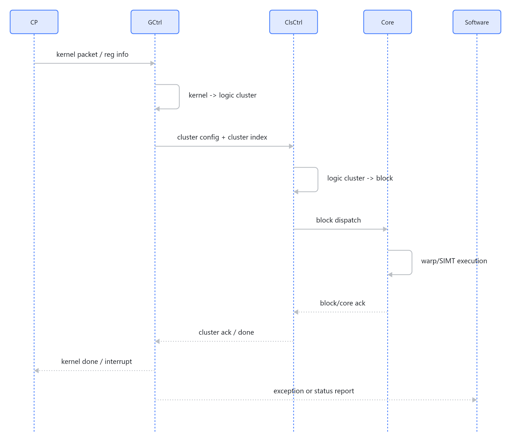

# 00 系统总览

## 系统组成

`RGU_Design_Spec_Sys_V1.2` 把 RGU 系统拆为以下核心模块：

- `RguGCtrl`：对 kernel 进行拆分和调度。
- `RguClsCtrl`：对 cluster 进行拆分和调度。
- `RguCRouter`：在 GCtrl 和 ClsCtrl 之间传输任务与响应。
- `RguCore`：SIMT 计算核。
- `RguGAtom`：负责原子操作相关逻辑。

所有模块通路以标准 `valid/ready` 握手为基础，是否插入异步 FIFO 由集成侧根据时钟结构决定。

## 任务执行链路

主执行链路：

> 图解源文件：[`01-任务执行链路-sequenceDiagram.mmd`](../../../../_attachments/mas/RguCore/00-system-overview/whiteboard-mermaid/01-任务执行链路-sequenceDiagram.mmd)。由 lark-whiteboard `whiteboard-cli` 从原 Mermaid 渲染。

## 控制通路

系统支持多层直接控制：

- CP 触发 GCtrl 执行。
- 通过寄存器接口直接触发 GCtrl。
- 通过 GCtrl 调度 ClsCtrl。
- 通过寄存器接口直接触发 ClsCtrl。
- 调试模式下可直接控制 Core 执行一个 block。

直接控制下级模块时要注意响应模式，否则下级向上级返回不合理 ACK 会污染系统状态；文档建议调试模式使用 polling 确认完成。

## 数据通路

核心数据路径：

- RegFile 与外存之间：由 LSU 实现。
- RegFile 与 SHM 之间：由 LSU 实现。
- 外存与 SHM 之间：由 AsyncCopy/TMA 实现。
- 核对外访问：支持读取外存、读取其他核 SHM。
- 所有 AXI 口为 1024bit 数据宽度、48bit 地址宽度。

## 调度能力

- 最大支持 16 个 kernel 并行。
- 一个 kernel 已经分发完后，可以继续分发后续 kernel。
- 每个 kernel 支持两类分发模式：
  - 随机分发：logic cluster 动态映射到 physical cluster，可选择尽量占更多 cluster、尽量占更少 cluster、或软件指定 cluster 数。
  - 固定分发：logic cluster 固定映射到 physical cluster，支持交织和大块切分两种公式。

## Harvest 机制

系统支持可用资源裁剪：

- 可用 cluster 数可调，GCtrl 通过 `cluster_map` 配置。
- 每个 cluster 的可用 core 数可配置，GCtrl 通过 `core_num` 配置。
- ClsCtrl 可通过 `core_mask` 配置可用 core。
- 文档明确支持部分 core 数组合，例如 1/2/4/8/9/10。

## 软件视角

软件需要准备：

- 外存中的指令和数据。
- UMD 包，下发给 CP。
- UMD `0x400` 地址控制 kernel 执行属性，包括分发模式、固定映射、启动/结束时 cache invalid、block/kernel 结束时等待访存状态等。

软件还需要处理异常上报后的策略：清 stall、early stop、返回缓存中的 kernel 响应、让正在执行的 kernel 快速返回 done、或让所有相关 core 进入 stall。
