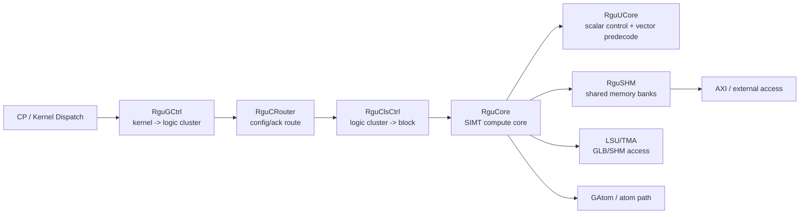

# RguCore MAS Wiki

本 wiki 基于 `C:\work\mas\RguCore` 下 5 份 MAS/RGU 设计文档整理：

- `RGU_Design_Spec_Sys_V1.2.docx`
- `RGU_Design_Spec_Core_V1.2.docx`
- `RGU_Design_Spec_RguGCtrl_V1.0.docx`
- `RGU_Design_Spec_RguUCore_V1.2.docx`
- `Rgu_Design_Spec_SHM_V1.2.docx`

## 阅读路径

1. [00 系统总览](00-system-overview.md)
2. [01 RguCore 计算核](01-rgu-core.md)
3. [02 RguGCtrl 学习文档：从 Kernel 到 Core 的两级调度](02-rgu-gctrl.md)
4. [03 RguUCore 标量控制前端](03-rgu-ucore.md)
5. [04 RguSHM 共享内存](04-rgu-shm.md)
6. [05 控制流与数据流](05-control-data-flow.md)
7. [06 异常、调试与一致性](06-debug-exception-consistency.md)
8. [07 术语与问答索引](07-glossary-qa-index.md)

## 总体心智模型

RGU 是一个面向 AI 计算的 SIMT 计算系统。CP 下发 kernel 配置包，GCtrl 负责将 kernel 拆成 logic cluster 并映射到 physical cluster，ClsCtrl 再把 cluster 拆成 block 下发到 core。Core 内部以 warp 为基本执行单元，UCore 处理标量控制和向量指令预处理，SHM 提供多线程共享内存访问、bank 冲突拆分、原子操作和 AXI/Cache 访问桥接。

## 当前限制

- docx 中的图没有被语义化抽取，wiki 主要基于正文和表格内容。
- 原始抽取文本保存在本轮工作区 `RguCore_doc_extract/`，便于后续追溯。
- 文档中的 ClsCtrl 细节主要通过 Sys/GCtrl 间接整理，当前目录没有单独的 ClsCtrl docx。
