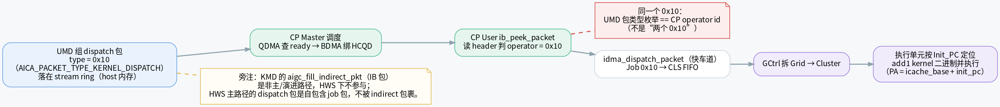

# kernel cmd → CP job cmd 字段映射

> 这是主文档 [[saxpy-kernel-end-to-end|《一个 Kernel 从 .cu 到硬件执行的全流程》]] **第 2.4 节的深度展开**。主文档把 dispatch packet 一笔带过；本文逐字段拆开这个结构体，并彻底澄清一个**面试高频混淆点：全栈到底有几个 `0x10`**。
>
> 读本文前，建议先有主文档第 2~4 节的全景：UMD 组包 → 写 ring buffer + 敲 doorbell → CP 取包分拣 → 执行单元执行。
>
> 术语首次出现给定义；**“源码确认”与“推断”分开标注**。

---

## 0. 一句话结论

**UMD 组的 kernel dispatch 包，就是 CP 看到的 job 包——它们是同一份内存、同一个 `0x10`，不存在任何“转换”或“再包裹”。**

UMD 在 host 内存里按 `aica_kernel_dispatch_packet_t` 逐字段填好一个包（包类型 `AICA_PACKET_TYPE_KERNEL_DISPATCH = 0x10`），写进 stream ring buffer；CP 固件从这块 host 内存把同一份字节读出来，`peek` 包头看到 operator id `0x10`（即 Job / Submit_JD），就把它当 job 处理。**没有第二份包，没有第二个 `0x10`。**

下面先逐字段看这个包长什么样，再回到这个澄清。

---

## 1. `aica_kernel_dispatch_packet_t` 逐字段

> 字段全貌（带位宽的解剖图）见主文档 [[saxpy-kernel-end-to-end]] 第 2.4 节的 `04-launch-packet` 字段解剖图，本文不再重复画字段表，只逐项解释每个字段的含义与用途。

源码：`~/aigc-driver/include/aica_packet_def.h`（源码确认，2026-06-26）。结构体从 word0 一直排到 word30 的 `scatter_cfg`。按用途分组：

### 1.1 身份与队列

| 字段 | 含义 |
|---|---|
| `header`（`aica_head_t`，4 字节） | 包头。其中 `block_mask[3:0]` 标记本 job 涉及哪些引擎：compute / dma / video / atomic。**operator id（`0x10`）就编码在这个 header 里**——CP `peek` 读的就是它。 |
| `stream_id`（5 bit）+ `seq_id`（19 bit） | 标识来自哪条 stream、本 stream 内第几个包。CP 与完成回路靠它对上号。 |

### 1.2 启动几何（grid / block / cluster）

| 字段 | 含义 |
|---|---|
| `grid_dim`（x 32bit, y 16bit, z 16bit） | grid 维度——总共多少个 block。 |
| `block_dim`（x 11bit, y 11bit, z 7bit） | 每个 block 多少线程。 |
| `cluster_dim`（x/y/z 各 8bit）、`cta_num`（6bit） | cluster（CTA 簇）维度与每簇 CTA 数。 |
| `cluster_ctrl` | cluster 调度控制位。 |

> `add1<<<1,1>>>` 这个例子里，grid/block 全是 1——一个 block、一个线程。但字段位宽决定了硬件能表达的最大启动规模。

### 1.3 kernel 二进制定位（本文最关键的一组）

| 字段 | 含义 |
|---|---|
| `icache_base`（lo + hi 16bit） | kernel 指令所在区域的基址（指令 cache 基址）。 |
| `init_pc`（lo + hi 16bit） | kernel 入口相对基址的偏移（初始 program counter）。 |

**执行单元定位 kernel 的公式（源码确认）：**

```
pa_init_addr = icache_base + init_pc
```

即 kernel 第一条指令的物理地址 = 基址 + 入口偏移。执行单元（GPU 计算阵列）从 CLS FIFO 拿到这个 job 包后，按 `pa_init_addr` 跳过去，取出 `add1` 的二进制指令开始执行。**`init_pc` 不是 CP 用的，是最末端的执行单元用的**——CP 只负责把包搬到 FIFO，不读 `init_pc`、也不解码指令（见第 3 节 CP 职责边界）。

> 🎯 **面试官会追问：`init_pc` 怎么被用来定位 kernel 二进制？**
> 关键是分清谁用它。`icache_base` + `init_pc` 这对字段，是 UMD 在 `aicaLaunchKernel` 时，用 host 端函数符号 `&add1` 反查注册表（见主文档 2.2）拿到的 device kernel 入口信息填进去的。一路传到执行单元，执行单元算 `icache_base + init_pc` 得到入口物理地址，跳过去执行。**CP 固件全程不碰它**——CP 看 header 知道这是 job，就把整包投给 CLS FIFO，`init_pc` 对 CP 是透明负载。

### 1.4 kernel 参数与内存布局

| 字段 | 含义 |
|---|---|
| `local_base` | local memory 基址。 |
| `local_step`（warp_step 低 16bit / elem_step 高 16bit） | local memory 的步长（per-warp / per-element）。 |
| `const_base` | 常量内存基址。kernel 里的 `__constant__`（本例的 `a`）与 **kernel 参数**经此区域传递。 |
| `trf_size`（9bit）、`trf_size_n` | transfer / 寄存器文件相关尺寸。 |
| `shm_size`（19bit） | 每 block 的 shared memory 大小，最大 256 KB。 |
| `cfg_addr` | 寄存器配置块地址；**`cfg_addr == 0` 表示不取额外寄存器配置**。 |

> **kernel 参数（`deviceA` 这个指针实参）怎么放？** UMD 把 `<<<>>>` 后括号里的实参打包，放到 const/参数区域（由上面这组基址字段描述），随包一起下发；执行单元执行 `add1` 时按约定从该区域读出 `dst`。具体打包布局属于 UMD 与 device ABI 的约定，本文不逐字节展开（**推断：未逐行核实参数区精确布局**）。

### 1.5 完成 fence

| 字段 | 含义 |
|---|---|
| `packet_done` | kernel 完成后要执行的动作。 |
| `fence_addr` | job 完成后，把 `fence_value` 写到这个地址；**`fence_addr == 0` 表示禁用 fence**。 |
| `fence_value`（lo + hi） | 写入 fence 地址的（单调递增）完成值。 |

> **fence 地址由 UMD 设置（源码确认）。** 阻塞式 launch 且 `fence_addr == 0` 时，UMD 在 `dispatchCommandPacket` 里取 user signal 的 `GetSignalValueAddr` 填进 `fence_addr`。注意这与 KMD 路径里的 `aigc_ts_copy`（盖 `SIGNAL_FENCE` 包）**不是同一条路**——HWS 主路径的 fence 是 UMD 设的。完成回路细节见主文档第 5 节。

### 1.6 代码长度与 scatter

| 字段 | 含义 |
|---|---|
| `ICodLenLo` / `ICodLenL1` | 指令代码长度（instruction code length）。 |
| `CCodLenL1` | 常量代码长度（const code length）。 |
| `scatter_cfg`（word30） | scatter 配置（多维 / 离散分发相关），结构体末字段。 |

---

## 2. 核心澄清：全栈只有一个 `0x10`

这是本文要纠正的**面试高频误判**。旧文档里出现过“UMD 有一个 `0x10`、CP 又有一个 `0x10`，两者要做转换”的说法——**这是错的**。

事实（源码确认，`aica_packet_def.h:17`）：

- UMD 的包类型枚举 **`AICA_PACKET_TYPE_KERNEL_DISPATCH = 0x10`**。
- CP 侧的 **operator id `0x10`** = Job（Submit_JD）。
- 这**两者指的是同一件事**。UMD 按这个枚举值在 header 里写下 `0x10`；CP `peek` 包头读出来的，正是 UMD 写下的那同一个 `0x10`。

为什么会有“两个 `0x10`”的错觉？因为 UMD 源码用枚举名 `AICA_PACKET_TYPE_KERNEL_DISPATCH`，CP/MAS 文档用名字 `Job` / `Submit_JD`，名字不一样让人误以为是两个独立的编号体系、需要中间映射。**实际上同一个字节 `0x10` 从头走到尾，没有翻译。** 这也正是「UMD dispatch 包 == CP job 包」的直接体现。

> 🎯 **面试官会追问：UMD 的 `0x10` 和 CP 的 `0x10` 是不是一回事？**
> 是同一回事，同一个字节。UMD `AICA_PACKET_TYPE_KERNEL_DISPATCH = 0x10` 与 CP operator id `0x10`（Job / Submit_JD）是**对同一个包类型的两个名字**。UMD 把包填好、把 `0x10` 写进 header，包落进 host ring buffer；CP 从同一块 host 内存读出这同一份字节，`peek` header 看到 `0x10`，按 Job 处理。**没有第二份包、没有编号转换、没有“UMD 的包要先变成 CP 的包”这一步。** 旧文档的“两个 `0x10`”是把同一事物的两个名字误当成两个东西了。

---

## 3. 包裹 / 映射链：从 host ring 到执行单元

把这个包的完整旅程串起来（与主文档第 2.5、4 节一致）：



> 图解源文件：[`k1-packet-wrapping.dot`](../../../_attachments/grace/saxpy-e2e/src/k1-packet-wrapping.dot)

1. **UMD 组包、落 host ring**：`aicaLaunchKernel` 逐字段填好 `aica_kernel_dispatch_packet_t`（header 里的 operator = `0x10`），`sendPacket` 写进 stream ring buffer（**host 内存**，源码确认），`UpdateDoorBellRelaxed` 敲 doorbell。
2. **CP Master 调度**：决定哪条队列（MCQD）上场，绑到空闲 HCQD（见主文档 4.1）。
3. **CP User peek**：`ib_peek_packet` 读 header，判 operator = `0x10` → 这是 Job。**这里读到的 `0x10` 就是 UMD 写下的那个**（第 2 节）。
4. **走快车道（iDMA direct）**：Job 不需要固件逐字解释，由 iDMA 硬件直接搬运——`idma_dispatch_packet` 把整包投到 **CLS FIFO**（GPU 计算阵列入口）。对照 [[wiki/grace/fw/concepts/CP-Command-Packet|CP 命令包]] 表：`Job | 0x10 | iDMA → CLS FIFO`。
5. **GCtrl 拆 Grid → Cluster**：计算阵列的调度逻辑按 `grid_dim` / `cluster_dim` 把 job 拆成 cluster 级任务分发。
6. **执行单元按 `init_pc` 定位 kernel**：算 `pa_init_addr = icache_base + init_pc`，跳到 `add1` 第一条指令执行，把 `10` 写回 `deviceA`。

**全链没有“再包裹”一层。** UMD 下发的就是自包含的 job 包，CP 原样搬运。

---

## 4. 关于 “indirect buffer 包裹”：这是非主路径

会有人问：KMD 里不是有个组「IB 包（indirect buffer）」的 `aigc_fill_indirect_pkt` 吗？dispatch 包要不要先被它包一层？

**答案：HWS 主路径下不需要，dispatch 包是自包含的 job 包，不经 KMD indirect 包裹。**

辨析（源码确认，见 verified-facts 第 4 条）：

- KMD 里确有 `aigc_cp_cmd_pkt.c:22 aigc_fill_indirect_pkt(AIP_CMD_INDIRECT)`，配合 `aigc_sched.c:310 aigc_cp_insert_ring`、`INDIRECT_CMD_NODE` 与后台 `aigc_wait_event_kthread`，组一个 IB 包插进 CP 环。
- 但这条路是 **`aigc_cmd_create(vdev, INDIRECT_CMD_NODE, NULL, CP_EVENT_DISPATCH)`**——服务于 `CP_EVENT_DISPATCH` 等，**不是 `add1` 这种 kernel job 的主线**。
- 而且它的入口 `aigc_fops.c:2677 aigc_ioctl_queue_submit` 开头当前就 **`return -EFAULT`（submission disabled，注释明写）**。换言之这条 ioctl 提交路径当前是禁用的。

所以这条 indirect 包裹机制是**另一条 / 演进中的 KMD 提交机制**，与 HWS 默认下 UMD 直发 kernel job 是两码事。在 HWS 主路径里：UMD 把自包含 dispatch 包直接写进 host ring + 敲 doorbell，**KMD 不经手这个包，更不会用 IB 包再裹一层**。

> ⚠️ **存疑标注**：上述 indirect / `CP_EVENT_DISPATCH` 路径的完整语义未逐行核实其全部用途；这里只确认了「它不是 add1 kernel job 的主线、且其 ioctl 入口当前 `return -EFAULT`」这两点。若后续该机制被启用或角色变化，本节需重核。

> 🎯 **面试官会追问：dispatch 包要不要被 indirect buffer 包裹？**
> HWS 默认路径下**不要**。UMD 组的 dispatch 包（type `0x10`）本身就是 CP 直接能处理的自包含 job 包，落 host ring → CP peek → iDMA direct → CLS FIFO，全程没有“indirect buffer 再包一层”。KMD 里那个 `aigc_fill_indirect_pkt`（IB 包）属于 `CP_EVENT_DISPATCH` 相关的另一条 / 演进中的机制，而且其提交 ioctl 当前 `return -EFAULT`（禁用）。把它当 add1 kernel 提交的主线，是误读。

---

## 5. 延伸阅读

- **主文档**：[[saxpy-kernel-end-to-end|一个 Kernel 从 .cu 到硬件执行的全流程]]（本文是其 2.4 节展开；fence 完成回路见其第 5 节）。
- **同系列**：[[stream-mcqd-hcqd-and-command-submission|stream / MCQD / HCQD 与命令下发]]。
- **CP 侧**：[[wiki/grace/fw/concepts/CP-Command-Packet|CP 命令包]]、[[wiki/grace/fw/concepts/iDMA|iDMA]]、[[wiki/grace/fw/concepts/GraceC-CP|GraceC CP]]、[[wiki/grace/fw/flows/CP command processing flow|CP 命令处理流程]]。
- **源码**（远程）：`shuaishuai.zhu@192.168.80.116:~/aigc-driver/include/aica_packet_def.h`、`src/device/grace/gracevirtualgpu.cpp`（`dispatchCommandPacket` / `sendPacket`）。

---

> 📝 **本文状态**：字段与 `0x10` 结论经 116 源码确认（2026-06-26，`aica_packet_def.h`）。kernel 参数区精确布局、indirect 路径完整语义为推断 / 未逐行核实，已就地标注。字段解剖图复用主文档 `04-launch-packet`；本文仅含一张包裹链图（`k1-packet-wrapping`）。
