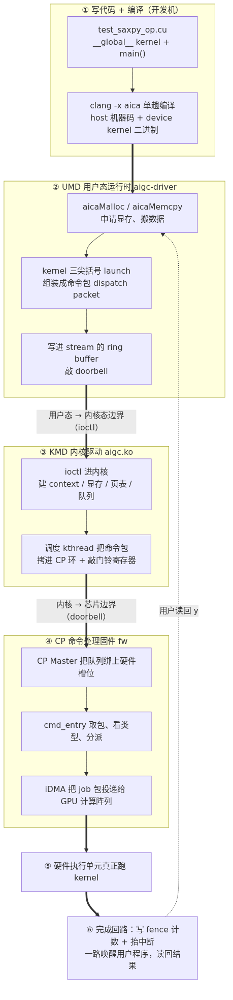
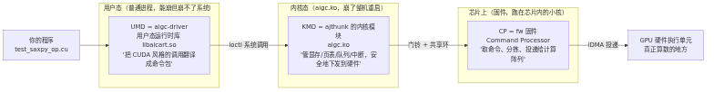
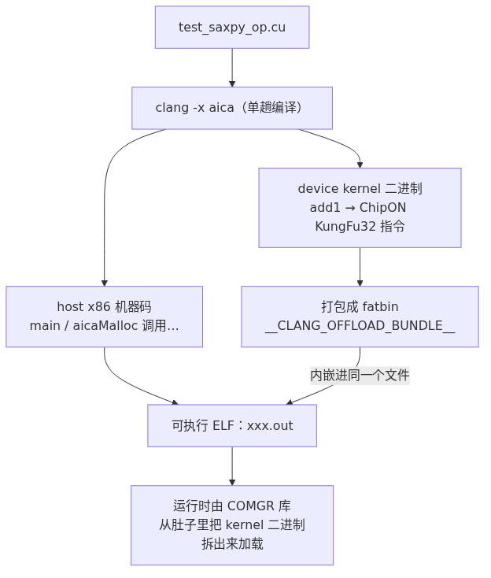
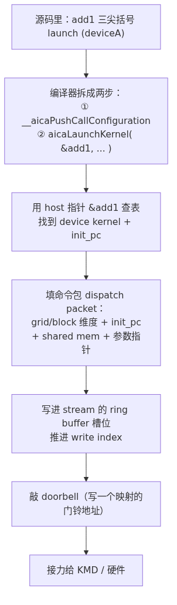
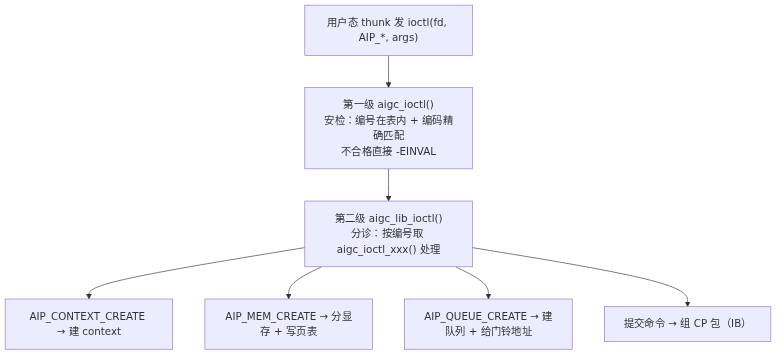
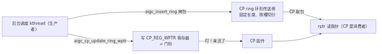
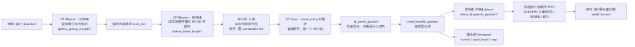
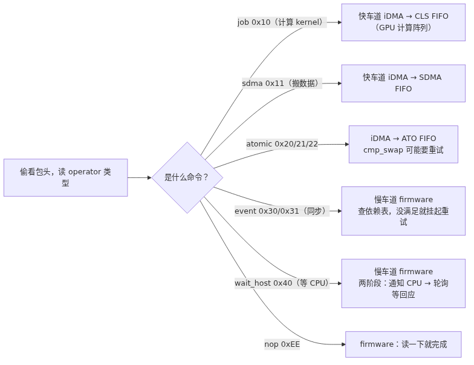
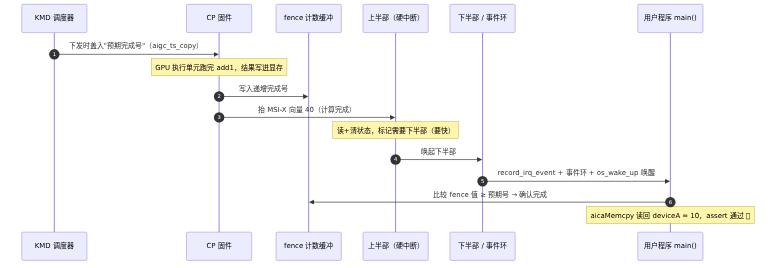
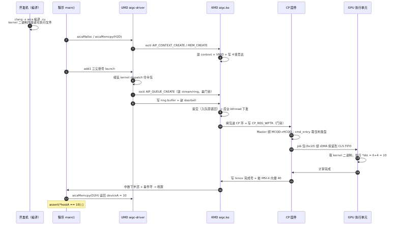

# 一个 Kernel 的奇幻漂流：从 .cu 源码到硬件执行的全流程

> 这是一篇**给组内同事看的科普长文**。目标：哪怕你完全没碰过我们这套 GPU 软件栈，读完也能在脑子里建立起一张完整的地图——
> 一段 GPU kernel 代码，是怎么从你写的 `.cu` 文件，一路翻山越岭，最后真的跑在芯片的计算阵列上的。
>
> 全程用一个**最简单的例子**贯穿：UMD 测试程序 `test_saxpy_op.cu`。
> （三层代码分别在：**UMD = `aigc-driver`**、**KMD = `ajthunk`（内核模块 `aigc.ko`）**、**CP = `fw` 固件**，源码都在 `192.168.80.116`。）

---

## 0. 先看全景图：一个 kernel 要过五关

在抠任何细节之前，先把"地图"摆出来。下面这张图是本文最重要的一张图——**记住它，后面所有内容都是在放大它的某一段**。

一段 GPU 计算，从你写代码到它真正在硬件上跑完，要穿过 **6 个阶段、3 个软件层、1 道用户态/内核态边界**：



> 图解源文件：[`01-panorama-overview.mmd`](../../../_attachments/grace/saxpy-e2e/whiteboard-mermaid/01-panorama-overview.mmd)（含 SVG 矢量版同目录）。由 Mermaid 经 `mermaid-cli` 渲染。

**一句话总结这张图**：
> 你写的 kernel 被编译成"芯片能懂的二进制"；UMD 把"要算什么"打包成一个**命令包**塞进队列、按下**门铃**；KMD 在内核里把这个包安全地搬上一条通往芯片的**传送带**；CP 固件在芯片上把包**取出来、分拣、投递**给真正干活的计算阵列；算完之后通过**取餐号 + 叫号**的方式通知你结果好了。

下面我们一关一关地走。每一关都会先讲"大白话"，再给"对应的真实函数/文件"，方便你之后真的去读源码。

---

## 1. 三个主角：UMD、KMD、CP 各是谁、管什么

这套栈最容易让新人懵的就是三个缩写。先用一句话把它们认全：



> 图解源文件：[`02-three-layers.mmd`](../../../_attachments/grace/saxpy-e2e/whiteboard-mermaid/02-three-layers.mmd)（含 SVG 矢量版同目录）。由 Mermaid 经 `mermaid-cli` 渲染。

| 缩写 | 实际是什么 | 跑在哪 | 它的核心职责 | 一句话比喻 |
|---|---|---|---|---|
| **UMD** | `aigc-driver`（用户态库 `libaicart.so`） | 用户态进程 | 提供类 CUDA 的 API，把 kernel launch 翻译成硬件命令包，放进队列 | 餐厅的**点餐 App** |
| **KMD** | `ajthunk` 里的内核模块 `aigc.ko` | Linux 内核 | 管理 GPU 的显存、地址翻译（页表）、命令队列、中断；是唯一能直接碰硬件的软件 | 餐厅的**前台 + 传菜系统** |
| **CP** | `fw` 固件（Command Processor） | 芯片内的小核（MCU + RISC-V core） | 从队列里取命令包、判断类型、投递给真正的执行单元 | 后厨的**分拣 + 传菜员** |

> 💡 **一个关键认知**：真正"算 `y = a*x + y`"的，既不是 UMD 也不是 KMD，甚至不是 CP 固件——是**最底层的 GPU 硬件执行单元（计算阵列）**。上面三层全都是"如何把任务安全、高效地送到执行单元手里"的物流系统。

如果你之前用过 NVIDIA 的栈，可以这样对应（**不完全等价，仅帮助建立直觉**）：

| 我们的栈 | NVIDIA 大致对应 |
|---|---|
| UMD `aigc-driver` | CUDA Runtime（`libcudart`） |
| `ajthunk` 用户态 thunk 库 | 用户态 thunk / libdrm 那层 |
| KMD `aigc.ko` | `nvidia.ko` 内核驱动 |
| CP `fw` | GPU 上的 firmware / front-end |

> 🔎 **幕后真相（诚实交代，方便你读源码不迷路）**：`aigc-driver` 其实是把 AMD 的 **HIP/ROCm 运行时整体改名**移植来的——`hip*` → `aica*`，`amdgpu` → `aicagcn`，ROCt thunk → `ajthunk`。所以你在源码里看到的很多结构（`HostQueue`、COMGR、fatbin、code object）都是 ROCm 的影子。本文用我们自己的命名讲，但你心里有个底：**"这套东西在血缘上是 ROCm 的近亲"**。

---

## 2. 阶段一 · UMD：从 `.cu` 到"按下门铃"

### 2.0 我们的例子长什么样

先看清楚 `test_saxpy_op.cu` 到底写了啥（这就是全文的"主角"）：

```cuda
#include "help_test.h"

__constant__ float a = 1.0f;          // 一个常量（这个例子里其实没用上）

__global__ void add1(int* dst) {       // 这就是要在 GPU 上跑的 kernel
  int l = 6, r = 4;
  *dst = l + r;                        // 把 10 写回显存
  return;
}

int main() {
  int *hostA, *deviceA;
  hostA = (int*)malloc(sizeof(int));               // host 内存
  AICA_CHECK(aicaMalloc(&deviceA, sizeof(int)));   // ① 申请显存
  hostA[0] = -1;
  AICA_CHECK(aicaMemcpy(deviceA, hostA, sizeof(int), aicaMemcpyHostToDevice));  // ② H2D 拷贝

  add1<<<1, 1>>>(deviceA);                          // ③ 启动 kernel（1 个 block，1 个线程）

  AICA_CHECK(aicaMemcpy(hostA, deviceA, sizeof(int), aicaMemcpyDeviceToHost));  // ④ D2H 拷回
  printf("[saxpy.cu] result = %d.\n", *hostA);
  assert(*hostA == 10);                             // 期望结果 = 10
  AICA_CHECK(aicaFree(deviceA));
}
```

> ⚠️ **澄清一个名字坑**：这个文件**叫** `test_saxpy_op.cu`，但它里面真正跑的 kernel 是 `add1`——逻辑只是 `*dst = 6 + 4 = 10`，跟教科书里的 saxpy（`y = a*x + y`）**没有关系**。文件名是历史遗留。本文就拿这个最简单的 `add1` 当例子，因为它把"流程"暴露得最干净——计算本身越简单，越能看清"命令是怎么走的"。

如果你写过 CUDA，会发现这几乎就是 CUDA 程序换了个前缀：`cudaMalloc` → `aicaMalloc`，`cudaMemcpy` → `aicaMemcpy`，`<<<>>>` 还是那个 `<<<>>>`。这正是 UMD 的设计目标：**让会写 CUDA 的人零成本上手**。

### 2.1 第一关：`.cu` 是怎么被编译的？

很多人以为 `.cu` 是 `nvcc` 编的——**我们这里不是**。

我们用的是一个**改名版的 LLVM/Clang**：`/usr/local/aica/bin/clang -x aica`（`-x aica` 就像 hipcc 的 `-x hip`）。它**一趟编译**就同时干两件事：

1. **host 部分**（`main` 里的 CPU 代码）→ 编成普通的 x86 机器码；
2. **device 部分**（`__global__ void add1`）→ 编成**芯片能执行的 GPU 二进制**（机器名叫 `ChipON KungFu32`，独立文件时扩展名是 `.co`，即 code object）。

然后 Clang 用 `__CLANG_OFFLOAD_BUNDLE__` 这个机制，把 device 二进制**打包成 fatbin，直接嵌进同一个可执行 ELF 文件**里。也就是说，编出来的 `.out` 可执行文件，肚子里同时装着"CPU 代码"和"GPU kernel 二进制"。



> 图解源文件：[`03-umd-compile-chain.mmd`](../../../_attachments/grace/saxpy-e2e/whiteboard-mermaid/03-umd-compile-chain.mmd)（含 SVG 矢量版同目录）。由 Mermaid 经 `mermaid-cli` 渲染。

> 📌 **顺手纠正一处旧文档**：KMD 的老笔记里提到过一个叫 `aigc_kernel.o_binary` 的"闭源 kernel 二进制文件"。实际查源码（`aigc-driver` 整棵树）**并不存在这个文件名**——`aigc_kernel` 只是一个 C++ 变量名（`const aigc::Kernel*`）。真实情况是：kernel 二进制以 **fatbin 内嵌在可执行文件里**，独立形态是 `.co`。读源码时别去找 `aigc_kernel.o_binary` 这个文件，会扑空。

**对应源码**：编译脚本 `~/aigc-driver/build_ex.sh`（`AIGC_CLANG_EXECUTABLE="/usr/local/aica/bin/clang"`）；fatbin 魔数与解包 `~/aigc-driver/src/aica_fatbin.cpp`、`aica_code_object.cpp`（triple `aicagcn-aica-aicahsa-`）。

### 2.2 第二关：程序一跑起来，运行时先做什么

可执行文件加载时，`libaicart.so` 这个运行时库会自动做两件事（编译器悄悄帮你插了代码）：

1. **注册 kernel**：`__aicaRegisterFatBinary` 把内嵌的 fatbin 登记上，再对每个 `__global__` 调 `RegisterFunction`，建立一张表：**`host 端的函数符号 &add1` → `device 上的 kernel`**。
2. **初始化设备**：首次用到 GPU 时，通过 thunk 层在内核里建出这块卡的**硬件 context**（对应内核的 `AIP_CONTEXT_CREATE`）。

为什么要那张"函数符号 → device kernel"的表？因为你在 host 代码里写的 `add1` 是个**普通 C++ 函数符号**，GPU 并不认识它。运行时要靠这张表，才能在你 `add1<<<...>>>(...)` 时，反查到"哦，你要的是 device 上那段 kernel 二进制"。

**对应源码**：`~/aigc-driver/src/aica_platform.cpp`（`RegisterFatBinary`/`RegisterFunction`/`PlatformState::init`）。

### 2.3 第三关：`aicaMalloc` / `aicaMemcpy` 在干嘛

- **`aicaMalloc(&deviceA, 4)`**：在当前设备上分配一块显存，返回一个 GPU 能用的地址。底层 `SvmBuffer::malloc`，最终通过 thunk 走 `AIP_MEM_CREATE` 这个 ioctl 让内核去分配物理显存并建立地址映射。
- **`aicaMemcpy(..., aicaMemcpyHostToDevice)`**：把 host 内存的数据搬到显存。它并不是简单的 `memcpy`——而是**造一个"拷贝命令"塞进 stream 队列**，和 kernel launch 走**同一条队列**异步执行（默认会等它完成）。

**对应源码**：`~/aigc-driver/src/aica_memory.cpp`（`iaicaMalloc`/`iaicaMemcpy`/`createCopyCommand`）。

### 2.4 第四关（最关键）：`add1<<<1, 1>>>(deviceA)` 是怎么变成"命令"的

这是整个 UMD 段的核心魔法。三尖括号 `<<<grid, block>>>` 不是普通语法，编译器会把它**拆成两步函数调用**：

1. `__aicaPushCallConfiguration(grid, block, sharedMem, stream)` —— 先把"启动配置"（几个 block、每个 block 几个线程、用哪个 stream）压进去；
2. `aicaLaunchKernel(&add1, grid, block, &args, ...)` —— 真正发起启动。

`aicaLaunchKernel` 做的事：

1. 用 host 函数指针 `&add1` 去查 2.2 那张表，找到 device 上的 kernel，读出它的**入口地址 `init_pc`** 和代码大小；
2. 把 **grid/block 维度、shared memory 大小、kernel 参数（这里就是 `deviceA` 的地址）、`init_pc`** 全部填进一个结构体 `aica_kernel_dispatch_packet_t`（一个"kernel 启动命令包"）；
3. 把这个命令包**写进 stream 对应的 ring buffer**，推进写指针，然后**敲 doorbell（门铃）**通知硬件"有新活了"。



> 图解源文件：[`04-umd-launch-packet.mmd`](../../../_attachments/grace/saxpy-e2e/whiteboard-mermaid/04-umd-launch-packet.mmd)（含 SVG 矢量版同目录）。由 Mermaid 经 `mermaid-cli` 渲染。

> 🧩 **stream 是什么**？就是 CUDA 里的"流"——本质是**一条命令队列**。源码里 `Stream` 直接继承自 `HostQueue`（命令队列）。`aicaStreamCreate` 建一个 stream，第一次真用时会**懒创建**一条硬件 ring buffer（`AigcQueue`），并通过 thunk 的 `AIP_QUEUE_CREATE` 在内核里把这条 ring buffer 建好、拿到 doorbell 地址。**"创建 stream" ≈ "开一条通往硬件的传送带"**。

**对应源码**：`~/aigc-driver/src/aica_runtime.cpp`（`aicaLaunchKernel`）、`aica_platform.cpp`（`KernelLaunchKit::iaicaLaunchKernelCommand` 组包）、`include/aica_packet_def.h`（`aica_kernel_dispatch_packet_t`，包类型 `AICA_PACKET_TYPE_KERNEL_DISPATCH=0x10`）、`src/device/grace/gracevirtualgpu.cpp`（`sendPacket` 写包 + `UpdateDoorBell` 敲门铃）。

### 2.5 UMD 段的边界：`Thunk_*` 与 ioctl

UMD 自己**从不直接调 `ioctl()`**。所有"要麻烦内核帮忙"的操作（建 context、分显存、建队列、提交），都统一经过 `ajthunk` 这个用户态库的 `Thunk_*` 系列函数，由它去对 `/dev/aigcN` 发真正的 `ioctl(AIP_*)`。这就是**用户态 → 内核态的边界**。

| UMD 干的事 | 经 thunk 调的 ioctl |
|---|---|
| 建硬件 context | `AIP_CONTEXT_CREATE`（编号 0） |
| 创建 stream / 硬件队列 | `AIP_QUEUE_CREATE`（编号 2） |
| 分配显存 | `AIP_MEM_CREATE`（编号 5） |
| 提交命令 | `AIP_QUEUE_SUBMIT`（编号 9）等 |

> 🚧 **诚实标注**：`ajthunk` 库本身是闭源的（源码树里是空的子模块），所以"`Thunk_*` 内部到底怎么把参数封装进 ioctl"这一小段，我们是从 UMD 这侧反推的，没逐行核实。但边界很清楚：**doorbell 写的是一个内核映射给用户态的地址，命令的"建立/提交"走 ioctl**。

---

## 3. 阶段二 · KMD：内核里的"前台 + 传菜系统"

门铃响之前，其实 KMD 已经默默干了一大堆"建场子"的活；门铃响之后，它还要把命令真正搬上传送带。我们把 KMD 想成一家很忙的餐厅的**前台 + 传菜系统**。

### 3.1 每个请求都走同一条"两道关卡"的路

用户态每喊一次 `ioctl(fd, AIP_*, &args)`，内核里都走**两级派发**：

- **第一级（入口层，`aigc_ioctl()`）只做安检**：编号必须在表里，且命令编码（含读写方向 + 参数结构大小）必须**精确匹配**，否则当场 `-EINVAL` 打回（fail closed，畸形请求别想混进来）。
- **第二级（核心层，`aigc_lib_ioctl()`）只做分诊**：拿编号当下标，从处理函数表里取出对应的 `aigc_ioctl_<op>()` 去干活。



> 图解源文件：[`05-kmd-ioctl-dispatch.mmd`](../../../_attachments/grace/saxpy-e2e/whiteboard-mermaid/05-kmd-ioctl-dispatch.mmd)（含 SVG 矢量版同目录）。由 Mermaid 经 `mermaid-cli` 渲染。

**对应页**：[[wiki/grace/kmd/arch/request-path]]、[[wiki/grace/kmd/ioctl/ioctl-abi]]。

### 3.2 开场前的四件准备

| 步骤 | 大白话 | 关键函数 | 对应 ioctl |
|---|---|---|---|
| **① 进门拿号** | `open("/dev/aigcN")`，给这个 fd 分配一个客户端对象 `aigc_vdev` | `aigc_open` → `aigc_lib_open` | open(2) |
| **② 开专属工位** | 建一个 GPU 上的"进程地址空间"：分配 **VMID** + 建根页表 | `aigc_context_create` → `aigc_ctx_init_vm` | `AIP_CONTEXT_CREATE` |
| **③ 备料 + 贴地址** | 给 `deviceA` 分显存，并把"GPU 虚拟地址 → 物理页"写进 4 级页表，刷 TLB | `aigc_ioctl_mem_create` → `aigc_vm_update_pgtable` | `AIP_MEM_CREATE` |
| **④ 开传菜窗口** | 建命令队列，填好硬件队列描述符 **MCQD**，返回 **doorbell 地址** | `aigc_ioctl_queue_create` → `fill_mcqd_info` | `AIP_QUEUE_CREATE` |

> 🗺️ **为什么"写页表"这一步生死攸关**：显存分到手只是"有料"，但 GPU/CP 之后是拿着**GPU 虚拟地址**去找数据的。如果不把"虚拟地址 → 物理页"的对应关系写进这个 context 的页表，CP 后面执行 kernel 时就会**找不到 `deviceA` 这块数据**。页表 = GPU 看显存的"地址翻译词典"，每个 context 一本（用 VMID 区分）。
>
> **对应页**：[[wiki/grace/kmd/flows/context-create-flow]]、[[wiki/grace/kmd/flows/mem-create-flow]]、[[wiki/grace/kmd/flows/pgtable-mapping-flow]]、[[wiki/grace/kmd/flows/queue-create-flow]]。

### 3.3 "提交 ≠ 执行"：KMD 最聪明的一个设计

命令的下发被故意拆成**两个阶段**，这是这一层最值得理解的设计：

- **阶段 A · 提交（同步，立刻返回）**：用户的提交请求进来，`aigc_cmd_create(INDIRECT_CMD_NODE)` 建一个命令对象，`aigc_fill_indirect_pkt` 组一条**间接缓冲（IB）CP 包**——包里写的是"真正的命令缓冲在显存哪个地址、多大"，让 CP 之后跳过去执行。命令挂进队列，**然后就立刻返回了**。这时候命令**还没下到硬件**。
- **阶段 B · 下发（异步，后台 kthread 干）**：每条环有一个后台调度线程 `aigc_wait_event_kthread`，它循环地从队列取命令、拷进 CP 环、敲门铃。

为什么要这么拆？**点餐 vs 上菜**的道理：你点完单（提交）就可以去忙别的，不用站在窗口干等；真正"把单子送进后厨 + 按门铃"（下发）由传菜员（kthread）按节奏来做。硬件忙时命令可以排队，环满了还能等下一轮重试——两端各自高效，互不阻塞。

### 3.4 传送带与门铃：CP ring + doorbell

后台 kthread 的下发动作分两下：

1. **拷包上传送带**：`aigc_insert_ring` → `aigc_cp_insert_ring` 把 CP 包拷进环里 `wptr`（写指针）指向的槽位，然后把 `wptr` 前进一格。
2. **敲门铃**：`aigc_cp_update_ring_wptr` 把新的 `wptr` **写进 `CP_REG_WPTR` 这个寄存器**——这一下寄存器写，就是**门铃**，告诉 CP"环里有新包，来取"。



> 图解源文件：[`06-kmd-ring-doorbell.mmd`](../../../_attachments/grace/saxpy-e2e/whiteboard-mermaid/06-kmd-ring-doorbell.mmd)（含 SVG 矢量版同目录）。由 Mermaid 经 `mermaid-cli` 渲染。

这就是经典的**环形缓冲区 + 单生产者单消费者**模型：
- 软件是生产者，推进 `wptr`（写到哪了）；
- CP 是消费者，推进 `rptr`（读到哪了）；
- 永远空出一个槽当"间隙"，好区分"满"和"空"（满的判定：`(wptr + 一格) % 环大小 == rptr`）。

**对应页**：[[wiki/grace/kmd/flows/command-submission-flow]]、[[wiki/grace/kmd/queue/aigc_sched]]、[[wiki/grace/kmd/queue/aigc_cp_ring]]。

---

## 4. 阶段三 · CP：芯片上的"分拣中心"

门铃响了，命令包进了环。现在轮到 **CP（Command Processor）固件**登场。注意：**KMD 并不会把命令直接喂给 GPU 计算阵列**，中间隔着 CP 这个固件子系统。

CP 像一个**机场塔台 + 行李分拣中心**：它自己不开飞机（不算 kernel），但它决定"哪个队列该上场、每个包该走哪条传送带、最后投递给谁"。

CP 内部分两半：
- **CP Master**（跑在一个 MCU 上）：管"**哪个队列该上场**"；
- **CP User**（跑在 RISC-V 小核上，固件主体）：管"**把上场队列里的包一条条分拣、投递**"。

### 4.1 CP 命令处理主链路



> 图解源文件：[`07-cp-pipeline.mmd`](../../../_attachments/grace/saxpy-e2e/whiteboard-mermaid/07-cp-pipeline.mmd)（含 SVG 矢量版同目录）。由 Mermaid 经 `mermaid-cli` 渲染。

把这条链路讲成故事：

1. **谁有活？（QDMA）** CP Master 的 QDMA 不停查"哪条队列（MCQD）里有待处理的包"，把发现的活按 8 档优先级排进 `task_list`。
2. **派个工位（BDMA）** BDMA 从 `task_list` 取任务，找一个**空闲的硬件队列槽位 HCQD**，把这条软件队列"装载"上去。绑定后 HCQD 就 active 了。
3. **抓包 + 举手** HCQD 从队列里 fetch 一个 1024-bit 的命令包进自己的小 FIFO，并在一个 8-bit 的"举手牌"（candidate mask）里把自己那一位置 1：**"我这队有包待处理！"**
4. **挑一个干（cmd_entry）** CP User 的主循环 `cmd_entry` 不停看举手牌，用 round-robin 挑一个 HCQD 来处理（O(1)，不空转）。
5. **偷看包头（peek）** `ib_peek_packet` 只看不取，读包头的 `type` 字段，判断这是什么命令（operator id）。
6. **分拣（dispatch）** `cmd_handle_packet` 按类型决定走哪条道（见下一节）。

> 🪟 **Interaction Buffer (IB) 是什么**：它是硬件给固件开的一扇"共享内存窗口 + 操作台"，每个 HCQD 一条通道。固件透过它能：偷看包头、读完整包、提交"消费/完成"动作、看下游忙不忙。可以理解成**分拣中心传送带旁边的操作台**。
>
> **对应页**：[[wiki/grace/fw/flows/CP command processing flow]]、[[wiki/grace/fw/cp-master/overview]]、[[wiki/grace/fw/cp-user/cmd_entry]]、[[wiki/grace/fw/concepts/HCQD]]、[[wiki/grace/fw/concepts/MCQD]]。

### 4.2 分拣决策：快车道 vs 慢车道

不是所有命令都一样处理。CP 按 **operator 类型**分流：



> 图解源文件：[`08-cp-dispatch-decision.mmd`](../../../_attachments/grace/saxpy-e2e/whiteboard-mermaid/08-cp-dispatch-decision.mmd)（含 SVG 矢量版同目录）。由 Mermaid 经 `mermaid-cli` 渲染。

- **快车道（iDMA direct）**：像 job、sdma 这类"包搬到下游硬件 FIFO 就行、固件不用逐字解释"的命令，让 iDMA 硬件**直接搬运**，省掉固件逐字搬包的开销。这是高频命令的高价值路径。
- **慢车道（firmware 处理）**：像 event（事件同步）、wait_host（等 CPU 回应）这类，需要固件读依赖、改状态表、等条件、抬中断，必须固件亲自介入，可能反复重试。

**我们的 `add1` 走哪条？** 它是一个 **job 包（operator id `0x10`）**，走**快车道**：`idma_dispatch_packet` 把它投递到 **CLS FIFO**（GPU 计算阵列的入口）。

### 4.3 CP 的职责到此为止（重要边界）

这是最容易被误解的地方，必须讲清楚：

> **CP 看不懂、也不关心 kernel 二进制里到底算什么。** 它处理的只是一个最多 32 words 的**命令包**——包头告诉它"这是个 job、body 多大、kernel 入口在哪"，它就把这个包投递到 CLS FIFO。
>
> **真正取出 kernel 二进制、解码指令、跑 SIMT 计算的，是 GPU 硬件执行单元**，不在 CP 固件代码里。CP 的终点是"投递成功"那一刻。

所以完整地说：CP 把 job 包投进 CLS FIFO → **GPU 计算阵列**从 FIFO 取出、按包里的 `init_pc` 找到 `add1` 的 kernel 二进制 → 真正执行 `*dst = 6 + 4` → 把 `10` 写进 `deviceA` 指向的显存。

**对应页**：[[wiki/grace/fw/concepts/iDMA]]、[[wiki/grace/fw/concepts/CP-Command-Packet]]、[[wiki/grace/fw/concepts/CP-Firmware-CPE]]。

---

## 5. 阶段四 · 完成回路：怎么知道"算完了"

kernel 跑完了，结果 `10` 已经在显存里。但 host 上的 `main()` 此刻正卡在 `aicaMemcpy(..., DeviceToHost)` 等结果——它怎么知道可以读了？

答案是**"取餐号 + 叫号广播"**两件套，**而不是傻等/轮询硬件**（轮询太费 CPU）。

### 5.1 取餐号：fence 时间戳

早在下发命令时就埋好了伏笔：调度器用 `aigc_ts_copy` 把这条命令的**预期完成号**（一个单调递增的计数值）盖进 CP 的 fence 包里。CP 把 kernel 跑完后，就把这个**递增的号码写进一块 fence 时间戳缓冲**（这块缓冲被映射进 context 的 GPU 地址空间）。

判断"完成了没"，就变成一句话：**看 fence 缓冲里的值有没有 ≥ 我记下的那个预期号**。比大小，而不是读硬件状态寄存器。

### 5.2 叫号广播：MSI-X 中断

光写个号还不够——得有人"叫"。CP 完成时抬一个 **MSI-X 中断**。对一次普通的 kernel 计算完成，用的是**向量 40（CP event-signal，计算引擎完成）**。

> ✅ **一个易混点（已核对）**：完成一次计算 kernel 用的是**向量 40**。源码里还有向量 39（CP TCU）、111（CP 固件命令的 ack，比如建/销队列）等——那些**不是** kernel 计算完成的通道。讲 `add1` 算完，认准**向量 40**。

中断进来后分两班接力：
- **上半部**（硬中断里，必须极快）：读一下、清一下中断状态，标记"需要下半部处理"，立刻返回。
- **下半部**（workqueue / 线程，可以慢慢干）：把"哪个引擎完成了"翻成事件码，`record_irq_event` 把事件推给注册了 event tracker 的客户端，写进事件环，`os_wake_up` **唤醒**那个在等结果的用户线程。



> 图解源文件：[`09-completion-loop.mmd`](../../../_attachments/grace/saxpy-e2e/whiteboard-mermaid/09-completion-loop.mmd)（含 SVG 矢量版同目录）。由 Mermaid 经 `mermaid-cli` 渲染。

最后，`main()` 被唤醒，`aicaMemcpy` 把显存里的 `10` 拷回 `hostA`，`assert(*hostA == 10)` 通过，再依次 `aicaFree` / 销毁队列 / 销毁 context，引用计数归零、层层释放。**全程结束。**

**对应页**：[[wiki/grace/kmd/interrupt/aigc_kmd_fence]]、[[wiki/grace/kmd/interrupt/aigc_interrupt]]、[[wiki/grace/kmd/flows/completion-interrupt-flow]]。

---

## 6. 把全程串成一条时间线

前面分了四关讲，最后用一张**端到端时序图**把所有角色串起来，对照着回顾一遍：



> 图解源文件：[`10-end-to-end-sequence.mmd`](../../../_attachments/grace/saxpy-e2e/whiteboard-mermaid/10-end-to-end-sequence.mmd)（含 SVG 矢量版同目录）。由 Mermaid 经 `mermaid-cli` 渲染。

---

## 7. 给新人的 5 条"设计直觉"

如果上面的细节你只能记住几条，那就记这 5 条——它们是这套栈反复出现的设计哲学：

1. **句柄而非指针**。用户态全程拿的是"打包了 id 的整数句柄"（context/显存/队列），不是内核内存地址。内核用 IDR 表把句柄还原成对象。好处：**跨进程安全**，伪造的句柄查无此物，崩不了内核。

2. **提交 ≠ 执行**。`ioctl` 提交命令只是"贴到队列就返回"（点单），真正下发到硬件由后台 kthread 异步做（上菜）。**解耦让用户态不阻塞、硬件忙时能排队**。

3. **完成靠 fence + 中断，不靠轮询**。CP 写一个单调递增的"完成号"，CPU 比大小即知完成；再用 MSI-X 中断主动"叫号"。**省 CPU，且天然支持乱序/批量完成**。

4. **一切访问经页表**。GPU/CP 拿的是 GPU 虚拟地址，必须先把"虚拟地址 → 物理页"写进 context 的 4 级页表，硬件才找得到数据。**页表是 GPU 看显存的地址翻译词典**。

5. **分层 + 边界清晰**。UMD（能崩但崩不了系统）→ ioctl 边界 → KMD（唯一碰硬件）→ 门铃边界 → CP（芯片上分拣）→ iDMA → 硬件执行。**每一层只做自己该做的，把复杂度关在层内**。

---

## 8. 术语表 + 延伸阅读

### 快速术语表

| 术语 | 一句话解释 |
|---|---|
| **UMD / aigc-driver** | 用户态运行时库，提供类 CUDA 的 API（`aica*`），把 kernel launch 翻译成命令包 |
| **KMD / aigc.ko** | 内核驱动，管显存/页表/队列/中断，唯一直接碰硬件的软件 |
| **CP / fw** | 芯片上的命令处理固件，取命令、分拣、投递给执行单元 |
| **fatbin / .co** | 编译后内嵌进可执行文件的 device kernel 二进制（独立形态是 `.co`） |
| **dispatch packet** | kernel 启动命令包，含 grid/block 维度、kernel 入口、参数 |
| **stream** | 命令队列（CUDA stream），底层是一条硬件 ring buffer |
| **ring buffer / CP 环** | 环形传送带，软件写（wptr）、CP 读（rptr） |
| **doorbell（门铃）** | 一个 MMIO 寄存器，写它就是通知硬件"有新命令" |
| **ioctl / AIP_\*** | 用户态请求内核服务的系统调用（建 context/显存/队列/提交） |
| **VMID / 页表** | GPU 地址空间 id + 4 级地址翻译表，每个 context 一套 |
| **MCQD / HCQD** | 软件队列描述符 / 硬件队列槽位；CP Master 把前者绑到后者 |
| **candidate mask** | HCQD 的"举手牌"，标记哪些队列有包待处理 |
| **cmd_entry** | CP User 固件的调度主循环 |
| **iDMA** | 把命令包从队列搬到下游硬件 FIFO 的 DMA |
| **fence 时间戳** | 单调递增的完成计数；比大小即知命令完成 |
| **MSI-X 向量 40** | CP 通知"计算 kernel 完成"用的中断向量 |

### 想深入哪一层，往这里跳

- **UMD 源码**（远程）：`shuaishuai.zhu@192.168.80.116:~/aigc-driver/`，重点看 `src/aica_runtime.cpp`、`src/aica_platform.cpp`、`build_ex.sh`。
- **KMD 深入**：[[wiki/grace/kmd/index|KMD 内核驱动知识库]]，尤其 [[wiki/grace/kmd/flows/saxpy-submission-flow|saxpy 端到端提交流程]]、[[wiki/grace/kmd/flows/command-submission-flow|命令提交与下发]]、[[wiki/grace/kmd/queue/aigc_cp_ring|CP ring]]、[[wiki/grace/kmd/interrupt/index|中断与 Fence]]。
- **CP 深入**：[[wiki/grace/fw/index|FW 技术知识库]]，尤其 [[wiki/grace/fw/flows/CP command processing flow|CP 命令处理流程]]、[[wiki/grace/fw/cp-user/cmd_entry|cmd_entry 调度]]、[[wiki/grace/fw/concepts/HCQD|HCQD]]。
- **芯片栈总入口**：[[wiki/grace/index|GraceC 芯片软硬件栈]]。

---

> 📝 **本文状态**：当前为 wiki 暂存版，图用 Mermaid 内嵌。后续搬飞书时会把关键框图渲成 PNG。如发现某段与最新源码不符，欢迎直接在对应深入页留言修订。
