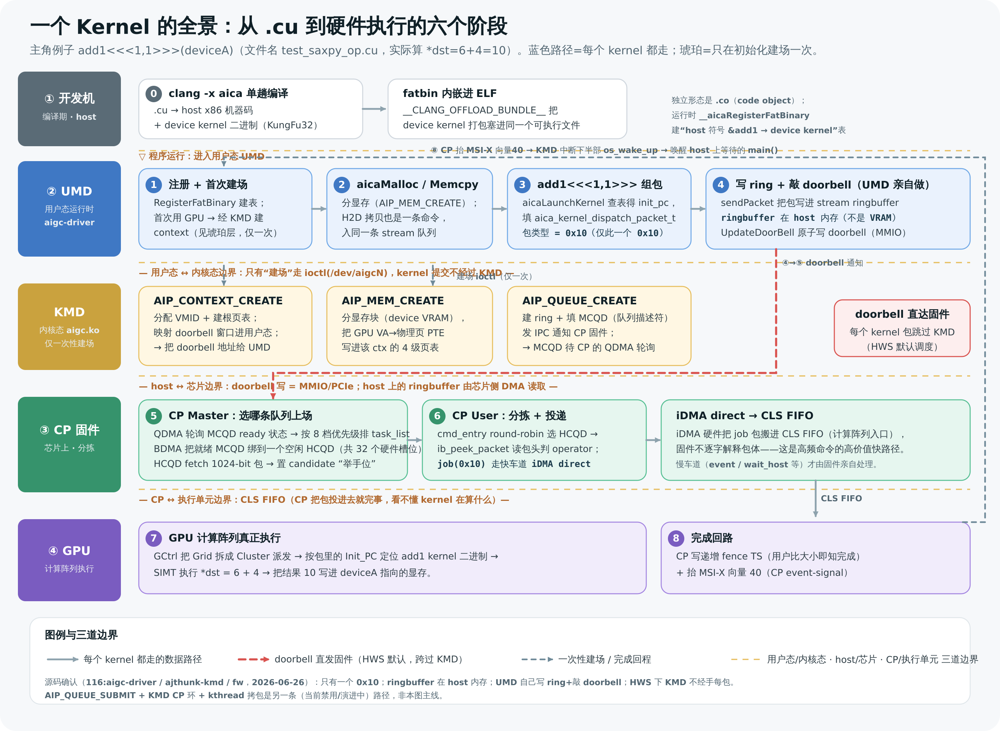
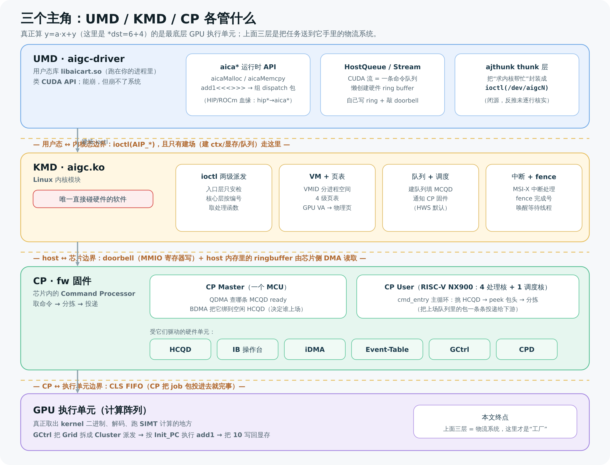
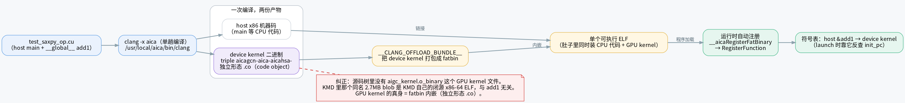
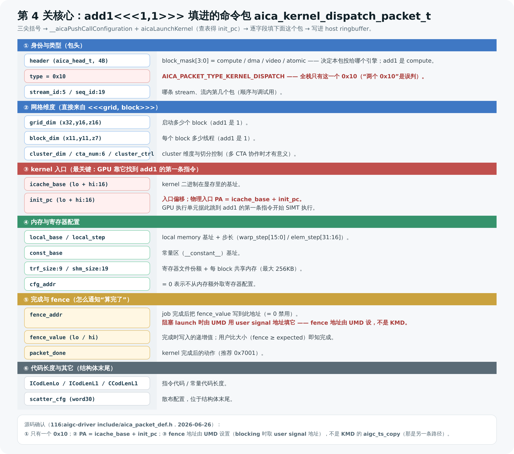
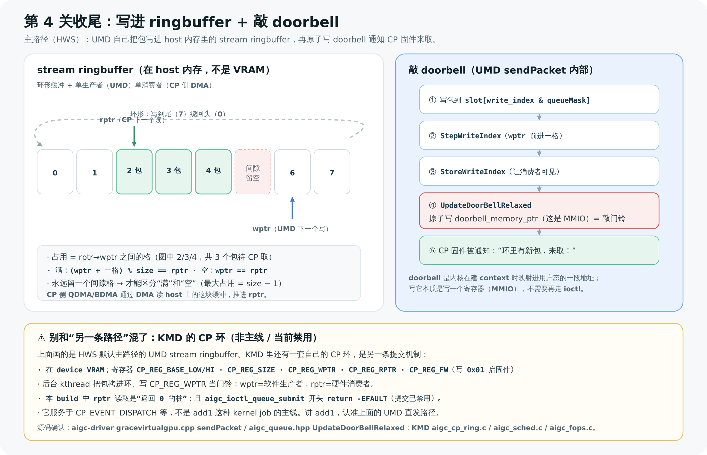
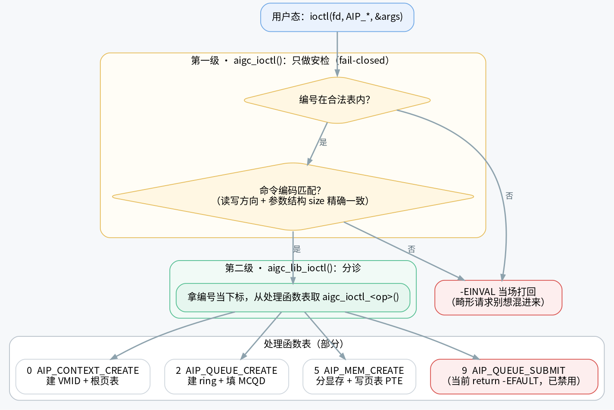
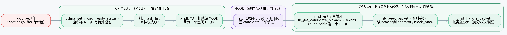
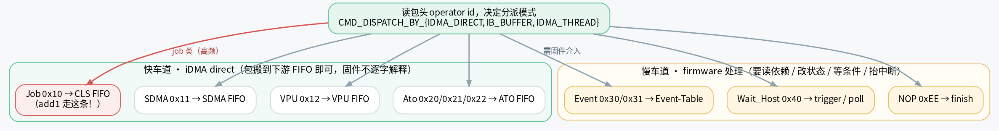
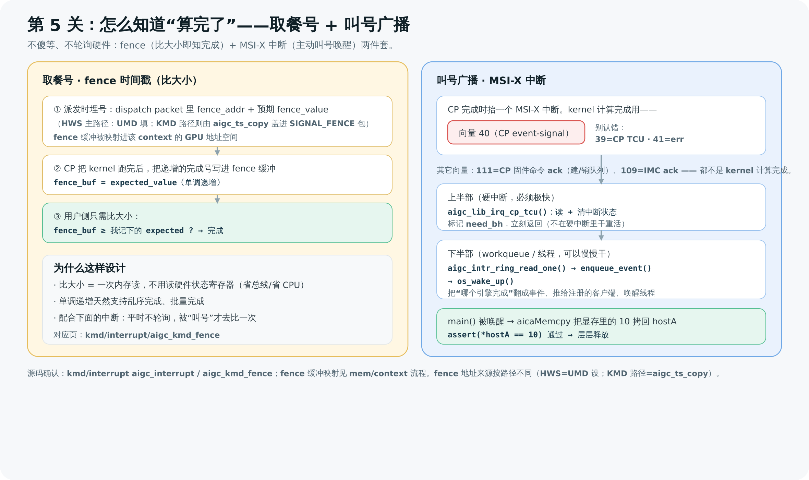
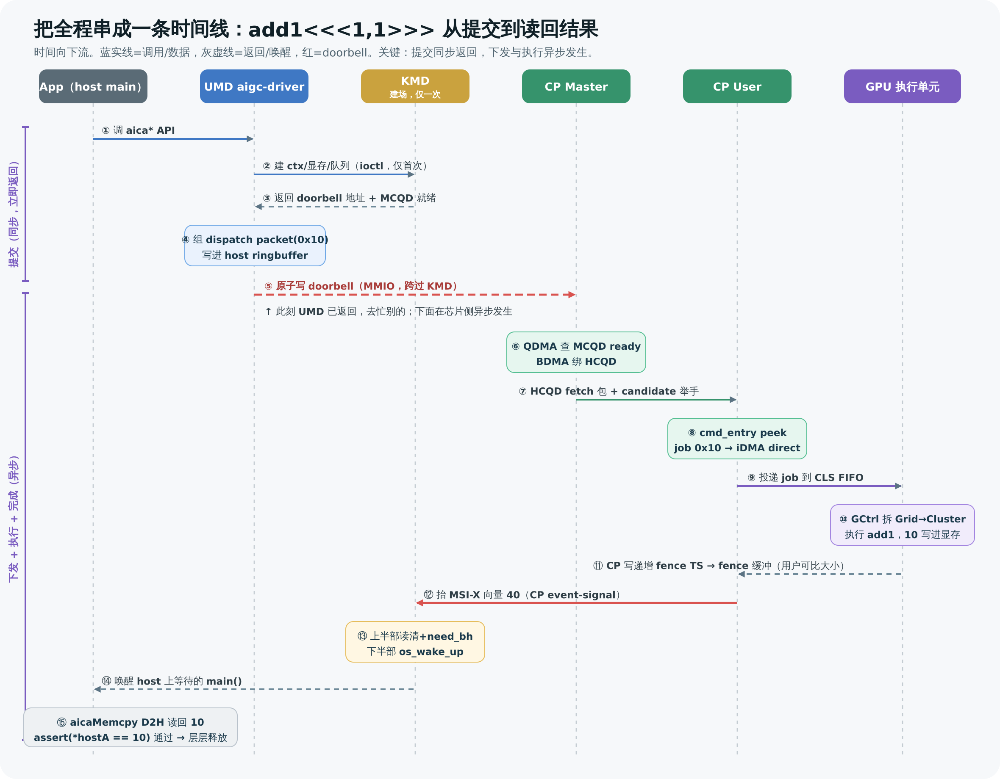

# 一个 Kernel 从 .cu 源码到硬件执行的全流程

> 这是一篇**给组内同事 / 新人 / 面试准备**看的端到端长文。读完，你应能在脑中建立一张完整的地图：一段 GPU kernel 代码，怎么从 `.cu` 文件，经 UMD → KMD → CP 三层，最终在芯片的计算阵列上执行完。
>
> 全程用一个**最简单的例子**贯穿：UMD 测试程序 `test_saxpy_op.cu`。三层源码分别在 **UMD = `aigc-driver`**、**KMD = `ajthunk`（内核模块 `aigc.ko`）**、**CP = `fw` 固件**，均在 `192.168.80.116`。
>
> 文中每个术语首次出现都给定义；**“源码确认”与“推断”分开标注**；闭源部分（`ajthunk` thunk 层）如实标“反推未逐行核实”。

---

## 0. 全景图：一个 kernel 要过的六个阶段

先把地图摆出来。**这是本文最重要的一张图**——后面每一节都是在放大它的某一段。

一段 GPU 计算，从写代码到在硬件上执行完，要穿过 **6 个阶段、3 个软件层、3 道边界**：



> 图解源文件：[`01-panorama.svg`](../../../_attachments/grace/saxpy-e2e/src/01-panorama.svg)

**这张图要先记住三件事（都经源码确认，2026-06-26）**：

1. **kernel launch 是 UMD 直发的**：UMD 自己把命令包写进 ring buffer、自己写 doorbell 通知芯片。默认的硬件调度模式（HWS）下，**KMD 并不经手每一个 kernel 包**——它只在初始化时一次性“建场”（建 context、分显存、建队列）。
2. **这个 ring buffer 在 host 内存**，不是显存（VRAM）。
3. **全栈只有一个 `0x10`**（kernel dispatch 包类型）。旧文档里“两个 0x10”的说法是误判。

下面一关一关走。每关都先给严谨定义，再给“对应的真实函数/文件”，方便你之后去读源码。

---

## 1. 三个软件层：UMD / KMD / CP 各管什么

这套栈最容易让新人懵的是三个缩写。先认全：



> 图解源文件：[`02-three-layers.svg`](../../../_attachments/grace/saxpy-e2e/src/02-three-layers.svg)

| 缩写 | 实际是什么 | 跑在哪 | 核心职责 |
|---|---|---|---|
| **UMD** | `aigc-driver`（用户态库 `libaicart.so`） | 用户态进程 | 提供类 CUDA 的 API（`aica*`）；把 kernel launch 翻译成命令包，写进 ring buffer，敲 doorbell |
| **KMD** | `ajthunk` 里的内核模块 `aigc.ko` | Linux 内核 | 管理显存、地址翻译（页表）、命令队列的**建立**、中断；**唯一直接碰硬件的软件** |
| **CP** | `fw` 固件（Command Processor） | 芯片内的小核（Master MCU + RISC-V NX900 ×5） | 从队列取命令包、判类型、投递给执行单元 |

> 💡 **关键认知**：真正“算 `*dst = 6 + 4`”的，既不是 UMD/KMD，也不是 CP 固件——是**最底层的 GPU 硬件执行单元（计算阵列）**。上面三层都是“把任务安全、高效地送到执行单元手里”的物流系统。

如果你用过 NVIDIA 栈，可以这样对应（**不完全等价，仅帮助建立直觉**）：

| 我们的栈 | NVIDIA 大致对应 |
|---|---|
| UMD `aigc-driver` | CUDA Runtime（`libcudart`） |
| `ajthunk` 用户态 thunk 库 | 用户态 thunk / libdrm 那层 |
| KMD `aigc.ko` | `nvidia.ko` 内核驱动 |
| CP `fw` | GPU 上的 firmware / front-end |

> 🔎 **血缘（方便读源码不迷路）**：`aigc-driver` 是把 AMD 的 **HIP/ROCm 运行时整体改名**移植来的——`hip*` → `aica*`，`amdgpu` → `aicagcn`，ROCt thunk → `ajthunk`。所以源码里很多结构（`HostQueue`、COMGR、fatbin、code object）都是 ROCm 的影子。

---

## 2. 阶段一 · UMD：从 `.cu` 到“写包 + 敲 doorbell”

### 2.0 例子长什么样

`test_saxpy_op.cu`（全文主角）：

```cuda
#include "help_test.h"

__constant__ float a = 1.0f;          // 一个常量（这个例子里没用上）

__global__ void add1(int* dst) {       // 要在 GPU 上跑的 kernel
  int l = 6, r = 4;
  *dst = l + r;                        // 把 10 写回显存
  return;
}

int main() {
  int *hostA, *deviceA;
  hostA = (int*)malloc(sizeof(int));
  AICA_CHECK(aicaMalloc(&deviceA, sizeof(int)));   // ① 申请显存
  hostA[0] = -1;
  AICA_CHECK(aicaMemcpy(deviceA, hostA, sizeof(int), aicaMemcpyHostToDevice));  // ② H2D

  add1<<<1, 1>>>(deviceA);                          // ③ 启动 kernel（1 block，1 线程）

  AICA_CHECK(aicaMemcpy(hostA, deviceA, sizeof(int), aicaMemcpyDeviceToHost));  // ④ D2H
  printf("[saxpy.cu] result = %d.\n", *hostA);
  assert(*hostA == 10);                             // 期望结果 = 10
  AICA_CHECK(aicaFree(deviceA));
}
```

> ⚠️ **名字坑**：文件**叫** `test_saxpy_op.cu`，但里面真正跑的 kernel 是 `add1`——逻辑只是 `*dst = 6 + 4 = 10`，跟教科书的 saxpy（`y = a*x + y`）**无关**。文件名是历史遗留。本文用这个最简单的 `add1`，因为计算越简单，越能看清“命令是怎么走的”。

会写 CUDA 的人会发现这几乎就是 CUDA 换了前缀：`cudaMalloc` → `aicaMalloc`，`<<<>>>` 还是 `<<<>>>`。这正是 UMD 的设计目标：**让会写 CUDA 的人零成本上手**。

### 2.1 编译：`.cu` 是怎么变成可执行文件的

不是 `nvcc`。我们用一个**改名版的 LLVM/Clang**：`/usr/local/aica/bin/clang -x aica`（`-x aica` 类比 hipcc 的 `-x hip`）。它**一趟编译**同时干两件事：

1. **host 部分**（`main` 等 CPU 代码）→ x86 机器码；
2. **device 部分**（`__global__ void add1`）→ **芯片能执行的 GPU 二进制**（机器名 KungFu32，独立文件时扩展名 `.co`，即 code object，triple `aicagcn-aica-aicahsa-`）。

然后用 `__CLANG_OFFLOAD_BUNDLE__` 机制，把 device 二进制**打包成 fatbin，内嵌进同一个可执行 ELF**。即：编出来的可执行文件，肚子里同时装着 CPU 代码和 GPU kernel 二进制。



> 图解源文件：[`03-compile-chain.dot`](../../../_attachments/grace/saxpy-e2e/src/03-compile-chain.dot)

> 📌 **纠正一处旧笔记（源码确认）**：旧文档提到过一个 `aigc_kernel.o_binary` 的“kernel 二进制”。实际情况是：
> - `aigc-driver` 源码树里**没有**这个文件名；GPU kernel 的真身是 **fatbin 内嵌**（独立形态 `.co`）。
> - KMD 侧（`~/ajthunk/kmd/aigc/aigc_kernel.o_binary`）**确有**一个同名文件，但它是 **KMD 自己的闭源 x86-64 ELF blob（2.7MB，`file` 显示 relocatable x86-64）**，由 `kmdlib/Makefile` 的 `AIGC_BINARY_OBJECT` 链进 `aigc.ko`——**与 `add1` 这个 GPU kernel 毫无关系**。旧 wiki 两种说法（“它是 saxpy kernel 二进制” / “它只是变量名不存在”）都错。

**对应源码**：编译脚本 `~/aigc-driver/build_ex.sh`；fatbin 解包 `~/aigc-driver/src/aica_fatbin.cpp`、`aica_code_object.cpp`。

### 2.2 运行时注册

可执行文件加载时，`libaicart.so` 自动做两件事（编译器插了代码）：

1. **注册 kernel**：`__aicaRegisterFatBinary` 登记内嵌 fatbin，再对每个 `__global__` 调 `RegisterFunction`，建一张表：**`host 端函数符号 &add1` → `device 上的 kernel`**。
2. **初始化设备**：首次用 GPU 时，经 thunk 在内核里建出这块卡的**硬件 context**（对应 `AIP_CONTEXT_CREATE`）。

为什么要那张表？你在 host 写的 `add1` 是个普通 C++ 函数符号，GPU 不认识它。运行时靠这张表，才能在 `add1<<<...>>>(...)` 时反查到“device 上那段 kernel 二进制”和它的入口地址。

**对应源码**：`~/aigc-driver/src/aica_platform.cpp`（`RegisterFatBinary` / `RegisterFunction` / `PlatformState::init`）。

### 2.3 `aicaMalloc` / `aicaMemcpy`

- **`aicaMalloc(&deviceA, 4)`**：在当前设备分配显存，返回 GPU 可用地址。底层 `SvmBuffer::malloc`，经 thunk 走 `AIP_MEM_CREATE` ioctl，让内核分配物理显存并建立地址映射。
- **`aicaMemcpy(..., HostToDevice)`**：并非简单 `memcpy`——而是**造一个“拷贝命令”塞进 stream 队列**，与 kernel launch 走**同一条队列**异步执行（默认会等它完成）。

**对应源码**：`~/aigc-driver/src/aica_memory.cpp`（`iaicaMalloc` / `iaicaMemcpy` / `createCopyCommand`）。

### 2.4 核心：`add1<<<1, 1>>>(deviceA)` 怎么变成命令包

三尖括号 `<<<grid, block>>>` 不是普通语法，编译器把它拆成两步函数调用：

1. `__aicaPushCallConfiguration(grid, block, sharedMem, stream)` —— 压入启动配置；
2. `aicaLaunchKernel(&add1, grid, block, &args, ...)` —— 真正发起启动：用 `&add1` 查 2.2 那张表，读出 device kernel 的**入口偏移 `init_pc`** 和代码大小，再把 grid/block 维度、shared memory、kernel 参数、入口等**逐字段填进一个结构体 `aica_kernel_dispatch_packet_t`**（kernel 启动命令包）。

这个包的字段值得逐项看清——**它是“面试官最爱深挖”的地方**：



> 图解源文件：[`04-launch-packet.svg`](../../../_attachments/grace/saxpy-e2e/src/04-launch-packet.svg)

要点（源码确认，`include/aica_packet_def.h`）：

- **包类型 = `0x10`**（`AICA_PACKET_TYPE_KERNEL_DISPATCH`）。**全栈只有这一个 `0x10`**。
- **kernel 入口**：`PA = icache_base + init_pc`，GPU 执行单元据此跳到 `add1` 的第一条指令。
- **完成 fence**：`fence_addr` / `fence_value`——job 完成后把递增值写到此地址（见第 5 节）。HWS 主路径下，**`fence_addr` 由 UMD 设置**（阻塞 launch 时取 user signal 地址），不是 KMD。
- 维度（grid/block/cluster）、内存（local/const/shm）、代码长度等字段含义见上图与 **[[kernel-cmd-to-cp-job-cmd|kernel cmd → CP job cmd 字段映射]]** 深度文档。

> 🧩 **stream 是什么**：就是 CUDA 的“流”——本质是**一条命令队列**。源码里 `Stream` 继承自 `HostQueue`。`aicaStreamCreate` 建一个 stream，第一次真用时**懒创建**一条硬件 ring buffer（`AigcQueue`），并经 thunk 的 `AIP_QUEUE_CREATE` 在内核里建好、拿到 doorbell 地址。详见 **[[stream-mcqd-hcqd-and-command-submission|stream / MCQD / HCQD 与命令下发]]**。

### 2.5 写包 + 敲 doorbell（UMD 亲自做）

`aicaLaunchKernel` 填好包后，**UMD 自己**完成下面这套动作（HWS 主路径，源码确认 `gracevirtualgpu.cpp` / `aigc_queue.hpp`）：



> 图解源文件：[`06-ring-doorbell.svg`](../../../_attachments/grace/saxpy-e2e/src/06-ring-doorbell.svg)

1. `sendPacket`：把包写进 stream ring buffer 里 `write_index & queueMask` 指向的槽位；
2. `StepWriteIndex` 推进写指针（wptr），`StoreWriteIndex` 让消费者可见；
3. `UpdateDoorBellRelaxed`：**原子写 `doorbell_memory_ptr`**——这是个 MMIO 写，就是“敲 doorbell”。

两个常被追问的事实（源码确认）：

- **ring buffer 在 host 内存**（`sendPacket` 注释 `AICA_RB_ALLOC==1 // alloc on host`；KMD 侧 `aigc_cp_ring.c` 用 `aigc_alloc_system_pages`，`MH_HOST`；MAS v1.4 也写明“确保写入 host memory 后再触发 doorbell”）。CP 侧通过 DMA 来读这块 host 缓冲。
- **doorbell 是 MMIO 寄存器**，地址是内核在建 context 时映射进用户态的；写它不需要再走 ioctl。

### 2.6 边界：`Thunk_*` 与 ioctl

UMD **从不直接调 `ioctl()`**。所有“要麻烦内核”的操作（建 context、分显存、建队列）都经 `ajthunk` 的 `Thunk_*` 函数，由它对 `/dev/aigcN` 发真正的 `ioctl(AIP_*)`。这就是**用户态 → 内核态的边界**。

| UMD 干的事 | 经 thunk 调的 ioctl |
|---|---|
| 建硬件 context | `AIP_CONTEXT_CREATE`（编号 0） |
| 创建 stream / 硬件队列 | `AIP_QUEUE_CREATE`（编号 2） |
| 分配显存 | `AIP_MEM_CREATE`（编号 5） |

> 🚧 **诚实标注**：`ajthunk` 库本身闭源（子模块为空），“`Thunk_*` 内部怎么封装 ioctl”这一小段是从 UMD 这侧反推的，未逐行核实。但边界清楚：**建立类操作走 ioctl；kernel 提交（写 ring + 敲 doorbell）不走 ioctl**。

> 🎯 **面试官会追问**
> - **为什么 ring buffer 放 host 内存而不是显存？** 写包是 host CPU 干的，放 host 内存写起来快、免 PCIe 往返；芯片侧用 DMA 拉取。源码与 MAS 均确认。
> - **doorbell 物理上是什么？** 一个 MMIO 寄存器（写它即通知硬件），地址由内核建 context 时映射进用户态。
> - **kernel 提交到底经不经过内核（KMD）？** HWS 默认下**不经过**——UMD 直接写 ring + 敲 doorbell。KMD 只在建场时出现一次。
> - **dispatch packet 里到底有哪些字段？** 见 [`04-launch-packet`](../../../_attachments/grace/saxpy-e2e/04-launch-packet.png)：身份/维度/入口(`icache_base+init_pc`)/内存/fence/代码长度。

---

## 3. 阶段二 · KMD：一次性“建场” + 完成中断

> ⚠️ **先纠正一个常见误解**：旧文档把 KMD 描述成“每次提交都由后台 kthread 把命令拷进 CP 环、敲门铃”。**在 HWS 默认模式下并非如此**（源码确认 `aigc_lib_dev.c:71 sched_policy = SCHED_POLICY_HWS`）：
> - KMD 只在**初始化时一次性建场**：建 context/VMID/页表、分显存、建队列填 MCQD、发 IPC 通知固件。之后**每个 kernel 包都由 UMD 直发**（见 2.5），KMD 不经手。
> - KMD 里那套 `INDIRECT_CMD_NODE` + CP 环 + `aigc_wait_event_kthread` 后台线程，是**另一条提交机制**（用于 `CP_EVENT_DISPATCH` 等，且 `aigc_ioctl_queue_submit` 开头当前 `return -EFAULT`，提交已禁用）。它**不是 `add1` 这种 kernel job 的主线**。详见 [[stream-mcqd-hcqd-and-command-submission|那篇文档]] 的“命令下发两阶段”一节。

### 3.1 每个 ioctl 都走“两级派发”

用户态每喊一次 `ioctl(fd, AIP_*, &args)`，内核里走两级：



> 图解源文件：[`05-ioctl-dispatch.dot`](../../../_attachments/grace/saxpy-e2e/src/05-ioctl-dispatch.dot)

- **第一级（入口层 `aigc_ioctl()`）只做安检**：编号必须在合法表内，且命令编码（含读写方向 + 参数结构 size）必须**精确匹配**，否则当场 `-EINVAL`（fail-closed，畸形请求别想混进来）。
- **第二级（核心层 `aigc_lib_ioctl()`）只做分诊**：拿编号当下标，从处理函数表取出对应的 `aigc_ioctl_<op>()`。

**对应页**：[[wiki/grace/kmd/arch/request-path]]、[[wiki/grace/kmd/ioctl/ioctl-abi]]。

### 3.2 建场：开场前的四件准备

| 步骤 | 做什么 | 关键函数 | 对应 ioctl |
|---|---|---|---|
| **① 拿 fd** | `open("/dev/aigcN")`，给 fd 分配客户端对象 `aigc_vdev` | `aigc_open` → `aigc_lib_open` | open(2) |
| **② 建地址空间** | 分配 **VMID** + 建根页表（GPU 上的“进程地址空间”） | `aigc_context_create` → `aigc_ctx_init_vm` | `AIP_CONTEXT_CREATE` |
| **③ 分显存 + 贴页表** | 给 `deviceA` 分显存，把“GPU 虚拟地址 → 物理页”写进 4 级页表，刷 TLB | `aigc_ioctl_mem_create` → `aigc_vm_update_pgtable` | `AIP_MEM_CREATE` |
| **④ 建队列** | 建命令队列，填硬件队列描述符 **MCQD**，返回 **doorbell 地址** | `aigc_ioctl_queue_create` → `fill_mcqd_info` | `AIP_QUEUE_CREATE` |

> 🗺️ **为什么“写页表”生死攸关**：显存分到手只是“有料”，但 GPU/CP 之后是拿着 **GPU 虚拟地址**去找数据的。不把“虚拟地址 → 物理页”写进这个 context 的页表，CP 执行 kernel 时就**找不到 `deviceA`**。页表 = GPU 看显存的“地址翻译词典”，每个 context 一本（用 VMID 区分）。
>
> **对应页**：[[wiki/grace/kmd/flows/context-create-flow]]、[[wiki/grace/kmd/flows/mem-create-flow]]、[[wiki/grace/kmd/flows/queue-create-flow]]。

> 🎯 **面试官会追问**
> - **HWS 和 NO_HWS 区别？** HWS（默认）：KMD 填 MCQD + 发 IPC，固件用 QDMA/BDMA 自己把 MCQD 绑到 HCQD 调度；NO_HWS：KMD 用 `create_queue_no_cpsche` + `allocate_hqd()`（当前恒 pipe0/queue0）直接绑。
> - **`AIP_QUEUE_SUBMIT` 现在能用吗？** 当前 `aigc_ioctl_queue_submit` 开头 `return -EFAULT`，提交已禁用——再次印证 kernel 提交走 UMD 直发，不靠这个 ioctl。
> - **句柄而非指针？** 用户态拿的是打包了 id 的整数句柄（context/显存/队列），内核用 IDR 表还原成对象。伪造的句柄查无此物，崩不了内核。

---

## 4. 阶段三 · CP：芯片上的命令分拣

doorbell 响后，命令包（在 host ring buffer 里）等待被取。轮到 **CP（Command Processor）固件**。注意：**KMD 不会把命令直接喂给 GPU 计算阵列**，中间隔着 CP。

CP 内部分两半：

- **CP Master**（一个 MCU）：决定“**哪条队列上场**”；
- **CP User**（RISC-V NX900：4 处理核 + 1 调度核，固件主体）：把上场队列里的包**逐条分拣、投递**。

### 4.1 CP 命令处理主链路



> 图解源文件：[`07-cp-pipeline.dot`](../../../_attachments/grace/saxpy-e2e/src/07-cp-pipeline.dot)

1. **谁有活（QDMA）**：CP Master 的 `qdma_get_mcqd_ready_status()` 查哪条队列（MCQD）有待处理包，按 8 档优先级排进 `task_list`。
2. **派槽位（BDMA）**：`bindDMA` 取任务，找一个**空闲的硬件队列槽位 HCQD**（共 32 个），把就绪的 MCQD 绑上去。
3. **抓包 + 举手**：HCQD fetch 一个 1024-bit 命令包进 `rb_fifo`，并在 8-bit 的 candidate mask（“举手牌”）里置位：“我这队有包”。
4. **挑一个（cmd_entry）**：CP User 主循环 `cmd_entry` 用 `ib_get_candidate_bitmask()` 看举手牌，round-robin 选一个 HCQD（O(1)）。
5. **读包头（peek）**：`ib_peek_packet()`（须持锁）只看不取，读 header 判 operator / block_mask。
6. **分拣（dispatch）**：`cmd_handle_packet()` 按类型决定走哪条道（见下节）。

> 🪟 **Interaction Buffer (IB) 是什么**：硬件给固件开的“共享内存窗口 + 操作台”，每个 HCQD 一条通道。固件透过它偷看包头、读完整包、提交“消费/完成”动作。锁规则：peek/consume/finish 须持锁，candidate 检查可锁外。
>
> **对应页**：[[wiki/grace/fw/flows/CP command processing flow]]、[[wiki/grace/fw/cp-master/overview]]、[[wiki/grace/fw/cp-user/cmd_entry]]、[[wiki/grace/fw/concepts/HCQD]]、[[wiki/grace/fw/concepts/MCQD]]。

### 4.2 分派决策：快车道 vs 慢车道

CP 按 **operator 类型**分流：



> 图解源文件：[`08-dispatch-decision.dot`](../../../_attachments/grace/saxpy-e2e/src/08-dispatch-decision.dot)

- **快车道（iDMA direct）**：像 Job（`0x10`）、SDMA（`0x11`）、VPU（`0x12`）、Ato（`0x20/0x21/0x22`）这类“包搬到下游硬件 FIFO 即可、固件不用逐字解释”的命令，让 iDMA 硬件**直接搬运**。这是高频命令的高价值路径。
- **慢车道（firmware 处理）**：像 Event（`0x30/0x31`）、Wait_Host（`0x40`）、NOP（`0xEE`）这类，需要固件读依赖、改状态表、等条件、抬中断。

三种分派模式：`CMD_DISPATCH_BY_{IDMA_DIRECT, IB_BUFFER, IDMA_THREAD}`。

**`add1` 走哪条？** 它是 **Job 包（operator id `0x10`）**，走**快车道**：`idma_dispatch_packet` 把它投递到 **CLS FIFO**（GPU 计算阵列入口）。

### 4.3 CP 的职责边界（重要）

> **CP 看不懂、也不关心 kernel 二进制里到底算什么。** 它处理的只是一个命令包——包头告诉它“这是个 job、kernel 入口在哪”，它就把包投递到 CLS FIFO。
>
> **真正取出 kernel 二进制、解码指令、跑 SIMT 计算的，是 GPU 硬件执行单元**，不在 CP 固件代码里。CP 的终点是“投递成功”那一刻。

完整地说：CP 把 job 包投进 CLS FIFO → **GPU 计算阵列**（GCtrl 拆 Grid→Cluster）从 FIFO 取出、按包里的 `Init_PC` 找到 `add1` 的 kernel 二进制 → 执行 `*dst = 6 + 4` → 把 `10` 写进 `deviceA` 指向的显存。

> 🎯 **面试官会追问**
> - **MCQD 和 HCQD 什么关系？** MCQD 是软件队列描述符（逻辑队列，可以很多）；HCQD 是硬件队列槽（物理有限，32 个）。CP Master 把就绪 MCQD 动态绑到空闲 HCQD。为什么两级：软件多队列 ↔ 硬件有限槽。详见 [[stream-mcqd-hcqd-and-command-submission|专文]]。
> - **为什么要快/慢车道？** 高频的搬运型命令走 iDMA 硬件直发，省掉固件逐字搬包；需要语义处理的才让固件介入。
> - **add1 为什么是 `0x10`？** 它是 kernel dispatch（Job）。UMD 包类型枚举 `0x10` 与 CP operator id `0x10` 指的是同一件事——**只有一个 `0x10`**。

**对应页**：[[wiki/grace/fw/concepts/iDMA]]、[[wiki/grace/fw/concepts/CP-Command-Packet]]。

---

## 5. 阶段四 · 完成回路：怎么知道“算完了”

kernel 跑完，结果 `10` 已在显存。但 host 上的 `main()` 正卡在 `aicaMemcpy(..., DeviceToHost)` 等结果——它怎么知道可以读了？

答案是 **fence（比大小）+ MSI-X 中断（主动通知）** 两件套，**而不是轮询硬件**（轮询费 CPU）。



> 图解源文件：[`09-completion-loop.svg`](../../../_attachments/grace/saxpy-e2e/src/09-completion-loop.svg)

### 5.1 取餐号：fence 时间戳

派发时就埋好号：dispatch packet 里带 `fence_addr` + 预期 `fence_value`（HWS 主路径由 UMD 设；KMD 路径则由 `aigc_ts_copy` 盖进 `SIGNAL_FENCE` 包）。CP 把 kernel 跑完后，把这个**递增的完成号**写进 fence 缓冲（映射进 context 的 GPU 地址空间）。

判断“完成没”，就是一句话：**看 `fence_buf ≥ 记下的预期值**。比大小，不读硬件状态寄存器。

### 5.2 叫号：MSI-X 中断

CP 完成时抬一个 **MSI-X 中断**。对一次普通 kernel 计算完成，用**向量 40（CP event-signal）**。

> ✅ **易混点（已核对）**：kernel 计算完成用**向量 40**。源码里还有向量 39（CP TCU）、41（err）、111（CP 固件命令的 ack，如建/销队列）、109（IMC ack）——**那些不是 kernel 计算完成的通道**。讲 `add1` 算完，认准**向量 40**。

中断进来分两班接力：

- **上半部**（硬中断，必须极快）：`aigc_lib_irq_cp_tcu()` 读 + 清中断状态，标记 `need_bh`，立刻返回。
- **下半部**（workqueue / 线程）：`aigc_intr_ring_read_one()` → `enqueue_event()` → `os_wake_up()` 把事件推给注册的客户端、**唤醒**等结果的用户线程。

最后，`main()` 被唤醒，`aicaMemcpy` 把显存里的 `10` 拷回 `hostA`，`assert(*hostA == 10)` 通过，再依次 `aicaFree` / 销队列 / 销 context，引用计数归零、层层释放。**全程结束。**

**对应页**：[[wiki/grace/kmd/interrupt/aigc_kmd_fence]]、[[wiki/grace/kmd/interrupt/aigc_interrupt]]、[[wiki/grace/kmd/flows/completion-interrupt-flow]]。

> 🎯 **面试官会追问**
> - **为什么不轮询？** 比大小 = 一次内存读；轮询硬件状态寄存器费总线/CPU。fence 单调递增还天然支持乱序/批量完成。
> - **fence 地址谁设？** HWS 主路径由 UMD 设（阻塞 launch 时取 user signal 地址）；KMD 路径由 `aigc_ts_copy`。两条路径别混。
> - **为什么中断要分上/下半部？** 硬中断里不能干重活（会拖慢系统、可能死锁）；上半部只读清+标记，重活丢给下半部线程。

---

## 6. 端到端时序

最后用一张**时序图**把所有角色串起来回顾。注意两条竖线：**提交是同步的（UMD 写包 + 敲 doorbell 后立即返回）**，**下发 + 执行 + 完成是异步发生在芯片侧的**。



> 图解源文件：[`10-end-to-end-sequence.svg`](../../../_attachments/grace/saxpy-e2e/src/10-end-to-end-sequence.svg)

---

## 7. 给新人的 5 条“设计直觉”

1. **句柄而非指针**。用户态全程拿“打包了 id 的整数句柄”（context/显存/队列），不是内核内存地址。内核用 IDR 表还原。好处：**跨进程安全**，伪造句柄查无此物，崩不了内核。

2. **提交 ≠ 执行，且默认不经内核**。HWS 下 UMD 写包 + 敲 doorbell 就返回（同步），芯片侧 CP 固件异步取包、调度、执行。**用户态不阻塞，硬件忙时能在 ring 里排队**。

3. **完成靠 fence + 中断，不靠轮询**。CP 写单调递增的完成号，CPU 比大小即知完成；再用 MSI-X 中断主动唤醒。**省 CPU，天然支持乱序/批量完成**。

4. **一切访问经页表**。GPU/CP 拿 GPU 虚拟地址，必须先把“虚拟地址 → 物理页”写进 context 的 4 级页表，硬件才找得到数据。

5. **分层 + 边界清晰**。UMD（能崩但崩不了系统）→ ioctl 边界（仅建场）→ KMD（唯一碰硬件）→ doorbell 边界 → CP（芯片上分拣）→ iDMA → 硬件执行。**每层只做自己该做的**。

---

## 8. 术语表 + 延伸阅读

### 快速术语表

| 术语 | 一句话解释 |
|---|---|
| **UMD / aigc-driver** | 用户态运行时库，类 CUDA API（`aica*`），把 kernel launch 翻译成命令包并直发 |
| **KMD / aigc.ko** | 内核驱动，管显存/页表/队列建立/中断，唯一直接碰硬件 |
| **CP / fw** | 芯片上的命令处理固件（Master + User），取命令、分拣、投递 |
| **fatbin / .co** | 编译后内嵌进可执行文件的 device kernel 二进制（独立形态 `.co`） |
| **dispatch packet** | kernel 启动命令包 `aica_kernel_dispatch_packet_t`，类型 `0x10` |
| **stream** | 命令队列（CUDA stream），继承自 `HostQueue`，底层是一条 ring buffer |
| **ring buffer** | 环形缓冲（**在 host 内存**），UMD 写（wptr）、CP 侧 DMA 读（rptr） |
| **doorbell** | 一个 MMIO 寄存器，原子写它即通知硬件“有新命令” |
| **ioctl / AIP_\*** | 用户态请求内核服务（建 context/显存/队列）；kernel 提交**不**走它 |
| **VMID / 页表** | GPU 地址空间 id + 4 级地址翻译表，每个 context 一套 |
| **MCQD / HCQD** | 软件队列描述符（逻辑，多）/ 硬件队列槽（物理，32）；CP Master 动态绑定 |
| **candidate mask** | HCQD 的 8-bit“举手牌”，标记哪些队列有包待处理 |
| **cmd_entry** | CP User 固件的调度主循环 |
| **iDMA** | 把命令包从队列搬到下游硬件 FIFO 的 DMA（快车道） |
| **fence 时间戳** | 单调递增的完成计数；比大小即知命令完成 |
| **MSI-X 向量 40** | CP 通知“kernel 计算完成”用的中断向量 |

### 想深入哪一层，往这里跳

- **同系列文档**：[[stream-mcqd-hcqd-and-command-submission|stream / MCQD / HCQD 与命令下发]]、[[kernel-cmd-to-cp-job-cmd|kernel cmd → CP job cmd 字段映射]]、[[wiki/grace/umd/index|UMD 总览]]、[[wiki/grace/kmd/kmd-interview-deep-dive|KMD 面试向深入]]、[[wiki/grace/fw/fw-cp-interview-deep-dive|CP 面试向深入]]。
- **UMD 源码**（远程）：`shuaishuai.zhu@192.168.80.116:~/aigc-driver/`，重点 `src/aica_runtime.cpp`、`src/aica_platform.cpp`、`src/device/grace/gracevirtualgpu.cpp`、`build_ex.sh`。
- **KMD 深入**：[[wiki/grace/kmd/index|KMD 内核驱动知识库]]，尤其 [[wiki/grace/kmd/flows/saxpy-submission-flow|saxpy 提交流程]]、[[wiki/grace/kmd/queue/aigc_cp_ring|CP ring]]、[[wiki/grace/kmd/interrupt/index|中断与 Fence]]。
- **CP 深入**：[[wiki/grace/fw/index|FW 技术知识库]]，尤其 [[wiki/grace/fw/flows/CP command processing flow|CP 命令处理流程]]、[[wiki/grace/fw/cp-user/cmd_entry|cmd_entry]]、[[wiki/grace/fw/concepts/HCQD|HCQD]]。
- **芯片栈总入口**：[[wiki/grace/index|GraceC 芯片软硬件栈]]。

---

> 📝 **本文状态**：图解为手绘 SVG + Graphviz（源文件在 `_attachments/grace/saxpy-e2e/src/`，渲染 PNG 同目录）。关键事实经 116 源码确认（2026-06-26），“源码确认 / 推断”已分开标注。如发现与最新源码不符，欢迎在对应深入页修订。
