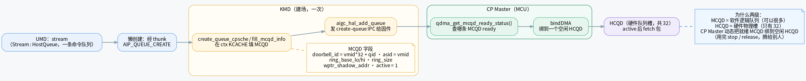
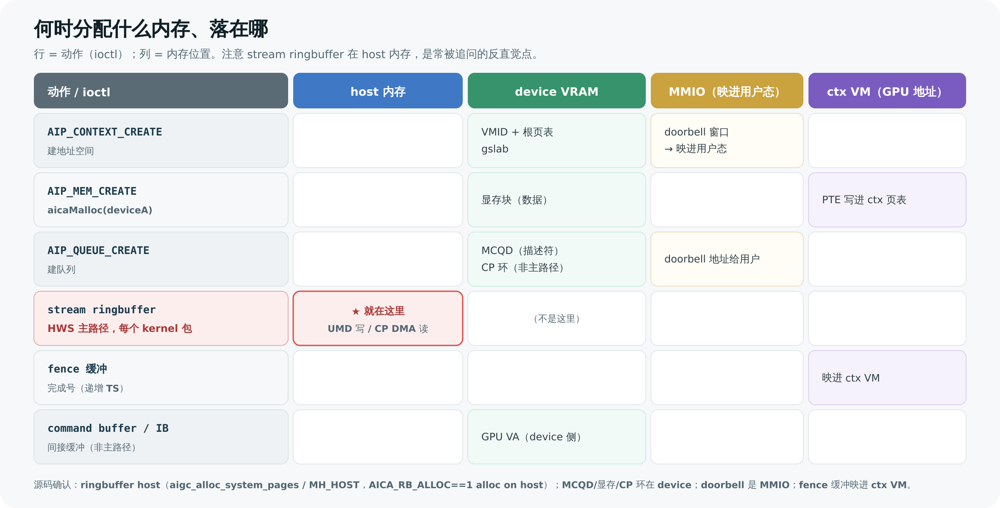
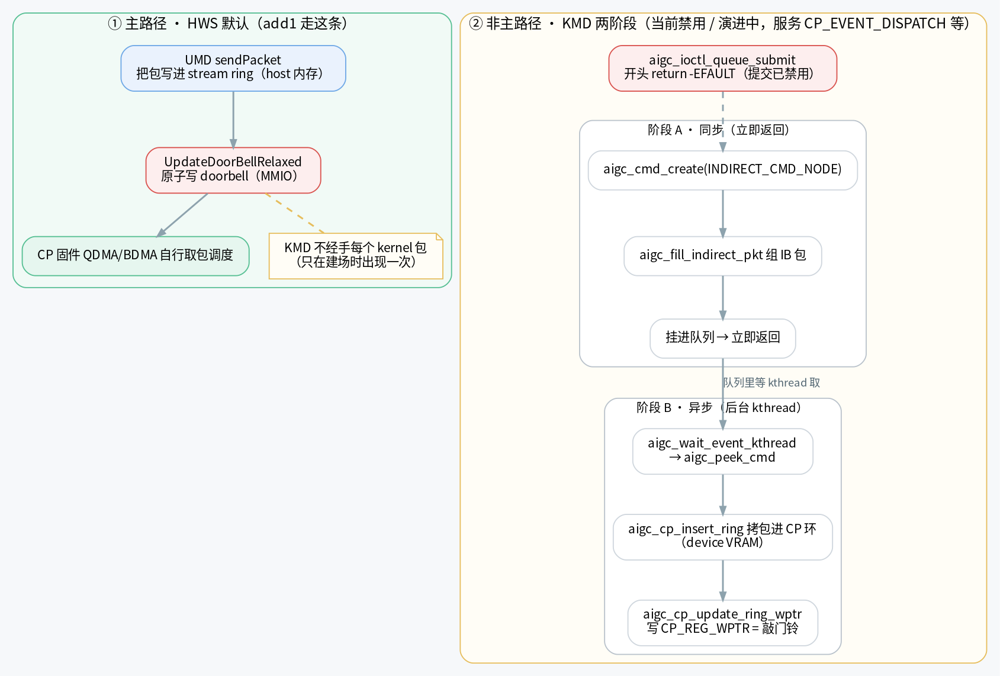

# stream / MCQD / HCQD 与命令下发

> 这是 **[[saxpy-kernel-end-to-end|一个 Kernel 从 .cu 到硬件执行的全流程]]** 的配套深入篇。主文档把 `add1<<<1,1>>>` 这条命令“怎么穿过 UMD → KMD → CP”讲了一遍主线；本文专门放大其中三个最容易被混淆、也最容易被面试官深挖的点：
>
> 1. **stream（CUDA 流）和底层那条硬件 ring buffer 到底是什么关系**，什么时候才真正建出来；
> 2. **MCQD（软件队列，可以很多）和 HCQD（硬件队列槽，物理只有 32 个）为什么要分两级**，CP 怎么把前者动态绑到后者；
> 3. **一次 kernel 下发，谁在什么时候分配了哪块内存、落在 host 还是 device**；以及
> 4. **命令下发其实有两条路径**——HWS 默认走的“UMD 直发”主路径，和 KMD 里那条“两阶段 kthread”的非主路径（当前已禁用 / 演进中）。现有 [[command-submission-flow|命令提交与下发代码流程]] 把第二条当成主线，是一处需要纠正的误导。
>
> 文中**“源码确认”与“推断”分开标注**；闭源部分（`ajthunk` thunk 层）如实标“反推未逐行核实”。术语首次出现给定义。

---

## 1. stream 是什么：从 CUDA 流到一条硬件 ring buffer

先把概念对齐。在这套栈里，下面这几个名字指的是**同一个东西的不同层次**：

- **stream**：CUDA 概念上的“流”——一条**有序的命令队列**。同一个 stream 里的命令按提交顺序执行；不同 stream 之间可以并发。
- **HostQueue**：UMD 源码里 stream 的基类。`Stream` 继承自 `HostQueue`（这是从 AMD ROCm 移植来的影子，见主文档的“血缘”说明）。所以源码里你看到 `HostQueue`，脑子里就换成“一条 stream”。
- **AigcQueue / ring buffer**：stream 真正用来装命令包的**环形缓冲区**（ring buffer）。它有一个写指针 `write_index`（wptr）和容量掩码 `queueMask`，UMD 往 `wptr & queueMask` 指向的槽位写包。

也就是说：**一条 stream 在用户态的物理载体，就是一条 ring buffer**；UMD 调 `sendPacket` 写包、调 `UpdateDoorBellRelaxed` 敲 doorbell，针对的都是这条 ring buffer。

> 🧩 **ring buffer 在 host 还是 device？**（源码确认）
> 在 **host 内存**，不是显存（VRAM）。`sendPacket` 注释里写明 `AICA_RB_ALLOC==1 // alloc on host`；KMD 侧 `aigc_cp_ring.c` 用 `aigc_alloc_system_pages`（DMA-able 系统内存）分配，销毁时还检查 `mem->heap != MH_HOST`。原因很直接：写包是 host CPU 干的活，放 host 内存写起来快、免去一次 PCIe 往返；芯片侧再用 DMA 把包拉过去。
> 注意区分：**stream 的 ring buffer 在 host**；下文要讲的 **MCQD 描述符在 device（VRAM）**。两者不是一回事。

### 1.1 懒创建：stream 不是建的时候就有硬件队列

`aicaStreamCreate` 建一个 stream 对象时，**并不立刻**去内核里建硬件队列。真正的硬件队列是**第一次真用这条 stream 时才懒创建（lazy create）** 的——比如第一次往它上面发 kernel dispatch 包或拷贝命令。那一刻 UMD 才：

1. 建出一条 `AigcQueue`（host 内存里的 ring buffer）；
2. 经 `ajthunk` 的 thunk 层发 **`AIP_QUEUE_CREATE`** ioctl 进内核；
3. 内核里建好硬件队列、**填好 MCQD**、**回一个 doorbell 地址**给用户态。

懒创建之后，这条 stream 才算“可提交”。后续每个命令包就是 UMD 自己写 ring + 写那个 doorbell 地址，不再走 ioctl（见第 4 节主路径）。

> 图解源文件：[`s1-stream-mcqd-hcqd.dot`](../../../_attachments/grace/saxpy-e2e/src/s1-stream-mcqd-hcqd.dot)

> 🎯 **面试官会追问**
> - **为什么懒创建？** 建硬件队列要进内核、占 MCQD 槽、通知固件，是有成本的。很多程序建了 stream 却没真用；推迟到第一次提交，避免无谓开销。
> - **`aicaStreamCreate` 返回时硬件队列存在吗？** 不一定。它返回的是用户态 stream 对象；硬件队列（ring + MCQD + doorbell）可能要等第一次提交才出现。

---

## 2. MCQD ↔ HCQD：两级队列，为什么

这是本文最核心的一块，也是面试高频题。先给两个定义：

- **MCQD（Memory Command Queue Descriptor）**：**软件队列描述符**，住在 device memory（VRAM）里，由 KMD/UMD 为每条 stream 创建。它是“host 想让芯片跑的命令流”在 device 侧的**入口结构**——里面记着这条队列的 ring buffer 基址、大小、doorbell id、属于哪个地址空间等。**逻辑队列，数量可以很多**（每 context 最多 32 个 stream，多个 context 叠加）。
- **HCQD（Hardware Command Queue Descriptor）**：**硬件队列槽**，是芯片里**物理存在、数量有限**的执行单元入口——**一共 32 个**。它负责从 ring buffer 真正 fetch 命令包（1024-bit/包），维护 read pointer，并把“我这队有包待处理”暴露给 CP 固件。

> 💡 **一句话记法**：MCQD 是“**软件登记的一条队列**”（可以很多），HCQD 是“**硬件能同时盯着的槽位**”（只有 32 个）。系统里逻辑队列数 ≫ 硬件槽位数，所以必须有人把就绪的 MCQD **动态绑**到空闲的 HCQD 上——这个“调度员”就是 CP Master。

### 2.1 MCQD 是谁、在什么时候、填了哪些字段（源码确认）

在 HWS 默认调度模式下，MCQD 由 **KMD 在 `AIP_QUEUE_CREATE` 时填好**（详见 [[wiki/grace/kmd/05-submission-events-interrupts|命令队列创建代码流程]]）：

- 入口：`aigc_ioctl_queue_create` → `create_queue_cpsche`；
- 在该 context 的 **KCACHE** 区算出 MCQD 地址（`mcqd_base + qid 槽`），映射到内核 VA 并清零；
- 调 **`fill_mcqd_info()`** 把字段写进去：

| MCQD 字段 | 值 / 含义 |
|---|---|
| `doorbell_id` | `vmid * 32 + qid`——这条队列的门铃编号（vmid 选哪个 context，qid 选 context 内第几条 stream） |
| `asid` | `= vmid`，把队列绑到本 context 的地址空间（页表） |
| `ring_base_low` / `ring_base_hi` | stream ring buffer 的基址（host 内存那条环） |
| `ring_size` | 环大小 |
| `wptr_shadow_addr` | 写指针影子地址，固件据此知道 host 写到哪了 |
| `active` | `= 1`，标记这条队列有效 |

填完后，KMD 调 **`aigc_hal_add_queue()`** 发一条 **create-queue IPC** 给 CP 固件（带 context/stream id、优先级、MCQD 地址），固件从此开始把这条 MCQD 纳入调度；并把 `doorbell_addr = ctx->db_base + qid*sizeof(u32)` 回给用户态——这就是 UMD 之后“敲门铃”要写的那个 MMIO 地址。

> 🔎 **NO_HWS 旁路（源码确认，非默认）**：若 `sched_policy = SCHED_POLICY_NO_HWS`，走 `create_queue_no_cpsche`：不发 IPC，而是 `allocate_hqd()`（当前实现恒选 pipe0/queue0）+ `aigc_hal_bind_queue()` 由驱动**直接绑** HCQD。默认是 HWS（`aigc_lib_dev.c:71 sched_policy = SCHED_POLICY_HWS`），本文主线按 HWS 讲。

### 2.2 CP Master 怎么把 MCQD 绑到 HCQD（源码确认）

doorbell 响后，**谁上场**由 CP Master（一个 MCU）决定。流程（详见 [[qdma|QDMA 查询与入队]] 与主文档第 4 节）：

1. **查 ready（QDMA）**：`qdma_get_mcqd_ready_status()` / `qdma_query_mcqd()` 通过 query DMA 读 `TOP_REG_MCQD_NOT_EMPTY`，找出哪些 stream（MCQD）有待处理包，按 8 档优先级排进 `task_list[priority]`，并用 `task_valid` 防重复入队。
2. **绑槽位（BDMA / bindDMA）**：`bindDMA` 取一个 task，找一个**空闲的 HCQD**（32 个之一），把这条就绪 MCQD 绑上去（task 里 `hcqd_id` 从 `UNVALID_HCQDID` 填成实际槽号）。
3. **fetch + 举手**：HCQD 据 MCQD 里的 ring 信息从 host ring buffer DMA 取一个命令包进 `rb_fifo`，并在 8-bit 的 **candidate mask**（“举手牌”）里置位，告诉 CP User“我这队有包”。
4. **stop / release**：队列处理完或需要切换时，`bindDMA` 侧按 `exc_cnt` 决定何时 **stop/unbind**，把 HCQD 解绑、还回空闲池，让下一个就绪 MCQD 能用上这个物理槽。这就是**动态绑定**——32 个 HCQD 被众多 MCQD 分时复用。

> 🎯 **面试官会追问**
> - **为什么要两级队列（MCQD vs HCQD）？** 软件想要的逻辑队列可以很多（多 context × 每 context 多 stream），但硬件能同时盯着的物理执行槽有限（32 个 HCQD）。两级 = **“软件无限登记” + “硬件有限执行” + “中间动态绑定”**，用 32 个物理槽分时服务大量逻辑队列。这跟 OS 用有限 CPU 核调度大量线程是同一种思路。
> - **绑定是一次性的吗？** 不是。是**动态**的：ready 才绑、处理完 stop/release 解绑、空出槽给别的队列。一条 MCQD 在它生命周期里可能反复占用不同 HCQD。
> - **doorbell_id 为什么是 `vmid*32+qid`？** 32 是每 context 的 stream 上限。这个编码让“(哪个 context, 第几条 stream)”压进一个整数，硬件用它定位是哪条队列被敲了门铃。
> - **MCQD 在 host 还是 device？** **device（VRAM，在 ctx 的 KCACHE 区）**。别和“ring buffer 在 host”搞混——描述符在 device，被描述的那条环在 host。

---

## 3. 何时分配什么内存、存哪

把一次 `add1` 跑通涉及的几块内存摆在一起，最容易看清“谁在 host、谁在 device、谁分的”。下表的动作就是主文档第 2~3 节那几个 ioctl。

> 图解源文件：[`s2-memory-placement.svg`](../../../_attachments/grace/saxpy-e2e/src/s2-memory-placement.svg)

| 内存对象 | 由谁、何时分配 | 落在哪 | 说明 |
|---|---|---|---|
| **VMID + 根页表** | KMD，`AIP_CONTEXT_CREATE`（`aigc_ctx_init_vm`） | device（VRAM） | GPU 上的“进程地址空间”，每 context 一套，doorbell 窗口同时被映进用户态 MMIO |
| **显存块（如 `deviceA`）** | KMD，`aicaMalloc` → `AIP_MEM_CREATE` | device（VRAM） | 物理显存 + 把“GPU 虚拟地址 → 物理页”的 PTE 写进上面的页表 |
| **MCQD（队列描述符）** | KMD，`AIP_QUEUE_CREATE`（`fill_mcqd_info`） | device（VRAM，ctx KCACHE 区） | 见第 2.1 节字段表；CP Master 读它来调度 |
| **CP 环 / IB 缓冲** | KMD，`AIP_QUEUE_CREATE` 时一并备好 | device（VRAM） | 服务于 KMD 那条非主路径（第 4 节路径 B）；与 stream 的 host ring 不是同一块 |
| **stream ring buffer** | UMD（懒创建时），`AIP_QUEUE_CREATE` 关联 | **host 内存** | UMD 写命令包的那条环（`aigc_alloc_system_pages`，`MH_HOST`） |
| **doorbell 地址** | `AIP_QUEUE_CREATE` 返回给用户态 | MMIO（映进用户态） | UMD 写它即“敲门铃”，不再走 ioctl |
| **fence 缓冲** | 映进 ctx 的 VM 地址空间 | device VM（ctx 地址空间内） | CP 把递增完成号写这里；CPU 比大小即知完成（见主文档第 5 节） |

> 🎯 **面试官会追问**
> - **ring buffer 和 MCQD 一个在 host 一个在 device，会不会矛盾？** 不矛盾，分工不同：**MCQD 是“说明书”**（在 device，固件本地读），里面记着“真正的命令环在 host 的哪个地址、多大”；固件按说明书去 host **DMA 拉**那条环里的包。说明书放近（device），数据放写得快的地方（host）。
> - **`aicaMalloc` 分的显存，CP 怎么找得到？** 靠页表。`AIP_MEM_CREATE` 把 PTE 写进 context 页表（`asid=vmid`），CP/GPU 拿 GPU 虚拟地址经页表翻译到物理页——所以 MCQD 里的 `asid` 字段不能填错，否则翻译到别的 context 就找不到 `deviceA`。

---

## 4. 命令下发的两条路径

这是最需要澄清的一点。**同样是“把命令送到芯片”，这套栈里存在两条机制**，但只有第一条是 `add1` 这类 kernel job 的真实主线。

> 图解源文件：[`s3-two-submission-paths.dot`](../../../_attachments/grace/saxpy-e2e/src/s3-two-submission-paths.dot)

### 4.1 路径 A · 主路径：UMD 直发（HWS 默认，源码确认）

HWS 默认模式下，建好场（context / 显存 / 队列）之后，**每个 kernel 包都由 UMD 自己直发，KMD 不经手每一个包**：

1. `aicaLaunchKernel` 填好 `aica_kernel_dispatch_packet_t`（类型 `0x10`）；
2. `sendPacket`：把包写进 stream ring buffer 里 `write_index & queueMask` 的槽位（这条 ring 在 **host 内存**）；
3. `StepWriteIndex` / `StoreWriteIndex` 推进并发布写指针；
4. `UpdateDoorBellRelaxed`：**原子写 doorbell（MMIO）**——这一下就是“敲门铃”，通知芯片“这条 stream 有新包”。

随后 CP Master 用第 2.2 节那套 QDMA→bindDMA 把这条 MCQD 绑到 HCQD，HCQD 从 host ring DMA 取包。**全程不进内核、不走 ioctl**。

> 这条路径的字段、ring/doorbell 细节，以及 CP 侧 candidate mask / round-robin / IB 锁规则，主文档 [[saxpy-kernel-end-to-end|端到端全流程]] 第 2、4 节已展开，这里不重复。

### 4.2 路径 B · 非主路径：KMD 两阶段（当前禁用 / 演进中，源码确认）

KMD 里**另有**一套“两阶段提交”机制，用一个后台 kthread 把命令拷进 **CP 环**（注意：是 device 侧的 CP ring，不是路径 A 那条 host stream ring）。它**不是 kernel job 主线**，且入口当前已被禁用：

**阶段 A（同步，立即返回）** —— 入口 `aigc_ioctl_queue_submit`：
- ⚠️ **该函数开头当前就是 `return -EFAULT;`（源码注释明写 submission disabled，提交已禁用）**。
- 若放开，逻辑是：`aigc_cmd_create(vdev, INDIRECT_CMD_NODE, NULL, CP_EVENT_DISPATCH)` 建命令对象 → `aigc_fill_indirect_pkt(AIP_CMD_INDIRECT)` 构一条**间接缓冲（IB）包**指向真正的命令缓冲 → 入队 → 立即返回。注意它关联的是 `CP_EVENT_DISPATCH`，服务的是 event 一类语义，不是 add1 那种计算 job。

**阶段 B（异步，后台 kthread）** —— `aigc_wait_event_kthread` 循环：
- `aigc_peek_cmd()` 从队列取一条 → `aigc_insert_ring()` → `aigc_cp_insert_ring()` 把包**拷进 CP 环 wptr 处的槽**（`aigc_sched.c`）；
- `aigc_cp_update_ring_wptr()` 把新 wptr **写进 `CP_REG_WPTR` 寄存器**——这是这条路径自己的“敲门铃”。

此外还有 `aigc_ioctl_queue_submit_v1/v2`、`aigc_fake_queue_submit` 等演进中 / 桩函数。

> ⚠️ **纠正现有文档**：[[command-submission-flow|命令提交与下发代码流程]] 把这条“两阶段 kthread + CP 环 + `CP_REG_WPTR`”流程当成 saxpy 的主线来讲，对 **HWS 默认模式是误导**。真实主线是路径 A（UMD 直发）。路径 B 应被理解为**另一条 / 演进中的 KMD 提交机制**（服务 `CP_EVENT_DISPATCH` 等），且当前 `aigc_ioctl_queue_submit` 已 `return -EFAULT`。该页那句“saxpy kernel 是闭源 `aigc_kernel.o_binary`”也是错的——`aigc_kernel.o_binary` 是 KMD 自己链进 `aigc.ko` 的闭源 x86-64 ELF blob，**与 GPU kernel 无关**（见主文档第 2.1 节纠正）。

> 🎯 **面试官会追问**
> - **kernel 提交到底走不走内核？** HWS 默认**不走**——UMD 直接写 host ring + 敲 doorbell。KMD 只在建场时出现一次。`AIP_QUEUE_SUBMIT` 当前还 `return -EFAULT`，本身就印证了“kernel 不靠这个 ioctl 提交”。
> - **那 KMD 里那条 CP 环 + kthread 是干嘛的？** 是另一条机制（事件类 `CP_EVENT_DISPATCH` 等），当前禁用 / 演进中。别把它当成 add1 的下发路径。
> - **两条路径的“环”是不是同一条？** 不是。路径 A 写的是 **host 内存里的 stream ring buffer**；路径 B 写的是 **device 侧的 CP ring**，敲的是 `CP_REG_WPTR` 寄存器而非用户态 doorbell。

---

## 5. CP 侧调度细节（简述，深入见主文档）

为完整性，把 HCQD 在 CP 固件侧的调度要点列一下；逐步展开见主文档 [[saxpy-kernel-end-to-end|端到端全流程]] 第 4 节：

- **candidate mask（8-bit）**：每个 HCQD 有包待处理时在这张“举手牌”里置位；CP User 主循环 `cmd_entry` 用 `ib_get_candidate_bitmask()` 读它。
- **round-robin**：在举手的 HCQD 里轮转选一个（O(1)），保证公平、避免饿死。
- **rb_fifo**：HCQD fetch 进来的 1024-bit 命令包先落在这个 FIFO，等 `cmd_entry` 来取。
- **Interaction Buffer（IB）锁规则**：固件透过 IB 偷看包头 / 读完整包 / 提交动作。**`ib_peek_packet`（peek）/ consume / `ib_finish_packet`（finish）须持锁**；candidate 检查可在锁外做。

> 这些都属于“包已经在芯片里、固件怎么分拣”的范畴，和本文“队列怎么建、命令怎么下发”衔接在 HCQD fetch 那一步。

---

## 6. 小结：四张速记表

| 问题 | 答案 |
|---|---|
| stream 物理上是什么？ | 一条 host 内存里的 ring buffer（`AigcQueue`），`Stream` 继承 `HostQueue` |
| 硬件队列何时建？ | stream 第一次真用时**懒创建**，经 `AIP_QUEUE_CREATE` 建 ring + MCQD + 拿 doorbell |
| MCQD vs HCQD？ | MCQD = 软件逻辑队列（device，很多）；HCQD = 硬件物理槽（32 个）；CP Master 动态绑定 |
| ring buffer 在哪？ | **host 内存**；MCQD 描述符在 **device（VRAM）** |
| kernel 提交走内核吗？ | HWS 默认**不走**：UMD 直发（写 host ring + 敲 doorbell）；`AIP_QUEUE_SUBMIT` 当前 `-EFAULT` |
| 全栈几个 `0x10`？ | 只有一个（`AICA_PACKET_TYPE_KERNEL_DISPATCH` = CP Submit_JD job operator id） |

---

## 7. 延伸阅读

- **主文档**：[[saxpy-kernel-end-to-end|一个 Kernel 从 .cu 到硬件执行的全流程]]——本文是它的配套深入篇。
- **KMD 队列创建**：[[wiki/grace/kmd/05-submission-events-interrupts|命令队列创建代码流程（AIP_QUEUE_CREATE）]]、[[wiki/grace/kmd/04-memory-and-pagetables|显存创建流程]]、[[wiki/grace/kmd/02-data-structures|context 创建流程]]、[[wiki/grace/kmd/05-submission-events-interrupts|CP ring]]、[[wiki/grace/kmd/05-submission-events-interrupts|调度器]]。
- **KMD 提交流程（含需纠正之处）**：[[command-submission-flow|命令提交与下发代码流程]]（注意：其主线对 HWS 默认是误导，见本文第 4.2 节）。
- **CP 侧 MCQD/HCQD 调度**：[[wiki/grace/fw/cp-master/qdma|QDMA 查询与入队]]、[[wiki/grace/fw/concepts/MCQD|MCQD]]、[[wiki/grace/fw/concepts/HCQD|HCQD]]、[[wiki/grace/fw/concepts/Interaction-Buffer|Interaction Buffer]]、[[wiki/grace/fw/flows/CP command processing flow|CP 命令处理流程]]。
- **芯片栈总入口**：[[wiki/grace/index|GraceC 芯片软硬件栈]]。

---

> 📝 **本文状态**：关键事实经 116 源码确认（2026-06-26），“源码确认 / 推断”已分开标注；闭源 thunk 层如实标注未逐行核实。图解为手绘 SVG / Graphviz（源文件在 `_attachments/grace/saxpy-e2e/src/`）。如发现与最新源码不符，欢迎在对应深入页修订。
