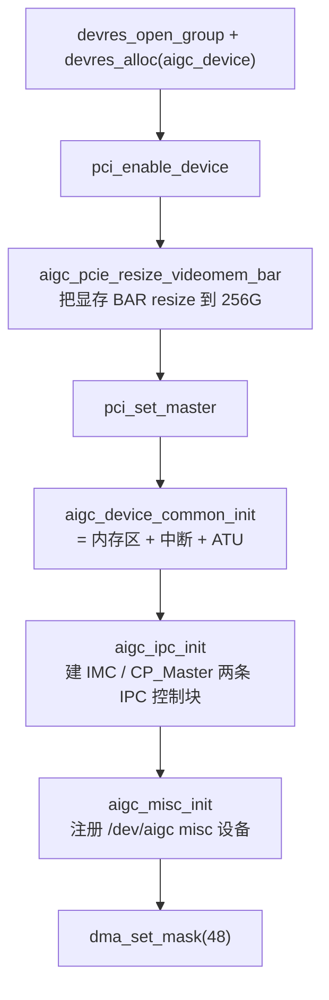
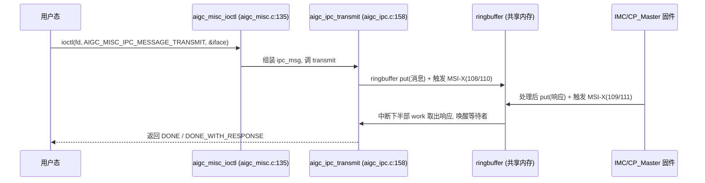

# tiny-kmd 架构总览

**文件**: `tinykmd/aigc_drv.c`、`aigc_device.c`、`aigc_ipc.c`、`aigc_misc.c`
**关联**: [[wiki/grace/tiny-kmd/index|tiny-kmd 知识库]] | [[wiki/grace/tiny-kmd/ipc]] | [[wiki/grace/tiny-kmd/device]]

> tiny-kmd 是一个**扁平的单设备驱动**：没有 ajthunk 那样的三层（OS 抽象 / 可移植核心 / HAL），而是直接调
> Linux 内核 API、直接 `iowrite32` 读写寄存器。它的「分层」体现在 probe 时按顺序拉起的几个子系统。

---

## probe 序列（驱动从这里开始）

`aigc_probe()`（`aigc_drv.c:26`）是 PCI 设备绑定入口，按顺序做这几件事：

- **资源管理用 devres**：`devres_alloc(aigc_devres_release, ...)` 把 `struct aigc_device` 挂到 `pdev->dev` 上，
  出错时 `devres_release_group` 自动回滚（`aigc_drv.c:31-87`）。**给应届生**：devres = 「设备生命周期托管的内存」，
  设备拔出/probe 失败时自动释放，省去手写 cleanup。
- **`aigc_device_common_init()`**（`aigc_device.c:189`）内部再拉起三件事：`aigc_device_memory_init`（映射 BAR/内存区）
  → `aigc_interrupt_init`（MSI-X）→ `aigc_atu_init`（PCIe 入站地址翻译）。
- `aigc_remove()`（`aigc_drv.c:91`）按相反顺序拆除：misc → ipc → 保存的 PCI 状态 → device_common → clear master → disable。

## 核心数据结构 `struct aigc_device`

`aigc.h:41` 定义，是整个驱动的根对象（比 ajthunk 的 `aigc_lib_device` 小得多）：

| 字段 | 含义 |
|---|---|
| `pdev` / `pci_state` | PCI 设备与保存的配置状态。 |
| `mem_bar_base` | 显存 BAR（`MEM_BAR_INDEX=2`）映射。 |
| `pcie_config_base` | PCIe 配置区（ATU/HDMA 用，`PCIE_CONFIG_BAR_INDEX=4`）。 |
| `share_mem_region` / `ilm_region` / `imc_regbank_region` | IMC 共享内存 / ILM / 寄存器组（IPC 与寄存器访问用）。 |
| `irq_info` | MSI-X 向量簿记（`aigc_irq_info_t`）。 |
| `ipc_private` / `misc_private` | 指向 IPC 信息块和 misc 信息块（子系统私有数据）。 |

`struct aigc_io_region`（`aigc.h:27`）= `{ resource_size_t base/size; void __iomem *registers; }`，所有 BAR/内存区
映射都用它。

## 请求路径（用户态一次 ioctl 怎么走）

细节见 [[wiki/grace/tiny-kmd/ipc]] 与 [[wiki/grace/tiny-kmd/ioctl]]。

## 与 ajthunk 三层架构的对比

tiny-kmd **没有** ajthunk 的 [[wiki/grace/kmd/01-architecture|三层架构]]——这正是移植时要补的：先给它加一层
`os_*` 抽象（对齐 [[os_interface]]），再加 `hal/hal.h` 函数指针表，然后才能把 ajthunk 的可移植模块逐个搬进来。
见 [[wiki/grace/tiny-kmd/gap-vs-ajthunk|缺口对照]]。

## 延伸

- [[wiki/grace/tiny-kmd/ipc]]：IPC 消息环（核心）。
- [[wiki/grace/tiny-kmd/device]]：probe 拉起的设备/内存子系统。
- [[wiki/grace/tiny-kmd/gap-vs-ajthunk]]：要移植什么。
