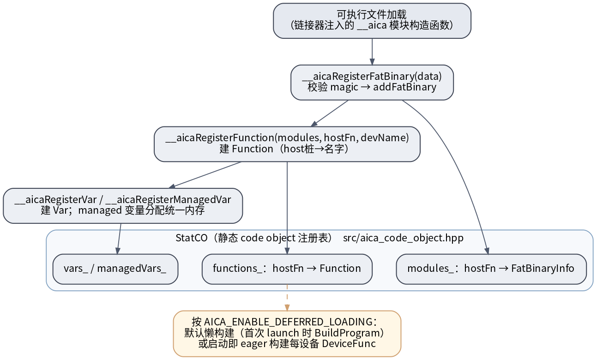
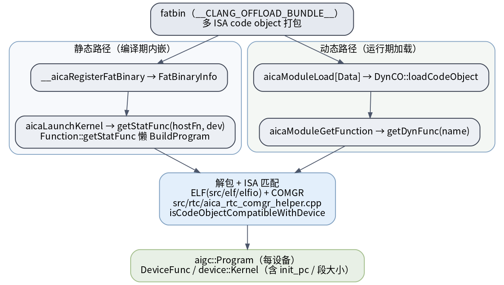

# UMD code object 装载与注册

device kernel 的二进制（code object）以 **fatbin**（`__CLANG_OFFLOAD_BUNDLE__`，多 ISA 打包）形态存在。UMD 要解决两件事：**启动时把编译器注入的注册信息收进注册表**，以及 **launch 时把 host 桩地址解析成某设备上的 device kernel**。

## 启动注册链 → StatCO

> 图解源文件：[`c1-startup-registration.dot`](../../../../_attachments/grace/umd-arch/src/c1-startup-registration.dot)

可执行文件加载时，链接器注入的 `__aica` 模块构造函数依次调用（`src/aica_table_interface.cpp:48+`）：

- `__aicaRegisterFatBinary(data)`：校验 magic → `addFatBinary` → 建 `FatBinaryInfo`（每设备一份解包信息）。
- `__aicaRegisterFunction(modules, hostFn, devName)`：建 `Function`（host 桩 → device 函数名）。
- `__aicaRegisterVar` / `__aicaRegisterManagedVar`：建 `Var`；managed 变量额外分配统一内存。

全部落进 **`StatCO`**（静态 code object 注册表，`src/aica_code_object.hpp`）的三张表：`modules_`(hostFn→FatBinaryInfo)、`functions_`(hostFn→Function)、`vars_`/`managedVars_`。是否立即编译由 `AICA_ENABLE_DEFERRED_LOADING` 决定：默认**懒构建**（首次 launch 时 `BuildProgram`），否则启动即 eager 构建每设备 `DeviceFunc`。

## host 桩 → device kernel 解析；静态 vs 动态装载

> 图解源文件：[`c2-codeobject-resolve-load.dot`](../../../../_attachments/grace/umd-arch/src/c2-codeobject-resolve-load.dot)

- **静态路径**（编译期内嵌）：`__aicaRegisterFatBinary` → `FatBinaryInfo`；`aicaLaunchKernel` 时 `getStatFunc(hostFn, dev)` → `Function::getStatFunc` 懒 `BuildProgram`。
- **动态路径**（运行期加载）：`aicaModuleLoad[Data]` → `DynCO::loadCodeObject`；`aicaModuleGetFunction` → `getDynFunc(name)`（`src/aica_module.cpp`）。
- 两路汇合到**解包 + ISA 匹配**：ELF（`src/elf/`，elfio）+ COMGR（`src/rtc/aica_rtc_comgr_helper.cpp`），`isCodeObjectCompatibleWithDevice` 按 target triple 校验 processor / SRAM-ECC / XNACK。产出 **`aigc::Program`（每设备）** 与 `DeviceFunc` / `device::Kernel`（含入口 `init_pc`、各段大小）。

> ROCm 血缘：fatbin / code object / COMGR / `Program`/`Symbol` 都是 ROCm 原样移植，`Function`/`Var` 对应 HIP 的 host stub 注册模型。

## 延伸

- [[kernel-launch|kernel launch 全路径]]（`getStatFunc` 在主链里的位置）· [[packet-and-doorbell|dispatch packet]]（`init_pc` 怎么进包）
- [[wiki/grace/umd/index|UMD 总览]] · [[wiki/grace/umd/dev/access-and-build|代码结构]]
