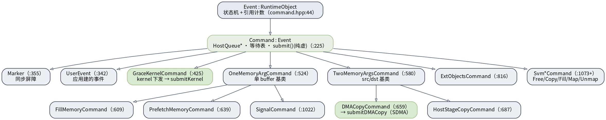
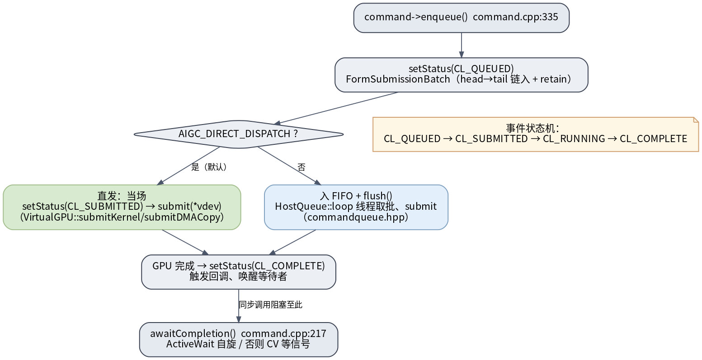

# UMD 命令模型与队列

UMD 把每一次 kernel launch / 内存拷贝 / 同步都建模成一个**带类型的命令对象**（`Command` 子类），入 stream 队列执行。这是 HSA/ROCm 的命令模型移植。

## Command 类继承体系

> 图解源文件：[`cmd1-command-hierarchy.dot`](../../../../_attachments/grace/umd-arch/src/cmd1-command-hierarchy.dot)

`src/platform/command.hpp`：

- **`Event : RuntimeObject`**（`:44`）：状态机 + 引用计数。
- **`Command : Event`**（`:225`）：持 `HostQueue*`、等待表、纯虚 `submit()`（device 后端多态实现）。
- 子类：`Marker`(`:355` 同步屏障)、`UserEvent`(`:342`)、**`GraceKernelCommand`**(`:425`，kernel 下发 → `submitKernel`)、`OneMemoryArgCommand`(`:524` 单 buffer 基类 → `FillMemoryCommand`/`PrefetchMemoryCommand`/`SignalCommand`)、`TwoMemoryArgsCommand`(`:580` src/dst 基类 → **`DMACopyCommand`**`:659` → `submitDMACopy`、`HostStageCopyCommand`)、`ExtObjectsCommand`、`Svm*Command`(`:1073+`)。

## 命令生命周期 + 队列批处理

> 图解源文件：[`cmd2-command-lifecycle-queue.dot`](../../../../_attachments/grace/umd-arch/src/cmd2-command-lifecycle-queue.dot)

`command->enqueue()`（`command.cpp:335`）：

1. `setStatus(CL_QUEUED)`，`FormSubmissionBatch` 把命令链入 `head→tail` 批次并 retain。
2. **`AIGC_DIRECT_DISPATCH`（默认）**：当场 `setStatus(CL_SUBMITTED)` + `submit(*vdev)` 多态派发到 `VirtualGPU::submitKernel`/`submitDMACopy`（直发，见 [[packet-and-doorbell]]）。
3. 否则：入 FIFO + `flush()`，由 `HostQueue::loop` 线程取批、`submit`（`commandqueue.hpp`）。
4. GPU 完成 → `setStatus(CL_COMPLETE)`，触发回调、唤醒等待者；同步调用在 `awaitCompletion()`（`command.cpp:217`）阻塞（`ActiveWait` 自旋 / 否则 CV 等信号，见 [[thunk-and-sync]]）。

事件状态机：`CL_QUEUED → CL_SUBMITTED → CL_RUNNING → CL_COMPLETE`。

## 延伸

- [[packet-and-doorbell|dispatch packet 与 doorbell]] · [[streams-events-signals|stream/event/signal]] · [[aica-memcpy-copy-command|aicaMemcpy 造命令]]
- [[wiki/grace/umd/index|UMD 总览]]
