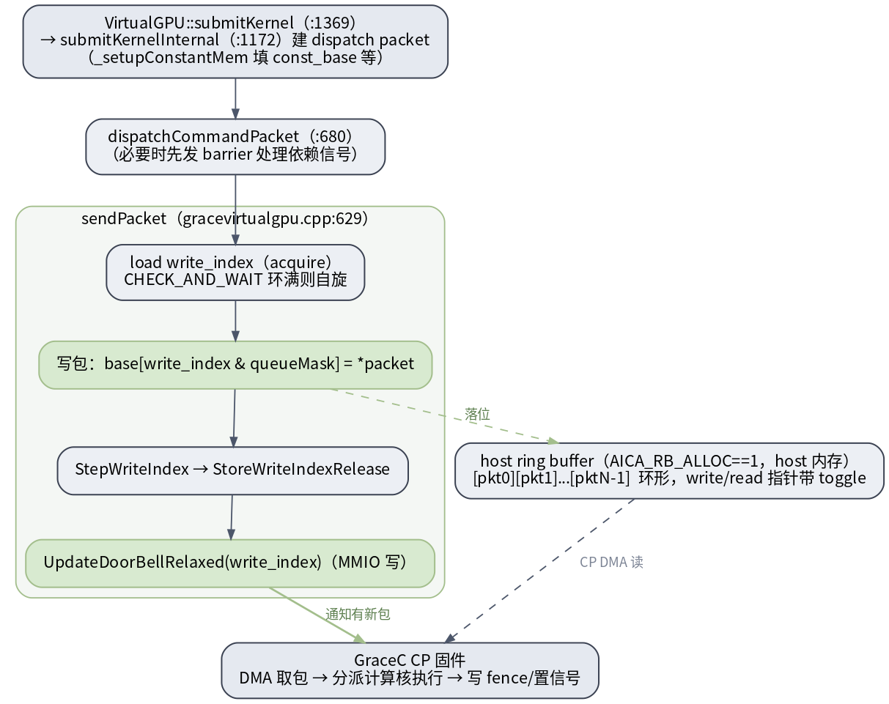
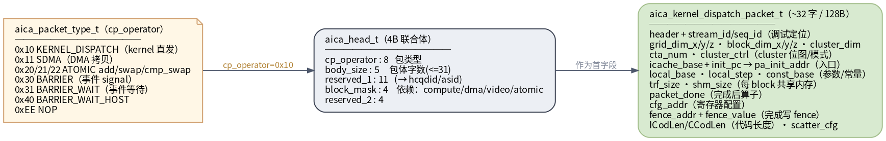

# UMD dispatch packet 与 doorbell 直发

这是 UMD 最关键的一段：**kernel launch 由 UMD 直发**——自己把命令包写进 host 内存的 ring buffer，再敲 doorbell（MMIO 写）通知芯片。默认 HWS 模式下 KMD 不经手每一个包。

## 直发路径：sendPacket 写 ring + 敲 doorbell

> 图解源文件：[`pkt1-ringbuffer-doorbell.dot`](../../../../_attachments/grace/umd-arch/src/pkt1-ringbuffer-doorbell.dot)

`src/device/grace/gracevirtualgpu.cpp`（源码确认 2026-06-28）：

1. `VirtualGPU::submitKernel`（`:1369`）→ `submitKernelInternal`（`:1172`）：建 `aica_kernel_dispatch_packet_t`，`_setupConstantMem` 填 `const_base` 等。
2. `dispatchCommandPacket`（`:680`）：必要时先发 barrier 处理依赖信号。
3. **`sendPacket`（`:629`）**：`load write_index`（acquire）→ `CHECK_AND_WAIT` 环满则自旋 → 写包 `base[write_index & queueMask] = *packet` → `StepWriteIndex` → `StoreWriteIndexRelease` → **`UpdateDoorBellRelaxed(write_index)`（MMIO 写）**。
4. ring buffer 在 **host 内存**（`AICA_RB_ALLOC==1 // alloc on host`），环形、write/read 指针带 toggle 位防回绕；GraceC CP 固件经 DMA 取包 → 分派计算核执行 → 写 fence/置信号。

## 包类型与字段布局

> 图解源文件：[`pkt2-packet-layout.dot`](../../../../_attachments/grace/umd-arch/src/pkt2-packet-layout.dot)

`include/aica_packet_def.h`：

- **包类型 `aica_packet_type_t`**（`cp_operator` 字段）：`0x10 KERNEL_DISPATCH`、`0x11 SDMA`、`0x20/21/22 ATOMIC`、`0x30 BARRIER`、`0x31 BARRIER_WAIT`、`0x40 BARRIER_WAIT_HOST`、`0xEE NOP`。**全栈只有一个 `0x10`**，UMD dispatch 包与 CP job operator id 指同一件事。
- **`aica_head_t`（4B 联合体）**：`cp_operator:8` / `body_size:5`(包体字数≤31) / `reserved_1:11`(→hcqdid/asid) / `block_mask:4`(依赖：compute/dma/video/atomic) / `reserved_2:4`。
- **`aica_kernel_dispatch_packet_t`（~32 字 / 128B）**：header + `stream_id`/`seq_id`（调试定位）；`grid_dim`/`block_dim`/`cluster_dim`；`cta_num`、`cluster_ctrl`（cluster 位图/模式）；`icache_base`+`init_pc`→ `pa_init_addr`（kernel 入口）；`local_base`/`local_step`/`const_base`（参数与常量）；`trf_size`/`shm_size`（每 block 共享内存）；`packet_done`（完成后算子）；`cfg_addr`（寄存器配置）；`fence_addr`+`fence_value`（完成写 fence）；`ICodLen`/`CCodLen`（代码长度）、`scatter_cfg`。

> kernel 参数不是直接塞进包，而是经 `const_base` 指向的常量内存（`_setupConstantMem` 备好）。`init_pc` 来自 [[code-object-and-registration|code object]] 解析出的 device kernel 入口。

## 延伸

- [[command-model-and-queue|命令模型与队列]] · [[kernel-launch|kernel launch 全路径]] · [[kernel-cmd-to-cp-job-cmd|kernel cmd → CP job cmd 字段映射]]
- [[wiki/grace/umd/index|UMD 总览]] · [[wiki/grace/kmd/index|KMD]] · [[wiki/grace/fw/index|FW CP 固件]]
