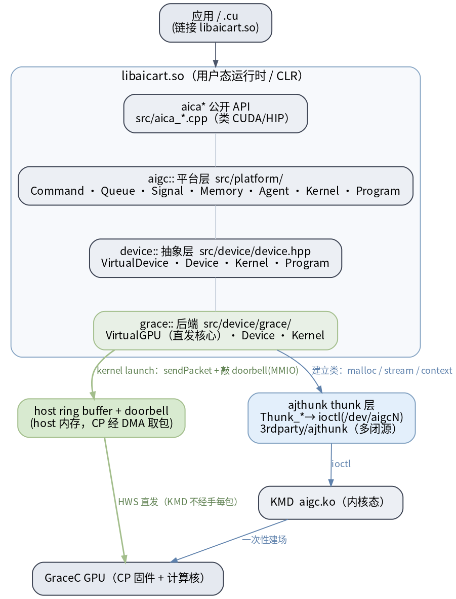
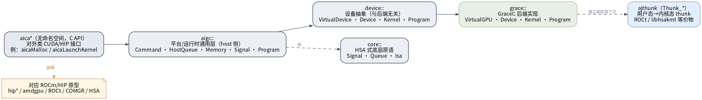
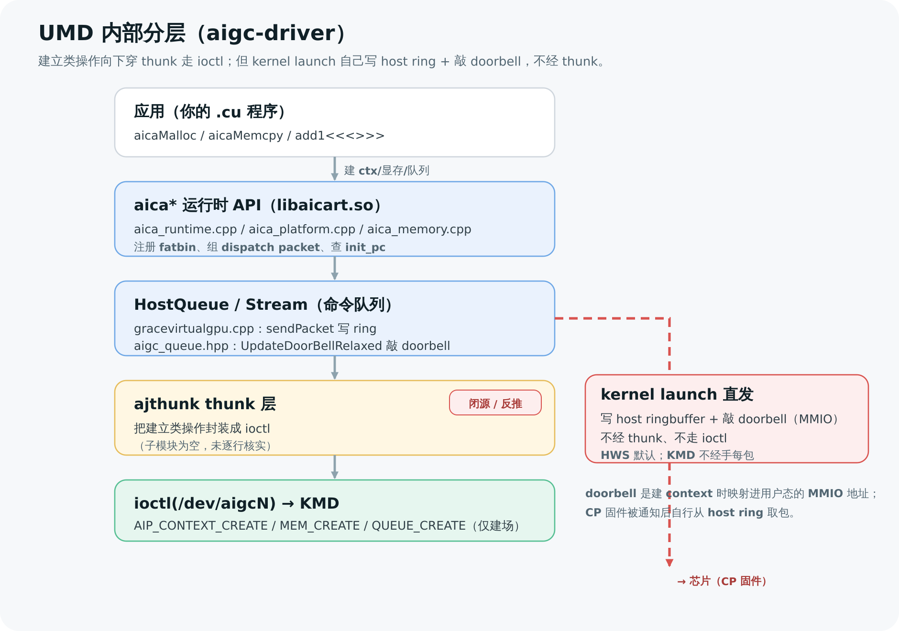

# UMD 用户态运行时（aigc-driver）

这是 **UMD**（User-Mode Driver，用户态驱动）相关内容的统一入口。和 [[wiki/grace/kmd/index|KMD `aigc.ko`]]（跑在内核态）、[[wiki/grace/fw/index|FW CP 固件]]（跑在芯片上）相对，**UMD 跑在用户态进程里**，是 GraceC GPU 软件栈中应用直接链接的那一层：它提供一套**类 CUDA 的 API**（前缀 `aica*`），把 kernel launch 翻译成命令包，**自己写进 host 端 ring buffer、自己敲 doorbell**，并管理设备初始化、显存、stream、完成同步。

> 给应届生的一句话：**应用 / `.cu` → UMD `libaicart.so`（`aica*` API）→ 写 host ring buffer + 敲 doorbell(MMIO) → 芯片 CP 固件取包执行**。UMD 是这条链路上「应用看得见、摸得着」的那层；建 context / 分显存 / 建队列才下沉到 [[wiki/grace/kmd/index|KMD]] 的 ioctl。

> 术语：**UMD = `aigc-driver` 源码树**，编出用户态运行时库 **`libaicart.so`**；**ajthunk** 是它下面的用户态 thunk 层（封装 `ioctl`）。三者首次出现，记住这条对应。

## 整体架构

> 图解源文件：[`a1-stack-layers.dot`](../../../_attachments/grace/umd-arch/src/a1-stack-layers.dot)

一句话读图：应用 → `libaicart.so`（aica\* API → aigc:: 平台层 → device:: 抽象 → grace:: 后端）。**建立类**（malloc / stream / context）经 ajthunk 走 `ioctl` 下沉 KMD；**kernel launch** 由 grace `VirtualGPU` 写 host ring buffer + 敲 doorbell(MMIO)，HWS 下旁路 KMD 每包。

读源码先认住命名空间分工：

> 图解源文件：[`a2-namespace-map.dot`](../../../_attachments/grace/umd-arch/src/a2-namespace-map.dot)

## 子系统导航

按子系统系统化通读全代码，每页架构级讲解 + Graphviz 图解（源码确认 2026-06-28）：

| 子系统 | 页面 | 看什么 |
|---|---|---|
| 初始化 / 设备模型 | [[init-and-device-model\|运行时初始化与设备模型]] | `Runtime::init`/`aica::init` 时序、`g_devices`/`VirtualGPU`/TLS 对象图 |
| kernel launch | [[kernel-launch\|kernel launch 全路径]] | `aicaLaunchKernel`→`KernelLaunchKit`→造命令→直发；`<<<>>>` 降级 |
| stream/event/signal | [[streams-events-signals\|stream / event / signal]] | HostQueue、Event 状态机、Signal 三类、完成回路 |
| code object / 注册 | [[code-object-and-registration\|code object 装载与注册]] | `__aicaRegister*`→StatCO、host桩→DeviceFunc、static/dynamic + COMGR |
| 命令模型 / 队列 | [[command-model-and-queue\|命令模型与队列]] | Command 继承树、enqueue/直发/批处理、状态机 |
| dispatch 直发 | [[packet-and-doorbell\|dispatch packet 与 doorbell]] | sendPacket 写 ring + doorbell；包类型与字段布局 |
| 显存模型 | [[allocation-and-memory-model\|显存分配与内存对象模型]] · [[aica-memcpy-copy-command\|aicaMemcpy 造命令]] | 分配两条路、MemObjMap/Memory/mempool/IPC；拷贝命令 |
| thunk / 同步 | [[thunk-and-sync\|thunk 边界与同步原语]] | thunk/ioctl vs 直发边界；Thread/Monitor/Semaphore/Signal |
| 访问 / 构建 | [[wiki/grace/umd/dev/access-and-build\|访问、代码结构与构建]] | SSH 80.116、目录结构、`build_ex.sh` |

## 这是什么 / 不是什么

- **是什么**：类 CUDA 的用户态运行时。会写 CUDA 的人几乎零成本上手：`cudaMalloc → aicaMalloc`，`<<<>>>` 还是 `<<<>>>`。
- **血缘**：`aigc-driver` 是把 AMD 的 **HIP / ROCm 运行时整体改名**移植来的。读源码时按下表对应，就不会在满屏 ROCm 影子里迷路：

| 我们的栈 | ROCm / HIP 原型 | 说明 |
|---|---|---|
| `aica*`（如 `aicaMalloc`） | `hip*`（如 `hipMalloc`） | 整体改前缀 |
| `aicagcn` | `amdgpu` | GPU 后端目标名（target triple `aicagcn-aica-aicahsa-`） |
| `ajthunk` | ROCt thunk（`libhsakmt`） | 用户态 → 内核态的 thunk 层 |
| `HostQueue` / `Stream` | ROCm `HostQueue` | 命令队列基类 |
| COMGR / fatbin / code object | ROCm COMGR / fatbin / `.co` | 编译产物与 kernel 二进制装载 |

> 🔎 **为什么要知道血缘**：源码里大量结构体、文件名、注释都是 ROCm 的，看起来像两套东西其实是同一套换皮。认住这张表，遇到 `HostQueue`、`Bundle`、`code object` 不用从零猜。

## 关键事实（与全栈一致，源码确认 2026-06-26）

UMD 这层必须记住的三条（与 [[saxpy-kernel-end-to-end|端到端长文]] 完全一致）：

1. **kernel launch 是 UMD 直发的**：UMD 自己 `sendPacket` 把命令包写进 stream ring buffer，`UpdateDoorBellRelaxed` 原子写 doorbell（MMIO 写触发通知）。默认硬件调度模式（HWS）下，**KMD 不经手每一个 kernel 包**——只在初始化时一次性建场（建 context、分显存、建队列）。
2. **ring buffer 在 host 内存**（`sendPacket` 注释 `AICA_RB_ALLOC==1 // alloc on host`），不是显存（VRAM）；CP 侧通过 DMA 读这块 host 缓冲。
3. **全栈只有一个 `0x10`**（`AICA_PACKET_TYPE_KERNEL_DISPATCH`）。UMD 的 dispatch 包类型 `0x10` 与 CP 的 Submit_JD job operator id `0x10` 指同一件事；旧文档「两个 0x10」是误判。

## UMD 内部分层

> 图解源文件：[`u1-umd-layers.svg`](../../../_attachments/grace/saxpy-e2e/src/u1-umd-layers.svg)

一句话读图：**建立类操作（建 context / 分显存 / 建队列）走 ajthunk → `ioctl`；kernel 提交（写 ring + 敲 doorbell）不走 thunk，UMD 直接做 MMIO 写。** 这两条路径是 UMD 最该分清的边界。

> 🚧 **闭源标注**：`ajthunk` thunk 层（子模块为空）与 `libaicart` 的部分实现闭源。「`Thunk_*` 内部怎么封装 `ioctl`」这一段是从 UMD 这侧**反推的，未逐行核实**；但边界清楚——见上图。

## 关键 API 表

UMD 对外 API（`aica*`）→ 底层真实动作（源码确认）：

| API | 底层动作 | 走 ioctl？ | 源码 |
|---|---|---|---|
| `aicaMalloc(&p, n)` | 分配显存，返回 GPU 可用地址；`SvmBuffer::malloc` 经 thunk 发 `AIP_MEM_CREATE`，内核分物理页 + 建地址映射 | 是（建立类） | `aica_memory.cpp` |
| `aicaMemcpy(..., H2D/D2H)` | **不是裸 memcpy**：造一个「拷贝命令」塞进 stream 队列，与 kernel launch 走同一条队列异步执行（默认等完成） | 否（走队列） | `aica_memory.cpp`（`createCopyCommand`） |
| `aicaStreamCreate(&s)` | 建一个 stream（继承自 `HostQueue`）；第一次真用时**懒创建**一条硬件 ring buffer，经 thunk `AIP_QUEUE_CREATE` 建好、拿到 doorbell 地址 | 是（建立类，懒触发） | `aica_runtime.cpp` |
| `aicaLaunchKernel(&fn, grid, block, args, ...)` | 查 fatbin 注册表反推 device kernel 入口 `init_pc`，逐字段填 `aica_kernel_dispatch_packet_t`（类型 `0x10`），再 `sendPacket` 写 ring + `UpdateDoorBellRelaxed` 敲 doorbell | **否**（直发 HWS） | `gracevirtualgpu.cpp`（`dispatchCommandPacket` / `sendPacket`） |
| `add1<<<g,b>>>(...)` | 编译器拆成 `__aicaPushCallConfiguration(g,b,...)` + `aicaLaunchKernel(...)` 两步 | — | 编译器插桩 + `aica_runtime.cpp` |
| `aicaFree(p)` | 释放显存句柄，引用计数归零层层释放 | 是（建立类） | `aica_memory.cpp` |

> 🎯 **面试官会追问**
> - **`aicaMemcpy` 和 `aicaLaunchKernel` 走的是同一条 stream 吗？** 是。拷贝命令和 kernel dispatch 包进同一条 ring buffer 顺序执行，这保证了「先 H2D、再 launch、再 D2H」的依赖关系无需额外同步。
> - **`aicaLaunchKernel` 提交后到底经不经过内核（KMD）？** HWS 默认下**不经过**——UMD 自己 `sendPacket` + 敲 doorbell 就返回。KMD 只在 `aicaStreamCreate` / `aicaMalloc` 这类建立类调用里出现。dispatch 路径上没有 `ioctl`、没有 `QUEUE_SUBMIT`。

## 源码地图

远程主机 `shuaishuai.zhu@192.168.80.116:~/aigc-driver`（源码确认 2026-06-26）：

| 文件 | 作用 |
|---|---|
| `src/aica_runtime.cpp` | `aica*` 运行时 API 入口（launch / stream / 配置） |
| `src/aica_platform.cpp` | 平台状态、fatbin 注册（`RegisterFatBinary` / `RegisterFunction`）、设备初始化 |
| `src/aica_memory.cpp` | 显存分配 / `aicaMemcpy` / 拷贝命令（`iaicaMalloc` / `createCopyCommand`） |
| `src/aica_fatbin.cpp` | fatbin / code object 解包（ROCm COMGR 影子） |
| `src/device/grace/gracevirtualgpu.cpp` | **kernel 直发核心**：`dispatchCommandPacket` → `sendPacket` → `UpdateDoorBellRelaxed` |
| `include/aica_packet_def.h` | `aica_kernel_dispatch_packet_t` 字段定义、`AICA_PACKET_TYPE_KERNEL_DISPATCH = 0x10` |
| `build_ex.sh` | 编译脚本（`clang -x aica` 一趟编出 host + device，打 fatbin） |

**闭源部分**（反推未逐行核实）：

- **`ajthunk` thunk 层**：子模块为空，`Thunk_*` 如何封装 `ioctl(AIP_*)` 仅从 UMD 侧反推。
- **`libaicart` 的部分实现**：闭源 blob 形态，行为以对外 API + 包结构反推。

## 推荐阅读顺序

UMD 这层不必从这里逐页读完——主线在端到端长文里，这页是导航：

1. **【主线·先读】** [[saxpy-kernel-end-to-end|一个 Kernel 从 .cu 到硬件执行的全流程]]：用 `add1` 例子贯穿 UMD → KMD → CP，UMD 段（编译 / 注册 / `aicaLaunchKernel` / 写包敲门铃）讲得最细。
2. [[stream-mcqd-hcqd-and-command-submission|stream / MCQD / HCQD 与命令下发]]：stream 懒创建硬件 ring、doorbell 从哪来、命令下发两阶段。
3. [[kernel-cmd-to-cp-job-cmd|kernel cmd → CP job cmd 字段映射]]：`aica_kernel_dispatch_packet_t` 逐字段如何对到 CP job 包。
4. 下沉到内核：[[wiki/grace/kmd/index|KMD 内核驱动知识库]]（建 context / 分显存 / 建队列的真实实现）。
5. 下沉到芯片：[[wiki/grace/fw/index|FW 技术知识库]]（CP 取包、分拣、投递 CLS FIFO）。

## 新增 UMD 页面放哪里

| 新页面类型 | 放置目录 | 同步更新 |
|---|---|---|
| 运行时 API / launch / stream 分析 | `wiki/grace/umd/runtime/` | 本页 |
| 编译链 / fatbin / code object 分析 | `wiki/grace/umd/compile/` | 本页 |
| 显存 / memcpy / SVM 分析 | `wiki/grace/umd/memory/` | 本页 |
| dispatch packet / 直发路径分析 | `wiki/grace/umd/dispatch/` | 本页 |
| 端到端流程（跨层） | `wiki/grace/overview/` | 本页 + overview |

## 延伸

- [[saxpy-kernel-end-to-end|Kernel 端到端全流程长文]]（UMD 主线在此）
- [[wiki/grace/kmd/index|KMD 内核驱动知识库]]
- [[wiki/grace/fw/index|FW 技术知识库]]
- [[wiki/grace/index|GraceC 芯片软硬件栈总入口]]
