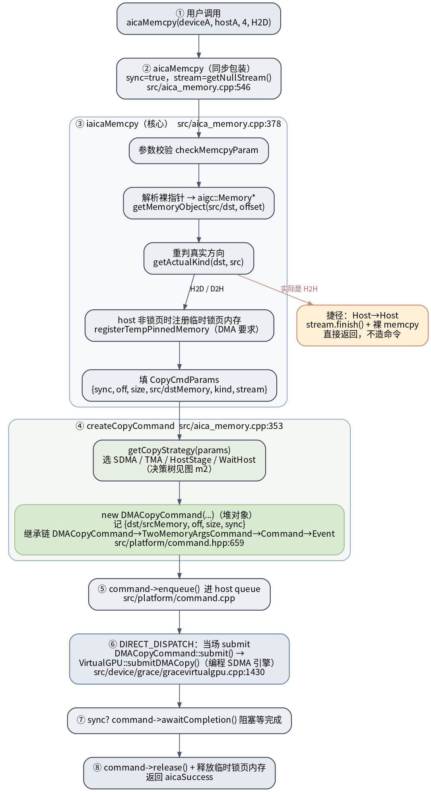
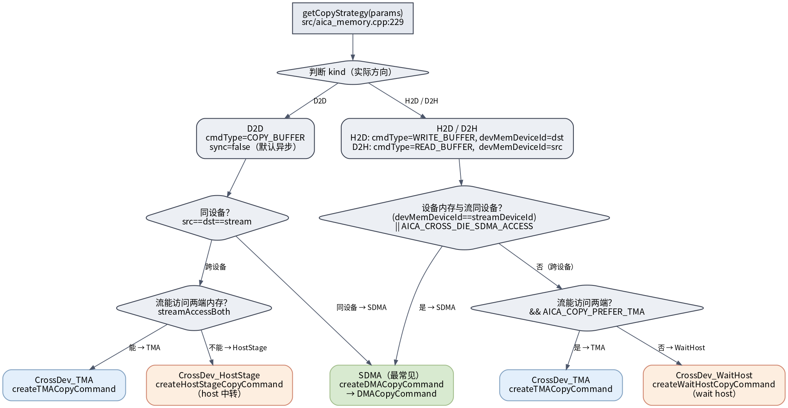

# aicaMemcpy 怎么造拷贝命令（iaicaMemcpy 内部）

一句话：**`aicaMemcpy` 不是一次裸 `memcpy`，而是把这次拷贝包装成一个带类型的命令对象（`DMACopyCommand`），选好搬运策略，丢进 stream 的 host queue 里执行**——和 kernel launch 走同一条队列。本页用 `aicaMemcpy(deviceA, hostA, 4, H2D)`（来自 [[saxpy-kernel-end-to-end|test_saxpy_op.cu]]）贯穿。

上层 API 语义见 [[wiki/grace/umd/index|UMD 总览]]的 API 表；本页只拆 `iaicaMemcpy` 内部的「造命令」过程。

## 命令的一生：构造 → 入队 → 提交 → 等待

> 图解源文件：[`m1-memcpy-command-lifecycle.dot`](../../../../_attachments/grace/umd-memcpy/src/m1-memcpy-command-lifecycle.dot)

逐步对应源码（`src/aica_memory.cpp`，源码确认 2026-06-28）：

1. **入口包装** `aicaMemcpy`（`:546`）：固定 `sync=true`、用 default/null stream（`getNullStream()`），转调 `iaicaMemcpy`。
2. **核心** `iaicaMemcpy`（`:378`）：
   - `checkMemcpyParam` 校验；
   - `getMemoryObject(ptr, &offset)` 把用户的**裸指针解析回内部 `aigc::Memory*` + 偏移**；
   - `getActualKind(dst, src)` 按指针属性**重新判定真实方向**（防 `kind` 传错或传 `Default`）。
3. **H2H 捷径**：若实际是 Host→Host，`stream.finish()` 后直接裸 `memcpy` 返回，**根本不造命令**。
4. **H2D/D2H 锁页**：host 端若不是锁页(pinned)内存，`registerTempPinnedMemory` 注册一块临时锁页内存并强制同步——**DMA 引擎只能搬锁页内存**。本例 `hostA` 是普通 `malloc`，会走这步。
5. **填 `CopyCmdParams`**（`:186`）：把 `{sync, dOffset, sOffset, sizeBytes, dst/srcMemory, kind, currentStream}` 打包。
6. **造命令** `createCopyCommand`（`:353`）：`getCopyStrategy` 选策略（见下图），SDMA 策略下 `createDMACopyCommand` → `new aigc::DMACopyCommand(...)`，一个**堆对象**，记下 `{dst/srcMemory, off, size, sync}` 并对两块内存加引用计数。继承链：`DMACopyCommand → TwoMemoryArgsCommand → Command → Event`（`src/platform/command.hpp:659`）。它还重写了 `submit()`：`device.submitDMACopy(*this)`。
7. **入队** `command->enqueue()`（`src/platform/command.cpp`）：进 host queue。在 `AIGC_DIRECT_DISPATCH` 下不是只排队等子线程，而是**当场** `FormSubmissionBatch` 后立刻 `submit(*queue_->vdev())`。
8. **提交执行**：多态派发到 `VirtualGPU::submitDMACopy`（`src/device/grace/gracevirtualgpu.cpp:1430`），真正去**编程 SDMA 引擎**完成搬运。
9. **同步等待**：`sync==true` 时 `command->awaitCompletion()` 阻塞到拷贝结束；最后 `command->release()` + 释放临时锁页内存，返回 `aicaSuccess`。

## getCopyStrategy 决策树：选哪种搬运 + 造哪种命令

> 图解源文件：[`m2-copy-strategy-decision.dot`](../../../../_attachments/grace/umd-memcpy/src/m2-copy-strategy-decision.dot)

`getCopyStrategy`（`src/aica_memory.cpp:229`）按**方向**和**同设备/跨设备**选 4 种策略，每种对应一个 `createXxxCopyCommand`：

| 策略 | 触发条件 | 造的命令 |
|---|---|---|
| **SDMA**（最常见） | 源/目的与流同设备（`devMemDeviceId==streamDeviceId`），或 `AICA_CROSS_DIE_SDMA_ACCESS` | `createDMACopyCommand` → `DMACopyCommand` |
| CrossDev_TMA | 跨设备且流能访问两端内存（`streamAccessBoth`，H2D/D2H 还需 `AICA_COPY_PREFER_TMA`） | `createTMACopyCommand` |
| CrossDev_HostStage | D2D 跨设备且流**不能**访问两端 | `createHostStageCopyCommand`（host 中转） |
| CrossDev_WaitHost | H2D/D2H 跨设备且不用 TMA | `createWaitHostCopyCommand` |

补充：H2D 设 `cmdType=CL_COMMAND_WRITE_BUFFER`、`devMemDeviceId=dstDeviceId`；D2H 设 `READ_BUFFER`、`devMemDeviceId=srcDeviceId`；D2D 设 `COPY_BUFFER` 且 `sync=false`（默认异步，对齐 CUDA `cudaMemcpyDtoD` 语义）。本例单设备 H2D → **SDMA → `DMACopyCommand`**。

## 关键认识

- **拷贝是“命令”，不是函数调用里就地完成的**：它和 kernel dispatch 进同一条 stream，顺序执行——这正是 `aicaMemcpy(H2D) → launch → aicaMemcpy(D2H)` 依赖关系无需额外同步的原因。
- **同步语义靠 `awaitCompletion()`**：`aicaMemcpy`/`aicaMemcpyHtoD`/`aicaMemcpyDtoH` 默认 `sync=true`（阻塞）；`aicaMemcpyDtoD` 默认 `sync=false`（异步入队，对齐 NVIDIA）。
- **锁页是 DMA 的前置**：普通 host 内存会被临时 pin 后才能 DMA。

## 延伸

- [[wiki/grace/umd/index|UMD 用户态运行时（aigc-driver）]]（API 表、ROCm 血缘、源码地图）
- [[saxpy-kernel-end-to-end|Kernel 端到端全流程长文]]（`aicaMemcpy` 在 `add1` 用例里的位置）
- [[wiki/grace/umd/dev/access-and-build|UMD 开发维护：访问、代码结构与构建]]
