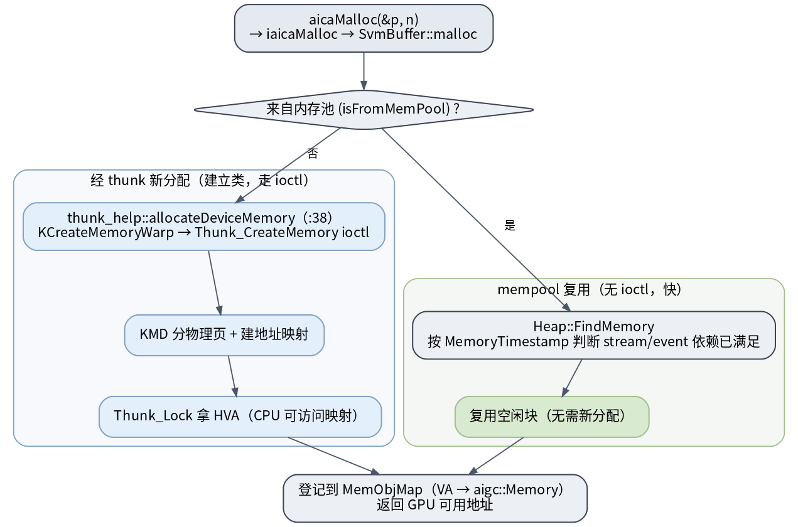
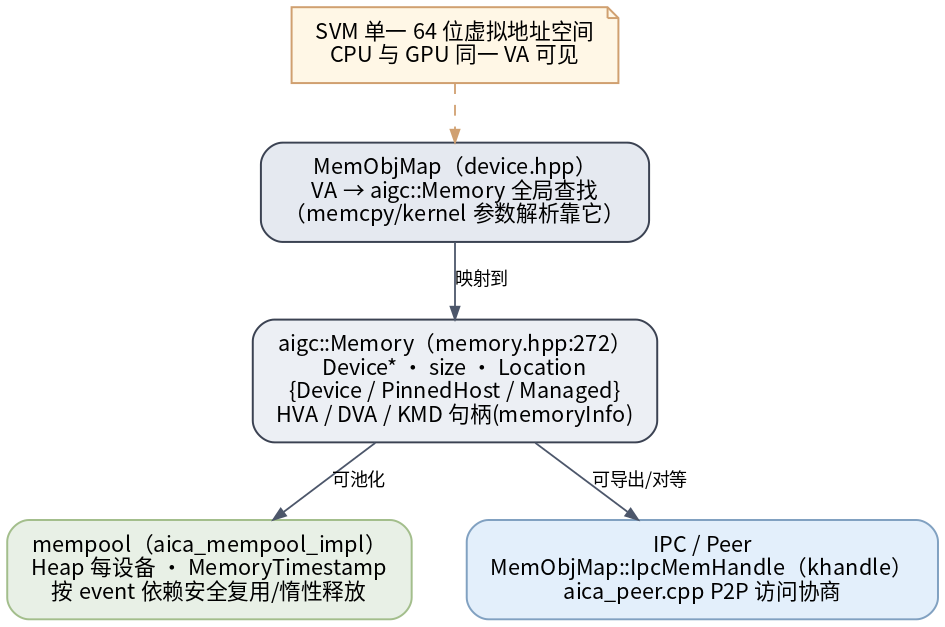

# UMD 显存分配与内存对象模型

UMD 用 **SVM（单一 64 位虚拟地址空间，CPU/GPU 同一 VA 可见）** 模型管理内存。`aicaMalloc` 要么经 thunk 向内核新分配，要么从内存池复用；拷贝/kernel 参数解析都靠 `MemObjMap` 把裸 VA 反查成内存对象。拷贝命令本身见 [[aica-memcpy-copy-command]]。

## 分配两条路：thunk 新分配 vs mempool 复用

> 图解源文件：[`mem1-allocation-path.dot`](../../../../_attachments/grace/umd-arch/src/mem1-allocation-path.dot)

`aicaMalloc(&p, n)` → `iaicaMalloc` → `SvmBuffer::malloc`（`src/aica_memory.cpp`）：

- **经 thunk 新分配**（建立类，走 ioctl）：`thunk_help::allocateDeviceMemory`（`:38`）→ `KCreateMemoryWarp` → `Thunk_CreateMemory` ioctl → KMD 分物理页 + 建地址映射 → `Thunk_Lock` 拿 HVA（CPU 可访问映射）。
- **mempool 复用**（无 ioctl，快）：`Heap::FindMemory` 按 `MemoryTimestamp` 判断该块的 stream/event 依赖已满足 → 复用空闲块。
- 两路都登记到 `MemObjMap`（VA → `aigc::Memory`），返回 GPU 可用地址。

## 内存对象模型

> 图解源文件：[`mem2-memory-object-model.dot`](../../../../_attachments/grace/umd-arch/src/mem2-memory-object-model.dot)

- **`MemObjMap`**（`src/device/device.hpp`）：全局 `VA → aigc::Memory` 查找——`aicaMemcpy` 和 kernel 参数解析都靠它把裸指针映射回对象。
- **`aigc::Memory`**（`src/platform/memory.hpp:272`）：`Device*` / `size` / `Location`{Device / PinnedHost / Managed} / HVA / DVA / KMD 句柄（`memoryInfo`）。
- **mempool**（`src/aica_mempool_impl.*`）：每设备一个 `Heap`，用 `MemoryTimestamp` 记录依赖，按 event 安全复用 / 惰性释放。
- **IPC / Peer**：`MemObjMap::IpcMemHandle`(`khandle`) 导出句柄、`src/aica_peer.cpp` 协商 P2P 访问。

> ROCm 血缘：`SvmBuffer` / `MemObjMap` / pinned-host / managed 都是 ROCm 内存模型的移植。

## 延伸

- [[aica-memcpy-copy-command|aicaMemcpy 怎么造拷贝命令]] · [[thunk-and-sync|thunk 边界]] · [[init-and-device-model|内存池在初始化中的位置]]
- [[wiki/grace/umd/index|UMD 总览]]
