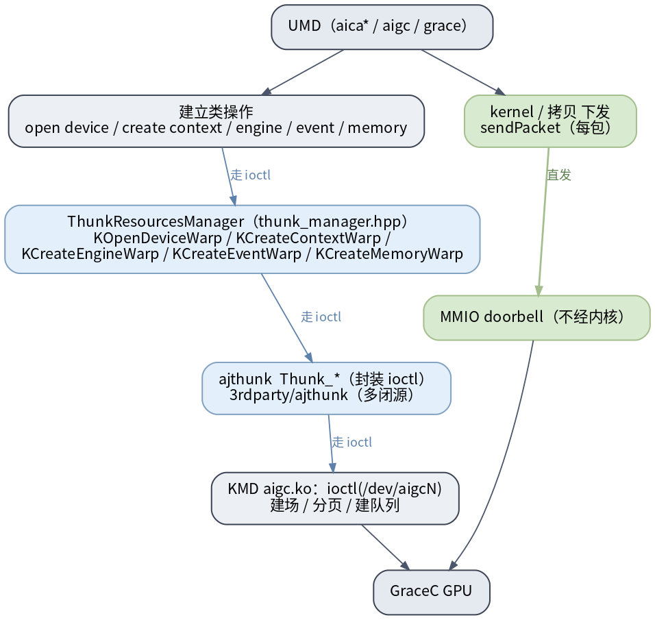
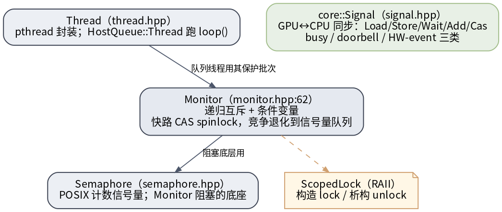

# UMD thunk 边界与同步原语

两件底层事：UMD 怎么跨进内核（thunk/ioctl），以及 UMD 内部线程怎么同步。

## UMD→KMD 边界：建立类经 thunk，dispatch 直发 MMIO

> 图解源文件：[`th1-thunk-boundary.dot`](../../../../_attachments/grace/umd-arch/src/th1-thunk-boundary.dot)

- **建立类操作**（open device / create context / engine / event / memory）经 **`ThunkResourcesManager`**（`src/platform/thunk_manager.hpp`）的 `KOpenDeviceWarp` / `KCreateContextWarp` / `KCreateEngineWarp` / `KCreateEventWarp` / `KCreateMemoryWarp` → **ajthunk `Thunk_*`**（封装 `ioctl`，`3rdparty/ajthunk`，多闭源）→ `ioctl(/dev/aigcN)` 让 KMD 建场/分页/建队列。
- **kernel / 拷贝下发**走 `sendPacket`，**直发 MMIO doorbell，不经内核**（见 [[packet-and-doorbell]]）。

> 这是 UMD 最该分清的边界：**建立类 = thunk/ioctl；每包下发 = 直发 MMIO**。`ajthunk` 子模块为空/闭源，`Thunk_*` 内部如何封装 ioctl 是从 UMD 侧反推、未逐行核实。

## 同步原语

> 图解源文件：[`th2-sync-primitives.dot`](../../../../_attachments/grace/umd-arch/src/th2-sync-primitives.dot)

- **`Thread`**（`src/thread/thread.hpp`）：pthread 封装；`HostQueue::Thread` 跑 `loop()` 处理命令批次。
- **`Monitor`**（`src/thread/monitor.hpp:62`）：递归互斥 + 条件变量；快路 CAS spinlock，竞争时退化到信号量队列；`ScopedLock` 是其 RAII 包装。队列线程用它保护提交批次。
- **`Semaphore`**（`src/thread/semaphore.hpp`）：POSIX 计数信号量，是 `Monitor` 阻塞的底座。
- **`core::Signal`**（`src/platform/signal.hpp`）：GPU↔CPU 同步（`Load/Store/Wait/Add/Cas`），busy / doorbell / HW-event 三类（见 [[streams-events-signals]]）。

## 延伸

- [[packet-and-doorbell|dispatch packet 与 doorbell]] · [[streams-events-signals|stream/event/signal]] · [[allocation-and-memory-model|显存分配（经 thunk）]]
- [[wiki/grace/umd/index|UMD 总览]] · [[wiki/grace/kmd/index|KMD 内核驱动]]
