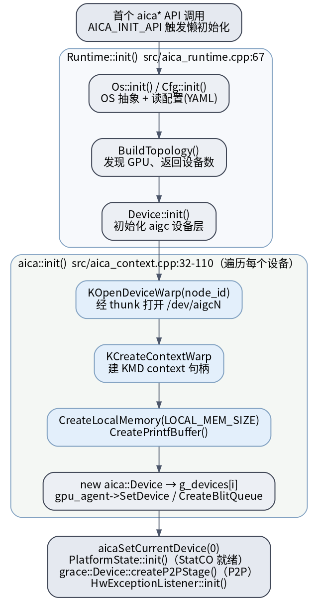
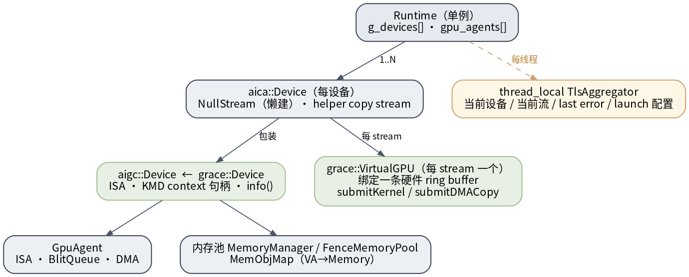

# UMD 运行时初始化与设备模型

UMD 是**懒初始化**的：第一个 `aica*` API 被调用时，`AICA_INIT_API` 宏触发 `Runtime::init()`，建好 OS/配置/拓扑，再对每个 GPU 经 thunk 建场，最后落成 `g_devices[]` 与一套全局单例。

## 初始化时序

> 图解源文件：[`i1-init-sequence.dot`](../../../../_attachments/grace/umd-arch/src/i1-init-sequence.dot)

两段（源码确认 2026-06-28）：

1. **`Runtime::init()`**（`src/aica_runtime.cpp:67`）：`Os::init()` / `Cfg::init()`（OS 抽象 + 读 YAML 配置）→ `BuildTopology()`（发现 GPU、返回设备数）→ `Device::init()`（初始化 aigc 设备层）。
2. **`aica::init()`**（`src/aica_context.cpp:32-110`）：遍历每个设备，经 thunk 打开 `/dev/aigcN`（`KOpenDeviceWarp`）→ 建 KMD context（`KCreateContextWarp`）→ `CreateLocalMemory(LOCAL_MEM_SIZE)` / `CreatePrintfBuffer()` → `new aica::Device` 推入 `g_devices[]`、`gpu_agent->SetDevice` / `CreateBlitQueue()`。收尾：`aicaSetCurrentDevice(0)`、`PlatformState::init()`（StatCO 就绪，见 [[code-object-and-registration]]）、`grace::Device::createP2PStage()`（P2P）、`HwExceptionListener::init()`。

## 对象模型

> 图解源文件：[`i2-object-model.dot`](../../../../_attachments/grace/umd-arch/src/i2-object-model.dot)

- **`Runtime`（单例）** 持 `g_devices[]`、`gpu_agents[]`。
- **`aica::Device`（每设备）** 包装 **`aigc::Device` ← `grace::Device`**（ISA、KMD context 句柄、`info()`）；持 `NullStream`（默认流，懒建）、helper copy stream。
- 每条 stream 对应一个 **`grace::VirtualGPU`**，绑定一条硬件 ring buffer，提供 `submitKernel` / `submitDMACopy`（见 [[packet-and-doorbell]]）。
- `GpuAgent` 提供 ISA / BlitQueue / DMA；内存池 `MemoryManager` / `FenceMemoryPool` 与 `MemObjMap`（VA→Memory，见 [[allocation-and-memory-model]]）。
- **`thread_local TlsAggregator`**：每线程的当前设备 / 当前流 / last error / launch 配置——`aicaGetLastError`、`<<<>>>` 配置暂存都在这里。

## 延伸

- [[wiki/grace/umd/index|UMD 总览]] · [[kernel-launch|kernel launch 全路径]] · [[code-object-and-registration|code object 与注册]]
- [[wiki/grace/umd/dev/access-and-build|访问、代码结构与构建]]
