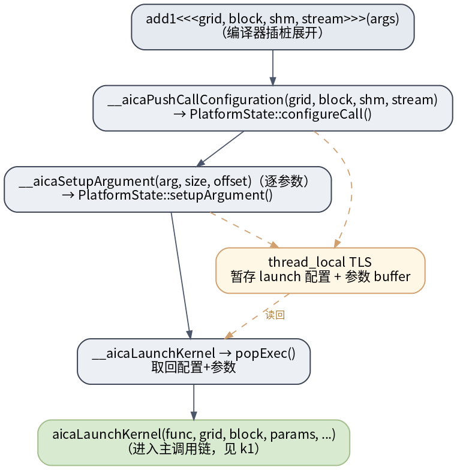
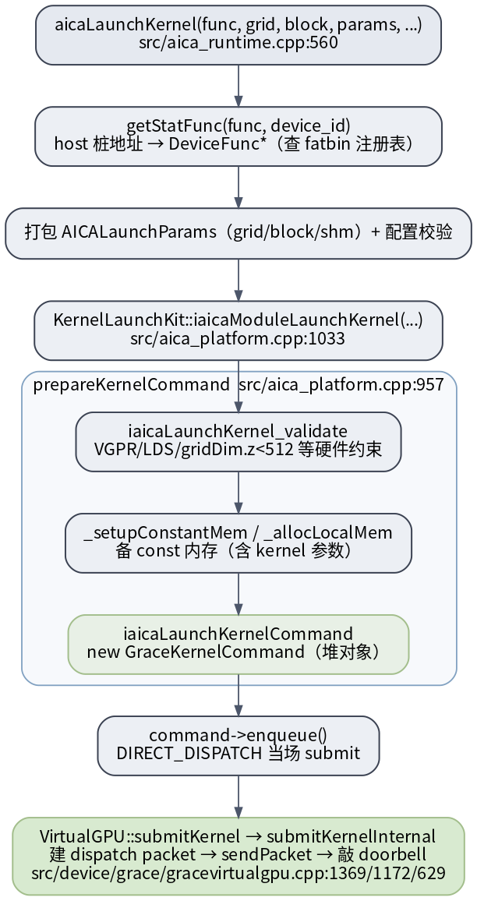

# UMD kernel launch 全路径

`aicaLaunchKernel` 是个**薄壳**：校验 + 把 host 桩地址查成 device 函数 + 打包配置，真正造命令/下发都委托给 `KernelLaunchKit`。和 [[aica-memcpy-copy-command|aicaMemcpy]] 共享「造命令 → enqueue → direct-dispatch 提交」同一套机制。

## `<<<>>>` 怎么降级 + 配置/参数经 TLS 暂存

> 图解源文件：[`k2-launch-config-setup.dot`](../../../../_attachments/grace/umd-arch/src/k2-launch-config-setup.dot)

编译器把 `add1<<<grid,block,shm,stream>>>(args)` 拆成：`__aicaPushCallConfiguration`（→`PlatformState::configureCall`）+ 逐参数 `__aicaSetupArgument`（→`setupArgument`），都暂存进 **thread_local TLS**；`__aicaLaunchKernel` 再 `popExec()` 读回配置+参数，进入下面的主调用链。

## 主调用链

> 图解源文件：[`k1-launch-callchain.dot`](../../../../_attachments/grace/umd-arch/src/k1-launch-callchain.dot)

逐步（源码确认 2026-06-28）：

1. **`aicaLaunchKernel`**（`src/aica_runtime.cpp:560`）：校验 stream/func。
2. **`getStatFunc(func, device_id)`**：把 `func`（编译器给的 **host 桩地址**）查 fatbin 注册表反推成内部 `DeviceFunc*`；查不到返回 `aicaErrorNoBinaryForGpu`（见 [[code-object-and-registration]]）。
3. 打包 `AICALaunchParams`（grid/block/shm）+ `IsValidConfig` / workgroup 上限校验。
4. **`KernelLaunchKit::iaicaModuleLaunchKernel`**（`src/aica_platform.cpp:1033`）→ **`prepareKernelCommand`**（`:957`）：
   - `iaicaLaunchKernel_validate`：VGPR / LDS / **`gridDim.z < 512`（规避硬件缺陷）** / `maxThreadsDim` / 动态 shared mem 等硬件约束；
   - `_setupConstantMem` / `_allocLocalMem`：备 const 内存（kernel 参数随 `const_base` 走）；
   - `iaicaLaunchKernelCommand`：`new GraceKernelCommand`（堆对象，见 [[command-model-and-queue]]）。
5. `command->enqueue()`：`AIGC_DIRECT_DISPATCH` 下当场 `submit`。
6. `VirtualGPU::submitKernel`→`submitKernelInternal`：建 `aica_kernel_dispatch_packet_t` → `sendPacket` 写 ring + 敲 doorbell（`src/device/grace/gracevirtualgpu.cpp:1369/1172/629`，详见 [[packet-and-doorbell]]）。

> 关键：dispatch 路径上**没有 `ioctl`**——UMD 自己写 host ring buffer + 敲 doorbell；只有 `getStatFunc` 首次触发的 `BuildProgram` 与建立类调用会下沉内核。

## 延伸

- [[command-model-and-queue|命令模型与队列]] · [[packet-and-doorbell|dispatch packet 与 doorbell]] · [[code-object-and-registration|code object 与注册]]
- [[wiki/grace/umd/index|UMD 总览]] · [[saxpy-kernel-end-to-end|Kernel 端到端长文]]
