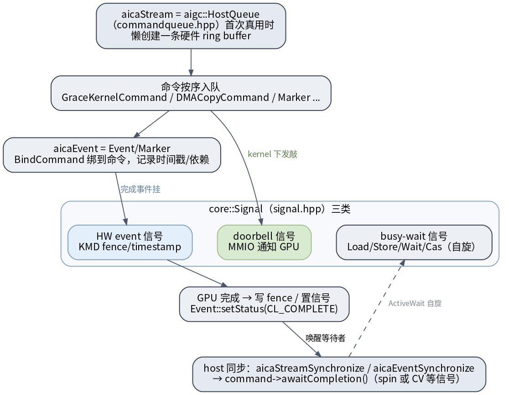

# UMD stream / event / signal

这三者是 UMD 的异步与同步骨架：**stream 是命令队列，event 是队列里的里程碑，signal 是 GPU↔CPU 的底层同步原语**。

> 图解源文件：[`s1-stream-event-signal.dot`](../../../../_attachments/grace/umd-arch/src/s1-stream-event-signal.dot)

- **Stream = `aigc::HostQueue`**（`src/platform/commandqueue.hpp`）。`aicaStream_t` 就是它；第一次真用时**懒创建**一条硬件 ring buffer（经 thunk `QUEUE_CREATE`，拿到 doorbell 地址）。null stream 是每设备的默认流。命令（`GraceKernelCommand` / `DMACopyCommand` / `Marker`…）按序入队，保证依赖顺序（见 [[command-model-and-queue]]）。
- **Event = `Event`/`Marker`**（`src/platform/command.hpp`）。`aicaEvent_t` 经 `BindCommand` 绑到某条命令，记录完成时间戳/依赖；既能跨 stream 表达依赖，也用于计时。
- **`core::Signal`**（`src/platform/signal.hpp`）三类：
  - **busy-wait 信号**：`Load/Store/Wait/Add/Cas`（acquire/release/relaxed 语义），自旋。
  - **doorbell 信号**：MMIO 写通知 GPU（kernel 下发就是敲它）。
  - **HW event 信号**：KMD 维护的 fence/timestamp。
- **完成回路**：GPU 干完 → 写 fence / 置信号 → `Event::setStatus(CL_COMPLETE)` → 唤醒等待者。host 侧 `aicaStreamSynchronize` / `aicaEventSynchronize` 落到 `command->awaitCompletion()`（`command.cpp:217`）：`ActiveWait` 下自旋 `Os::yield`，否则在 `Monitor` 条件变量上等信号量（见 [[thunk-and-sync]]）。

## 延伸

- [[command-model-and-queue|命令模型与队列]] · [[packet-and-doorbell|dispatch packet 与 doorbell]] · [[thunk-and-sync|thunk 边界与同步原语]]
- [[wiki/grace/umd/index|UMD 总览]]
