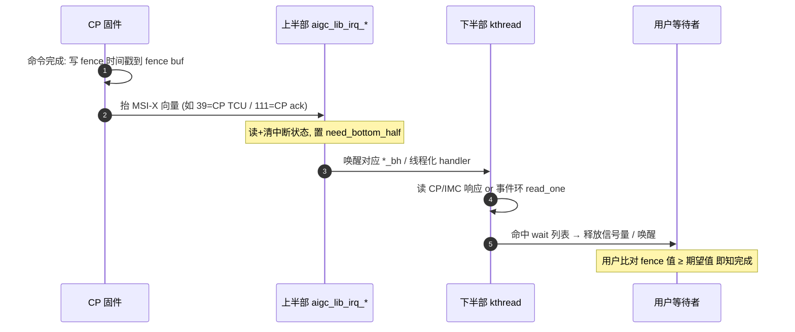

# 命令完成与中断代码流程

**文件**: `aigc_interrupt.c` / `aigc_interrupt_ring.c` / `aigc_kmd_fence.c`
**关联**: [[aigc_interrupt]] | [[aigc_kmd_fence]] | [[command-submission-flow]] | [[wiki/kmd/interrupt/index|中断与 Fence]]

> 命令跑完不靠 CPU 轮询寄存器，而是 **CP 写一个递增的 fence 时间戳 + 抬 MSI-X 中断**。这条流程把
> 「硬件完成 → 中断上半部 → 下半部线程 → 释放等待者」串起来。

---

## 调用链

## 两条完成通道

### 1. fence 时间戳（命令完成的「值」）
- **预备**：下发命令时，`aigc_sched.c::aigc_ts_copy()` 把该命令事件类型的**期望 fence 值**塞进 CP 事件写
  包；全局 per-event 软时间戳随之自增，保证后一条命令拿到更大的值。
- **缓冲**：fence 缓冲由 [[aigc_kmd_fence]] 分配并映射进 context 的 GPU 地址空间（`aigc_map_page()` →
  `aigc_vm_mmap`，见 [[aigc_kmd_fence]]）。CP 完成时把递增时间戳**写**到这里。
- **判定**：用户态/内核只需比较「fence buf 里的值 ≥ 自己记下的期望值」，即知命令已完成——**比大小**而非读硬件状态。

### 2. MSI-X 中断（命令完成的「事件」）
1. **上半部**：CP 抬向量，`aigc_lib_irq_*`（如 `aigc_lib_irq_cp_tcu`）读+清该向量状态，把状态经
   `need_bottom_half` 带出，决定要不要跑下半部。`aigc_clear_irq_stage2()` 负责清位并复查。
2. **下半部 / 线程化 handler**：
   - **CP 固件 ack**（向量 111）：`aigc_lib_irq_thread_fn_111()` 读 CP 响应消息，在 `wait_cp_ack` 列表里
     按 event_id + ctx/stream 找到**阻塞在某条固件命令上的进程**（create/destroy queue、stop schedule），
     `list_del` + `os_release_semalock` 唤醒它。
   - **IMC 固件 ack**（向量 109）：`aigc_lib_irq_thread_fn_109()` 读 IMC 响应，匹配缓存的待处理请求，
     回填结果字段（reset bitmap / fw-update 进度 / phase）后释放信号量。
   - **事件环**：完成/事件经中断环传出，`aigc_intr_ring_read_one()`（`aigc_interrupt_ring.c`）从 tail 消费
     一个事件单元；`enqueue_event()`（`aigc_fops.c`）把事件写进用户共享的 ring buffer 并 `os_wake_up` 唤醒
     等待事件的用户线程。

## 给应届生

- **fence = 单调递增的「完成水位线」**：每条命令分一个更大的期望值，CP 完成就把水位线抬到那个值；谁要等
  某条命令，就等水位线漫过它的值。不用为每条命令单独建一个信号。
- **上半部短、下半部重**：硬中断里只读+清状态（要快），把读响应消息、走链表、唤醒进程这些重活丢给
  线程化下半部——这是 Linux 中断处理的通用范式。
- **两种「等」**：等固件命令完成靠**信号量**（thread_fn_111/109 释放）；等 GPU 计算事件靠**事件环 + 等待队列**
  （enqueue_event + wake）。

## 延伸

- [[aigc_interrupt]] | [[aigc_kmd_fence]] | [[command-submission-flow]]
- [[saxpy-submission-flow]]：完整时间线里第 8/9 步。
