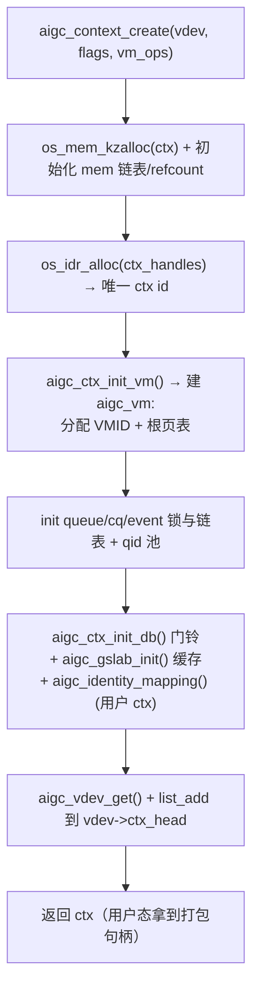

# context 创建代码流程（AIP_CONTEXT_CREATE）

**文件**: `kmd/aigc/kmdlib/aigc_ctx.c::aigc_context_create` / `aigc_context_destroy`
**关联**: [[aigc_ctx]] | [[aigc_vm]] | [[mem-create-flow]] | [[queue-create-flow]]

> 一个 [[aigc_ctx]] 就是 GPU 上的一个「进程地址空间」：它有自己的 [[aigc_vm]]（VMID + 4 级页表）、
> 自己的命令队列、显存列表和门铃。`AIP_CONTEXT_CREATE` 在内核里落到 `aigc_context_create()`，
> 后续的 mem/queue/submit 全都挂在它下面。

---

## 调用链

## 关键步骤（对应 aigc_context_create 的 step 注释）

1. **分配并初始化**：`os_mem_kzalloc` 出 `struct aigc_ctx`，填 vdev/type，`INIT_LIST_HEAD(mem_head)`、
   `os_kref_init(refcount)`。
2. **登记 id**：`os_idr_alloc(lib_dev->ctx_handles, ...)` 在**每设备** IDR 表里换一个唯一 ctx id ——
   用户态后续就用「打包了这个 id 的句柄」来指代本 context（句柄而非指针，跨进程安全）。
3. **建地址空间**：`aigc_ctx_init_vm()` 创建 [[aigc_vm]]——分配 VMID（硬件地址空间 id）、建根页表。
   这是 mem_create 写 PTE、queue 绑 ASID 的前提。
4. **建队列/事件簿记**：`os_alloc_mutexlock` 一串锁 + `os_idr_init(queue_idr)` + 队列/事件链表 +
   `aigc_init_ctx_pool(MAX_QID_PCTX)` 的 qid 池。
5. **门铃 + 缓存 + 恒等映射**：`aigc_ctx_init_db()` 建门铃；`aigc_gslab_init()` 起 GPU 端 slab 缓存
   （MCQD 等内核对象从这里分配，见 [[queue-create-flow]]）；用户 ctx 还做 `aigc_identity_mapping()`。
6. **挂上 vdev**：`aigc_vdev_get()` 给 vdev 加引用，`list_add_tail(&ctx->node, &vdev->ctx_head)` 把
   ctx 挂进它所属 vdev 的链表，返回。失败走 `__free_id`/`__free_ctx` 逆序回收。

## 销毁：aigc_context_destroy（逆操作）

生效路径（`#if 0` 的 emulator early-stop 大块在本构型不编译）按**与创建相反**的顺序拆：
丢恒等映射 → 释放所有显存 → 释放 qid 池 + 反初始化门铃 → `grace_ctx_invalid()` 让硬件 MMU 失效本 asid →
销毁命令队列 → `aigc_ctx_put()` 落最后一个引用真正释放 ctx。

## 给应届生

- **VMID = 一个 context 一套页表**：第 3 步分到的 VMID 贯穿始终——mem 的 PTE 写在这套页表里，queue 的
  MCQD 用它当 asid，硬件按 VMID 区分不同 context 的地址空间。
- **引用计数定生死**：ctx 被 vdev、被每个 mem/queue 持有引用；`aigc_ctx_put` 减到 0 才真正释放，
  避免「队列还在跑就把 ctx 释放了」。

## 延伸

- [[aigc_ctx]] / [[aigc_vm]] | [[wiki/kmd/flows/index|端到端流程]]
