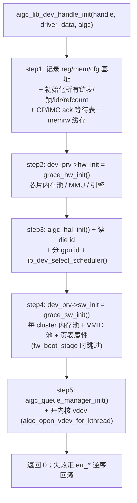

# 设备模型初始化代码流程（aigc_lib_dev_handle_init）

**文件**: `aigc_lib_dev.c::aigc_lib_dev_handle_init` / `aigc_lib_dev_handle_cleanup`
**关联**: [[device-probe-flow]] | [[aigc_lib_device]] | [[command-submission-flow]]

> [[device-probe-flow|probe]] 的第 5 步把 BAR 和设备信息交给 kmdlib，真正「在内核里把这张卡建成一个可用
> 设备模型」就发生在这里。它是 driver-entry 层与可移植核心层的接缝：probe 之上是 Linux/PCI，这里之下是
> 与 OS 无关的 ctx/内存/页表/队列/调度。

---

## 调用链

## 关键步骤（对应 aigc_lib_dev_handle_init 的 step 注释）

1. **簿记初始化**：记录 `regbase/membase/cfgbase` 三个 BAR 基址；`INIT_LIST_HEAD` 一串链表（all_vdevs、
   inactive ctx/vdev）；`os_alloc_mutexlock`/`os_idr_init`/`os_kref_init` 一串锁、IDR、引用计数；建
   **CP/IMC 固件 ack 等待表** 和 **memrw 调试缓存**。
2. **硬件初始化**：`lib_dev->dev_prv->hw_init(lib_dev)`（Grace 下 = `grace_hw_init`）——建芯片内存池、初始化
   MMU、引擎 ops。
3. **HAL + 身份**：`aigc_hal_init()` 装好寄存器级 ops；`aigc_get_die_id()` 读 die id；按需 `aigc_set_gpu_id()`；
   `lib_dev_select_scheduler()` 选调度器（默认 `DEFAULT_SCHEDULER`）。
4. **软件初始化**：`dev_prv->sw_init`（= `grace_sw_init`）——为每个有效 cluster 把它的 NPA 区切成一个
   gen-pool（该 cluster 的显存分配器），并在 cluster0 配 PCIe iATU；再建 MMU 锁、VMID 池、Grace 页表属性。
   **仅启动固件阶段（`fw_boot_stage`）会跳过**。
5. **队列管理器 + 内核 vdev**：`aigc_queue_manager_init()` 按调度策略装好 create/destroy ops（见
   [[queue-create-flow]]）；`aigc_open_vdev_for_kthread()` 开一个内核 vdev，供内核自身发起的工作（如内部
   命令、固件交互）使用——[[command-submission-flow|命令下发]] 的调度 kthread 就跑在这个内核 vdev 上下文里。

## 销毁：aigc_lib_dev_handle_cleanup

与初始化**严格相反**：停命令调度器 → `aigc_remove_irq` → `hw_reset` → 释放用户资源 → `sw_reset` →
释放 memrw 缓存 → 释放所有锁/idr → `aigc_hal_deinit`。

## 给应届生

- **driver-entry / kmdlib 的接缝就在这一行**：probe（Linux 侧）调 `aigc_lib_dev_handle_init`（可移植侧），
  之后核心层只通过 `dev_prv->*` 和 `aigc_hal_*` **函数指针** 碰硬件——这就是 kmdlib 能同时编进内核和主机测试
  环境的原因（见 [[wiki/kmd/os/index|OS 抽象层]]）。
- **hw_init / sw_init 分两段**：hw_init 偏「让芯片活过来」，sw_init 偏「为分配/地址空间建数据结构」；
  固件启动阶段只需前者，所以 sw_init 可跳过。

## 延伸

- [[device-probe-flow]] | [[aigc_lib_device]] | [[wiki/kmd/arch/layered-architecture|三层架构]]
