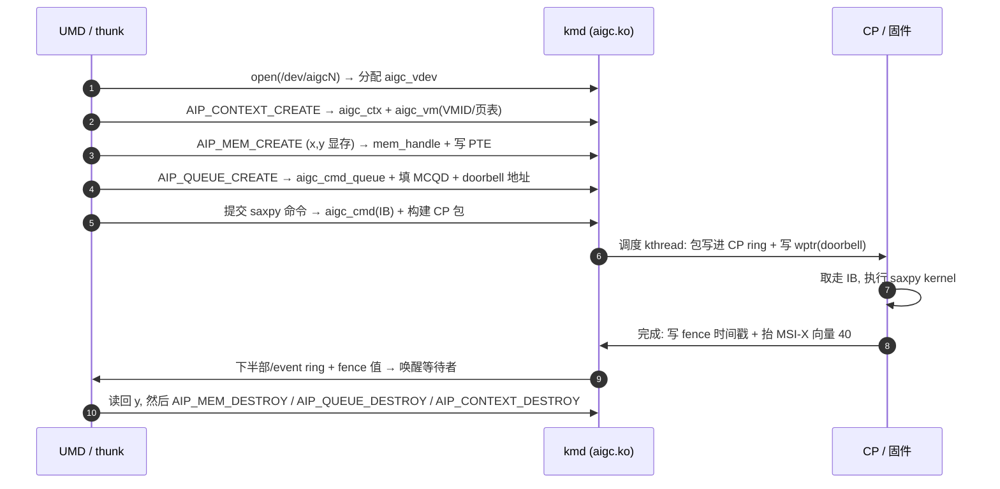

# saxpy 端到端提交流程

**关联**: [[wiki/kmd/arch/request-path]] | [[wiki/kmd/ioctl/index|ioctl]] | [[wiki/kmd/memory/index|内存]] | [[wiki/kmd/queue/index|队列调度]] | [[wiki/kmd/interrupt/index|中断与 Fence]]

> 用一次最简单的计算（saxpy：`y = a*x + y`）把所有子系统串成一条时间线。每一步都标出它落在哪个 ioctl /
> 哪个子系统，方便顺着读源码。

---

## 全链路时间线

## 逐步对应（读到哪、跳到哪）

| 步 | 动作 | 子系统页 |
|---|---|---|
| 1 | `open()` 建 [[aigc_vdev]]，存 `file->private_data` | [[wiki/kmd/arch/request-path]] |
| 2 | `AIP_CONTEXT_CREATE` 建 [[aigc_ctx]] + [[aigc_vm]]（VMID/根页表） | [[wiki/kmd/ioctl/ioctl-abi]] |
| 3 | `AIP_MEM_CREATE` 给 x/y 分显存 → [[mem_handle]]，`AIP_MEM_MAP` 写 4 级 PTE | [[wiki/kmd/memory/index|内存与页表]]、[[aigc_page_table]] |
| 4 | `AIP_QUEUE_CREATE` 建 `aigc_cmd_queue`，`fill_mcqd_info` 填 MCQD，返回 doorbell 地址 | [[wiki/kmd/queue/index|命令队列]] |
| 5 | 提交 saxpy → `aigc_cmd_create(INDIRECT_CMD_NODE)`，`aigc_fill_indirect_pkt` 建 CP 包指向 IB | [[wiki/kmd/queue/index|命令队列]] |
| 6 | 调度 kthread：`aigc_insert_ring` 把包拷进 [[aigc_cp_ring|CP ring]]，`update_wptr` 按 doorbell | [[aigc_sched]]、[[aigc_cp_ring]] |
| 7 | CP 取走 IB、跑 saxpy kernel（闭源 `aigc_kernel.o_binary`） | [[grace-hal]] |
| 8 | 完成：CP 写 fence 时间戳，抬 MSI-X 向量 40 | [[aigc_kmd_fence]]、[[aigc_interrupt]] |
| 9 | 下半部/event ring 推事件，fence 值释放等待者，用户读回 y | [[wiki/kmd/interrupt/index|中断与 Fence]] |
| 10 | 依次 destroy mem/queue/context，引用计数归零层层释放 | [[wiki/kmd/concepts/index|核心数据结构]] |

## 给应届生：从这条线能学到的设计直觉

- **句柄而非指针**：用户态全程拿打包整数句柄（ctx/mem/queue），内核侧查 IDR 还原对象——跨进程安全。
- **提交 ≠ 执行**：第 5 步提交只是入队就返回；第 6 步由 kthread 异步真正下发——解耦让两端各自高效。
- **完成靠 fence + 中断**：第 8/9 步不是轮询寄存器，而是「CP 写递增时间戳 + 抬中断」，CPU 比大小即知完成。
- **一切映射经页表**：第 3 步的 PTE 决定了 CP 在第 7 步能不能用那个 GPU VA 访问到 x/y。

## 延伸

- [[wiki/kmd/arch/request-path]]：单步 ioctl 的内核路径。
- [[wiki/kmd/index|KMD 内核驱动知识库]]
