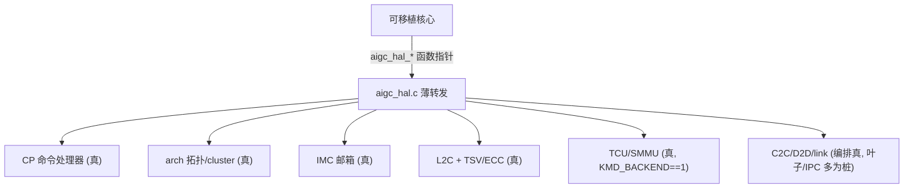

# KMD Grace HAL

> Grace HAL 是 `aigc.ko` 的芯片相关后端。可移植核心通过函数指针 ops 调进来，HAL 把这些调用变成 Grace 的
> 寄存器读写和固件 IPC。

## 本区页面

- [[grace-hal]]：后端怎么绑定、各硬件块（CP/arch/IMC/L2C/TCU/C2C/D2D/link）做什么、哪些是真驱动哪些是 bring-up 桩、寄存器映射。

## 一眼看懂

## 延伸

- [[wiki/kmd/arch/layered-architecture]]
- [[wiki/kmd/env|环境]]：`KMD_BACKEND`（0=cmodel/1=emulator/2=chip）怎么选硬件路径。
