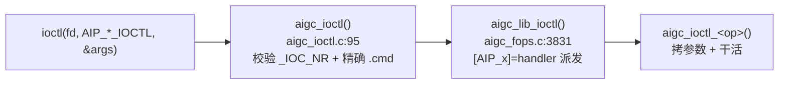

# KMD ioctl 接口与 ABI

> 用户态和驱动之间所有控制流量都从一个 `ioctl()` 入口走。这一区讲清楚：命令怎么编码、怎么经两级表派发到
> 处理函数、参数结构这份「共享契约」为什么动一下就是 ABI 破坏。

## 本区页面

- [[wiki/kmd/ioctl/aigc_ioctl|aigc_ioctl 两级派发]]：入口层校验 + 核心层派发的代码路径。
- [[wiki/kmd/ioctl/ioctl-abi|ioctl ABI 与操作表]]：`AIP_*` 操作集、X-macro 双表、`ioctl_*_args` 与版本契约。

## 一眼看懂

两张表（校验表 + 派发表）都由 `common/include/aigc_ioctl_tab.h` 这一个 X-macro 列表生成，所以永不跑偏。

## 延伸

- [[wiki/kmd/arch/request-path]]：把这条路径放进完整请求里看。
- [[wiki/kmd/index|KMD 内核驱动知识库]]
