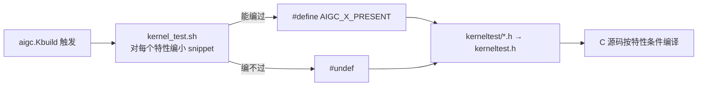

# os_interface — OS 抽象缝隙与 conftest

**文件**: `kmd/aigc/os_interface.c`、`common/include/os_interface.h`、`kmd/aigc/kernel_test.sh`
**关联**: [[wiki/kmd/arch/layered-architecture]] | [[wiki/kmd/env|环境与构建]]

> 整个驱动里**唯一**替核心层 `#include <linux/...>` 的翻译单元。它把内核原语收口成 `os_*` 包装，并把
> 不透明的 `void *` 句柄「洗」回具体内核结构体类型。

---

## 它解决什么

[[wiki/kmd/arch/layered-architecture|三层架构]]要求 kmdlib 不直接调内核。`os_interface.c` 就是那条缝隙：

- 核心层只用 `os_interface.h` 里声明的 `os_*`（如 `os_memcpy_from_user`、`os_kmalloc`、`os_mem_copy_to_io`…）。
- `os_interface.c` 用真内核 API 实现这些包装。
- 它还负责把核心层传来的 `void *` 句柄转回 `struct device *` / `struct file *` 等具体类型。

好处：**内核版本漂移被关进一个文件**，核心层可移植（既能编进内核，也能编进 host 测试）。

## NVIDIA 式 conftest（跨内核版本兼容）

光有缝隙还不够——同一个内核 API 在不同版本里签名可能变。kmd 借用 NVIDIA 开源驱动的 **conftest** 思路：

`kmd/aigc/kernel_test.sh` 在编译前**探测**目标内核，对每个特性编一小段 snippet：能编过就发
`#define AIGC_<FEATURE>_PRESENT`，编不过就 `#undef`。结果汇进 `kerneltest/` 下生成的头（`functions.h`、
`symbols.h`、`types.h`、`macros.h`、`generic.h`…），由 `kmd/aigc/kerneltest.h` 统一包含，于是 C 源码能
针对「目标内核到底有哪些 API」来编译。`kerneltest/` 在构建后会被删掉。

> 排错提示：**如果构建莫名其妙「看不到」某个内核符号，先怀疑 conftest 头是陈旧/缺失的，而不是 C 代码本身。**
> 删掉 `kerneltest/` 重新构建常能解决。

## 延伸

- [[wiki/kmd/arch/layered-architecture]]：缝隙在三层架构里的位置。
- [[wiki/kmd/env|环境与构建]]：构建命令与编译开关。
