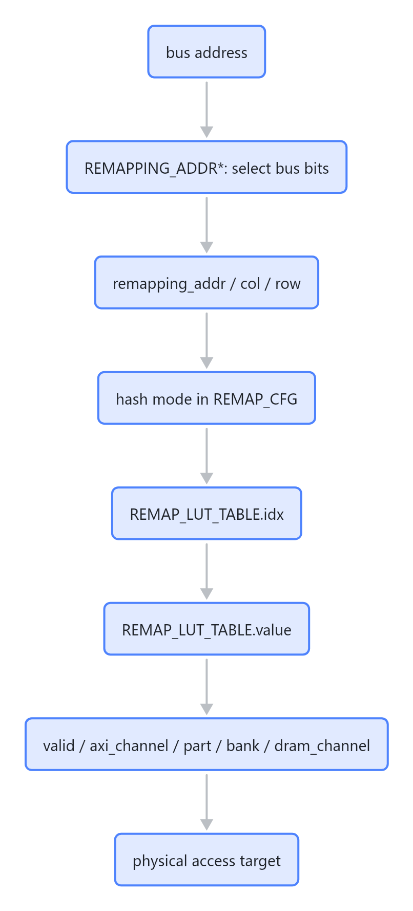

# L2C Remapping 机制

## 一句话结论

L2C 设置 remap，是为了把总线地址转换成真实物理地址选择：`dram_channel / bank / part / axi_channel`。它让软件继续使用稳定的逻辑地址，同时硬件可以根据 DRAM 组织、坏块信息、交织粒度和 hash 策略，把访问分散或绕开到正确的物理资源。

## 为什么需要 remap

### 1. 解耦总线地址和物理 DRAM 拓扑

文档明确说 Remapping 负责“配置总线地址到物理地址的映射关系”，并且映射分两部分：

- `dram_channel / bank / part / axi_channel` 和总线地址的映射。
- `col / row / remapping_addr` 和总线地址的映射。

这意味着软件发出的 bus address 不直接等于物理 DRAM 位置。硬件先从 bus address 抽取 `remapping_addr`、`col`、`row` 等逻辑字段，再通过查找表和 hash 得到最终物理资源。

### 2. 支持坏块/良率处理

文档给出的典型 LUT 配置可用于 `ut/soc/emu` 测试，但也说明真实过程会由 BIST 算法根据坏块信息自动生成 `REMAP_LUT_TABLE` 配置值。

这说明 remap 的一个核心价值是：当某些物理 DRAM channel、bank、part 或相关路径不可用时，不需要改变软件地址模型，而是修改映射表，把逻辑地址段映射到可用物理资源。

### 3. 支持交织，提高并行访问能力

示例配置描述了 16 个 bank 以 1KB 为粒度做交织：

```text
col_addr[2:0] = bus_addr[9:7]        // 连续 1KB 映射到同 row 不同 col
col_addr[3] = bus_addr[14]           // 每隔 16KB 映射到同 row 不同 col
remapping_addr[3:0] = bus_addr[13:10] // 连续 16KB 在不同 bank 上
remapping_addr[7:4] = bus_addr[31:28] // 每 256MB 映射在不同 bank 上
row_addr[12:0] = bus_addr[27:15]
```

这种映射不是只为了“能访问”，还用于把连续或大跨度访问分布到不同 bank/channel，减少热点，提升并行度。

### 4. 支持 hash 打散访问

`REMAP_LUT_TABLE.idx` 可以通过三种方式得到：

```text
不做 hash:
REMAP_LUT_TABLE.idx = remapping_addr

低 3bit hash:
REMAP_LUT_TABLE.idx[2:0] = hash_h3b_fun({20'b0, row_addr, remapping_addr[2:0]})
REMAP_LUT_TABLE.idx[7:3] = remapping_addr[7:3]

低 4bit hash:
REMAP_LUT_TABLE.idx[3:0] = hash_h3b_fun({20'b0, row_addr, remapping_addr[3:0]})
REMAP_LUT_TABLE.idx[7:4] = remapping_addr[7:4]
```

默认选择低 4bit hash。hash 的作用是让低位索引不要只由连续地址线性决定，避免某些访问模式集中打到同一组物理资源。

### 5. 提供错误检测点

`REMAPPING_ERROR.remapping_error_flag` 在物理地址映射表索引无效时置位。调试阶段可以打开 `PA_CFG.remapping_error_int_en`，当映射表配置错、表项无效或访问落到不该访问的位置时，通过中断快速暴露问题。

## remap 关闭后会怎样

`PA_CFG.remapping_en` 默认是 1。文档说明：

- 关掉 remapping 后，地址会透传。
- 透传模式仅用于 debug 和 LTC 访问。
- 透传地址给到 PBM 会发生错误地址。
- `REMAP_CFG.remapping_bypass_addr_lshift2` 控制 remapping 关闭时总线地址左移 2 bit。

所以 remap 不是可有可无的普通优化项。正常系统路径里，它是地址正确性的组成部分。关闭 remap 只适合明确知道访问端是 debug/LTC、并且期望绕过正常物理映射的场景。

## 配置链路



> 图解源文件：[`01-配置链路-flowchart.mmd`](../../../_attachments/mas/L2C/remapping/whiteboard-mermaid/01-配置链路-flowchart.mmd)。由 lark-whiteboard `whiteboard-cli` 从原 Mermaid 渲染。

## 编程关注点

- BOOT 阶段要配置 `REMAP_LUT_TABLE*` 和 `REMAPPING_ADDR*`，实际量产路径应由 BIST 坏块信息生成表项。
- `remapping_en` 默认应保持打开。只有 debug/LTC 这类明确场景才考虑关闭。
- hash 配置必须和期望的 DRAM channel/bank 交织粒度一致，否则可能打散方式和物理布局不匹配。
- 调试阶段建议打开 `remapping_error_int_en`，映射表配置错误时更容易定位。
- 如果同时配置 cache/bypass，要注意文档中 BIST 阶段会把 Cacheop 强覆盖为 bypass，这和 remapping 关闭常一起用于测试/绕行场景。

## 对软件的含义

软件不应该把 bus address 直接理解为物理 DRAM 位置。只要 remapping 打开，软件看到的是逻辑地址空间；真正落到哪个 `dram_channel/bank/part/axi_channel` 由 L2C remap 表和 hash 决定。

这也是为什么文档里说某些典型配置“兼容 2 层/4 层 dram，需要软件内存管理不要地址越界”：remap 可以改变地址到物理资源的对应关系，但软件仍要保证分配的逻辑地址范围合法。
