# RguGCtrl 学习文档：从 Kernel 到 Core 的两级调度

> 源文档：`C:\work\mas\RguCore\RGU_Design_Spec_RguGCtrl_V1.0.docx`
>
> 适用目标：先把 GCtrl 的“位置、职责、调度流程、关键寄存器/信号、常见问题”学清楚，再去看 RTL 或继续问细节。

## 1. 一句话理解

**RguGCtrl 是 RGU 里负责“把 CP 提交的 kernel 任务逐级派发到 physical cluster / core 上执行”的两级调度控制模块。**

它不是实际执行计算的 core，也不是只做寄存器转发的普通桥接模块。这里的 “GCtrl” 最好先拆成两个职责层次来看：

- **GlbCtrl 做全局调度**：从 CP 接收 kernel 的寄存器配置和启动信息，把 kernel 切成多个 **logic cluster**，并决定这些 logic cluster 应该落到哪些 **physical cluster**。
- **ClusCtrl 做 cluster 内部调度**：每个 physical cluster 内部的 ClusCtrl 接收 GlbCtrl 派来的 logic cluster，把它展开成 **block**，再根据 core 忙闲把 block 分发给本 cluster 内的 core。
- **GCtrl 整体做完成状态收敛**：ClusCtrl 聚合 core 的 block 完成 / 释放反馈，GlbCtrl 汇总 cluster 反馈，最终给 CP 回 `kernel_done`。

一个非常实用的心智模型是：


> 图解源文件：[`01-1.-一句话理解-flowchart.mmd`](../../../_attachments/mas/RguCore/02-rgu-gctrl/whiteboard-mermaid/01-1.-一句话理解-flowchart.mmd)。由 lark-whiteboard `whiteboard-cli` 从原 Mermaid 渲染。

## 2. GCtrl 在系统中的位置

在 RGU 系统里，GCtrl 处在 **CP 配置入口**、**Router / Control Fabric**、**physical cluster** 之间。

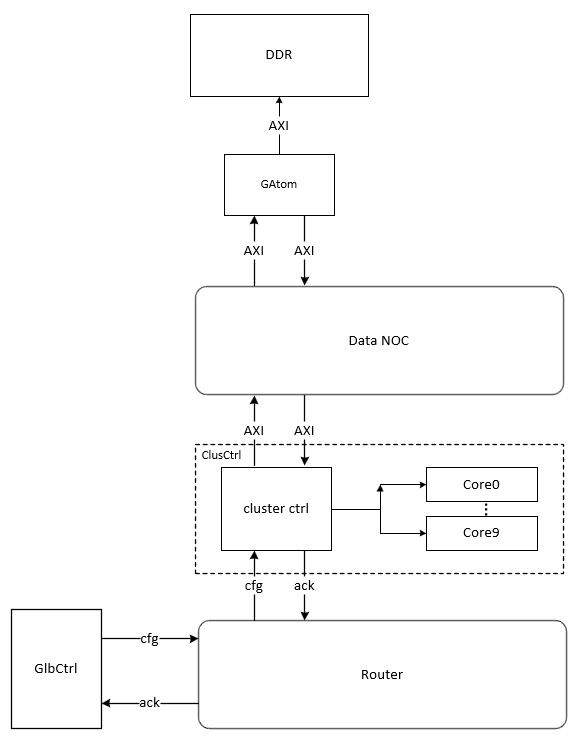

从图里可以抓住三条线：

- **CP 到 GlbCtrl**：CP 通过配置通路下发 kernel packet / register info。
- **GlbCtrl 到 Router / ClusCtrl**：GlbCtrl 通过 Router 把公共 reg info 和每个 physical cluster 对应的 logic cluster 任务送过去；它不直接给 core 派发 block。
- **ClusCtrl 到 Core**：每个 physical cluster 内部有一个 ClusCtrl，它接住 logic cluster 后，才继续展开 block 并派给 core。

所以 GCtrl 的名字虽然像一个单模块，但实际上源文档把它拆成两个层级：

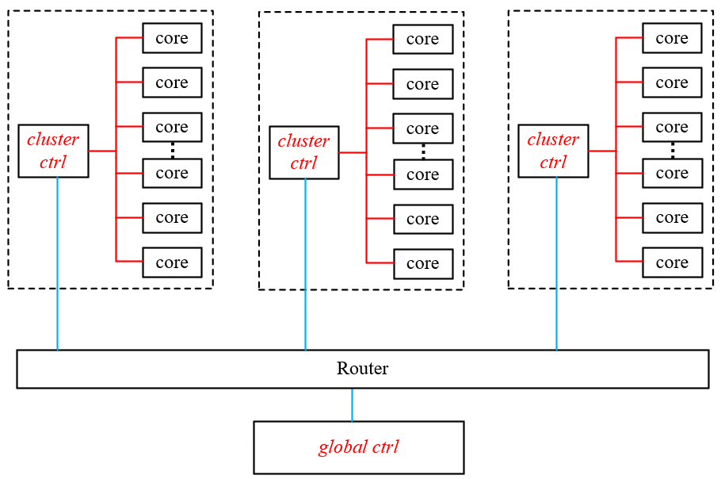

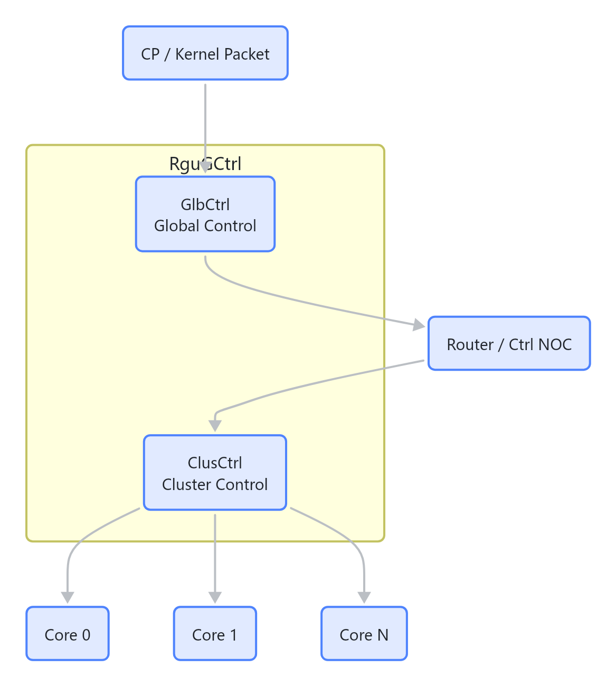

> 图解源文件：[`02-2.-GCtrl-在系统中的位置-flowchart.mmd`](../../../_attachments/mas/RguCore/02-rgu-gctrl/whiteboard-mermaid/02-2.-GCtrl-在系统中的位置-flowchart.mmd)。由 lark-whiteboard `whiteboard-cli` 从原 Mermaid 渲染。

## 3. 两级控制结构：GlbCtrl 和 ClusCtrl

### 3.1 GlbCtrl 负责什么

**GlbCtrl 是全局调度器。**

它主要做这些事：

- 缓存 CP 下发的多个 kernel 配置，最大并行 kernel 数由参数 `KNEL_N` 控制。
- 等 packet register 读取完成后，判断当前剩余 physical cluster 资源是否足够启动下一个 kernel。
- 从 `gridDim`、`clusDim`、`cta_num`、physical cluster 状态里计算调度方案。
- 生成 `cluster mask`，决定当前 kernel 能使用哪些 physical cluster。
- 把 kernel 的寄存器信息广播到目标 physical cluster。
- 把 kernel 拆出来的 logic cluster 按策略发给 selected physical cluster。
- 接收 ClusCtrl 汇总后的反馈，维护每个 physical cluster 的执行状态。
- 当 kernel 的所有 logic cluster 都完成后，对 CP 产生 `kernel_done` 和 kernel index。

可以把 GlbCtrl 看成“跨 physical cluster 的调度器”。

### 3.2 ClusCtrl 负责什么

**ClusCtrl 是 physical cluster 内部的调度器。**

每个 physical cluster 有一个 ClusCtrl，它主要做：

- 接收 GlbCtrl 通过 Router 送来的 reg info 和 logic cluster 任务。
- 把 reg info 广播给 cluster 内所有 core。
- 把一个 logic cluster 拆成多个 block。
- 根据 core 当前忙闲程度，把 block 分发给最空闲的 core。
- 收集 core 的 block 完成 / 释放反馈。
- 当当前 logic cluster 完成后，向 GlbCtrl 返回 ack。

可以把 ClusCtrl 看成“单个 physical cluster 内部的 block 调度器”。

### 3.3 为什么要分两级

如果只有一个全局调度器，它既要管 kernel 到 physical cluster 的映射，又要管每个 core 的 block 分发，状态会非常复杂。

GCtrl 用两级结构把复杂度拆开：

| 层级 | 输入 | 输出 | 关注点 |
|---|---|---|---|
| GlbCtrl | kernel packet / reg info | reg info + logic cluster | 哪些 physical cluster 执行这个 kernel |
| ClusCtrl | logic cluster | block + core | 这个 physical cluster 内哪些 core 执行哪些 block |

这样做的直接收益是：**全局调度只看 cluster 资源，局部调度只看 core 资源**。

## 4. 三个层级：kernel、logic cluster、block

学习 GCtrl 时最容易混的是这三个概念。

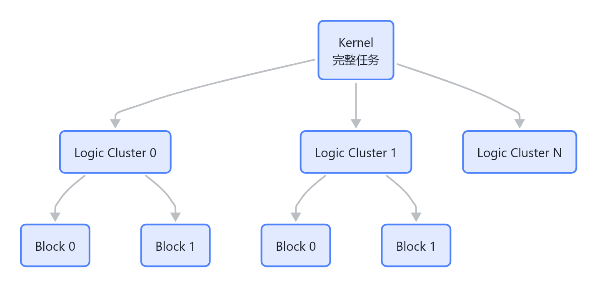

> 图解源文件：[`03-4.-三个层级-kernel-logic-cluster-block-flowchart.mmd`](../../../_attachments/mas/RguCore/02-rgu-gctrl/whiteboard-mermaid/03-4.-三个层级-kernel-logic-cluster-block-flowchart.mmd)。由 lark-whiteboard `whiteboard-cli` 从原 Mermaid 渲染。

### 4.1 kernel

kernel 是 CP 提交的一次完整计算任务。源文档里，GlbCtrl 主要关心 kernel 的这些配置：

- `gridDim.x/y/z`：kernel 的整体 block 网格形状。
- `clusDim.x/y/z`：一个 logic cluster 覆盖多少 block。
- `cta_num`：单个 core 最多可以同时容纳多少 block。
- kernel index：用于区分多个并行 kernel，同一个 index 只能等前一个 kernel 完成后再复用。

### 4.2 logic cluster

logic cluster 是 GlbCtrl 调度 physical cluster 的基本单位。

它由 `clusDim` 从 `gridDim` 切出来。比如：

```text
gridDim = (4, 4, 1)
clusDim = (2, 2, 1)

logic cluster 数量 =
ceil(4 / 2) * ceil(4 / 2) * ceil(1 / 1)
= 2 * 2 * 1
= 4
```

四个 logic cluster 的坐标是：

```text
(0, 0, 0)
(1, 0, 0)
(0, 1, 0)
(1, 1, 0)
```

### 4.3 block

block 是 core 真正执行的工作单元。

一个 logic cluster 里的 block 坐标由下面公式得到：

```text
blockIdx.x = clusterIdx.x * clusDim.x + [0 .. clusDim.x - 1]
blockIdx.y = clusterIdx.y * clusDim.y + [0 .. clusDim.y - 1]
blockIdx.z = clusterIdx.z * clusDim.z + [0 .. clusDim.z - 1]
```

注意：`gridDim` 不要求被 `clusDim` 整除。边界上的 logic cluster 可能包含更少的 block。

## 5. 核心执行链路

把整个 GCtrl 行为串起来，可以理解成下面 8 步：

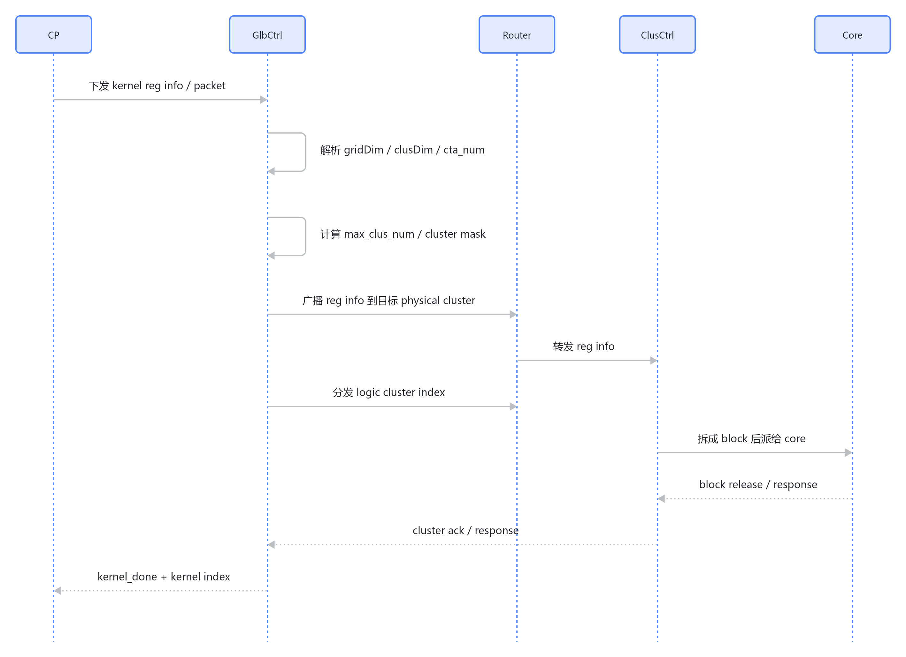

> 图解源文件：[`04-5.-核心执行链路-sequenceDiagram.mmd`](../../../_attachments/mas/RguCore/02-rgu-gctrl/whiteboard-mermaid/04-5.-核心执行链路-sequenceDiagram.mmd)。由 lark-whiteboard `whiteboard-cli` 从原 Mermaid 渲染。

其中最关键的分界点是：

- **reg info 可以广播**：因为同一个 kernel 的寄存器配置对所有被选中的 physical cluster 一样。
- **cluster index 不能广播**：因为不同 physical cluster 收到的 logic cluster 坐标可能不同。

## 6. 关键参数

源文档给出了一组默认参数。理解它们有助于读公式和判断资源上限。

| 参数 | 默认值 | 含义 |
|---|---:|---|
| `KNEL_N` | 4 | 最多可缓存 / 并行管理的 kernel 数 |
| `CLUS_N` | 4 | physical cluster 数 |
| `CLCR_N` | 7 | 单个 physical cluster 内 core 数 |
| `CORE_N` | 28 | 全系统 core 数，通常等于 `CLUS_N * CLCR_N` |
| `PARA_N` | 128 | 参数数量上限 |
| `DATA_W` | 32 | 数据宽度 |
| `IADR_W / OADR_W / INADR_W` | 16 | 地址宽度相关参数 |

这些参数会影响：

- 一个 kernel 最多能占用多少 physical cluster。
- 一个 physical cluster 的 block 容量。
- ClusCtrl 内部 min-tree / full interconnect 的规模。

## 7. physical cluster 可用性的判断

不是所有 physical cluster 都一定可用。源文档强调了两个事实：

1. 一个 physical cluster 里如果所有 core 都不能工作，这个 physical cluster 就不可用。
2. 一个 physical cluster 同一时刻只能执行一个 kernel。

因此 GlbCtrl 维护 physical cluster 状态时，至少要知道：

- 这个 physical cluster 当前是否 idle。
- 这个 physical cluster 属于哪个 kernel。
- 当前还有多少 block 容量。
- 内部有多少 usable core。

源文档中 `clus_idle` 的含义接近：

```text
clus_idle = block_num == 0 && physical cluster 内存在可工作的 core
```

而 physical cluster 的理论容量可以用下面方式理解：

```text
phy_clus_bcnt = usable_core_num * cta_num
```

如果 `cta_num = 4`，某个 physical cluster 有 6 个 usable core，那么这个 physical cluster 理论上最多同时容纳：

```text
6 * 4 = 24 个 block
```

## 8. cluster_ctrl 寄存器和 GCtrl 的关系

结合前面学习到的 RguCore register table，`packet(CP)` 里的 `cluster_ctrl` 是 CP 侧控制 GCtrl cluster 资源的重要寄存器：

```text
cluster_ctrl offset = 0x2C
cluster_ctrl regID  = 11

bit[8:5] = cluster_bit_map
bit[4:0] = max_cluster_num
```

这两个字段可以这样理解：

| 字段 | 作用 |
|---|---|
| `cluster_bit_map` | CP / software 希望允许使用的 physical cluster 集合 |
| `max_cluster_num` | 当前 kernel 最多允许占用多少 physical cluster |

它和 GCtrl 里的 `cluster mask`、`max_clus_num` 是同一类问题：**约束一个 kernel 可以落到哪些 physical cluster，以及最多落几个**。

需要注意的是，MAS 文档里同时出现了硬件计算 `max_clus_num` 和软件配置 `clus_cnt + 1` 的模式。也就是说，某些 mode 下 physical cluster 数量由硬件根据 `gridDim/clusDim/cta_num` 推导，某些 mode 下软件会显式给出约束。

## 9. cluster mask 是怎么选出来的

GlbCtrl 需要从可用 physical cluster 里选出当前 kernel 可以使用的集合。这个集合就是 `cluster mask`。

可以把问题简化成：

```text
给定:
flag[N-1:0]       每个 physical cluster 是否可用
K                 当前最多要选几个

目标:
从 flag 中选出前 K 个 1，得到 clus_mask
```

示例：

```text
flag      = 110101
K         = 3
clus_mask = 010101   # 从低位开始选到第 3 个可用 cluster
```

硬件实现上可以用多个 1-bit adder tree 统计前缀中 1 的个数，再找到第一个达到 K 的位置，最后生成 mask。


> 图解源文件：[`05-9.-cluster-mask-是怎么选出来的-flowchart.mmd`](../../../_attachments/mas/RguCore/02-rgu-gctrl/whiteboard-mermaid/05-9.-cluster-mask-是怎么选出来的-flowchart.mmd)。由 lark-whiteboard `whiteboard-cli` 从原 Mermaid 渲染。

## 10. Random mode 和 Fixed mode

GCtrl 支持两类分发策略：Random 和 Fixed。

### 10.1 先纠正一个名字误区

这里的 **Random mode 不是纯随机数意义上的随机**。

它更像“硬件根据当前 cluster 资源状态动态选择 physical cluster”。选择时会考虑：

- 当前哪些 cluster idle。
- 哪些 cluster 还有 block 容量。
- 当前 kernel 已经用了几个 cluster。
- `max_clus_num` 限制。

### 10.2 Random mode 的两种思路

MAS 文档里提到两种调度思想。

| 思路 | 特点 | 优点 | 风险 |
|---|---|---|---|
| 尽量分散 | logic cluster 分散到多个 physical cluster | 单 kernel 时能让更多 core 同时工作 | kernel0 可能占满所有 cluster，影响 kernel1 并行 |
| 尽量填满 | 先填满一个 physical cluster，再用下一个 | 小任务和多 kernel 并行更友好 | 只有一个 kernel 时可能 core 利用率不足 |

当前文档描述的总体策略是：先根据 mode 算出 `max_clus_num`，再在不超过这个限制的前提下，动态选择可用 physical cluster。

### 10.3 Fixed mode

Fixed mode 根据 logic cluster 坐标直接映射到 physical cluster。

核心公式是：

```text
physical_id =
    (clusterIdx.y & (2**b - 1)) * (2**a)
  + (clusterIdx.x & (2**a - 1))

a, b in [0 .. log2(CLUS_N)]
a + b <= log2(CLUS_N)
```

直观理解：

- 取 `clusterIdx.x` 的低 `a` 位。
- 取 `clusterIdx.y` 的低 `b` 位。
- 两者组合成 physical cluster id。

Fixed mode 适合在软件或编译器已经知道希望怎样铺任务时使用，因为映射关系更确定。

## 11. max_clus_num 怎么计算

`max_clus_num` 是 GCtrl 学习里的核心变量。它限制一个 kernel 最多能占用多少 physical cluster。

### 11.1 先算 logic cluster 总数

```text
lgc_clus_cnt =
    ceil(gridDim.x / clusDim.x)
  * ceil(gridDim.y / clusDim.y)
  * ceil(gridDim.z / clusDim.z)
```

### 11.2 Random mode 0

Mode 0 偏向让更多 physical cluster 参与。

```text
N = clusDim.x * clusDim.y * clusDim.z
phy_clus_cnt = ceil(CLCR_N / N)
max_clus_num = min(CLUS_N, ceil(lgc_clus_cnt / phy_clus_cnt))
```

文档例子：

```text
gridDim = (4, 4, 4)
clusDim = (1, 1, 2)
CLUS_N  = 6
CLCR_N  = 6

N = 1 * 1 * 2 = 2
lgc_clus_cnt = 4 * 4 * 2 = 32
phy_clus_cnt = ceil(6 / 2) = 3
ceil(32 / 3) = 11
max_clus_num = min(6, 11) = 6
```

结论：这个 kernel 最多会用满 6 个 physical cluster。

### 11.3 Random mode 1

Mode 1 会把 `cta_num` 纳入容量估算，更偏向“一个 physical cluster 能多塞就多塞”。

```text
N = clusDim.x * clusDim.y * clusDim.z
phy_clus_cnt = ceil(cta_num * CLCR_N / N)
max_clus_num = min(CLUS_N, ceil(lgc_clus_cnt / phy_clus_cnt))
```

文档例子：

```text
gridDim = (4, 4, 4)
clusDim = (1, 1, 2)
CLUS_N  = 5
CLCR_N  = 6
cta_num = 4

N = 2
lgc_clus_cnt = 32
phy_clus_cnt = ceil(4 * 6 / 2) = 12
ceil(32 / 12) = 3
max_clus_num = min(5, 3) = 3
```

结论：同样是 32 个 logic cluster，因为考虑了每个 core 可同时容纳多个 block，所以只需要最多 3 个 physical cluster。

### 11.4 软件指定模式

文档中还提到一个软件指定方式：

```text
max_clus_num = clus_cnt + 1
```

这类模式下，软件直接给出 cluster 数量上限。硬件仍然需要根据可用状态和 mask 去执行约束，但不再完全由硬件公式决定数量。

## 12. reg info 为什么能广播，clusterIdx 为什么不能

这是理解 GCtrl 时最重要的一个分叉。

### 12.1 reg info 可以广播

同一个 kernel 的寄存器配置对所有执行它的 physical cluster 是相同的。

所以 GlbCtrl 可以用 `clus_mask` 把 reg info 一次广播给多个 ClusCtrl。

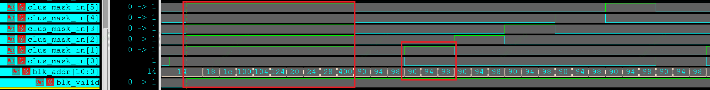

### 12.2 clusterIdx 不能广播

clusterIdx 表示当前 physical cluster 要执行哪个 logic cluster。

不同 physical cluster 收到的 logic cluster 坐标可能不同，所以它必须逐个发送。

源文档中 clusterIdx 支持两种发送方式：

| 方式 | AXI-Lite 事务数量 | 地址 | 适用场景 |
|---|---:|---|---|
| full | 3 次 | `0x8C / 0x90 / 0x94` | x/y/z 都完整写入 |
| incr | 1 次 | `0x9C` | 本次 clusterIdx 可以由上一次增量得到 |

`incr` 格式大致是：

```text
{ z_incr[9:0], y_incr[9:0], x_incr[9:0] }
```

如果 x/y/z 相对上一个 clusterIdx 的增量能放进 signed 10-bit，就可以走 `incr`，减少事务数。

### 12.3 clusterIdx 的作用

`clusterIdx` 是 **logic cluster 的坐标**，也就是告诉某个 physical cluster：你现在要执行 kernel 里的哪一块 logic cluster。

它的作用有三层：

| 作用 | 说明 |
|---|---|
| 标识任务片段 | `clusterIdx.x/y/z` 标识一个 logic cluster 在整个 kernel grid 中的位置 |
| 生成 blockIdx | ClusCtrl 用 `clusterIdx` 和 `clusDim` 展开出该 logic cluster 内的所有 `blockIdx` |
| 完成状态收敛 | ClusCtrl 完成这个 logic cluster 后，向 GlbCtrl 返回 ack，GlbCtrl 再判断 kernel 是否完成 |

例如：

```text
gridDim = (4, 4, 1)
clusDim = (2, 2, 1)
clusterIdx = (1, 0, 0)
```

这个 logic cluster 覆盖的 block 是：

```text
blockIdx.x = 1 * 2 + [0, 1] = [2, 3]
blockIdx.y = 0 * 2 + [0, 1] = [0, 1]

=> blockIdx = (2,0,0), (3,0,0), (2,1,0), (3,1,0)
```

图解：

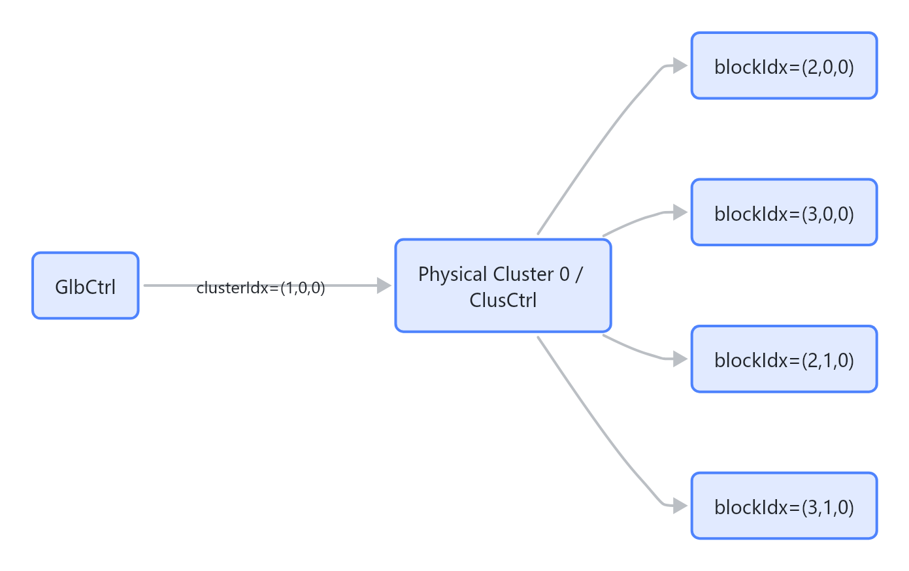

> 图解源文件：[`06-12.3-clusterIdx-的作用-flowchart.mmd`](../../../_attachments/mas/RguCore/02-rgu-gctrl/whiteboard-mermaid/06-12.3-clusterIdx-的作用-flowchart.mmd)。由 lark-whiteboard `whiteboard-cli` 从原 Mermaid 渲染。

所以 `clusterIdx` 的粒度是 **logic cluster -> physical cluster**。

### 12.4 blockIdx 的作用

`blockIdx` 是 **core 真正执行的 block 坐标**。它对应 kernel 程序里看到的 block 位置，程序会用它和 thread id 一起计算数据索引。

它的作用主要是：

| 作用 | 说明 |
|---|---|
| 标识具体 block | 一个 logic cluster 内可能有多个 block，每个 block 都要有自己的 `blockIdx` |
| 给 core / warp 执行语义 | Core 执行 kernel 时需要知道当前 block 在 grid 中的位置 |
| 支持 ClusCtrl 本地负载均衡 | ClusCtrl 可以把不同 `blockIdx` 分给不同 core，而不用让 GlbCtrl 管每个 core |

图解：

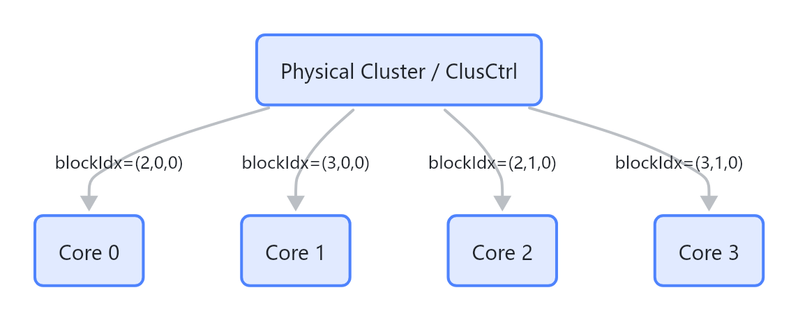

> 图解源文件：[`07-12.4-blockIdx-的作用-flowchart.mmd`](../../../_attachments/mas/RguCore/02-rgu-gctrl/whiteboard-mermaid/07-12.4-blockIdx-的作用-flowchart.mmd)。由 lark-whiteboard `whiteboard-cli` 从原 Mermaid 渲染。

所以 `blockIdx` 的粒度是 **block -> core**。

### 12.5 为什么 clusterIdx 和 blockIdx 要单独下发

根本原因是：**它们属于两个不同调度层级，接收对象也不同**。

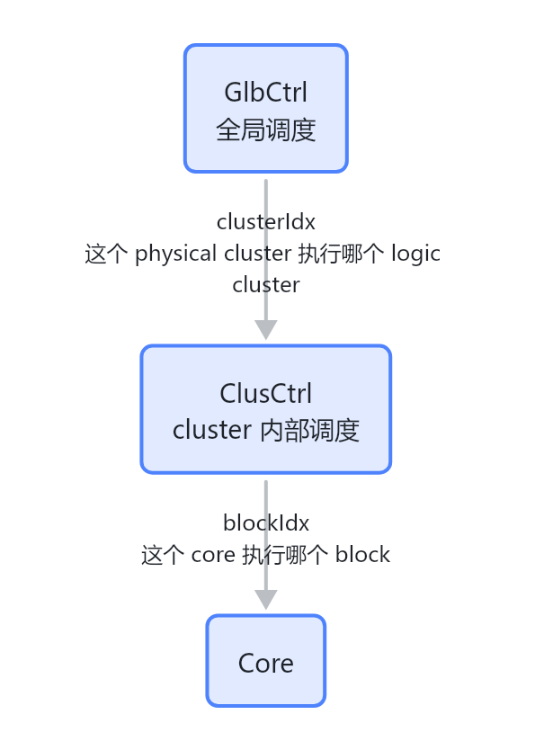

> 图解源文件：[`08-12.5-为什么-clusterIdx-和-blockIdx-要单独下发-flowchart.mmd`](../../../_attachments/mas/RguCore/02-rgu-gctrl/whiteboard-mermaid/08-12.5-为什么-clusterIdx-和-blockIdx-要单独下发-flowchart.mmd)。由 lark-whiteboard `whiteboard-cli` 从原 Mermaid 渲染。

如果把它们混在一起，会带来几个问题：

| 如果混在一起 | 问题 |
|---|---|
| GlbCtrl 直接发所有 blockIdx | GlbCtrl 需要知道每个 core 的忙闲，跨层管理太复杂 |
| clusterIdx 广播给所有 physical cluster | 不同 physical cluster 应执行不同 logic cluster，会发错任务 |
| blockIdx 广播给 cluster 内所有 core | 每个 core 应执行不同 block，会重复执行或覆盖任务 |
| 不用 clusterIdx，只发 blockIdx | 会丢掉 logic cluster 这个调度粒度，无法按 logic cluster 做 ack / replay / partial 分配 |

单独下发的好处是：

- GlbCtrl 只管粗粒度：`kernel -> logic cluster -> physical cluster`。
- ClusCtrl 只管细粒度：`logic cluster -> block -> core`。
- 全局 NoC 上不用传所有 block，降低全局通信压力。
- ClusCtrl 可以根据 `blkcnt_live` 在本 cluster 内做本地负载均衡。
- logic cluster 完成后能按 `clusterIdx` 粒度向 GlbCtrl 返回 ack。

### 12.6 三种 index / 配置的边界

| 名称 | 谁产生 | 发给谁 | 是否可广播 | 核心作用 |
|---|---|---|---|---|
| `reg info` | CP / UMD / 编译器 | 多个 physical cluster 的 ClusCtrl/Core | 可以按 `clus_mask` 广播 | 同一个 kernel 的公共配置 |
| `clusterIdx` | GlbCtrl | 某个 physical cluster 的 ClusCtrl | 不适合简单广播 | 指定这个 physical cluster 执行哪个 logic cluster |
| `blockIdx` | ClusCtrl | 某个 core | 不适合广播 | 指定这个 core 执行哪个具体 block |

速记：

```text
reg info   = kernel 公共配置
clusterIdx = logic cluster 坐标，给 physical cluster
blockIdx   = block 坐标，给 core
```

## 13. GlbCtrl 状态机

源文档把 GlbCtrl 分发过程拆成几个状态。

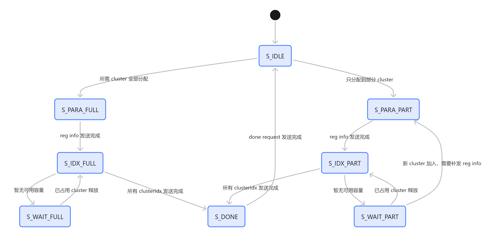

> 图解源文件：[`09-13.-GlbCtrl-状态机-stateDiagram-v2.mmd`](../../../_attachments/mas/RguCore/02-rgu-gctrl/whiteboard-mermaid/09-13.-GlbCtrl-状态机-stateDiagram-v2.mmd)。由 lark-whiteboard `whiteboard-cli` 从原 Mermaid 渲染。

几个状态的直观含义：

| 状态 | 含义 |
|---|---|
| `S_IDLE` | 没有正在分发的 kernel |
| `S_PARA_FULL` | 所需 cluster 已经全部拿到，广播全部 reg info |
| `S_PARA_PART` | 只拿到部分 cluster，先给这些 cluster 发 reg info |
| `S_IDX_FULL` | 在完整 cluster 集合里发送 logic cluster index |
| `S_IDX_PART` | 在部分 cluster 集合里发送 logic cluster index |
| `S_WAIT_FULL` | cluster 数够，但当前没有可继续投递的容量，等待释放 |
| `S_WAIT_PART` | cluster 数还没拿够，等待释放或新 cluster 加入 |
| `S_DONE` | 所有 logic cluster index 已发完，准备结束本轮分发 |

关键点：`S_PARA_PART` 的存在说明 GCtrl 支持“先用已有 cluster 跑起来，后面有新 cluster 释放再补发参数并加入调度”。

## 14. ClusCtrl 内部如何派 block 给 core

ClusCtrl 的任务比 GlbCtrl 更局部：它只关心自己这个 physical cluster 内部的 core。

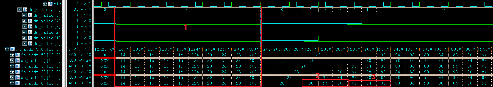

ClusCtrl 维护每个 core 的 `blkcnt_live`：

```text
blkcnt_live = 当前 core 正在执行、尚未释放的 block 数
```

每次要分发一个 block 时，ClusCtrl 用 min-tree 选择 `blkcnt_live` 最小的 core。

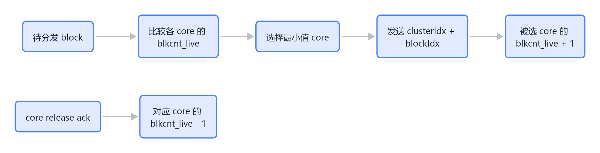

> 图解源文件：[`10-14.-ClusCtrl-内部如何派-block-给-core-flowchart.mmd`](../../../_attachments/mas/RguCore/02-rgu-gctrl/whiteboard-mermaid/10-14.-ClusCtrl-内部如何派-block-给-core-flowchart.mmd)。由 lark-whiteboard `whiteboard-cli` 从原 Mermaid 渲染。

如果某个 core 不可用，文档里的处理方式是把它的可选值置为全 1，例如 `7'b1111111`，这样 min-tree 就不会选中它。

## 15. ClusCtrl 一次 block 分发需要哪些信息

ClusCtrl 给 core 分发 block 时，需要写入：

- 3 个 `clusterIdx`：x / y / z。
- 3 个 `blockIdx`：x / y / z。

所以一个 block 的完整派发可以理解为：

```text
Period 1: reg info 广播，直到 cfg_done
Period 2: 发送 clusterIdx.x/y/z
Period 3: 发送 blockIdx.x/y/z
```

当 full interconnect 和 ready 条件足够理想时，源文档例子中 `CLCR_N = 6` 可以做到几乎每 cycle 完成一个 block 的投递节奏。

## 16. ack、response 和 kernel_done

GCtrl 不是把任务发出去就结束，它必须收敛完成状态。

可以分成三层：

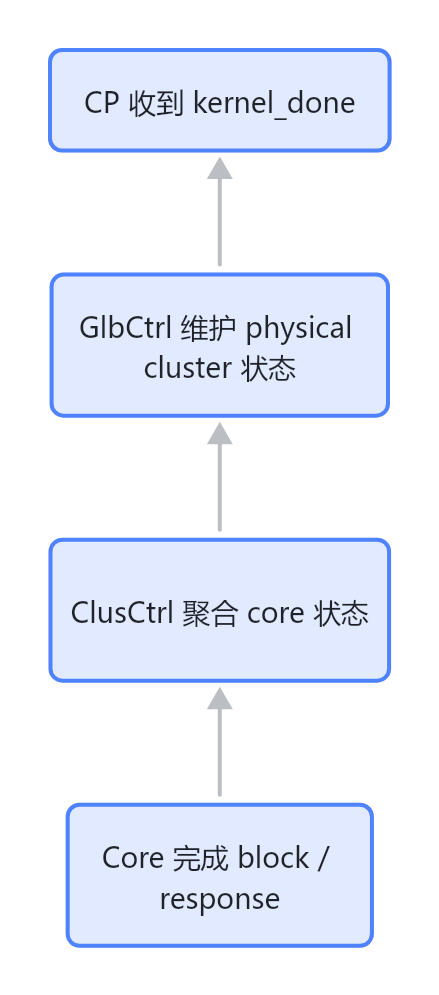

> 图解源文件：[`11-16.-ack-response-和-kernel_done-flowchart.mmd`](../../../_attachments/mas/RguCore/02-rgu-gctrl/whiteboard-mermaid/11-16.-ack-response-和-kernel_done-flowchart.mmd)。由 lark-whiteboard `whiteboard-cli` 从原 Mermaid 渲染。

### 16.1 core 到 ClusCtrl

Core 会向 ClusCtrl 上报 block 释放或 response。ClusCtrl 如果同一周期收到多个 core 的上报，会用 adder tree 累加释放数量。

当一个 logic cluster 的 block 完成数量达到它应有的 block 数，ClusCtrl 向 GlbCtrl 返回 ack。

### 16.2 ClusCtrl 到 GlbCtrl

源文档中 GlbCtrl 侧会收到两类重要反馈：

- block release 类型：用于维护 physical cluster 当前 block 数和容量。
- work complete / response 类型：用于判断 kernel 对应 work 是否全部完成。

### 16.3 GlbCtrl 到 CP

当条件满足时，GlbCtrl 给 CP 一个 `kernel_done` pulse，并带上对应 kernel index。

这里要避免两个误解：

- `cluster_done` 不等于 `kernel_done`。一个 kernel 可能包含多个 logic cluster，多个 physical cluster 都要收敛完成。
- `kernel_done` 不只是“所有 index 发完”。必须等执行反馈回来。

## 17. physical cluster 分配示意

下面这张图来自 MAS 中的示例，帮助理解 logic cluster 怎样落到 physical cluster。

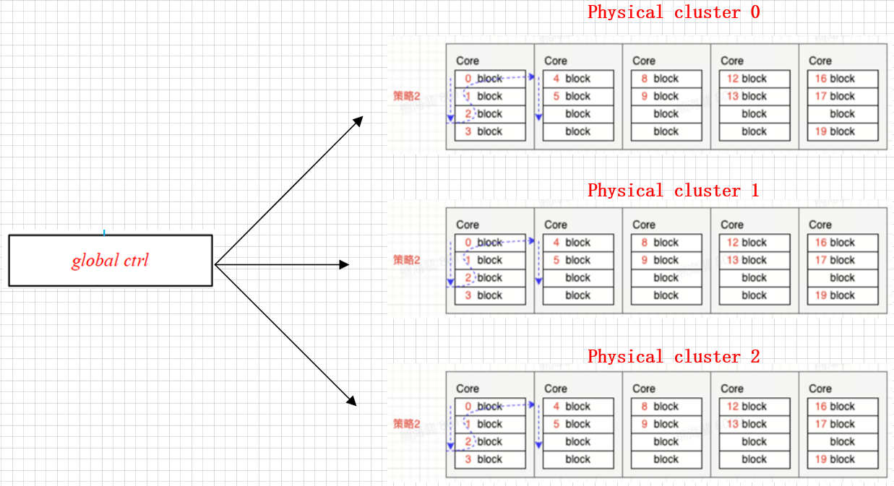

读这类图时建议按三步看：

1. 先看 `gridDim / clusDim`，算出总共有多少 logic cluster。
2. 再看 mode，判断 `max_clus_num` 是硬件计算还是软件指定。
3. 最后看当前 physical cluster 状态，判断本轮 `clus_mask` 实际选了哪些 cluster。

## 18. 常见问题

### Q1：GCtrl 是不是只转发寄存器？

不是。寄存器转发只是它的一部分。更准确地说，GCtrl 这个总模块的调度职责分两层：

- GlbCtrl 把 kernel 切成 logic cluster。
- GlbCtrl 把 logic cluster 映射到 physical cluster。
- ClusCtrl 在 physical cluster 内把 logic cluster 展开成 block，并把 block 分配给 core。
- GlbCtrl / ClusCtrl 分层收敛完成状态。

### Q2：Random mode 是不是随机选 cluster？

不是纯随机。它是动态资源调度模式，会根据 cluster idle、block 容量、`max_clus_num` 等状态选 physical cluster。

### Q3：为什么一个 physical cluster 不能同时跑两个 kernel？

源文档明确要求：physical cluster 可以被不同 kernel 占用，但同一时刻一个 physical cluster 只能执行一个 kernel。

这能简化 ClusCtrl 内部状态，因为 ClusCtrl 不需要在同一个 physical cluster 内混合维护多个 kernel 的寄存器上下文。

### Q4：为什么 reg info 要补发？

如果一开始只拿到部分 cluster，GCtrl 可以先发给这些 cluster 跑起来。后续如果有新的 physical cluster 释放并加入当前 kernel，那么新加入的 cluster 之前没有收到 reg info，所以必须补发。

这就是 `S_PARA_PART` 和 `S_WAIT_PART -> S_PARA_PART` 的意义。

### Q5：`cta_num` 是硬件算的吗？

文档里说 `cta_num` 由软件配置，通常由 shared memory、max blocks per core、max warps per core 等资源约束共同决定。硬件使用它做容量估算和调度。

### Q6：`clusDim = (1, 1, 1)` 有什么特殊含义？

这意味着一个 logic cluster 只包含一个 block。此时 GlbCtrl 的 logic cluster 粒度和 block 粒度一致。

### Q7：clusterIdx 和 blockIdx 为什么要分开？

因为它们是两个层级的调度标识：

```text
clusterIdx: GlbCtrl -> ClusCtrl，标识一个 logic cluster
blockIdx:   ClusCtrl -> Core，标识一个具体 block
```

`clusterIdx` 让 physical cluster 知道自己负责哪一片 logic cluster；`blockIdx` 让 core 知道自己执行哪个具体 block。分开以后，GlbCtrl 不需要管理每个 core，ClusCtrl 可以在本 physical cluster 内根据 core 忙闲做本地分配。

### Q8：GCtrl 是不是等价于 NVIDIA 的 SM scheduler？

不等价。更准确的类比是：GCtrl 更像 **kernel / CTA / block 级别的全局工作分发器**，而不是 SM 内部的 warp scheduler。

NVIDIA 常说的 SM scheduler 通常指 SM 内部的 warp 调度器：每个周期从 ready warps 里选 warp 发射指令。GCtrl 的工作层级更高，但也要分清内部主语：

- GlbCtrl 接收 kernel packet / reg info。
- GlbCtrl 把 kernel 切成 logic cluster。
- GlbCtrl 把 logic cluster 分配给 physical cluster。
- ClusCtrl 在目标 physical cluster 内把 logic cluster 展开成 block，并派给 core。
- ClusCtrl / GlbCtrl 分层收敛 cluster ack 和 kernel_done。

如果硬要类比：

```text
GCtrl / GlbCtrl       更像 grid/CTA/block dispatch 层
ClusCtrl              更像 cluster 内部 block dispatcher
Core 内部 warp 逻辑    才更接近 SM warp scheduler
```

所以面试里不要说“GCtrl 就是 NVIDIA SM scheduler”。更稳的说法是：**GCtrl 和 NVIDIA GPU 里的高层 CTA/block 分发机制有相似职责，但它不是 SM 内部按周期发射 warp 指令的 scheduler。**

## 19. 调试和读 RTL 时的检查清单

如果后面要看 RTL 或排查波形，可以优先盯这些点：

| 检查点 | 为什么重要 |
|---|---|
| `gridDim / clusDim / cta_num` | 决定 logic cluster 数量和容量估算 |
| `max_clus_num` | 限制一个 kernel 最多占几个 physical cluster |
| `cluster_ctrl` | CP 侧可能直接约束 cluster bitmap 和数量 |
| `clus_mask / curr_clus_mask / total_clus_mask` | 判断哪些 physical cluster 已经收到参数、正在参与当前 kernel |
| `S_PARA_PART / S_WAIT_PART` | 判断是否出现了部分分配和后续补发参数 |
| `blkcnt_live` | 判断 ClusCtrl 是否正确选择最空闲 core |
| ack0 / ack1 或 release / response | 判断 block 容量和 kernel_done 是否能正确收敛 |
| kernel index | 判断多 kernel 并行时是否复用过早 |

## 20. 面试回答模板和追问清单

### 20.1 如何回答 physical cluster 和 logic cluster 的区别

可以这样答：

> logic cluster 是由 kernel 的 `gridDim / clusterDim` 切出来的逻辑任务单位；physical cluster 是硬件上真实存在的执行资源，里面有 ClusCtrl 和多个 core。GCtrl 的核心工作就是把多个 logic cluster 按资源状态和分发策略映射到有限的 physical cluster 上执行。

再补一句层级：

```text
kernel -> logic cluster -> block
        GlbCtrl           ClusCtrl
logic cluster -> physical cluster -> core
```

如果面试官继续问，可以展开：

- `logic cluster` 有 `clusterIdx.x/y/z`。
- `physical cluster` 有硬件 id 和容量状态。
- 一个 physical cluster 同一时刻只能执行一个 kernel，但可以接收同一个 kernel 的多个 logic cluster。
- logic cluster 数量由 `ceil(gridDim / clusterDim)` 计算，physical cluster 数量由硬件参数 `CLUS_N` 决定。

### 20.2 如何回答 clusterIdx 和 blockIdx 的区别

可以这样答：

> `clusterIdx` 是 logic cluster 坐标，由 GlbCtrl 发给 ClusCtrl，用来指定这个 physical cluster 负责哪一片 logic cluster；`blockIdx` 是具体 block 坐标，由 ClusCtrl 根据 `clusterIdx` 和 `clusterDim` 展开后发给 core，用来让 core 执行正确的 block。

补充公式会更完整：

```text
blockIdx.x = clusterIdx.x * clusterDim.x + local_x
blockIdx.y = clusterIdx.y * clusterDim.y + local_y
blockIdx.z = clusterIdx.z * clusterDim.z + local_z
```

其中：

```text
local_x in [0, clusterDim.x - 1]
local_y in [0, clusterDim.y - 1]
local_z in [0, clusterDim.z - 1]
```

### 20.3 如何回答为什么不能广播 clusterIdx / blockIdx

可以这样答：

> reg info 是同一个 kernel 的公共配置，所以可以按 `clus_mask` 广播给多个 physical cluster；但 `clusterIdx` 对每个 physical cluster 可能不同，`blockIdx` 对每个 core 也可能不同，所以不能简单广播。

再补一层工程原因：

- 不广播 `clusterIdx`：避免多个 physical cluster 执行同一个 logic cluster。
- 不广播 `blockIdx`：避免多个 core 执行同一个 block。
- 分层下发：降低 GlbCtrl 状态复杂度，让 ClusCtrl 做本地 core 级负载均衡。

### 20.4 如何回答 GCtrl 和 NVIDIA SM scheduler 的关系

推荐回答：

> 不能直接等同。GCtrl 是 kernel/block 分发层：它通过 GlbCtrl 把 kernel / logic cluster 投到 physical cluster，再通过 ClusCtrl 把 block 投到 core；NVIDIA SM scheduler 通常指 SM 内部 warp 级调度，负责每周期选择 ready warp 发射指令。GCtrl 更接近 CTA/block dispatch 或全局 work distributor，而不是 SM warp scheduler。

这个回答的边界比较稳，因为它承认有类比，但不把两个层级混在一起。

### 20.5 可能追问

| 追问 | 回答要点 |
|---|---|
| logic cluster 数怎么计算？ | `ceil(gridDim.x/clusterDim.x) * ceil(gridDim.y/clusterDim.y) * ceil(gridDim.z/clusterDim.z)` |
| physical cluster 容量怎么算？ | `usable_core_num * cta_num` |
| `cluster_ctrl` 控制什么？ | 控制可用 physical cluster bitmap、最大 cluster 数、dispatch mode、fixed mode 参数 |
| Random mode 是真随机吗？ | 不是，是根据资源状态动态选择 physical cluster |
| Fixed mode 怎么映射？ | 根据 `clusterIdx.x/y` 的低位和 `a/b` 参数计算 physical id |
| 为什么需要 replay reg info？ | 后续有新 physical cluster 加入当前 kernel 时，它之前没收到公共配置，需要补发 |
| kernel_done 什么时候产生？ | 所有 logic cluster 已经发完，并且对应执行反馈都收敛后 |
| GCtrl 负责 warp 调度吗？ | 不负责。warp 级调度应在 core/warp 执行层，不在 GCtrl |


## 21. 推荐学习路径

如果你后面要继续深入，建议按这个顺序问或看：

1. **先问公式**：给一组 `gridDim/clusDim/cta_num/CLUS_N/CLCR_N`，手算 `logic cluster` 和 `max_clus_num`。
2. **再问模式**：比较 random mode 0、mode 1、fixed mode 的分配差异。
3. **再看状态机**：追一遍 `S_IDLE -> S_PARA -> S_IDX -> S_WAIT -> S_DONE`。
4. **再看 ClusCtrl**：重点看 `blkcnt_live`、min-tree、core release ack。
5. **最后看 kernel_done**：确认所有 logic cluster 都发完且所有执行反馈都回来了。

## 22. 速记版

```text
GCtrl = GlbCtrl + ClusCtrl

GlbCtrl:
  kernel -> logic cluster
  选择 physical cluster
  广播 reg info
  分发 clusterIdx
  收敛 kernel_done

ClusCtrl:
  logic cluster -> block
  选择最空闲 core
  分发 clusterIdx + blockIdx
  聚合 core 完成反馈

边界:
  GlbCtrl 不直接管理 block -> core
  ClusCtrl 不决定跨 physical cluster 的分配

最关键变量:
  gridDim
  clusDim
  cta_num
  max_clus_num
  cluster mask
  blkcnt_live
  kernel index
```

## 23. 和其他 RguCore wiki 的关系

- [[wiki/mas/RguCore/00-system-overview|00 系统总览]]：理解 RGU 在系统中的总体位置。
- [[wiki/mas/RguCore/01-rgu-core|01 RguCore 执行核心]]：理解 block 最终进入 core 后发生什么。
- [[wiki/mas/RguCore/05-control-data-flow|05 控制流与数据流]]：把 CP、GCtrl、Router、Core 的控制路径串起来。
- [[wiki/mas/RguCore/07-glossary-qa-index|07 术语与问答索引]]：补齐术语。

后续如果要问 GCtrl，建议直接带上这些变量：

```text
gridDim = ?
clusDim = ?
cta_num = ?
mode = ?
CLUS_N = ?
CLCR_N = ?
cluster_ctrl = ?
```
