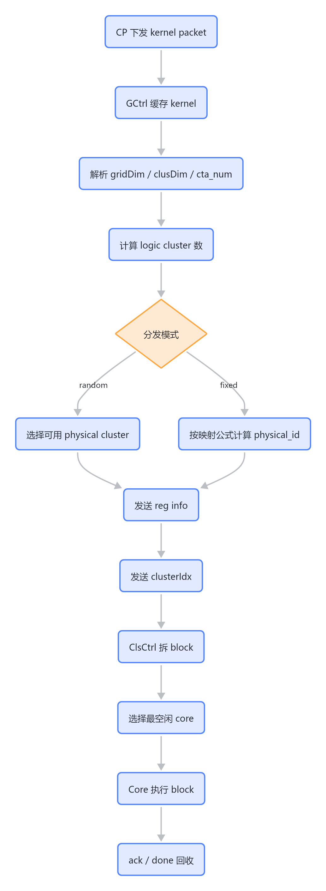

# 05 控制流与数据流

## 控制流

核心控制流从 CP 到 GCtrl，再到 ClsCtrl，最后到 Core：



> 图解源文件：[`01-控制流-flowchart.mmd`](../../../_attachments/mas/RguCore/05-control-data-flow/whiteboard-mermaid/01-控制流-flowchart.mmd)。由 lark-whiteboard `whiteboard-cli` 从原 Mermaid 渲染。

## 数据流

RGU 数据流包含三类常见路径：

- `RegFile <-> GLB`：LSU 负责。
- `RegFile <-> SHM`：LSU 负责。
- `GLB <-> SHM`：AsyncCopy/TMA 负责。

Core 内部访存按 Master/InterConnect/Slave 抽象：

- Master：LSU/TMA。
- Slave：SHM-RW、GLB-RW。
- InterConnect：负责连接、仲裁、拆分、合并。

## Kernel 并行与资源约束

系统支持多 kernel 并行，但有约束：

- 每个 physical cluster 同时只能执行 1 个 kernel。
- 一个 kernel 可占用多个 physical cluster。
- random 分发会影响吞吐和公平性。
- fixed 分发可提高确定性，但对资源碎片更敏感。

## Cluster 与 Block

GCtrl 把 kernel 拆成 logic cluster，ClsCtrl 把 logic cluster 拆成 block。

逻辑坐标关系：

```text
logic cluster = ceil(gridDim / clusDim)
blockIdx = clusterIdx * clusDim + local_offset
```

每个 block 的下发需要携带 clusterIdx 和 blockIdx。文档中 ClusCtrl 描述一个 block 需要 6 笔配置传输：3 笔 clusterIdx + 3 笔 blockIdx。

## Cache 与同步

软件可通过 UMD `0x400` 控制：

- kernel 启动时是否 invalid cache。
- kernel 结束时是否 invalid cache。
- block 结束时是否等待访存状态。
- kernel 结束时是否等待访存状态。

Core 文档进一步要求 kernel 切换时：

- 等待所有 warp 完成。
- flush 所有非 local memory cache。
- invalid 所有 local memory cache。

这意味着“kernel done”不能只看计算 pipe 空，还要看访存、cache、TMA、SHM 相关状态是否收敛。

## 分布式 SHM 访问

Sys 文档描述分布式 SHM 由软件实现映射：

1. 分配一片 VA 作为 SHM 地址映射表。
2. Core 接收 block 后，首线程写入映射表。
3. Core 访问其他 block 时，先用 barrier 确认目标 block 存活。
4. 计算目标 block 的映射表地址。
5. 读取映射表得到目标 block 的 shared memory 首地址。
6. 发起访问。

拓展理解：

- distributed SHM 不是单纯硬件透明寻址，它依赖软件映射表和 barrier 生存期协议。
- 如果 barrier 或映射表写入顺序不正确，可能访问到尚未初始化或已经释放的 SHM。
