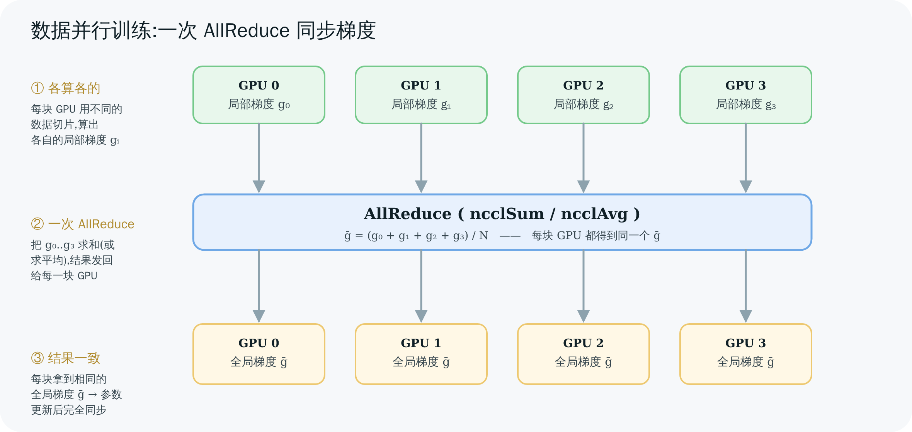

# 00 概览:NCCL 是什么、为什么需要它

> 本章不碰源码细节,只回答三个问题:**NCCL 是什么、为什么深度学习离不开它、它和 MPI/Gloo 这些"老牌通信库"有什么不一样。** 读完你脑子里要有一张"NCCL 在整个训练系统里站在哪"的地图。

---

## 1. 一句话定义

**NCCL(读作 "Nickel",NVIDIA Collective Communications Library)是一个面向多 GPU、多机的集合通信库。** 它提供一组"集合通信原语"(AllReduce、Broadcast、AllGather、ReduceScatter、Reduce、AllToAll、以及点对点 Send/Recv),并针对 NVIDIA GPU 的互联拓扑(NVLink、NVSwitch、PCIe、InfiniBand/RoCE、TCP)做了极致的带宽优化。

关键词拆开看:

- **集合通信(collective communication)**:不是"一个发、一个收"的点对点,而是**一组进程(每个管一块 GPU)一起参与**的通信模式。比如"把每块 GPU 上的梯度加起来,再让每块 GPU 都拿到这个总和"——这就是 AllReduce,一次调用、所有人参与。
- **库(library)**:它不是一个独立服务/进程,而是**链接进你的训练程序**的 `.so`(`libnccl.so`)。你的进程直接调它的函数。
- **GPU 原生**:通信的数据搬运是**在 GPU 上用 CUDA kernel 完成**的,数据通常不经过 CPU、不回 host 内存(这是它比通用通信库快的根本原因之一,详见第 07–09 章)。

---

## 2. 为什么深度学习离不开它:AllReduce 与数据并行

要理解 NCCL 的价值,先看**数据并行(data parallelism)**训练——这是它最主要的用武之地。

数据并行的做法:

1. 把同一个模型**复制**到 N 块 GPU 上(每块一份完整副本)。
2. 把一个 batch 的数据**切成 N 份**,每块 GPU 各算其中一份,得到各自的**梯度**。
3. 关键一步:**把 N 块 GPU 上的梯度求和(再求平均),让每块 GPU 都拿到同一个"全局梯度"**,这样它们更新后的模型参数才完全一致。
4. 各自用这个全局梯度更新参数 → 进入下一个 batch。

第 3 步,正是 **AllReduce**:"All"= 每块 GPU 最后都拿到结果,"Reduce"= 把各家的数据做归约(这里是求和)。



> 图解源文件:[`01-allreduce-in-training.svg`](../../_attachments/nccl/src/01-allreduce-in-training.svg)

**为什么这一步是性能命门?**

- 现代模型动辄上百亿参数,梯度就是同样大小的张量。每个 step 都要把这么大的张量在所有 GPU 间同步一遍。
- 训练有成千上万个 step。**通信只要慢一点,乘以 step 数就是巨大的墙钟时间**——很多大模型训练里,AllReduce 的耗时能占到整个 step 的 20%~50%。
- GPU 算得越快(H100/B200),通信占比反而越突出(算得快了,等通信的时间相对更长)。

所以:**让 AllReduce 尽可能快、尽可能贴着硬件带宽跑,就是 NCCL 存在的核心理由。** 它不是"能用就行"的胶水,而是被反复打磨到逼近硬件极限的关键路径。

> 💡 除了数据并行,张量并行(tensor parallel)用 AllReduce/AllGather/ReduceScatter 切分单层计算,流水线并行(pipeline parallel)用 Send/Recv 在 stage 间传激活,专家并行(MoE)用 AllToAll 路由 token。**几乎所有分布式训练并行策略,底层都落在 NCCL 的这几个原语上。**

---

## 3. NCCL 在软件栈里的位置

你几乎从不直接写 `ncclAllReduce`——它被框架包在下面:

```
你的训练脚本(PyTorch / JAX / Megatron-LM ...)
        │  loss.backward();  optimizer.step()
        ▼
框架的分布式后端(torch.distributed 的 "nccl" backend)
        │  dist.all_reduce(tensor)
        ▼
┌─────────────────────────────────────────────┐
│  NCCL(libnccl.so)  ← 本教程讲的就是这一层      │
│  ncclAllReduce / ncclBroadcast / ...          │
└─────────────────────────────────────────────┘
        │  用 CUDA kernel + 传输通道搬数据
        ▼
硬件互联:NVLink / NVSwitch / PCIe / InfiniBand / 以太网
```

- **上层**:PyTorch 的 `torch.distributed` 在 `backend="nccl"` 时,`dist.all_reduce()` 最终调到 `ncclAllReduce()`。
- **NCCL**:把"对这块张量做 AllReduce"翻译成"在哪些 channel、用什么算法(Ring/Tree)、什么协议(Simple/LL/LL128)、分多少块、谁先发给谁",再启动 GPU kernel 执行。
- **下层**:NCCL 直接驱动 NVLink/NVSwitch(卡间)、InfiniBand verbs 或 socket(机间)。

> 这套"用户态库直接把命令送上 GPU、不每次都麻烦内核驱动"的思路,和本 wiki 里 [[saxpy-kernel-end-to-end|GraceC 的 kernel launch]] 一脉相承——理解了一个,另一个就触类旁通。

---

## 4. 和 MPI / Gloo 比,NCCL 强在哪

集合通信的概念(AllReduce 等)其实来自 **MPI**(Message Passing Interface,HPC 领域几十年的标准)。NCCL 没有发明这些原语,但它为 GPU 重新实现了一遍。三者对比:

| 维度 | MPI(OpenMPI/MPICH) | Gloo | **NCCL** |
|------|----------------------|------|----------|
| 设计年代/对象 | CPU 集群、通用 | CPU,兼带 GPU | **GPU 原生** |
| 数据搬运在哪做 | CPU,常需 GPU→host→GPU 拷贝 | 多在 CPU | **GPU 上的 CUDA kernel,卡间直连不回 host** |
| 拓扑感知 | 弱 | 弱 | **强:自动探测 NVLink/NVSwitch/PCIe/NIC 并据此构图** |
| 算法 | 通用环/树 | 有限 | **Ring + double-binary Tree + CollNet + NVLS,按规模/拓扑自动选** |
| 典型场景 | HPC 数值计算 | 早期 PyTorch CPU | **深度学习训练/推理(事实标准)** |

NCCL 的三个杀手锏(本教程会逐一拆开):

1. **拓扑感知 + 图搜索**:它会探测"这台机器里 8 块 GPU 是全 NVLink 互联,还是两两 PCIe",然后据此搜出最优的通信环/树。同样 8 卡,不同连法,NCCL 给的计划完全不同。→ 第 04 章
2. **GPU 直连、kernel 内通信**:数据从 GPU A 的显存,经 NVLink 直接写到 GPU B 的显存,全程不经 CPU、不经 host 内存拷贝。搬运逻辑就跑在一个 CUDA kernel 里,边收边算(reduce)。→ 第 07–09 章
3. **算法 + 协议自适应**:小数据用低延迟的 Tree/LL,大数据用高带宽的 Ring/Simple,NCCL 内置一个性能模型自动选。→ 第 06、11 章

---

## 5. 一个最小可运行的例子(建立直觉)

不必现在读懂,先感受 API 形状(摘自官方用法,对应 `src/init.cc`、`src/collectives.cc`):

```c
ncclComm_t comm;
ncclUniqueId id;

// 进程 0 生成一个"唯一 ID",通过你自己的带外通道(MPI/socket/文件)广播给所有进程
if (rank == 0) ncclGetUniqueId(&id);
broadcast_id_to_all_ranks(&id);          // ← 你自己实现,NCCL 不管

// 每个进程用 (总卡数, id, 自己的 rank) 加入通信器
ncclCommInitRank(&comm, nRanks, id, rank);

// 真正的集合通信:把 sendbuff 里的数据在所有 rank 间求和,结果写回每个人的 recvbuff
ncclAllReduce(sendbuff, recvbuff, count, ncclFloat, ncclSum, comm, stream);
cudaStreamSynchronize(stream);           // ← NCCL 调用是异步入队到 stream 的

ncclCommDestroy(comm);
```

四个要点,后面章节会逐一展开:

1. **`ncclGetUniqueId` + 带外广播**:NCCL 自己不负责"进程间怎么第一次找到对方",你得用别的手段(通常是 MPI 或 `torch.distributed` 的 store)把那个 128 字节的 id 发给所有进程。→ 第 03 章 bootstrap。
2. **`ncclCommInitRank`**:这是最重的一步——握手、探测拓扑、搜环建树、建立所有传输通道。一次性"建场"。→ 第 03–04、07 章。
3. **`ncclAllReduce` 是异步的**:它只是把通信任务**入队**到你给的 CUDA `stream`,立即返回。真正执行要等 stream 调度到。→ 第 08 章 enqueue。
4. **`ncclSum` 等归约算子**:`ncclSum/Prod/Max/Min/Avg`(`src/nccl.h.in:364`),边搬边在 kernel 里算。→ 第 09 章。

---

## 6. 本教程的边界(不讲什么)

- 不讲怎么用 PyTorch DDP(那是框架层);我们讲 DDP 底下那层 NCCL。
- 不逐行抄源码;只引用关键片段并标注文件/行,重在讲清**为什么这么设计**。
- v2.30.7 的新特性(对称内存 `nccl_device/`、RMA `rma/`、GIN)只在附录点到为止,主线聚焦经典集合通信。

---

> 🎯 **面试官会追问**:
> - **为什么数据并行训练里通信是瓶颈,而不是计算?** —— GPU 算力增长快于互联带宽;梯度张量与模型同样大;每 step 都要同步,乘以上万 step。算得越快,等通信占比越高。
> - **AllReduce 和 "AllGather + 本地求和" 有什么区别?** —— 结果一样(每人都拿到全局和),但通信量和算法不同;NCCL 的 Ring AllReduce 通信量是 2(N−1)/N × 数据量,远优于"各发全量"。详见第 05 章。
> - **NCCL 为什么比 MPI 快?** —— GPU 原生(kernel 内搬运、不回 host)、拓扑感知图搜索、算法/协议自适应。不是单点优化,是端到端贴硬件。
> - **`ncclAllReduce` 返回了,通信完成了吗?** —— 没有。它只是入队到 stream,异步执行,要 `cudaStreamSynchronize` 或等后续 kernel 依赖才算完成。

---

**下一章** → [01 核心概念与 API](<./01-concepts-and-api.md>):把 communicator、rank、7 个集合原语的精确语义讲清楚。
