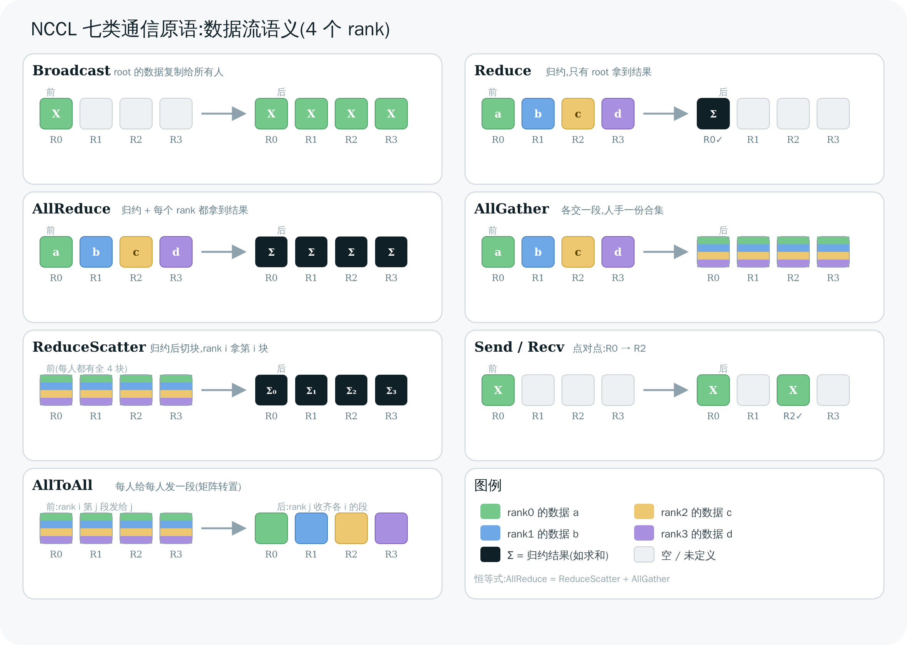

# 01 核心概念与 API

> 本章把 NCCL 的"名词体系"一次讲清:communicator / rank / device 的关系,7 类集合原语的**精确语义**(谁的数据去了谁那里),以及 stream、group call 这两个最容易踩坑的概念。这是后面所有章节的词汇表。

---

## 1. 三个最基础的名词:communicator / rank / device

```c
ncclCommInitRank(ncclComm_t* comm, int nranks, ncclUniqueId commId, int rank);
//                    ↑comm           ↑nranks               ↑rank
```

- **communicator(通信器,`ncclComm_t`)**:一次集合通信的"参与者集合"。所有要一起做 AllReduce 的 GPU,必须属于**同一个 communicator**。它是个不透明句柄,内部装着拓扑、环/树、所有传输通道(第 02–03 章拆开)。
- **rank**:communicator 里每个参与者的**编号**,`0 .. nranks-1`。一个 rank 通常对应一块 GPU、一个进程(或一个线程)。"rank 0" 常被用作 root(广播源、归约目的地)。
- **nranks**:communicator 里的总参与者数 = 总 GPU 数(对单机多卡或多机多卡都成立)。
- **device**:物理 GPU。rank 到 device 的映射由你决定——通常调 `ncclCommInitRank` 前先 `cudaSetDevice(localGpu)`,NCCL 就把当前 rank 绑到当前 device。

> 💡 **rank ≠ device 编号**。rank 是 communicator 内的逻辑序号(全局,跨机连续);device 是某台机器本地的 GPU 物理号(每机从 0 开始)。8 机 × 8 卡 = 64 个 rank(0–63),但每机 device 都是 0–7。这层映射在第 04 章拓扑里很关键。

三者关系一句话:**一个 communicator 由 nranks 个 rank 组成,每个 rank 绑定一块 device。**

### 创建 communicator 的三种姿势

| 函数 | 场景 | 源码 |
|------|------|------|
| `ncclCommInitRank(comm, nranks, id, rank)` | **多进程/多机**:每个进程各调一次,自报 rank | `src/nccl.h.in:186` |
| `ncclCommInitAll(comms, ndev, devlist)` | **单进程多卡**:一个进程管多块 GPU,一次建好所有 comm | `src/nccl.h.in:195` |
| `ncclCommInitRankConfig(...)` | 带 `ncclConfig_t`(调 blocking/网络/CGA 等) | `src/nccl.h.in:177` |
| `ncclCommSplit(comm, color, key, ...)` | 从已有 comm **切分**子通信器(类 MPI_Comm_split) | `src/nccl.h.in:231` |

最常见的是 `ncclCommInitRank`(PyTorch 的 nccl backend 走这条)。它**隐式与其它 rank 同步**——必须由不同进程/线程并发调用,否则死锁(见第 3 节 group call)。

---

## 2. 七类集合原语:谁的数据去了谁那里

这是全章核心。集合通信的所有"花样",本质就是**数据在 rank 之间怎么流动 + 要不要做归约**。下图把它们一次画全(以 4 个 rank 为例):



> 图解源文件:[`02-collective-primitives.svg`](../../_attachments/nccl/src/02-collective-primitives.svg)

逐个精确定义(对应 `src/collectives.cc` 的入口函数):

| 原语 | 语义(in → out) | 类比 | API |
|------|-----------------|------|-----|
| **Broadcast** | root 的数据 → 复制到所有 rank | "群发同一份文件" | `ncclBroadcast` |
| **Reduce** | 所有 rank 的数据归约(sum/max/…)→ 只 root 拿到结果 | "汇总到组长" | `ncclReduce` |
| **AllReduce** | 所有 rank 归约 → **每个 rank 都拿到结果** | "汇总后再群发给所有人" | `ncclAllReduce` |
| **AllGather** | 每个 rank 一块,拼成全量 → 每个 rank 都拿到全量 | "每人交一段,人手一份合集" | `ncclAllGather` |
| **ReduceScatter** | 所有 rank 归约后,**切块分给各 rank**(rank i 拿第 i 块) | "汇总后各领一段" | `ncclReduceScatter` |
| **AllToAll** | 每个 rank 给每个 rank 发一段(矩阵转置) | "互换名片" | `ncclAlltoAll`(基于 Send/Recv) |
| **Send / Recv** | 点对点:rank a → rank b | "私聊" | `ncclSend` / `ncclRecv` |

### 关键恒等式(面试高频)

```
AllReduce  =  ReduceScatter  +  AllGather
```

这不是巧合——**NCCL 的 Ring AllReduce 实现就是这么做的**:先 ReduceScatter(每人算出最终结果的一块),再 AllGather(把各块拼齐发给所有人)。理解这个分解是看懂第 05 章的钥匙。

类似地:
```
Broadcast ≈ Scatter + AllGather    (概念上)
AllReduce ≈ Reduce + Broadcast      (朴素实现,但通信量翻倍,NCCL 不用)
```

### 归约算子(reduction op)

`Reduce/AllReduce/ReduceScatter` 需要指定怎么"合并"(`src/nccl.h.in:364`):

```c
ncclSum=0, ncclProd=1, ncclMax=2, ncclMin=3, ncclAvg=4
```

- `ncclAvg`(求平均)= sum 后除以 nranks,正是数据并行同步梯度要的。
- 还能用 `ncclRedOpCreatePreMulSum` 自定义"先乘标量再求和"(混合精度缩放常用)。

### in-place 与数据类型

- 多数原语支持 **in-place**(`sendbuff == recvbuff`),省一块显存。`ncclBcast` 就是 `ncclBroadcast` 的 in-place 版(`collectives.cc:204`,直接转调,标注 deprecated)。
- 数据类型 `ncclDataType_t`(`nccl.h.in:382`):`ncclInt8/32/64`、`ncclFloat16/32/64`、`ncclBfloat16` 等。训练里最常见 `ncclFloat32`、`ncclBfloat16`。

---

## 3. 两个最容易踩坑的概念:stream 与 group call

### 3.1 stream:NCCL 调用是异步的

每个集合 API 的最后一个参数都是 `cudaStream_t stream`:

```c
ncclAllReduce(sendbuff, recvbuff, count, ncclFloat, ncclSum, comm, stream);
```

**它不会阻塞等通信完成,而是把通信 kernel 入队到这个 CUDA stream 后立即返回。** 真正执行要等 stream 调度到。这带来两个后果:

1. 想拿到结果,得 `cudaStreamSynchronize(stream)`,或让下游 kernel 在同一 stream 上依赖它。
2. 通信能和计算**重叠**:把通信放一个 stream、计算放另一个 stream,GPU 可以一边算一边通信——这是隐藏通信开销的关键技巧(第 11 章)。

> ⚠️ 常见 bug:`ncclAllReduce` 返回了就以为数据好了 → 读到旧值。返回 ≠ 完成。

### 3.2 group call:把多个调用"打包"

`ncclGroupStart()` / `ncclGroupEnd()`(`nccl.h.in` 末尾)把中间的一串调用**聚合成一次启动**。两个核心用途:

**用途一:单进程管多卡,避免死锁。** 若一个进程要替 N 块 GPU 各发一次 AllReduce,逐个同步调用会死锁(第 1 个在等其它 rank,但其它 rank 的调用还没发出)。包进 group 里,NCCL 先收集全部、再一起发:

```c
ncclGroupStart();
for (int i = 0; i < nGpu; i++)
    ncclAllReduce(send[i], recv[i], count, ncclFloat, ncclSum, comms[i], streams[i]);
ncclGroupEnd();   // ← 到这里才真正发起,内部协调好,不死锁
```

**用途二:融合多个点对点,实现 AllToAll。** `ncclSend`/`ncclRecv` 必须成对、且常需并发推进。把一轮要发要收的全部 `Send/Recv` 包进一个 group,NCCL 才能让它们并行而不互相阻塞:

```c
ncclGroupStart();
for (int r = 0; r < nranks; r++) {
    ncclSend(sendbuf + r*chunk, chunk, type, r, comm, stream);
    ncclRecv(recvbuf + r*chunk, chunk, type, r, comm, stream);
}
ncclGroupEnd();   // 这就是一次 AllToAll
```

> 💡 **`ncclCommInitRank` 也能放进 group**(并发建多个 comm),但**不能和集合通信混在同一个 group 里**(`nccl.h.in:708` 明确说明)。

---

## 4. 5 个"核心" vs 其余:实现层面的分类

源码里有个值得注意的常量(`src/include/nccl_common.h:72`):

```c
#define NCCL_NUM_FUNCTIONS 5 // Send/Recv not included for now
typedef enum {
  ncclFuncBroadcast=0, ncclFuncReduce=1, ncclFuncAllGather=2,
  ncclFuncReduceScatter=3, ncclFuncAllReduce=4,   // ← 这 5 个有专门的 device kernel
  ncclFuncSendRecv=5, ncclFuncSend=6, ncclFuncRecv=7,
  ncclFuncAlltoAll=8, ncclFuncScatter=9, ncclFuncGather=10, ...
} ncclFunc_t;
```

这揭示了一个重要的实现事实:

- **5 个核心原语**(Broadcast/Reduce/AllGather/ReduceScatter/AllReduce)有**各自编译出的 CUDA kernel**,走 Ring/Tree 等集合算法。
- **Send/Recv 是点对点**,单独一套 kernel。
- **AllToAll/Scatter/Gather** **没有独立的集合 kernel**,而是**在 host 侧拆成一堆 Send/Recv**(用 group call 融合)来实现。

所以本教程第 05–09 章的"算法 + kernel"主要围绕那 5 个核心原语展开,尤其是 **AllReduce**(它是 ReduceScatter+AllGather 的组合,最具代表性)。

---

## 5. 所有原语的统一入口:ncclEnqueueCheck

看一眼 `src/collectives.cc`,你会发现**每个集合函数长得几乎一样**:填一个 `ncclInfo` 结构体,然后调同一个函数。以 AllReduce 为例(`collectives.cc:168`):

```c
ncclResult_t ncclAllReduce(const void* sendbuff, void* recvbuff, size_t count,
                           ncclDataType_t datatype, ncclRedOp_t op,
                           ncclComm* comm, cudaStream_t stream) {
  struct ncclInfo info = {
    ncclFuncAllReduce, "AllReduce", sendbuff, recvbuff, count, datatype, op, 0, comm, stream,
    ALLREDUCE_CHUNKSTEPS, ALLREDUCE_SLICESTEPS
  };
  return ncclEnqueueCheck(&info);   // ← 所有原语都收敛到这里
}
```

`ncclInfo`(`src/include/info.h:17`)就是"把这次调用的全部参数打成一个包",`ncclEnqueueCheck`(`src/enqueue.cc:3124`)则是**通往算法选择、计划生成、kernel 启动的总闸门**——第 08 章会从这里一路追到 GPU。

记住这张极简调用链,后面就有了主心骨:

```
ncclAllReduce()  →  填 ncclInfo  →  ncclEnqueueCheck()  →  [算法/协议选择] → [生成 plan] → [启动 kernel]
   (用户 API)        (参数打包)        (统一入口)              第06/11章         第08章        第08/09章
```

---

> 🎯 **面试官会追问**:
> - **AllReduce 为什么等于 ReduceScatter + AllGather?** —— ReduceScatter 让每个 rank 算出最终结果的 1/N 块;AllGather 再把这 N 块互相补齐。两步合起来每个 rank 都拿到完整归约结果,且总通信量最优。NCCL 的 Ring 实现就是这么做的。
> - **`ncclSend/ncclRecv` 为什么常要包在 `ncclGroupStart/End` 里?** —— 单独的阻塞式 Send 可能在等对端 Recv,而对端的 Recv 还没发出,造成死锁;group 让 NCCL 收齐一轮收发后统一并发推进。
> - **rank 和 device 编号是一回事吗?** —— 不是。rank 是 communicator 内全局逻辑号(跨机连续 0..nranks-1);device 是每台机器本地 GPU 物理号。映射由 `cudaSetDevice` + init 决定。
> - **为什么 AllToAll 没有专门的 kernel?** —— 它被 host 侧拆解成 N×N 次 Send/Recv,用 group call 融合执行;NCCL 只给 5 个核心归约/聚合原语编译了专用集合 kernel(`NCCL_NUM_FUNCTIONS=5`)。
> - **`ncclAvg` 怎么实现的?** —— sum 归约后除以 nranks;数据并行同步梯度正好要平均而非求和。

---

**上一章** ← [00 概览](<./00-overview.md>)　|　**下一章** → [02 整体架构与代码地图](<./02-architecture-codemap.md>)
