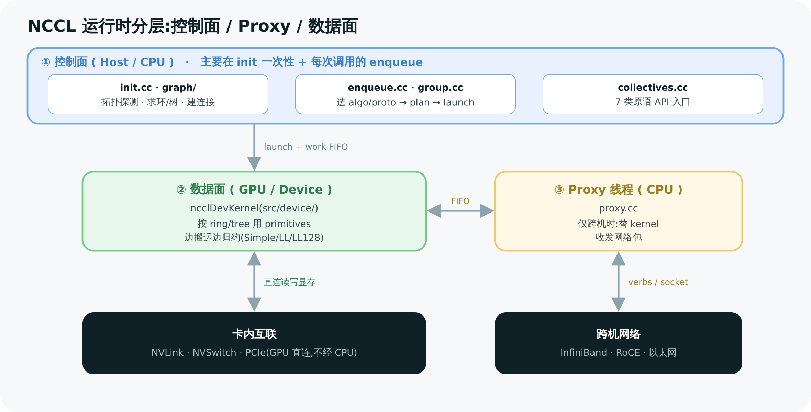
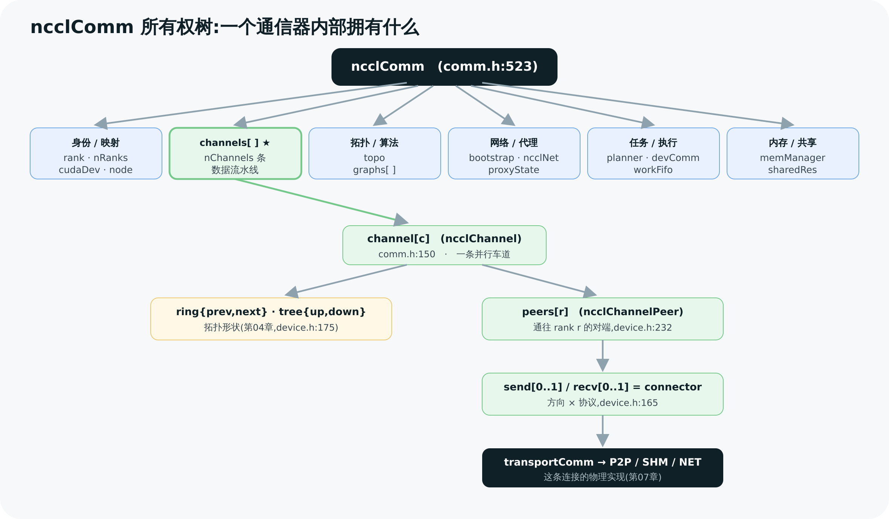
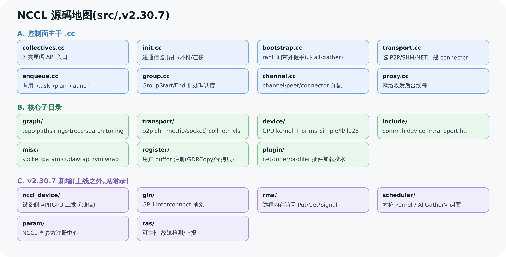

# 02 整体架构与代码地图

> 本章给你两张地图:**一张是"运行时分层"**(控制面在 CPU、数据面在 GPU、proxy 在中间),**一张是"源码目录"**(`src/` 下每个目录管什么)。再把贯穿全库的核心数据结构 `ncclComm` 的"所有权树"摊开——后面每一章其实都是在操作这棵树的某个分支。

---

## 1. 控制面 vs 数据面:NCCL 的根本二分

理解 NCCL 最重要的一刀,是把它劈成**控制面(control plane)**和**数据面(data plane)**:



> 图解源文件:[`03-architecture-layers.svg`](../../_attachments/nccl/src/03-architecture-layers.svg)

| | **控制面(CPU / Host)** | **数据面(GPU / Device)** |
|---|---|---|
| 代码 | `src/*.cc`(除 `device/`) | `src/device/*` 的 `__device__`/`__global__` |
| 干什么 | 拓扑探测、选算法、建连接、把任务排成 plan、启动 kernel | 真正搬数据、边搬边归约、跨卡/跨机收发 |
| 何时跑 | 主要在 **init 一次性**,加每次调用的 **enqueue** | 每次集合通信,在 stream 上 |
| 性能瓶颈 | PCIe、socket、系统调用 | 显存带宽、互联带宽 |

中间还夹着一个特殊角色——**Proxy 线程**(`src/proxy.cc`):它是 CPU 上的后台线程,但站在**数据通路**上。当通信要跨机走网络时,GPU kernel 没法直接调 InfiniBand verbs,于是 kernel 把数据准备好、通过 FIFO 通知 proxy,proxy 替它发网络包、收网络包、再回写完成标志。**卡内(NVLink/PCIe)走纯 GPU 直连不经 proxy;跨机(NET)才需要 proxy。** → 第 10 章详解。

一句话总线图(贯穿第 08–10 章):

```
[控制面 CPU]  ncclAllReduce → enqueue → 生成 plan → 序列化进 work FIFO → cudaLaunchKernel
                                                                              │
[数据面 GPU]                                            ncclDevKernel 启动 ──┘
                                                        按 ring/tree 用 primitives 搬+算
                                                        跨机时 ↕ 通过 FIFO 与 proxy 协作
[Proxy CPU]                                             proxy progress 循环:收发网络包
```

---

## 2. 核心数据结构 ncclComm:一个通信器内部都拥有什么

`ncclComm`(`src/include/comm.h:523-797`)是整个库的中心。它就是 `ncclCommInitRank` 建出来、`ncclAllReduce` 反复使用的那个不透明句柄背后的实体。把它的"所有权树"摊开:



> 图解源文件:[`05-ncclcomm-tree.svg`](../../_attachments/nccl/src/05-ncclcomm-tree.svg)

按职责分组看它的关键字段(行号均为 `comm.h`):

**① 身份与拓扑映射**(我是谁、组里有谁)
- `int rank / nRanks`(:570/571)——本 rank 序号、总 rank 数
- `int cudaDev`(:572)——绑定的物理 GPU
- `int node / nNodes / localRank / localRanks`(:583–586)——多机场景下"我在第几台机、机内第几块卡"
- `int* rankToNode / localRankToRank ...`(:589–591)——rank ↔ (机, 本地卡) 的映射表

**② 通信通道**(数据真正流过的管道)
- `struct ncclChannel channels[MAXCHANNELS]`(:534)——**核心**,见第 3 节
- `int nChannels`(:612)——实际启用多少条 channel

**③ 拓扑与算法图**(怎么连最优,第 04 章)
- `struct ncclTopoSystem* topo`(:536)——探测到的硬件拓扑(GPU/NIC/PCIe/NVLink 图)
- `struct ncclTopoGraph graphs[NCCL_NUM_ALGORITHMS]`(:559)——为 Ring/Tree/CollNet/NVLS 各算出的图
- `struct ncclPeerInfo* peerInfo`(:535)——所有 rank 的 GPU 信息(UUID、算力…)

**④ 网络与代理**(跨机怎么走,第 07/10 章)
- `void* bootstrap`(:554)——bootstrap 带外通道状态
- `ncclNet_t* ncclNet`(:543)——网络插件接口(IB / socket)
- `struct ncclProxyState* proxyState`(:683)——proxy 线程状态

**⑤ 任务规划与执行**(一次调用怎么变 kernel,第 08 章)
- `struct ncclKernelPlanner planner`(:721)——group 期间累积任务、生成 plan
- `struct ncclKernelComm* devComm`(:659)——传给 GPU kernel 的设备侧镜像
- `void* workFifoBuf / workFifoBufDev`(:663/664)——host/device 双端 work FIFO
- `uint32_t workFifoProduced / Consumed`(:668/670)——FIFO 生产/消费指针

> 💡 `startMagic`(:524)和 `endMagic`(:796)把整个结构体"夹"在两个魔数之间——一旦野指针踩坏 comm,校验 magic 立刻能发现。这是 NCCL 一贯的防御式编程风格。

---

## 3. channel / peer / connector:数据管道的三层

这是 NCCL 里最容易绕晕、但最关键的一组结构。自顶向下三层(行号见 `device.h`):

```
comm.channels[c]            ← 第 c 条 channel(comm.h:150 struct ncclChannel)
   ├─ ring / tree / nvls    ← 这条 channel 上的"拓扑形状"(谁的前驱/后继/父/子)
   └─ peers[peerRank]       ← 到某个 peer 的"对端"(device.h:232 struct ncclChannelPeer)
        ├─ send[0..1]       ← 发送方向的 connector(NCCL_MAX_CONNS=2)
        └─ recv[0..1]       ← 接收方向的 connector(device.h:165 struct ncclConnector)
             └─ transportComm + transportResources  ← 这条连接到底用 P2P/SHM/NET 哪种实现
```

逐层解释:

- **channel(`ncclChannel`,comm.h:150)**:一条独立的通信流水线。NCCL 会开 `nChannels` 条 channel **并行**跑同一个集合通信,把带宽喂满(就像多条车道)。每条 channel 内部存着它的 `ring`(prev/next)、`tree`(up/down)等拓扑形状。
- **peer(`ncclChannelPeer`,device.h:232)**:在某条 channel 上,"我"和某个对端 rank 的连接束。`channels[c].peers[r]` 就是"第 c 条 channel 上通往 rank r 的对端"。
- **connector(`ncclConnector`,device.h:165)**:一个**方向 + 一种协议**的实际连接。`send[0]/send[1]` 两条是给不同协议(如 LL 与 SIMPLE)用的。connector 里的 `transportComm` 指针决定这条连接走 **P2P(NVLink/PCIe IPC)、SHM(共享内存)、还是 NET(网络)**——这正是第 07 章传输层要讲的。

拓扑形状结构(都在 `device.h`):

| 结构 | 字段 | 含义 |
|------|------|------|
| `ncclRing`(:175) | `prev, next, userRanks[], index` | 环上我的前驱/后继、环的 rank 顺序 |
| `ncclTree`(:193) | `up, down[NCCL_MAX_TREE_ARITY], depth` | 树上我的父、最多 3 个孩子 |
| `ncclDirect / ncclNvls`(:200/215) | heads/up/down… | CollNet / NVLink-SHARP 的连接 |

> 🎯 记住这条链:**comm → channel → peer → connector → transport**。"算法"(Ring/Tree)决定 channel 里的 ring/tree 怎么填(第 04–06 章),"传输"(P2P/NET)决定 connector 怎么实现(第 07 章),"协议"(LL/Simple)决定开几条 connector、kernel 怎么搬(第 09 章)。三件事正交。

**为什么要分四层(channel → peer → connector → conninfo),不拍平成一层?** 因为这四层对应四个**独立变化的维度**,拍平了任何一个维度扩展都会牵连其它维度:

- **channel** 维度对应"有多少条并行物理链路"(04 章图搜索出的 `nChannels`),这个数字随拓扑/带宽变化。
- **peer** 维度对应"这条链路上我要跟哪些 rank 通信"——Ring 下一条 channel 上每个 rank 通常只有 prev/next 两个非空 peer,但 Tree/NVLS 结构下同一条 channel 可能要连更多 peer,`peers[]` 数组下标是 rank 号(命名沿用历史,容易误读成"以 channel 为下标",实际语义是"这条 channel 上到某个 peer rank 的连接")。
- **connector** 维度对应"同一对 (channel, peer) 之间可能同时存在的多种连接实现"——比如同时有走 NVLink 的常规连接和 NVLS 用的额外连接,`NCCL_MAX_CONNS` 就是这个"连接变体"的上限。
- **conninfo**(`ncclConnInfo`,device.h:133)才是最底层真正的数据面状态:`buffs[]`(数据 buffer)、`head`/`tail`(FIFO 指针,第 09 章详解)、`mhandles[]`(内存注册 handle)。

四层分开后,"channel 数怎么变"、"一条 channel 上连几个 peer"、"一对 peer 之间用几种连接实现"这三个问题可以互不干扰地独立演化——这正是下图要立住的结构,后面 03/06/08/09 章多次引用它:

![图17:channel/peer/connector 四层嵌套结构 — 从 ncclComm.channels[] 展开到 peers[]/send·recv connector/ncclConnInfo 图解](../../_attachments/nccl/17-channel-peer-connector-layers.png)

> 图解源文件:[`17-channel-peer-connector-layers.svg`](../../_attachments/nccl/src/17-channel-peer-connector-layers.svg)

这三层是**逻辑数据结构**,第 03 章会讲它们的字段是怎么从环/树的排列(`graph.intra[]`)一步步填出来的(参见 [03 章 §5.4](<./03-init-and-bootstrap.md>))。

---

## 4. 代码地图:src/ 下每个目录管什么

按"读源码会用到的顺序"组织(v2.30.7,经目录实查):



> 图解源文件:[`04-code-map.svg`](../../_attachments/nccl/src/04-code-map.svg)

**A. 主干 .cc(控制面入口)**

| 文件 | 职责 | 对应章节 |
|------|------|---------|
| `collectives.cc` | 7 类原语的 API 入口,都收敛到 `ncclEnqueueCheck` | 01 |
| `init.cc` | 建通信器:bootstrap、拓扑、求环树、建连接 | 03–04 |
| `bootstrap.cc` | rank 间带外握手(socket 环 all-gather) | 03 |
| `transport.cc` | 选 transport(P2P/SHM/NET)、建 connector | 07 |
| `enqueue.cc` | 调用 → task → plan → 启动 kernel | 08 |
| `group.cc` | `ncclGroupStart/End` 批处理与异步调度 | 01/08 |
| `channel.cc` | channel 与 peer/connector 的分配初始化 | 02 |
| `proxy.cc` | 网络收发的后台 proxy 线程 | 10 |

**B. 子目录**

| 目录 | 职责 | 章节 |
|------|------|------|
| `graph/` | 拓扑探测(`topo.cc`)、路径(`paths.cc`)、求环树(`rings.cc`/`trees.cc`)、搜索(`search.cc`)、调优(`tuning.cc`)、XML(`xml.cc`) | 04/11 |
| `transport/` | `p2p.cc`(IPC)、`shm.cc`、`net.cc`+`net_ib`/`net_socket`、`coll_net.cc`、`nvls.cc` | 07 |
| `device/` | **GPU kernel**:`all_reduce.h` 等 + `prims_simple/ll/ll128.h` 协议原语 + `common.cu` 入口 | 09 |
| `misc/` | 工具:`socket.cc`、`param.cc`、`cudawrap.cc`、`nvmlwrap.cc`、`gdrwrap.cc`… | 各处 |
| `include/` | 头文件:`comm.h`、`device.h`、`transport.h`、`proxy.h`、`enqueue.h`… | 全 |
| `register/` | 用户 buffer 注册(GDRCopy、零拷贝) | 07/11 |

**C. v2.30.7 新增(主线之外,附录略述)**

| 目录 | 一句话 |
|------|--------|
| `nccl_device/` | **设备侧 API**(GPU 上直接发起通信,如 `ncclTeamWorld`/LSA) |
| `gin/` | GPU Interconnect(新的设备发起互联抽象) |
| `rma/` | 远程内存访问(Put/Get/Signal,对应 `ncclPutSignal` 等新 API) |
| `scheduler/` | 对称 kernel / AllGatherV 的任务调度 |
| `param/` | 参数注册中心(`NCCL_*` 环境变量的新框架) |
| `ras/` | 可靠性(RAS:故障检测/上报) |

> ⚠️ 这些新目录反映 NCCL 正在往"设备发起通信(device-initiated)"和"RMA 语义"演进。本教程主线仍讲经典的"host 发起 + 集合原语",新方向在 [第 12 章附录](<./12-appendix.md>)定位。

---

## 5. 把两张地图叠起来:一次 AllReduce 的代码轨迹(预告)

为了让后面章节有主心骨,先把"一次 AllReduce 调用经过哪些文件"串一遍(细节在对应章):

```
collectives.cc  ncclAllReduce()                    ← API(第01章)
   → enqueue.cc   ncclEnqueueCheck() → 选 algo/proto ← 第08/11章(算法/协议选择)
   → enqueue.cc   生成 ncclKernelPlan              ← 第08章
   → enqueue.cc   写 work FIFO + cudaLaunchKernel   ← 第08章
   → device/      ncclDevKernel → all_reduce.h      ← 第09章(GPU 上执行)
        用 channels[c].ring + connector 搬数据
   → transport/   若跨机:connector 触发 proxy       ← 第07章
   → proxy.cc     proxy progress 收发网络包          ← 第10章
```

这条轨迹用到的所有结构(comm、channel、connector、planner、proxyState),都是第 2–3 节那棵 `ncclComm` 树上的分支。**理解了树,就理解了 NCCL 的骨架。**

---

> 🎯 **面试官会追问**:
> - **为什么 NCCL 要开多条 channel?** —— 单条 channel 喂不满 NVLink/NVSwitch 的聚合带宽;多条 channel 把数据分摊到多个 SM、多条物理链路上并行,逼近硬件峰值。channel 数由拓扑搜索决定(第 04 章)。
> - **channel、peer、connector 各是什么粒度?** —— channel 是并行车道(一个集合通信开 nChannels 条);peer 是某车道上通往某个对端 rank 的连接束;connector 是"一个方向 + 一种协议"的具体连接,内部的 transportComm 决定走 NVLink/PCIe/SHM/网络。
> - **proxy 线程属于控制面还是数据面?** —— 都不纯粹。它是 CPU 线程(像控制面),但跑在数据通路上替 GPU 收发网络包(像数据面)。只有跨机 NET 传输才需要它。
> - **为什么 ncclComm 有 startMagic/endMagic?** —— 防御式编程:句柄被野指针/越界写破坏时,magic 校验能立即报错,而不是产生诡异的通信结果。
> - **控制面的开销主要在哪?** —— init 的拓扑探测和建连接是一次性大头;每次调用的 enqueue(选算法、生成 plan、launch)是常态小开销,CUDA Graph 可把它进一步摊薄(第 08 章)。

---

**上一章** ← [01 核心概念与 API](<./01-concepts-and-api.md>)　|　**下一章** → [03 通信器初始化与 Bootstrap](<./03-init-and-bootstrap.md>)
