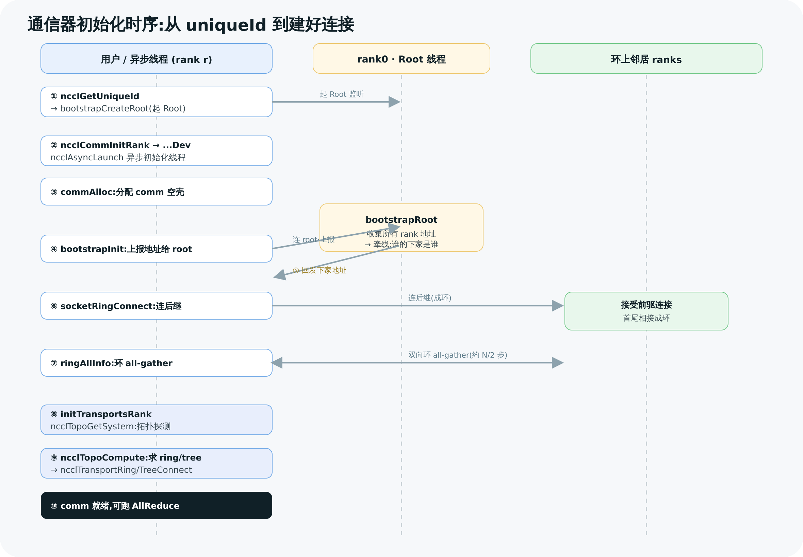

# 03 通信器初始化与 Bootstrap

> `ncclCommInitRank` 是整套库里最重的一次调用——一行 API 背后,要完成"互不相识的多个进程第一次找到彼此 → 探测硬件拓扑 → 算出最优环/树 → 建立所有传输连接"。本章把这条链按源码顺序一关一关走清楚。这是理解 NCCL 工程实现的关键一章。

---

## 1. 先看全景:init 的五个阶段

用户只调两步:`ncclGetUniqueId`(仅 rank0)+ 每个 rank 各调 `ncclCommInitRank`。但 `ncclCommInitRank` 内部展开是一条长链(`src/init.cc`):

```
ncclCommInitRank()                       init.cc:2562
  → ncclCommInitRankDev()                init.cc:2477   分配 comm、启动异步线程
      → ncclAsyncLaunch(ncclCommInitRankFunc)  init.cc:2544  ← 真正的初始化在异步线程
          → commAlloc()                  init.cc:441    ① 分配 comm 结构
          → bootstrapInit()              init.cc:1916   ② bootstrap 握手 + 建环
          → initTransportsRank()         init.cc:1921   ③④⑤ 拓扑/算法/连接
```

注意一个工程细节:**真正的初始化跑在异步线程里**(`ncclAsyncLaunch`,init.cc:2544)。这样多个 comm(或 group 内多次 init)能并发推进,也让 non-blocking 模式(`ncclCommInitRankConfig` + `blocking=0`)成为可能——`ncclCommInitRank` 可以先返回,你用 `ncclCommGetAsyncError` 轮询是否建好。

下图是把这条链按"哪些事在用户线程 / root 线程 / 各 rank 异步线程"摊开的时序:



> 图解源文件:[`06-init-sequence.svg`](../../_attachments/nccl/src/06-init-sequence.svg)

下面按阶段展开。

---

## 2. 第 0 步:uniqueId 是什么——rank0 的"门牌号"

NCCL 自己**不负责**进程间第一次怎么找到对方。它把这个问题缩小成:"所有 rank 只要都知道 **rank0 的网络地址**,就能先连到 rank0、再由 rank0 牵线认识彼此。" 而 `ncclGetUniqueId` 生成的,正是这个地址。

`ncclUniqueId` 实际是 `struct ncclBootstrapHandle`(`src/include/bootstrap.h:14`),128 字节里装着:

```c
struct ncclBootstrapHandle {
  uint64_t magic;               // 随机魔数,用于校验/防串扰
  union ncclSocketAddress addr; // rank0 bootstrap 监听 socket 的 IP+端口  ← 核心
  int nRanks;                   // 现有 rank 数(用于动态扩容 grow)
};
```

`ncclGetUniqueId`(`init.cc:183`)→ `bootstrapGetUniqueId`(`bootstrap.cc:430`)做两件事(`bootstrap.cc:452`):

1. `getRandomData(&handle->magic)` —— 生成随机 magic。
2. `memcpy(&handle->addr, &bootstrapNetIfAddr)` —— 填入本机(将成为 root)的网卡地址。
3. `bootstrapCreateRoot(handle)` —— **当场起一个 root 服务线程**开始监听。

> 💡 **关键认知**:uniqueId 本质就是"rank0 的门牌号 + 一个暗号"。你必须用 NCCL **之外**的手段(MPI 广播、`torch.distributed` 的 store、写文件、环境变量 `NCCL_COMM_ID`)把这 128 字节发给所有 rank。这一步 NCCL 不管——这是它和"全功能 MPI"最大的分工差异。

---

## 3. 第 ① 步:commAlloc——把 comm 结构搭起来

`commAlloc`(`init.cc:441`)分配并初始化 `ncclComm`:

- 初始化内存栈(`memPermanent/memScoped`)、设 `rank/nRanks`(:454)、取 `cudaDev` 与算力(:459);
- 初始化或共享进程内 `sharedResources`(stream、event)(:462);
- `ncclNetInit()` / `ncclRmaInit()` / `ncclGinInit()`(:475)——把网络/RMA/GIN 插件挂上。

此时 comm 是个"空壳":字段就位,但 channels、topo、连接都还没填。

---

## 4. 第 ② 步:bootstrapInit——多进程怎么连成一个环

这是 init 里最精彩的部分:**几十上百个互不相识的进程,怎么在只知道 rank0 地址的前提下,高效地两两交换信息?** NCCL 的答案是**先连成一个环,再在环上做 all-gather**。

### 4.1 rank0 的 root 线程:牵线人

`ncclGetUniqueId` 那一刻起,rank0 已经起了 `bootstrapRoot` 线程(`bootstrap.cc:288`)在监听。它干两件事:

1. **收集阶段**(:312):每个 rank 启动后都先连到 root,上报自己的监听地址(`struct extInfo`)。root 把所有人的地址记进 `rankInfo[]`。
2. **牵线阶段**(:377):收齐后,root 给每个 rank r **回发它的"下一个邻居"(rank r+1)的地址**:`next = (r+1) % nranks`。

注意:root 只牵线"谁的下家是谁",**自己并不中转后续数据**——它的活儿到此基本结束。

### 4.2 每个 rank:连成环

`bootstrapInit`(`bootstrap.cc:674`)里,每个 rank:

1. 建自己的监听 socket(:718)——供环上的前驱来连;
2. 把自己地址发给 root(:764);
3. 从 root 收到"下家"地址 `nextPeer`(:788);
4. `socketRingConnect(nextPeer)`(:805)——**连上自己的后继**。每个 rank 连后继、接受前驱的连接,N 个 rank 就首尾相接成一个**环**。
5. `ringAllInfo()`(:854)——在这个环上做一次 all-gather,把每个 rank 的代理地址等信息(`peerAddresses/peerProxy/peerUDS`)传遍全场。

### 4.3 环 all-gather 算法:为什么用环

`bootstrapAllGather`(`bootstrap.cc:1194`)→ `socketRingAllGather`(`bootstrap.cc:1144`)。核心是**双向环**算法(:1153):

```
totalSteps = nranks / 2          // 双向,只需约 N/2 步
每步:
  沿 ring0(逆时针)发一片、收一片
  沿 ring1(顺时针)发一片、收一片
```

为什么不让 rank0 挨个发给所有人?那样 rank0 是瓶颈(O(N) 串行、流量集中)。**环 all-gather 让每个 rank 同时收发,负载均摊**,N 越大优势越明显——这其实是 Ring AllReduce 思想(第 05 章)在 bootstrap 阶段的预演。

**为什么是双向环、约 N/2 步,不是单向环 N-1 步?** `socketRingAllGather`(`bootstrap.cc:1144`)源码注释直接写明(`:1157`):"N ranks requires (N-1)/2 steps for the double ring algorithm"——`totalSteps = nranks/2`(`:1153`),每一步同时用两组 socket 操作:Ring0 沿一个方向发一片收一片,Ring1 沿反方向发一片收一片(4 个并发 send/recv)。单向环(NCCL 里网络 fallback 路径 `netRingAllGather`,`bootstrap.cc:1107`,用于没有 socket bootstrap 网络时的兜底)则是标准算法,`nranks-1` 步,每步只转发"上一步收到的数据"。双向能减半步数,本质是**用双倍的每步带宽换步数减半**:单向环里数据要走 `nranks-1` 跳才能到达最远的 rank,双向环让数据同时顺时针和逆时针传播,每个 rank 的数据只需走约 `nranks/2` 跳就能从两个方向"会师"覆盖所有 rank。在小消息、高延迟敏感的 bootstrap 场景(瓶颈是每步的网络往返延迟而不是带宽),这个交易明显划算。

> ⚠️ **推断**:源码没有解释"为什么 bootstrap 走 socket 用双向环、而 net 路径的 `netRingAllGather` 反而是单向环"这个不对称设计。可能的原因是 bootstrap 走标准 TCP socket(每个 rank 对 prev/next 各有独立 fd),双向不需要额外硬件支持,纯软件层面就能做;而 `netRingAllGather` 走 NCCL 自己的 net 插件抽象,这条路径用得少(仅用于没有 TCP bootstrap 网络时的兜底),可能只是没有被同等优化,而不是有意为之的设计取舍。

> 🎯 **bootstrap 用的是低速 socket/网络通道,只传"控制信息"(地址、元数据),不是大数据通路。** 真正的张量数据走后面建立的 transport(NVLink/IB)。别把两者混淆。

---

## 5. 第 ③④⑤ 步:initTransportsRank——拓扑、算法、连接

`initTransportsRank`(`init.cc:965`)是 init 的后半程,内部又分几个阶段。函数开头的源码注释直接点明了为什么要拆两次 all-gather(`init.cc:967-969`):

```
// We use 2 AllGathers
// 1. { peerInfo, comm, compCap}
// 2. { nChannels, graphInfo, topoRanks }
```

**为什么不能合并成一次?** 因为第二批数据(`nChannels`/`graphInfo`/`topoRanks`)是每个 rank 各自跑完拓扑探测(`ncclTopoGetSystem`/`ncclTopoComputePaths`,§5.2)和图搜索(`ncclTopoCompute`,§5.3,第 04 章详解)**之后才产生的**,而这两步又**依赖** AllGather1 换来的 `peerInfo`(含 hostHash、busId 等)才能判断"哪些 rank 在同一台机器上、该怎么拼成一张跨机拓扑图"。这是严格的时序依赖链:没有 `peerInfo` 就不知道本机的拓扑边界,没有拓扑就跑不了图搜索,没有图搜索结果就没有 AllGather2 要发的数据——三者只能顺序发生,合并成一次 all-gather 反而会强迫所有 rank 在通信之前先做完拓扑探测,没有必要把两个不同阶段的屏障捆在一起。

### 5.1 第一次 all-gather:交换 GPU 信息(:1033)

```
fillInfo(comm->peerInfo + rank)      init.cc:1036   填本 rank 的 GPU UUID/算力/PCI 等
bootstrapAllGather(comm->peerInfo)   init.cc:1037   把所有人的 GPU 信息收齐
```

现在每个 rank 都知道"全场有哪些 GPU、各自什么型号、在哪条 PCI 上"——这是拓扑探测的输入。

### 5.2 拓扑探测(:1131,详见第 04 章)

```
ncclTopoGetSystem(comm, &comm->topo)   init.cc:1141  探测本机 GPU/CPU/NUMA/NIC/NVLink 拓扑
ncclTopoComputePaths(comm->topo, comm) init.cc:1143  算 GPU↔GPU、GPU↔NIC 的最短路径
ncclTopoTrimSystem(...)                init.cc:1145  裁掉用不到的 GPU/NIC
ncclTopoSearchInit(comm->topo)         init.cc:1149  初始化搜索结构
```

### 5.3 求 channel / ring / tree(:1171,详见第 04 章)

对每种算法各调一次 `ncclTopoCompute`,搜出最优的 channel 数和连接形状:

```
ncclTopoCompute(topo, ringGraph)          init.cc:1178   Ring
ncclTopoCompute(topo, treeGraph)          init.cc:1186   Tree
ncclTopoCompute(topo, collNetChain/Direct) init.cc:1203  (可选)CollNet
ncclTopoCompute(topo, nvlsGraph)          init.cc:1215   (可选)NVLS
```

### 5.4 第二次 all-gather + 建立连接(:1240、:1563)

再做一次 all-gather 同步各 rank 的 channel/图信息,然后**把逻辑上的环/树,变成物理上的 P2P 连接**:

```
setupChannel(comm, c, ...)              init.cc:1563   填每条 channel 的 ring 结构
ncclTransportRingConnect(comm)          init.cc:1565   建 Ring 的 prev/next 连接
ncclTransportTreeConnect(comm)          init.cc:1568   建 Tree 的 up/down 连接
```

`ncclTransportRingConnect`(`src/transport/generic.cc:14`)做的事很直白——**对每条 channel,把"我"和"环上前驱、后继"两个方向的 connector 建起来**:

```c
for each channel c:
  ncclTransportP2pConnect(comm, c, 1, &channel->ring.prev,   // 接收来自前驱
                                    1, &channel->ring.next, 0); // 发送给后继
ncclTransportP2pSetup(comm, &ringGraph, 0);                   // 真正协商/分配资源
```

到此,第 02 章那棵树上的 `channels[c].peers[r].send/recv` connector 全部就位,每条都绑定了它该走的 transport(P2P/SHM/NET,第 07 章决定)。**通信器建成,可以跑 AllReduce 了。**

**这里容易有个误解**:以为"图搜索算出环、all-gather 交换完信息"之后连接就自动建好了。实际上"数字上的环"和"物理上的连接"是两个独立阶段,中间还要经过一次真正的握手:

1. 图搜索(04 章)产出的 `graph.intra[]` 只是一串**数字**——每个 rank 在环上的排列顺序,`ncclBuildRings` 把它翻译成每个 rank 自己的 `ring.prev/next`(某个 rank 号),这时还没有任何显存映射、没有任何 socket 连接,纯粹是"逻辑关系"。
2. 对每个 (channel, direction) 调用对应 transport 的 `setup()`(`ncclTransportP2pSetup`,`transport.cc`),本地产出一个不透明的 `ncclConnect` 结构——可能是共享显存 handle,也可能是 socket 地址,取决于最终会选哪种 transport(07 章)。
3. 这些 `ncclConnect` 结构通过 bootstrap 在 prev/next 之间**点对点**交换(不是 all-gather——这里只需要知道对端一个人的信息,不需要全场广播)。
4. 收到对方的 `ncclConnect` 后调用 `connect()`,真正建立起可以互相读写的通道,填好第 02 章讲的 `ncclConnInfo` 里的 `buffs`/`head`/`tail` 指针。

![图18:逻辑环到物理连接的三个阶段 — graph.intra[]数字排列 → ncclConnect点对点交换 → NVLink/IPC物理连接建立 图解](../../_attachments/nccl/18-ring-to-p2p-connect.png)

> 图解源文件:[`18-ring-to-p2p-connect.svg`](../../_attachments/nccl/src/18-ring-to-p2p-connect.svg)

这里填出来的 prev/next 数字,最终写进的正是 [02 章 §3](<./02-architecture-codemap.md>) 讲的 channel/peer/connector 四层结构——一条 channel 的 `peers[]` 数组下标就是这里算出的 prev/next rank 号。

---

## 6. 三种 init 入口的区别(对照表)

| 入口 | 谁调 | 内部 | 典型用户 |
|------|------|------|---------|
| `ncclCommInitRank`(:2562) | **每进程一次**,自报 rank | → `...Dev` → 异步 `...Func` | PyTorch DDP / 多机 |
| `ncclCommInitAll`(:2581) | **单进程一次**管多卡 | 内部生成 id + group 包住 N 次 `...Dev`(:2625) | 单机多卡测试程序 |
| `ncclCommInitRankConfig`(:2657) | 同 InitRank 但带 `config` | 可设 non-blocking、网络、CGA | 需要精细控制时 |
| `ncclCommInitRankScalable`(:263) | 多个 uniqueId(多 root) | 缓解大规模下 rank0 的连接压力 | 超大规模集群 |

`ncclCommInitAll` 的精髓(:2625):它在内部 `ncclGetUniqueId` + `ncclGroupStart/End`,把对 N 块卡的 init 包进一个 group——这正是第 01 章讲的"单进程多卡必须用 group 避免死锁"的内建应用。

---

> 🎯 **面试官会追问**:
> - **uniqueId 里到底是什么?为什么只需要它?** —— 它是 `ncclBootstrapHandle`:rank0 的监听 socket 地址 + magic。所有 rank 知道 rank0 地址就能先连 rank0,由 rank0 牵线连成环,再环 all-gather 认识全场。
> - **为什么用环做 bootstrap all-gather,而不是 rank0 群发?** —— rank0 群发是 O(N) 串行瓶颈、流量集中;双向环让每个 rank 同时收发、负载均摊,约 N/2 步完成。是 Ring AllReduce 思想的预演。
> - **bootstrap 通道和真正的数据通道是一回事吗?** —— 不是。bootstrap 走 socket/低速网络,只传地址等控制信息;张量数据走后面建立的 NVLink/IB transport。
> - **`ncclCommInitRank` 为什么常常"返回了还没建好"?** —— 真正初始化在异步线程(`ncclAsyncLaunch`);blocking 模式下 API 会等它完成,non-blocking 模式下立即返回,需 `ncclCommGetAsyncError` 轮询。
> - **init 这么重,能不能省?** —— 不能省但可复用:一个 communicator 建一次、用很多次。频繁建销 comm 是性能反模式。`ncclCommSplit` 可从已有 comm 低成本切子通信器。
> - **rank0 挂了会怎样?** —— bootstrap 阶段 rank0 是单点(牵线人);建成后 rank0 只是普通 rank。大规模可用 `ncclCommInitRankScalable` 多 root 缓解。

---

**上一章** ← [02 整体架构与代码地图](<./02-architecture-codemap.md>)　|　**下一章** → [04 拓扑探测与图搜索](<./04-topology-and-graph-search.md>)
