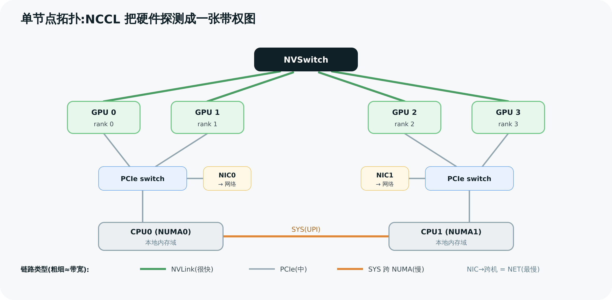
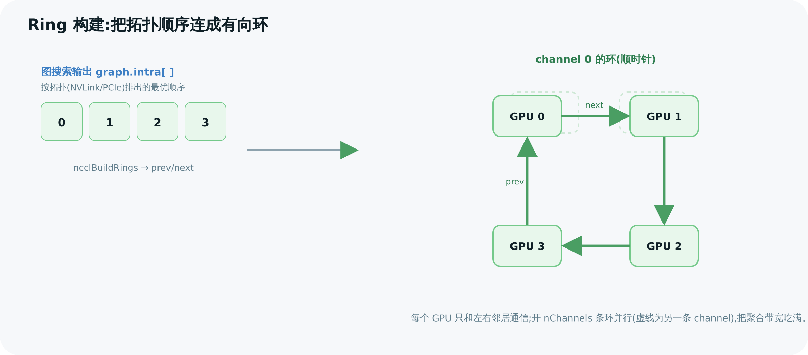

# 04 拓扑探测与图搜索

> NCCL 比通用通信库快的根因之一,是它**先搞清楚你的硬件到底怎么连的**,再据此搜出最优的通信环/树。本章拆开这套"拓扑感知"机制:NCCL 怎么把一台机器探测成一张图、怎么给任意两个 GPU 算"最短路",最后怎么搜出 ring/tree 的形状。这是 NCCL 工程上最"硬核"的一块。

---

## 1. 为什么要懂拓扑:同样 8 卡,连法天差地别

设想两台 8 卡机器:

- **机器 A(DGX 式)**:8 块 GPU 全部由 NVSwitch 全互联,任意两卡之间都有满速 NVLink。
- **机器 B(PCIe 式)**:8 块 GPU 分成两组挂在两颗 CPU 下,组内走 PCIe,跨组要过 CPU 的 UPI/QPI。

同样跑 AllReduce,最优策略完全不同:A 上可以排任意环都满速;B 上必须**避免**让数据频繁跨 CPU,环要顺着 PCIe 拓扑排。**NCCL 不能写死一种策略,它必须先探测、再决策。** 这就是 `graph/` 这个目录存在的理由。

整条流水线(对应 [第 03 章](<./03-init-and-bootstrap.md>) initTransportsRank 内部):

```
探测 → 算路径 → 裁剪 → 搜索 → 连成环/树
ncclTopoGetSystem → ncclTopoComputePaths → ncclTopoTrimSystem → ncclTopoCompute → ncclBuildRings/ncclGetDtree
```

---

## 2. 第一步:把机器探测成一张图(ncclTopoGetSystem)

`ncclTopoGetSystem`(`graph/topo.cc:1765`)把硬件探测成一张**节点 + 链路**的图(`struct ncclTopoSystem`,`topo.h:159`)。

### 2.1 节点类型(topo.h:42)

```c
#define GPU 0   #define PCI 1   #define NVS 2   // NVLink Switch
#define CPU 3   // 一个 CPU = 一个 NUMA 域
#define NIC 4   #define NET 5   // 网卡 / 网络接口
#define GIN 6   #define RMA 7   #define DEV 8   #define CXB 9
```

一台机器被建模成:若干 GPU 挂在 PCI switch 上,PCI switch 挂在 CPU(NUMA)下,GPU 之间可能有 NVLink(经 NVS),CPU 之间有 SYS 互联(UPI/Infinity Fabric),NIC 也挂在某个 PCI/CPU 下。

### 2.2 链路类型与带宽(topo.h:55)

```c
#define LINK_LOC 0   // 同卡,~5000 GB/s(其实是"不用搬")
#define LINK_NVL 1   // NVLink,18~40 GB/s(看 GPU 代)
#define LINK_C2C 3   // Grace-Hopper 那种 C2C
#define LINK_PCI 4   // PCIe Gen3 x16 ≈ 12 GB/s
#define LINK_SYS 9   // QPI/UPI/Infinity Fabric,6~40 GB/s
#define LINK_NET 10  // 100Gb 网络 ≈ 12 GB/s
```

每条边(`ncclTopoLink`,`topo.h:71`)记着 `type`、`bw`(带宽)、`remNode`(对端)。**这张带权图是后面所有决策的依据。**

### 2.3 探测从哪来:NVML + sysfs + XML

- 通过 NVML 探测 GPU(算力、是否支持 GDR)、通过 `/sys` 探测 PCI 树、NVLink 连接。
- 拓扑可序列化成 **XML**(`xml.cc`)。两个有用的环境变量:
  - `NCCL_TOPO_DUMP_FILE`(`topo.cc:1927`):把探测到的拓扑导出成 XML——**调试拓扑问题第一招**。
  - `NCCL_TOPO_FILE`(`topo.cc:1774`):直接喂一个 XML,跳过探测(容器里探测不全时常用)。



> 图解源文件:[`07-node-topology.svg`](../../_attachments/nccl/src/07-node-topology.svg)

---

## 3. 第二步:给任意两节点算"最短路"(ncclTopoComputePaths)

有了图,`ncclTopoComputePaths`(`paths.cc:721`)对每个节点做一次 **BFS**(`ncclTopoSetPaths`,`paths.cc:38`),算出它到所有其它节点的最优路径,存进 `node->paths[type][]`(`ncclTopoLinkList`)。每条路径记录:**瓶颈带宽 `bw`、跳数 `count`、以及"路径类型" `type`**。

路径类型 `PATH_*`(`include/graph.h:117`)按"从近到远"排序——这是 NCCL 选连接方式的核心标尺:

| PATH_ | 值 | 含义 | 远近 |
|-------|----|------|------|
| `PATH_LOC` | 0 | 同一块卡 | 最近 |
| `PATH_NVL` | 1 | NVLink 直连 | 很近 |
| `PATH_NVB` | 2 | 经一个中间 GPU 的 NVLink | 近 |
| `PATH_C2C` | 3 | C2C(GH 超级芯片) | 近 |
| `PATH_PIX` | 4 | 单个 PCIe 桥 | 中 |
| `PATH_PXB` | 5 | 多个 PCIe 桥(不过 Host) | 中 |
| `PATH_PXN` | 7 | 经中间 GPU 的 NVLink 再到 NIC | 中偏远 |
| `PATH_PHB` | 8 | 过 CPU/Host Bridge | 远 |
| `PATH_SYS` | 9 | 过 QPI/UPI/跨 NUMA | 远 |
| `PATH_NET` | 10 | 过网络(跨机) | 最远 |

> 💡 这张"远近表"就是 NCCL 的价值观:**能走 NVLink 绝不走 PCIe,能不过 CPU 绝不过 CPU,能不出机器绝不出机器。** 后面图搜索就是在这个偏好下找全局最优。
>
> 一个精彩的优化是 **PXN(PATH_PXN)**:当某 GPU 要发数据到一张"远在另一颗 CPU 下的网卡"时,与其自己艰难地跨 NUMA,不如先用 NVLink 把数据送给"离那张网卡近的邻居 GPU",由邻居代发。NCCL 的路径计算会主动发现并启用这种中继(`paths.cc:812` 一带)。

`ncclTopoTrimSystem`(`paths.cc:867`)随后用并查集找连通域,**把不属于本 communicator 的 GPU、用不上的 NIC 裁掉**,缩小搜索空间。

---

## 4. 第三步:搜出环/树的形状(ncclTopoCompute)

这是整章的高潮。`ncclTopoCompute`(`search.cc:1074`)对每种算法各跑一次,搜出"开几条 channel、每条 channel 上 rank 怎么排"。结果写进 `struct ncclTopoGraph`(`graph.h:170`):

| 字段 | 含义 |
|------|------|
| `pattern` | 拓扑模式(见下) |
| `nChannels` | 搜出的 channel 数 |
| `bwIntra / bwInter` | 机内 / 机间每 channel 带宽 |
| `typeIntra / typeInter` | 机内 / 机间走哪类路径(PATH_*) |
| `intra[]` | **每条 channel 内部的 rank 排列**(环/树的顺序) |
| `inter[]` | 机间的 (send, recv) NIC 配对 |

pattern 取值(`graph.h:160`):`RING(4)`、`BALANCED_TREE(1)`、`SPLIT_TREE(2)`、`TREE(3)`、`NVLS(5)`、`COLLNET_DIRECT(6)`。

### 4.1 搜索是"带预算的递归回溯"

`ncclTopoCompute` 的主循环(`search.cc:1162`)思路:

```
for 带宽档位 speed 从高到低:
    设 bwIntra = bwInter = speed
    ncclTopoSearchRec(...)        // 递归尝试在"每 channel 至少 speed 带宽"约束下排满所有 GPU
    if 找到完美解(time==-1): 收工
    if nChannels * bwInter >= 系统总带宽: 够好了,收工
    否则降一档带宽再试
```

直觉:**先贪心地要高带宽,排不出来就退而求其次**,直到找到一组能把硬件带宽吃满的 channel。递归 `ncclTopoSearchRec`(`search.cc:849`)对 RING 会要求"走一圈回到起点"(`backToNet=ngpus-1`,`search.cc:835`),对 TREE 则按树形展开。

**没接触过"回溯搜索"?用一个 4 GPU 的小例子走一遍。** 设 GPU0–3 之间部分有 NVLink(带宽 20)、部分只有 PCIe(带宽 12),要排一个环:

1. **先要高价**:从带宽档位数组(`speedArray`,`search.cc:1156` 按 GPU 代选)里取最高档,比如 20,约束变成"环上每一跳都得 ≥20"——只有 NVLink 边能用。
2. **递归试排**:从 GPU0 出发,下一跳只能挑"有 ≥20 边"的邻居,比如走到 GPU2;再从 GPU2 挑下一个……每一步都是"在剩余 GPU 里挑一个合法邻居"。
3. **走死了就回头**:如果排到 GPU3 却发现它回 GPU0 只有 PCIe(12 < 20),这条排列作废——**退回上一步换一个邻居再试**。这个"试错 + 撤销重试"就是**回溯(backtracking)**;而"带宽不够的边压根不进候选"就是**剪枝(pruning)**——提前砍掉注定失败的分支,不用真的走到头。
4. **整档降价**:所有排列都试完仍凑不出"每跳 ≥20"的环,就把档位降到 15 重来(`speedArray[++speedIndex]` 后 `goto search`,`search.cc:1246`);20 排不出来 15 也许就能排出来了——这正是伪代码里"降一档带宽再试"那行。
5. **见好就收**:除了"完美解提前收工",每轮搜索还带**时间预算**(`NCCL_SEARCH_TIMEOUT`,`search.cc:1178`),烧完就用当前最好的结果——宁可要一个 90 分的环,也不为 100 分把 init 拖慢几秒。

> 为什么不用 Dijkstra/最短路这类"多项式算法"?因为这不是找一条路,而是**找一组互不冲突、覆盖所有 GPU 的环/树**(还要同时定 channel 数),本质是组合优化,没有已知的多项式精确解法。回溯 + 剪枝 + 降档 + 超时,是工程上对 NP 难问题的标准"够用就好"打法。

> ⚙️ 这是个 NP 味道的组合搜索,NCCL 用带宽剪枝 + 时间预算 + 经验规则(优先 PCIe 顺序)把它压到可接受。`NCCL_GRAPH_FILE` 还能直接喂一个搜索结果跳过搜索(`search.cc:1111`)。

### 4.2 把搜索结果连成环(ncclBuildRings)

`ncclBuildRings`(`rings.cc:29`)把 `graph.intra[]` 里的 rank 排列,翻译成每个 rank 的 `prev/next`,并校验:每条环闭合(走一圈回到自己)、所有 rank 都在环上。这一步的产物,正是 [第 02 章](<./02-architecture-codemap.md>) `channel.ring.prev/next` 的来源。



> 图解源文件:[`08-ring-construction.svg`](../../_attachments/nccl/src/08-ring-construction.svg)

### 4.3 树的构造:double binary tree

`ncclGetBtree`(`trees.cc:32`)按二进制规则构造一棵二叉树:rank 的父/子由其二进制低位决定(`xx10` 形式做父,`xx01/xx11` 做子)。`ncclGetDtree`(`trees.cc:90`)构造**两棵互补的树**(double binary tree)——这是 Tree AllReduce 的关键,[第 06 章](<./06-tree-and-other-algos.md>)详解为什么要两棵。

---

## 5. 多 channel:为什么不止排一个环

`nChannels` 往往大于 1。原因:

1. **吃满聚合带宽**:NVSwitch/多 NVLink 的总带宽,单条环喂不满;多条环并行,把流量铺到多条物理链路。
2. **喂满 SM**:每条 channel 由 GPU 上一组线程块(block)驱动,多 channel 才能让足够多的 SM 参与搬运。
3. **不同 channel 可走不同环**(`sameChannels=0` 时),进一步均衡负载。

代价是每条 channel 要占 buffer 和 SM,所以 `nChannels` 由搜索在"带宽收益 vs 资源开销"间定夺,也可用 `NCCL_MIN/MAX_NCHANNELS` 干预(第 11 章)。

---

> 🎯 **面试官会追问**:
> - **NCCL 怎么知道我的 GPU 是怎么连的?** —— NVML + `/sys` 探测,建成带权拓扑图(节点 GPU/PCI/CPU/NIC,边 NVL/PCI/SYS/NET 各带带宽);可用 `NCCL_TOPO_DUMP_FILE` 导出查看。
> - **PATH_NVL 和 PATH_PHB 哪个好?为什么?** —— NVL 好。PATH_* 值越小越近越快;PHB 要过 CPU host bridge,带宽低、延迟高。NCCL 一切搜索都偏好小 PATH 值。
> - **PXN 是什么优化?** —— 当 GPU 离目标网卡要跨 NUMA 时,先用 NVLink 把数据交给"离网卡近的邻居 GPU"代发,避免昂贵的跨 CPU 路径。
> - **为什么要开多条 channel?** —— 单环喂不满 NVSwitch 聚合带宽、也用不满 SM;多 channel 并行把带宽和算力都吃满。
> - **拓扑搜索是穷举吗?** —— 是带剪枝的递归回溯:按带宽档从高到低试,配合时间预算和经验顺序,找到能吃满带宽的 channel 组合即停。
> - **容器里 NCCL 性能突然变差,先查什么?** —— 拓扑探测可能不全(看不到 NVLink)。`NCCL_TOPO_DUMP_FILE` 导出对比,必要时用 `NCCL_TOPO_FILE` 喂正确拓扑。

---

**上一章** ← [03 通信器初始化与 Bootstrap](<./03-init-and-bootstrap.md>)　|　**下一章** → [05 Ring AllReduce 算法深入](<./05-ring-allreduce.md>)
