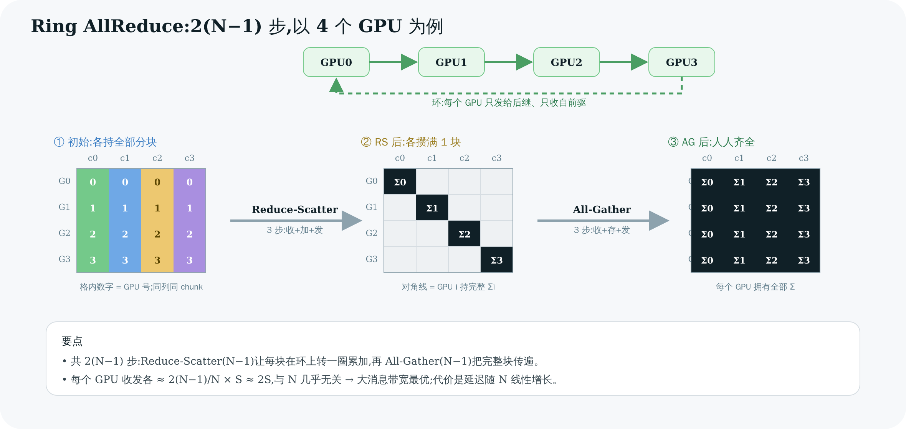

# 05 Ring AllReduce 算法深入 ⭐

> 这是全教程**最核心的一章**。Ring AllReduce 是 NCCL 的招牌算法,也是面试最爱问的点。读完你要能在白板上画出 4 个 GPU 的环、讲清"为什么是 2(N−1) 步""为什么带宽和 GPU 数几乎无关",并指出它在 `all_reduce.h` 里对应哪几行代码。

---

## 1. 核心思想:别让任何一个 GPU 成为瓶颈

朴素的 AllReduce 怎么做?让 rank0 收集所有人的数据、求和、再发回给所有人。问题:**rank0 的网卡/链路成了瓶颈**,要进出 (N−1)×S 的流量,其它 N−1 个 GPU 的带宽全闲着。

Ring AllReduce 的洞见:**把数据切成 N 块,让 N 个 GPU 排成环,每个 GPU 同时只和它的左右邻居通信。** 这样:

- 每条链路(GPU i → GPU i+1)在每一步都在传输,**没有空闲、没有热点**;
- 每个 GPU 同时收(从前驱)和发(给后继),**双工打满**。

利用第 01 章的恒等式 **AllReduce = ReduceScatter + AllGather**,Ring AllReduce 分两个阶段,每阶段恰好 N−1 步,共 **2(N−1) 步**。

---

## 2. 分步拆解:4 个 GPU 的完整过程

设 4 个 GPU 排成环 `0 → 1 → 2 → 3 → 0`。每个 GPU 把自己的数据切成 4 块(chunk 0/1/2/3)。记 `GPU i 的 chunk j` 为 `i:j`。



> 图解源文件:[`09-ring-allreduce.svg`](../../_attachments/nccl/src/09-ring-allreduce.svg)

### 阶段一:Reduce-Scatter(N−1 = 3 步)

**目标:让 GPU i 最终攒出"所有 GPU 的 chunk i 之和"(记 Σi)。**

每一步,每个 GPU 把"手里某一块"发给后继,后继**加到自己对应的块上**,再继续往下传。块在环上转一圈,边转边累加:

- **第 1 步**:GPU i 把自己的 chunk `(i−1)` 发给后继。(代码:`directSend`,送出原始块,还没东西可加)
- **第 2、3 步**:GPU i 收到前驱传来的某块,**加到自己同号的块上,再发给后继**。(代码:`directRecvReduceDirectSend`)

3 步之后,**每个 GPU 恰好攒满一块完整的和**:GPU 0 手里有 Σ0,GPU 1 有 Σ1,GPU 2 有 Σ2,GPU 3 有 Σ3。注意此刻**没有任何一个 GPU 拥有全部结果**——结果被"分散"在 4 个 GPU 上,各持 1/4。这就是 "scatter" 的含义。

> 代码里完成这"最后一块"的是 `directRecvReduceCopyDirectSend(postOp=true)`(`all_reduce.h:64`):它收下最后一份贡献、加完得到本 GPU 的最终块、**存进输出 buffer**(copy),并顺手把这块发给后继——这一发,正是下一阶段 all-gather 的第一步。`postOp=true` 在此做平均(`ncclAvg` 的除法)。

### 阶段二:All-Gather(N−1 = 3 步)

**目标:把"每个 GPU 手里那块完整的和"复制给所有其他 GPU。**

现在每个 GPU 有一块完整结果,只要再让这些完整块在环上转一圈,人人就都齐了:

- **第 4、5 步**:GPU i 收到前驱传来的"某块完整结果",**存到本地对应位置,并转发给后继**。(代码:`directRecvCopyDirectSend`,注意——**只复制、不再 reduce**)
- **第 6 步**:收下最后一块完整结果,**只存不发**(后继已经有了)。(代码:`directRecv`)

3 步之后,**每个 GPU 都拥有 Σ0、Σ1、Σ2、Σ3 全部四块**——AllReduce 完成。

### 一图对账:7 次 prims 调用 = 2(N−1) 步

`runRing`(`all_reduce.h:14`)对 N=4 实际发出的 primitive 调用序列:

| 调用 | 代码行 | 阶段 | 作用 |
|------|--------|------|------|
| `directSend` | :47 | RS 起 | 发原始块(只发) |
| `directRecvReduceDirectSend` ×(N−2) | :55 | RS | 收+加+发 |
| `directRecvReduceCopyDirectSend` | :64 | RS→AG 边界 | 收+加+存+发(本块完成) |
| `directRecvCopyDirectSend` ×(N−2) | :72 | AG | 收+存+发(不加) |
| `directRecv` | :81 | AG 末 | 收+存(只收) |

发送次数 = 1+(N−2)+1+(N−2) = **2(N−1)**;接收次数同样 = **2(N−1)**。首个"只发"与末个"只收"刚好配平——这就是流水线满载、双工无空闲的体现。

---

## 3. 为什么带宽最优:和 GPU 数几乎无关

这是面试的"题眼"。算一笔账(总数据量 S,N 个 GPU):

- 每块大小 = S/N。
- Reduce-scatter:每个 GPU 发送 N−1 块 = (N−1)/N × S。
- All-gather:每个 GPU 再发送 N−1 块 = (N−1)/N × S。
- **每个 GPU 总发送量 = 2(N−1)/N × S ≈ 2S(N 大时)。**

关键结论:**当 N 增大,每个 GPU 的通信量趋于常数 2S,不随 N 线性增长。** 而朴素方案里 rank0 要扛 (N−1)×S,随 N 线性恶化。

再看时间:总线带宽 B 下,完成时间 ≈ `2(N−1)/N × S / B`。N 很大时趋于 `2S/B`——**逼近"把数据收发两遍"的理论下界**。Ring AllReduce 之所以是大消息的默认选择,就在于此。

> ⚠️ 代价是**延迟随 N 线性增长**(要 2(N−1) 步,每步至少一个链路延迟)。所以小消息、大规模时,Ring 的延迟劣势暴露,NCCL 会改用 **Tree**(延迟 O(log N),[第 06 章](<./06-tree-and-other-algos.md>))。"大消息用 Ring、小消息用 Tree"是 NCCL 选算法的基本盘(第 11 章)。

---

## 4. chunk / step / slice:流水线是怎么叠起来的

上面讲的是"逻辑步骤"。实际为了打满带宽,NCCL 把每一步再切成更细的流水线单元(`collectives.h:19`):

```c
#define ALLREDUCE_SLICESTEPS (NCCL_STEPS/4)   // = 2
#define ALLREDUCE_CHUNKSTEPS (NCCL_STEPS/2)   // = 4
// NCCL_STEPS = 8  (device.h:26) —— FIFO 深度
```

层层包含关系:

```
一次 AllReduce 的数据
  └─ 切成 nranks 个 chunk(环上每块)
       └─ 每个 chunk 按 ProtoSimple<2,2> 再切成 slice(SlicePerChunk=2)
            └─ slice 通过深度 NCCL_STEPS=8 的 FIFO 流水发送
```

**为什么要 slice + FIFO?** 因为"收→加→发"如果整块串行,GPU 会在等数据时干等。切成小 slice 后,**发送 slice 0 的同时就能接收 slice 1、计算 slice 2**——经典的软件流水线,把链路、SM 计算、收发完全重叠起来。FIFO 深度 8 给了足够的"在途"slice 让流水不断流。第 09 章会看到这套 FIFO 在 kernel 里怎么用 head/tail 指针实现。

---

## 5. 代码锚点:prims 收发原语的语义

Ring 算法之所以能用寥寥几行写完,是因为重活都封装在 `Primitives`(`prims_simple.h`)里。本章用到的几个(`directRecvReduceCopyDirectSend` 等的语义):

| primitive | 语义 | 谁用 |
|-----------|------|------|
| `directSend` | 把本地块发给后继 | RS 第 1 步 |
| `directRecvReduceDirectSend` | 从前驱收 → 加到本地 → 发给后继 | RS 中间步 |
| `directRecvReduceCopyDirectSend` | 收 → 加 → **存输出** → 发 | RS/AG 边界 |
| `directRecvCopyDirectSend` | 收 → 存 → 发(**不加**) | AG 中间步 |
| `directRecv` | 收 → 存(不发) | AG 末步 |

`Primitives<T, RedOp, FanSymmetric<1>, 1, Proto, 0>`(`all_reduce.h:31`)里的 `FanSymmetric<1>` 正是"1 个前驱 + 1 个后继"的环形扇入扇出——和 Tree 的 `FanAsymmetric<n,1>`(多孩子、1 父)形成对照。`directXxx` 里的 "direct" 指**直接读写对端显存**(P2P 可达时),省掉中转 buffer——这是 NVLink 场景的零拷贝优化,详见第 07、09 章。

---

> 🎯 **面试官会追问**:
> - **Ring AllReduce 为什么是 2(N−1) 步?** —— ReduceScatter 让一块在环上转一圈累加需 N−1 步,AllGather 让完整块再转一圈需 N−1 步,共 2(N−1)。
> - **为什么通信量和 N 几乎无关?** —— 每个 GPU 收发各 (N−1)/N×S ≈ S,合计 ≈2S,N 增大趋于常数;而朴素中心化方案 rank0 要扛 (N−1)×S 线性恶化。
> - **Reduce-Scatter 结束时,数据在哪?** —— 分散在 N 个 GPU 上,每个 GPU 只持有"自己负责那一块的完整和",没人有全部。这正是 AllGather 接力的前提。
> - **Ring 的缺点是什么?何时不该用?** —— 延迟随 N 线性(2(N−1) 步)。小消息 / 大规模下延迟主导,改用 Tree(O(log N) 延迟)。
> - **slice 和 FIFO 解决什么?** —— 把"收-加-发"切成小单元做软件流水线,让链路传输与 SM 计算重叠,打满带宽;NCCL_STEPS=8 是流水线深度。
> - **`directRecvReduceCopyDirectSend` 那一步为什么特殊?** —— 它是 RS 与 AG 的接缝:收下最后贡献得到本 GPU 的最终块、存进输出(并按需做平均),同时把它作为 AllGather 第一发送出去。
> - **`ncclAvg` 的除法在哪做?** —— 在 reduce-scatter 收尾那步的 `postOp=true` 里,对已经求和完的块做除以 N。

---

**上一章** ← [04 拓扑探测与图搜索](<./04-topology-and-graph-search.md>)　|　**下一章** → [06 Tree 及其他算法](<./06-tree-and-other-algos.md>)
