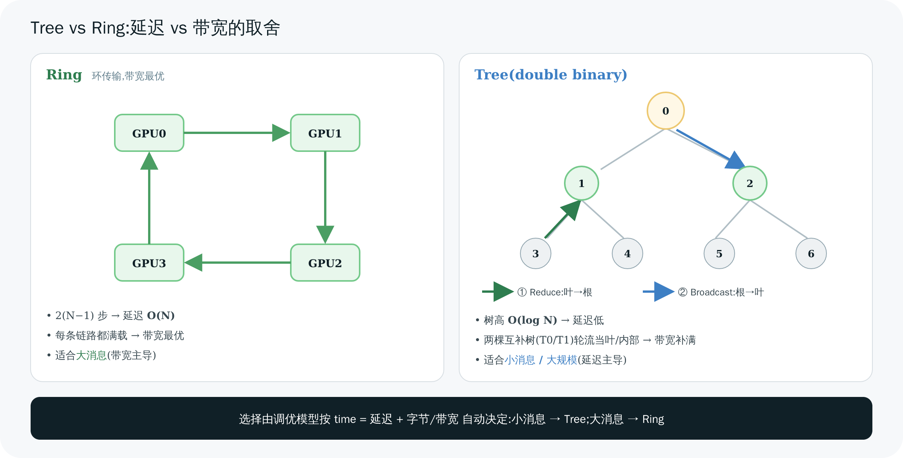

# 06 Tree 及其他算法:延迟 vs 带宽

> 上一章的 Ring 带宽最优,但延迟随 N 线性增长。本章讲 NCCL 的另一张王牌——**double binary tree**(延迟 O(log N)),解释它怎么用"两棵树"把带宽利用率补回来,再俯瞰 CollNet / NVLS,最后讲清 NCCL 是**怎么自动在这些算法/协议之间选**的(调优模型)。

---

## 1. 为什么需要 Tree:Ring 的延迟软肋

回忆 Ring AllReduce 要 2(N−1) 步。当 N=256(32 机 × 8 卡)时,就是 510 步——每步至少一个链路延迟,小消息时**延迟主导**,Ring 就慢了。

Tree 的思路:**像归约一棵树那样,先从叶子往根逐层求和(reduce),再从根往叶子逐层广播(broadcast)。** 树高是 log₂N,所以延迟是 **O(log N)**——N=256 时只有约 2×8=16 步,远少于 510。

代价是:朴素的一棵二叉树,带宽利用率只有约一半(见下节)。NCCL 用 **double binary tree** 解决这个问题。

---

## 2. Double Binary Tree:用两棵树补满带宽

### 2.1 一棵二叉树的浪费

`ncclGetBtree`(`trees.cc:32`)用 rank 的二进制位构造一棵二叉树:找到 rank 最低的非零位来定父/子。结果是一棵"内部节点和叶子交替"的树,root=0。

问题在于:**叶子节点在 reduce pass(往上)里只发不收,在 broadcast pass(往下)里只收不发。** 对一棵 N 节点的二叉树,约一半是叶子。这些叶子的"另一半"双工带宽被浪费了。

### 2.2 两棵互补树

`ncclGetDtree`(`trees.cc:90`)构造**两棵互补的二叉树** T0 和 T1:

- N 为偶数:T1 是 T0 的**镜像**(rank ↔ N−1−rank);
- N 为奇数:T1 是 T0 的**移位**(rank ↔ (rank−1+N)%N)。

关键性质:**一个 rank 在 T0 里若是叶子,在 T1 里就是内部节点(反之亦然)。** 于是让一半数据走 T0、另一半走 T1,每个 rank 在两棵树里的角色互补——**收发都被用满,带宽利用率接近 100%**,同时保住 O(log N) 的延迟。这就是 "double binary tree" 的精髓。

> 💡 这是 NCCL 借鉴自 MPI 文献(Sanders et al.)的经典技巧。一句话记住:**一棵树省延迟但浪费一半带宽,两棵互补树把带宽也补满。**

### 2.3 Tree AllReduce 的 device 实现:两个 pass

`all_reduce.h` 的 tree 实现(`runTreeUpDown`,:86;主路径 `runTreeSplit`,:146)分两个 pass,用**非对称扇入扇出** `FanAsymmetric`:

| Pass | 方向 | Primitives 模板 | 角色 |
|------|------|------------------|------|
| Reduce(up) | 叶 → 根 | `FanAsymmetric<NCCL_MAX_TREE_ARITY, 1>`(:97) | 收至多 3 个孩子、发给 1 个父 |
| Broadcast(down) | 根 → 叶 | `FanAsymmetric<1, NCCL_MAX_TREE_ARITY>`(:121) | 收 1 个父、发给至多 3 个孩子 |

(对照 Ring 的 `FanSymmetric<1>`:1 前驱 + 1 后继。)`NCCL_MAX_TREE_ARITY=3`(`device.h`)。根节点 `tree->up==-1` 只收不发,叶子 `tree->down[0]==-1` 只发不收。

---

## 3. Tree vs Ring:一张对照表

NCCL 的延迟模型(`tuning.cc:289` 起)对两者的估算:

| | **Ring** | **Tree(double binary)** |
|---|---|---|
| 步数/延迟 | 2(N−1),**O(N)** | **O(log N)** |
| 带宽利用 | 最优(多条独立环) | 接近最优(两棵互补树) |
| 延迟公式(多机) | `(nsteps−nInter)·intraLat + nInter·interLat`(:412) | `2·((ppn−1)·intraLat + log₂(nNodes)·interLat)`(:416) |
| **擅长** | **大消息**(带宽主导) | **小消息 / 大规模**(延迟主导) |



> 图解源文件:[`10-tree-vs-ring.svg`](../../_attachments/nccl/src/10-tree-vs-ring.svg)

> 🎯 一句话:**消息小、机器多 → Tree;消息大 → Ring。** 而"多小算小、多大算大"由下面的调优模型按真实带宽/延迟参数算出来,不是拍脑袋。

---

## 4. CollNet 与 NVLS:把归约下放到硬件

Ring/Tree 都是"GPU 自己边搬边算"。还有两类算法**把归约 offload 给专用硬件**,GPU 只管发:

- **CollNet**(`transport/coll_net.cc`,结构 `ncclDirect` `device.h:200`):把归约下放到**网络交换机**(InfiniBand SHARP)。GPU 把数据发上网,交换机在网络里完成求和,再发回。分 scatter → reduce(在网络) → gather 三段(`all_reduce.h:248`)。适合多机、有 SHARP 的 IB 网络。
- **NVLS**(NVLink SHARP,`transport/nvls.cc`,结构 `ncclNvls` `device.h:215`):用 **NVSwitch 的硬件 multicast + reduce**。GPU 把数据写进 NVLS multicast 地址,NVSwitch 硬件完成归约。延迟极低(`tuning.cc:425`:几乎只有一个 intraLat)。需要 NVSwitch + CUDA ≥ 12.1(`nvls.cc:19`)。

这两者把"算"从 GPU SM 卸到交换机芯片,省了 GPU 算力、也少搬一趟数据。它们和 Ring/Tree 一样,都只是 `ncclTopoCompute` 搜出的一种 graph(第 04 章),能不能用取决于硬件。

---

## 5. NCCL 怎么自动选算法和协议(调优模型)

NCCL 有 **7 种算法 × 3 种协议** 的组合(`nccl_tuner.h`):

```c
// 算法 NCCL_ALGO_*
TREE=0  RING=1  COLLNET_DIRECT=2  COLLNET_CHAIN=3  NVLS=4  NVLS_TREE=5  PAT=6   // NCCL_NUM_ALGORITHMS=7
// 协议 NCCL_PROTO_*
LL=0    LL128=1    SIMPLE=2                                                      // NCCL_NUM_PROTOCOLS=3
```

(协议 LL/LL128/Simple 是"怎么做收发同步"的三种方式,延迟/带宽各异,[第 09 章](<./09-device-kernels.md>)详解。)

### 5.1 init 时建一张成本表

`ncclTopoTuneModel`(`tuning.cc:243`)在初始化时,为**每个 (集合操作, 算法, 协议)** 三元组,根据探测到的带宽/延迟,预估出 `latencies[c][a][p]` 和 `bandwidths[c][a][p]`。

### 5.2 enqueue 时查表选最快

每次调用,`ncclTopoGetAlgoTime`(`tuning.cc:630`)按消息大小算出每个组合的预计耗时:

```
time = latency × numPipeOps + nBytes / bandwidth
```

`topoGetAlgoInfo`(`enqueue.cc:2028`)遍历所有组合,**选 time 最小的那个**:

```c
float minTime = FLT_MAX;
for (a in algorithms) for (p in protocols)
    if (table[a][p] >= 0 && table[a][p] < minTime) { algorithm=a; protocol=p; minTime=table[a][p]; }
```

直觉:`time = 延迟 + 数据量/带宽`。**小消息**里"延迟"项主导 → 选低延迟的 Tree/LL;**大消息**里"数据量/带宽"主导 → 选高带宽的 Ring/Simple。NCCL 就是用这个简单模型自动切换的。

### 5.3 手动干预:NCCL_ALGO / NCCL_PROTO

想强制?用环境变量(`tuning.cc:453`,支持 `^` 取反和 `func:` 前缀):

```bash
NCCL_ALGO=Ring                 # 全局只用 Ring
NCCL_PROTO=^LL128              # 禁用 LL128
NCCL_ALGO=tree;allreduce:ring  # 默认 Tree,但 AllReduce 用 Ring
```

调优排障常用,但**一般别乱设**——NCCL 的自动选择在大多数情况下已经接近最优。详见 [第 11 章](<./11-tuning-and-perf.md>)。

---

> 🎯 **面试官会追问**:
> - **Tree 为什么比 Ring 延迟低?** —— Tree 高度 O(log N),reduce+broadcast 各 log N 层;Ring 要绕环 2(N−1) 步,O(N)。大规模小消息差距悬殊。
> - **一棵二叉树有什么问题?double binary tree 怎么解决?** —— 叶子节点单向空闲,带宽利用约半;两棵互补树让每个 rank 在一棵是叶、另一棵是内部,数据各走一半,收发都用满。
> - **NCCL 怎么决定用 Ring 还是 Tree?** —— 调优模型:init 建 (coll,algo,proto) 的延迟/带宽成本表,enqueue 时按 `time=延迟+字节/带宽` 选最小;小消息偏 Tree/LL,大消息偏 Ring/Simple。
> - **CollNet/NVLS 和 Ring/Tree 本质区别?** —— Ring/Tree 是 GPU 自己边搬边算;CollNet 把归约下放到 IB 交换机(SHARP),NVLS 下放到 NVSwitch 硬件。省 GPU 算力、少搬数据,但依赖特定硬件。
> - **`FanSymmetric<1>` 和 `FanAsymmetric<3,1>` 区别?** —— 前者是 Ring 的 1 进 1 出;后者是 Tree reduce 的至多 3 孩子进、1 父出(广播 pass 反过来 1 进 3 出)。
> - **能强制算法吗?何时该强制?** —— `NCCL_ALGO`/`NCCL_PROTO` 可强制。仅在排障或确知模型选错时用;通常信任自动选择。

---

**上一章** ← [05 Ring AllReduce 算法深入](<./05-ring-allreduce.md>)　|　**下一章** → [07 Transport 传输层](<./07-transport.md>)
