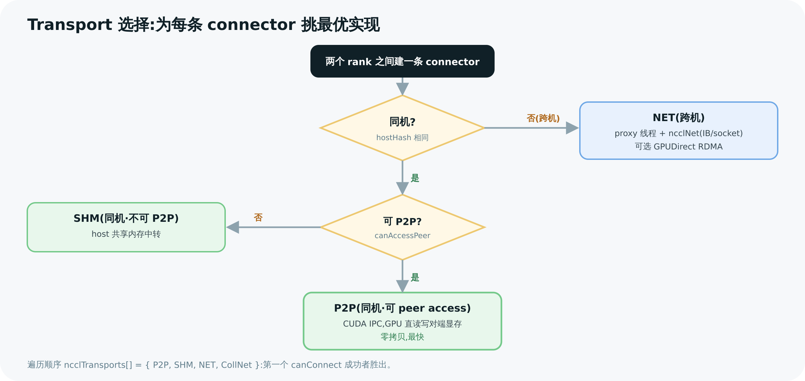

# 07 Transport 传输层:P2P / SHM / NET

> 前几章讲的"环/树"是**逻辑拓扑**——决定数据按什么顺序流。本章讲**物理实现**:两个 rank 之间的一条连接(connector),数据到底怎么从 A 的显存到 B 的显存。NCCL 有三种 transport(P2P / SHM / NET),它会按一套固定优先级,为每条连接挑出能用的最快那种。

---

## 1. 统一抽象:ncclTransport 接口

每种传输方式都实现同一个接口 `struct ncclTransport`(`transport.h:136`):

```c
struct ncclTransport {
  const char name[8];                                    // "P2P" / "SHM" / "NET"
  ncclResult_t (*canConnect)(int* ok, ...);              // 这两个 rank 能用我吗?
  struct ncclTransportComm send;                         // 发送侧:setup/connect/proxyProgress...
  struct ncclTransportComm recv;                         // 接收侧
};
```

`ncclTransportComm`(`transport.h:117`)里是一组函数指针:`setup`(分配资源)、`connect`(建连)、`proxyProgress`(网络后台推进)等。**第 02 章那个 connector 里的 `transportComm` 指针,就指向这里的 send 或 recv。**

NCCL 注册了一个**有序数组**(`transport.cc:15`):

```c
struct ncclTransport* ncclTransports[] = {
  &p2pTransport,    // 0  最优先
  &shmTransport,    // 1
  &netTransport,    // 2
  &collNetTransport // 3
};
```

---

## 2. 选择逻辑:按优先级试,谁先 canConnect 谁上

`selectTransport`(`transport.cc:20`)对每条连接,**按数组顺序**遍历,第一个 `canConnect` 返回 true 的就被选中:

```c
for (int t = 0; t < NTRANSPORTS; t++) {
  transport->canConnect(&ret, comm, graph, myInfo, peerInfo);
  if (ret) {                          // 这种 transport 可用
    connector->transportComm = (send ? &transport->send : &transport->recv);
    transportComm->setup(...);        // 立刻 setup 这条连接
    return ncclSuccess;
  }
}
```

因为顺序是 P2P → SHM → NET,等价于一棵决策树:**能直连就直连,不能直连就走共享内存,跨机才走网络。**



> 图解源文件:[`11-transport-decision.svg`](../../_attachments/nccl/src/11-transport-decision.svg)

---

## 3. P2P:同机直连,GPU 读写对端显存

**何时用**:同机(hostHash 相同)且两 GPU 能直接 peer access(NVLink,或可 P2P 的 PCIe)。`p2pCanConnect`(`p2p.cc:130`)查拓扑(`ncclTopoCheckP2p`)+ `cudaDeviceCanAccessPeer`。

**怎么实现**:用 **CUDA IPC** 把对端的显存 buffer 映射进本进程地址空间——

```
p2pSendConnect (p2p.cc:536) → p2pMap (:542)
  → cuMemImportFromShareableHandle + cuMemMap   (CUDA 11.3+ cuMem API,:296)
  或 cudaIpcOpenMemHandle                         (legacy IPC,:318)
```

映射好之后,**GPU kernel 可以直接读/写对端 GPU 的显存**——这就是第 05 章 `directSend`/`directRecv` 里的 "direct":零拷贝,数据从 GPU A 显存经 NVLink 直接落到 GPU B 显存,不经任何中转 buffer、不经 CPU。这是 NCCL 在 NVLink 上跑满带宽的根本。

> 💡 若两 GPU 之间隔着一个中间 GPU(NVLink 不直连但可经一跳),P2P 会退化成 **P2P_INTERMEDIATE**,借中间 GPU 中转——仍比走 CPU 强。

---

## 4. SHM:同机不能直连,借 host 共享内存中转

**何时用**:同机,但两 GPU **不能** P2P(典型:挂在不同 NUMA 下、跨 CPU 的 PCIe,peer access 不可达)。`shmCanConnect`(`shm.cc:61`)。

**怎么实现**:在 host 开一块 **pinned 共享内存**做 staging:

```
GPU A ──写──> host 共享内存(/dev/shm) <──读── GPU B
```

发送方 GPU 把数据拷到共享内存,接收方 GPU 从共享内存读。`shmSendConnect`(`shm.cc:153`)用 `ncclShmImportShareableBuffer` 把对端的 shm 段映射过来,head/tail 指针做流控。这条路要过 host 内存,比 P2P 慢,但比"绕一大圈过 CPU 的 P2P"在某些拓扑下更稳。

> ⚠️ 常见误解:"SHM 走 host 内存,所以要 proxy 线程帮忙搬"。**不对**。共享内存段映射好之后,GPU kernel 通过映射进自己地址空间的指针**直接读写**它(legacy 路径用 `cudaHostRegister + cudaHostGetDevicePointer`,`os/linux.cc:829`),和 P2P 一样不需要任何 CPU 线程站在数据通路上——v2.30.7 里 `shmTransport` 注册的 `proxyProgress` 槽位是 `NULL`(`shm.cc:470-471`,对照 `transport.h:117-129` 的字段顺序),proxy 只在**建连时**替它分配 host 共享内存资源(`shmSendProxySetup`,`shm.cc:245`),数据面完全不经 proxy。真正让 proxy 持续推进数据的只有 NET(第 10 章)。

---

## 5. NET:跨机走网络,proxy 线程登场

**何时用**:跨机(hostHash 不同)。`canConnect`(`net.cc:161`)基本总能成(只要有网卡)。这是最远的一档(PATH_NET)。

**为什么需要 proxy 线程?** 这是本章和[第 10 章](<./10-proxy-and-net-progress.md>)的衔接点:**GPU kernel 不能直接调用 InfiniBand verbs 或 socket**(那是 host 侧的系统调用)。于是 NCCL 引入 **proxy 线程**(CPU)做中介:

```
发送端:
  GPU kernel 把数据写进 FIFO buffer,更新 tail 指针
        │
  proxy 线程(sendProxyProgress, net.cc:1304)轮询 tail,发现有数据
        │
  调 ncclNet->isend()  → IB verbs / socket 把数据发出去  (net.cc:1414)
        │
  ncclNet->test() 轮询发送完成,推进 head 指针            (net.cc:1436)

接收端:
  proxy 线程(recvProxyProgress, net.cc:1470)调 ncclNet->irecv() 收包 (net.cc:1590)
        │
  收完写进 buffer、更新指针,通知 GPU kernel 数据到了
```

所以跨机通信是 **GPU(算)↔ FIFO ↔ proxy(收发网络)↔ 网卡 ↔ ... 对端** 的协作。proxy 把"GPU 不会做的网络 I/O"接管过去。

**GPUDirect RDMA(GDR)**:开启后(`net.cc` 的 `useGdr`),**网卡直接 DMA GPU 显存**,数据连 host 内存都不经过(`gdcSync`/`gdrDesc` 做同步)。这是跨机高性能的关键——否则要 GPU→host→网卡多拷一趟。

---

## 6. 三种传输一览

| | P2P | SHM | NET |
|---|---|---|---|
| 何时用 | 同机 + 可 peer access | 同机 + 不可 P2P | 跨机 |
| 关键判据 | `cudaDeviceCanAccessPeer` | 同机 + 共享 /dev/shm | hostHash 不同 |
| 数据路径 | GPU→GPU(零拷贝) | GPU→host shm→GPU | GPU→网卡→网络→GPU |
| 数据面需要 proxy? | 否(kernel 直连) | 否(kernel 直接读写映射好的 shm) | 是(proxy 收发网络包) |
| GDR | — | — | 支持(网卡直 DMA 显存) |
| 注册处 | `p2p.cc:1466` | `shm.cc:467` | `net.cc:2085` |

> 这张表正是第 02 章 connector → transportComm 的三种主力实现(第四种 collNetTransport 把归约下放给网络硬件,见第 06 章)。同一个 Ring/Tree 逻辑,落到不同 rank 对之间,可能各走不同 transport:机内 NVLink 走 P2P、跨机那一跳走 NET。**NCCL 自动为每条边选最优**,这就是它"拓扑感知"在传输层的体现。

---

> 🎯 **面试官会追问**:
> - **NCCL 怎么决定两个 GPU 之间走哪种 transport?** —— 按固定优先级 P2P→SHM→NET 遍历,第一个 `canConnect` 成功的胜出:能直连用 P2P、同机不能直连用 SHM、跨机用 NET。
> - **P2P 的零拷贝是怎么做到的?** —— CUDA IPC(`cuMemMap`/`cudaIpcOpenMemHandle`)把对端显存映射进来,kernel 直接经 NVLink 读写对端显存,不经中转 buffer、不经 CPU。
> - **跨机为什么要 proxy 线程,不能 kernel 直接发?** —— GPU kernel 调不了 IB verbs/socket(host 系统调用);kernel 把数据放 FIFO,proxy(CPU)轮询后调 `ncclNet->isend/irecv` 收发。
> - **GPUDirect RDMA 省了什么?** —— 省掉 GPU→host→网卡的额外拷贝,网卡直接 DMA 显存,跨机带宽/延迟大幅改善。
> - **同一次 AllReduce 会混用多种 transport 吗?** —— 会。环/树的不同边落在不同 rank 对上,机内走 P2P、跨机那条走 NET,各取最优。
> - **SHM 比 P2P 慢,为什么还保留?** —— 有些拓扑下两 GPU 无法 peer access(跨 NUMA PCIe),SHM 的 host 中转比强行绕远的 P2P 更可靠。

---

**上一章** ← [06 Tree 及其他算法](<./06-tree-and-other-algos.md>)　|　**下一章** → [08 Enqueue 与 Kernel 启动](<./08-enqueue-and-launch.md>)
