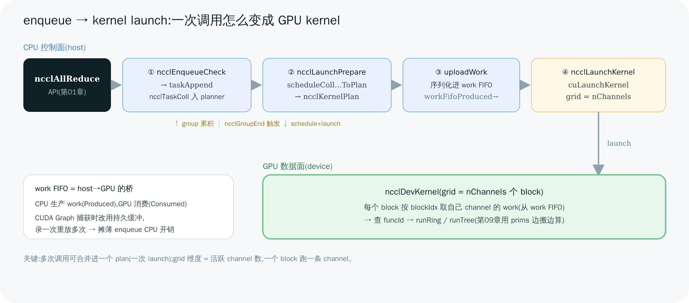

# 08 Enqueue 与 Kernel 启动

> [第 01 章](<./01-concepts-and-api.md>)说过,所有集合 API 都收敛到 `ncclEnqueueCheck`。本章把这道"总闸门"之后的控制面流程走完:一次调用怎么变成一个 **task**、多个 task 怎么 schedule 成 **kernel plan**、plan 怎么序列化进 **work FIFO**、最后怎么 `cuLaunchKernel` 把活儿交给 GPU。再讲清 **CUDA Graph** 为什么能把这套 CPU 开销摊薄。

---

## 1. 全景:四个阶段

从 API 到 GPU kernel 启动,控制面分四步(都在 `enqueue.cc` / `group.cc`):

```
① 累积 task   ncclEnqueueCheck → taskAppend → ncclTaskColl/ncclTaskP2p 排进 planner
② 生成 plan   ncclGroupEnd → ncclLaunchPrepare → scheduleColl/P2pTasksToPlan → ncclKernelPlan
③ 上传 work   uploadWork → 序列化进 work FIFO(host)→ 拷到 device
④ 启动 kernel ncclLaunchKernel → cuLaunchKernel(grid = nChannels)
```



> 图解源文件:[`13-enqueue-dataflow.svg`](../../_attachments/nccl/src/13-enqueue-dataflow.svg)

---

## 2. 阶段①:把一次调用变成 task

`ncclEnqueueCheck`(`enqueue.cc:3124`)做两件事:`ArgsCheck` 校验参数,然后 `taskAppend`(`enqueue.cc:3014`)把这次调用**分类并入队**:

- 集合操作 → `collTaskAppend`(`enqueue.cc:2690`):造一个 `ncclTaskColl`,插进 `planner.collSorter`(**按流量大小降序排**,大的优先)。
- 点对点 → `p2pTaskAppend`:造 `ncclTaskP2p`,插进 `planner.peers[rank]` 的 send/recv 队列。

注意:**此时还没启动任何 kernel**,只是把任务攒在 `ncclKernelPlanner`(`comm.h:429`)里。这正是 [第 01 章](<./01-concepts-and-api.md>) group call 的意义——`ncclGroupStart/End` 之间的多次调用,全攒进 planner,到 `ncclGroupEnd` 才一起处理。单次调用则有个隐式的 group 包装。

---

## 3. 阶段②:task schedule 成 kernel plan

`ncclGroupEndInternal`(`group.cc:766`)在 group 结束时触发 `groupLaunch` → `ncclLaunchPrepare`(`enqueue.cc:1568`),把攒下的 task 编排成一个或多个 `ncclKernelPlan`:

- `scheduleCollTasksToPlan`(`enqueue.cc:576`):为每个集合 task,**算出每条 channel 各做多少**,造出 device 侧的 `ncclDevWorkColl`,通过 `ncclAddWorkBatchToPlan` 追加成 batch。
- `scheduleP2pTasksToPlan`(`enqueue.cc:1130`):把 send/recv 配对,造 `ncclDevWorkP2p`。
- `finishPlan`(`enqueue.cc:203`):填好 `ncclDevKernelArgs`(含 `channelMask` = 哪些 channel 参与)、决定 work 存哪(见下),把 plan 入队。

一个 plan = 一次 kernel 启动要做的全部 work。它知道:用哪些 channel、每条 channel 一串什么 work、kernel 函数是哪个(按算法/协议从 `ncclDevFuncTable` 选,第 06、09 章)。

> 💡 "按流量降序排 + 打包进同一个 plan" 是 NCCL 减少 launch 次数的关键:能合并的集合操作合并成一次 kernel 启动,而不是一个调用启动一次 kernel。

---

## 4. 阶段③:work FIFO——host 怎么把 work 递给 GPU

GPU kernel 怎么知道要做什么?靠一块 **work FIFO**(`comm.h:659`):

- `workFifoBuf` / `workFifoBufDev`:host 端 / device 端的 FIFO 缓冲。
- `workFifoProduced` / `workFifoConsumed`:host 写到哪了 / device 消费到哪了——又是一对生产者-消费者指针(和 [第 09 章](<./09-device-kernels.md>) 的 FIFO 同思想,只不过这里是 CPU 生产、GPU 消费)。

`uploadWork`(`enqueue.cc:1248`)把 plan 里的 work 元素**按 16 字节粒度拷进 FIFO**,推进 `workFifoProduced`;若 FIFO 满了就 `waitWorkFifoAvailable` 自旋等 GPU 消费。kernel 跑完通过 callback 更新 `workFifoConsumed`,腾出空间。

> work 存哪有三种(`finishPlan` 决定):小的直接内联进 kernel args(`Args`),常规走环形 FIFO(`Fifo`),CUDA Graph 捕获时用独立持久缓冲(`Persistent`,见第 6 节)。

---

## 5. 阶段④:启动 kernel——grid = channel 数

`ncclLaunchKernel`(`enqueue.cc:1753`)最终调 `cuLaunchKernel`(或 `cuLaunchKernelEx`,CUDA 11.8+):

```c
dim3 grid  = { popcount(plan->channelMask), 1, 1 };   // ← grid.x = 活跃 channel 数
dim3 block = { plan->threadPerBlock, 1, 1 };
cuLaunchKernel(fn, grid.x,1,1, block.x,1,1, smem, stream, nullptr, extra);
```

**grid 维度 = channel 数,一个 block 一条 channel**(对应 [第 09 章](<./09-device-kernels.md>)第 1 节)。kernel args 里带着 `comm`(设备侧 `ncclKernelComm`)、`channelMask`、`workBuf`(指向 FIFO)。kernel 启动后,block `blockIdx.x` 找到自己 channel 的 batch,从 `workBuf` 取出 work 执行。

启动后 `ncclLaunchKernelAfter`(`enqueue.cc:1853`)还会提交 proxy ops(给 [第 10 章](<./10-proxy-and-net-progress.md>) 的 proxy 线程)和注册清理回调。

---

## 6. CUDA Graph:把 enqueue 开销摊薄

上面这套(taskAppend → schedule → uploadWork → launch)**每次调用都要在 CPU 上跑一遍**。对小消息、高频调用的训练,这点 CPU 开销会变成瓶颈("CPU launch bound")。

**CUDA Graph** 的解法:把一串 stream 操作(包括 NCCL 的 kernel launch)**录制成一张图**,之后**一次 `cudaGraphLaunch` 重放整张图**,跳过逐个 launch 的 CPU 开销。

NCCL 对 Graph 捕获做了适配:

- 捕获时 `ncclCudaGetCapturingGraph`(`enqueue.cc:2593`)检测到正在 capture,plan 标记为 **persistent**(`enqueue.cc:1571`)。
- work 不走会循环复用的环形 FIFO,而是分配**独立持久缓冲**(`ncclDevWorkStorageTypePersistent`)——因为 graph 会重放多次,FIFO 指针会被重复使用,必须让每个 plan 的 work 固定不动(`uploadWork` 里 `cudaMallocAsync` + `cudaMemcpyAsync`,`enqueue.cc:1320`)。

效果:**录制一次,重放千次,每次重放几乎没有 CPU launch 开销**。PyTorch 的 CUDA Graph / `make_graphed_callables` 能大幅提速小算子密集的训练,NCCL 通信能无缝进图是关键一环。

> 🎯 一句话:**没有 Graph,每次 AllReduce 都付一遍 enqueue 的 CPU 税;用 Graph,把这套录下来重放,CPU 税摊到近乎零。**

---

## 7. 串起来:一次 AllReduce 的控制面轨迹

```
ncclAllReduce(...)                              第01章 API
  → ncclEnqueueCheck (enqueue.cc:3124)          闸门
    → taskAppend → ncclTaskColl 进 planner      ① 累积 task
  → ncclGroupEnd (group.cc:766)
    → ncclLaunchPrepare (enqueue.cc:1568)        ② schedule
      → scheduleCollTasksToPlan → ncclKernelPlan
    → uploadWork (enqueue.cc:1248)               ③ 序列化进 work FIFO
    → ncclLaunchKernel (enqueue.cc:1753)         ④ cuLaunchKernel(grid=nChannels)
      → [GPU] ncclDevKernel → runRing            第09章 数据面执行
```

控制面到此交棒给数据面([第 09 章](<./09-device-kernels.md>))和——若跨机——proxy 线程([第 10 章](<./10-proxy-and-net-progress.md>))。

---

> 🎯 **面试官会追问**:
> - **一次 `ncclAllReduce` 就启动一次 kernel 吗?** —— 不一定。group 内多个集合操作会被 schedule 进同一个 plan、合并成一次 launch;反之大操作可能拆到多 channel。
> - **grid 维度怎么定?** —— grid.x = 活跃 channel 数(`popcount(channelMask)`),一个 block 跑一条 channel;block 内线程数是 threadPerBlock。
> - **work FIFO 是什么?和第 09 章的 FIFO 一样吗?** —— 都是生产者-消费者环形缓冲。这里是 CPU 生产 work、GPU 消费(`workFifoProduced/Consumed`);第 09 章是 GPU↔GPU 的数据 FIFO。思想同源。
> - **CUDA Graph 为什么能加速 NCCL?** —— 它把 launch 序列录成图重放,省掉每次 enqueue 的 CPU 开销;NCCL 捕获时把 work 放持久缓冲以支持重放。对小消息高频训练收益大。
> - **为什么 task 要按流量降序排?** —— 便于把大操作优先铺满 channel、合并调度,减少 kernel 启动次数和负载不均。
> - **enqueue 是同步还是异步?** —— enqueue 在 CPU 上同步跑完(构建 plan 并 launch),但 kernel 是异步入 stream 执行;API 返回不代表通信完成(第 01 章)。

---

**上一章** ← [07 Transport 传输层](<./07-transport.md>)　|　**下一章** → [09 Device 端 Kernel 内部](<./09-device-kernels.md>)
