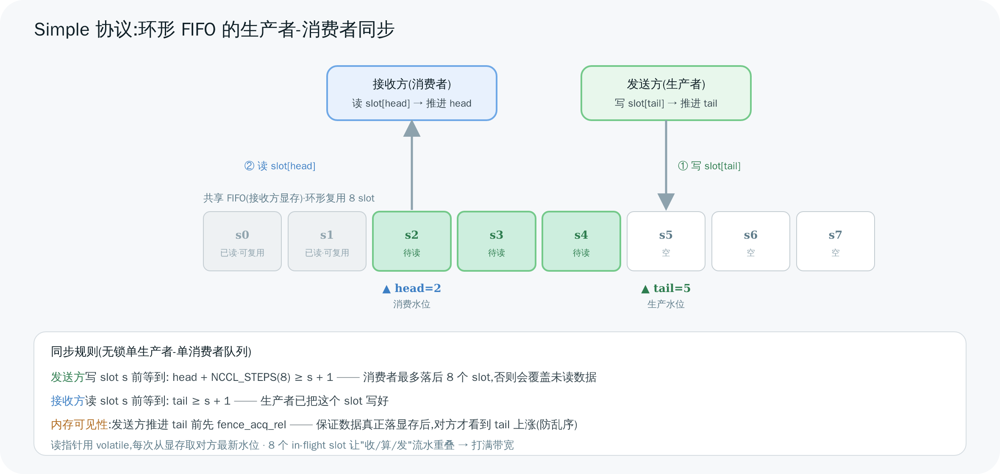

# 09 Device 端 Kernel 内部:primitives 与协议 ⭐

> 这是**难度最高的一章**。前面讲的"环/树/传输"最终都落到 GPU 上一个 kernel 里执行。本章拆开这个 kernel:它怎么启动、每个 block 怎么认领自己那条 channel、以及最核心的——**发送方和接收方怎么用一对 head/tail 指针在显存里做"生产者-消费者"同步**,还有 Simple/LL/LL128 三种协议各自怎么在"延迟 vs 带宽"上取舍。

---

## 1. kernel 入口:一个 block 一条 channel

NCCL 的通信 kernel 入口是 `ncclDevKernel_Generic`(`common.cu:23`),它调 `ncclKernelMain`(`common.h:356`)。启动时:

- **grid 维度 = channel 数**:每个 thread block 负责**一条 channel**。`blockIdx.x` 通过 `channelMask` 位图映射到具体的 `channelId`(`common.h:370`)。
- **block 内分工**(`common.h:383`):warp 0 把 `ncclKernelComm` 拷进共享内存,warp 1 拷本 channel 的 `ncclDevChannel`,warp 2+ 调 `loadWorkBatchToShmem`(`common.h:140`)把要做的 work 拷进来。
- **共享内存 `ncclShmem`**(`common.h:48`):放着 comm 副本、channel 副本(含 peers 指针)、work 存储区。**整个 kernel 高频访问的元数据都搬进 shmem**,避免反复读全局显存。

主循环(`common.h:417`)从 shmem 取出 work 的 `funcId`,查 `ncclDevFuncTable` 跳到对应实现(如 [第 05 章](<./05-ring-allreduce.md>)的 `runRing`)。一句话:**一次 launch,N 个 block 并行,每个 block 在自己的 channel 上跑算法。**

---

## 2. 核心难点:FIFO 生产者-消费者同步

这是整个 device 侧的灵魂。GPU A 要把数据"发"给 GPU B,本质是:**A 往一块两者都能访问的 buffer 写,B 从那块 buffer 读。** 难点在于:A 不能覆盖 B 还没读走的数据,B 不能读 A 还没写好的数据。NCCL 用**环形 FIFO + 一对 head/tail 指针**解决。

### 2.1 buffer 切成 NCCL_STEPS 个 slot

每条 connector 的 buffer(`ncclConnInfo.buffs`,`device.h:133`)被切成 **`NCCL_STEPS = 8`**(`device.h:26`)个 slot,首尾相接成环形 FIFO。两个指针:

- **`tail`**:生产者(发送方)写到哪了——"已生产"水位。
- **`head`**:消费者(接收方)读到哪了——"已消费"水位。

指针的"归属"很关键(`device.h` 注释):

```
发送方 A:  head 是 remote(读 B 的),tail 是 local(写,通知 B)
接收方 B:  tail 是 remote(读 A 的),head 是 local(写,通知 A)
```

即:**每一方都"读对方的进度、写自己的进度"。**

### 2.2 同步规则(看懂这张图就懂了)



> 图解源文件:[`12-fifo-sync.svg`](../../_attachments/nccl/src/12-fifo-sync.svg)

**发送方**(`prims_simple.h` 的 `waitPeer`,:101):写第 `step` 个 slot 前,必须确认这个 slot 已被消费者读走——否则会覆盖未读数据。条件(:107):

```
等待直到:  head + NCCL_STEPS >= step + StepPerSlice
           (消费者水位 + 8)        (我要写的位置)
```

含义:**消费者最多落后 8 个 slot**;发送方领先超过 8 个就得停下来等。等到后写数据,再 `postPeer`(:164)推进 `tail` 通知接收方。

**接收方**:读第 `step` 个 slot 前,必须确认生产者已经写好。条件:

```
等待直到:  tail >= step
           (生产者水位) (我要读的位置)
```

等到后读/reduce 数据,再 `postPeer` 推进 `head` 释放 slot 给发送方。

### 2.3 内存可见性:fence 与 volatile

光有指针还不够——还得保证"我写的数据,对方真能看到"。两个关键(`prims_simple.h`):

- 发送方 `postPeer`(:164)在更新 tail **之前**调 `fence_acq_rel_sys()`:**先确保数据真正落到显存,再亮起 tail**。否则对方可能看到 tail 更新了、数据却还没到(乱序)。
- 读指针用 `loadStepValue`/`ld_volatile_global`(:84):**volatile 读**,每次都从显存重新取对方的最新水位,不被编译器缓存进寄存器。

> 🎯 这套"环形 FIFO + head/tail + fence"就是经典的**无锁单生产者单消费者队列**,只不过跑在 GPU 显存上、两端是两块 GPU。理解它,就理解了 NCCL 数据面的同步内核。第 05 章的 slice/流水线,正是靠 8 个 slot 让"发 slot0、收 slot1、算 slot2"重叠起来。

---

## 3. 三种协议:Simple / LL / LL128

上面讲的是 **Simple 协议**。它数据和同步**分离**(数据在 buffer,水位在独立的 head/tail),大块传输带宽利用 100%,但每步有 fence + 指针往返的同步开销,**延迟偏高**。

为了小消息的低延迟,NCCL 还有两种"把同步塞进数据里"的协议:

### 3.1 LL(Low Latency):flag 夹在数据里

`prims_ll.h`。核心数据单元是 16 字节的 `ncclLLFifoLine`(:107):

```
[4B data][4B flag][4B data][4B flag]
```

接收方不看独立的 tail 指针,而是**轮询 flag**:flag 等于本轮期望值(一个递增 counter,`NCCL_LL_FLAG`,8 bit)就说明这 4 字节数据到了。妙处:**flag 和数据在同一次原子写里**(`storeLL`,:154),所以**不需要单独的内存 fence**——flag 可见即数据可见。

- **优点**:延迟极低(省掉 fence 往返)。
- **代价**:一半字节是 flag,**有效带宽只有约 50%**。

适合**小消息**(几 KB 以内),延迟主导、带宽损失无所谓。

### 3.2 LL128:NVLink 上的折中

`prims_ll128.h`。以 **128 字节**为单元(`NCCL_LL128_LINESIZE=128`):每 128B 里 **120B 数据 + 8B flag**(15 个 + 1 个 uint64,:10)。

```
[ 120 字节数据 (15× uint64) ][ 8B flag ]
```

带宽利用率 **120/128 ≈ 94%**,延迟接近 LL(同样靠 flag、少 fence)。代价:**依赖 NVLink 保证 128 字节写的原子性**(PCIe/网络不保证),所以主要用在 NVLink 互联上。

### 3.3 三协议对照

| | Simple | LL | LL128 |
|---|--------|-----|-------|
| 协议号 | `NCCL_PROTO_SIMPLE=2` | `NCCL_PROTO_LL=0` | `NCCL_PROTO_LL128=1` |
| 同步方式 | 独立 head/tail + fence | flag 夹在数据里(4B+4B) | flag 夹在数据里(120B+8B) |
| 有效带宽 | 100% | ~50% | ~94% |
| 延迟 | 高(有 fence) | **最低**(无 fence) | 低 |
| 硬件依赖 | 通用(PCIe/IB) | 通用 | **NVLink**(128B 原子) |
| 适用 | **大消息** | **小消息** | NVLink 上中等消息 |

> 💡 这三种协议正是 [第 06 章](<./06-tree-and-other-algos.md>) 调优模型里 `NCCL_PROTO` 那一维。和算法(Ring/Tree)正交组合:小消息常用 `Tree + LL`,大消息常用 `Ring + Simple`,NVLink 集群上 `LL128` 很常见。选哪个由成本模型按消息大小自动定。

---

## 4. 把全章串起来:一次 AllReduce 在 GPU 上发生了什么

```
kernel 启动(grid = nChannels 个 block)
  每个 block:
    ├─ 把 comm/channel/work 拷进 ncclShmem(common.h:383)
    ├─ 查 funcId → runRing(all_reduce.h,第05章)
    └─ 循环每个 chunk/slice:
         prims.directRecvReduceDirectSend(...)
           ├─ waitPeer:等前驱的 tail 推进(有数据)+ 等后继的 head 推进(有空位)
           ├─ 从前驱 slot 读 → reduce 到本地 → 写进发往后继的 slot
           └─ postPeer:fence + 推进自己的 tail/head
       (协议 Simple/LL/LL128 决定 waitPeer/postPeer 具体怎么同步)
```

这就是"控制面 enqueue 出来的 plan(第 08 章)"在数据面的真实执行。**算法定顺序、传输定通道、协议定同步**——三者在这个 kernel 里合流。

---

> 🎯 **面试官会追问**:
> - **发送方和接收方怎么不踩对方?** —— 环形 FIFO + 一对 head/tail:发送方等 `head+NCCL_STEPS >= step`(消费者没落后超过 8 个 slot)才写,接收方等 `tail >= step`(生产者写好了)才读;各自只写自己的水位、只读对方的水位。
> - **为什么发 tail 之前要 fence?** —— 防乱序:必须保证数据真正落显存后,对方才看到 tail 更新;否则对方看到水位涨了却读到旧数据。
> - **LL 协议怎么做到不用 fence?** —— flag 和数据打包进同一次原子写(4B 数据 + 4B flag),接收方轮询 flag 翻转即知数据到达,flag 可见性蕴含数据可见性,省掉栅栏。
> - **LL 为什么带宽减半,LL128 为什么不?** —— LL 每 8 字节里 4 字节是 flag(50% 开销);LL128 每 128 字节只 8 字节 flag(~6% 开销),但要 NVLink 保证 128B 写原子。
> - **NCCL_STEPS=8 是什么?** —— FIFO 的 slot 数 = 流水线深度;允许最多 8 个 slot 在途,让收/算/发重叠,打满带宽。
> - **一个 kernel block 处理多少数据?** —— 一条 channel;grid 维度 = nChannels,多 block 并行分摊带宽与 SM。
> - **三种协议谁选?** —— 调优模型按消息大小:小→LL(低延迟)、大→Simple(高带宽)、NVLink 中等→LL128。

---

**上一章** ← [08 Enqueue 与 Kernel 启动](<./08-enqueue-and-launch.md>)　|　**下一章** → [10 Proxy 线程与网络推进](<./10-proxy-and-net-progress.md>)
