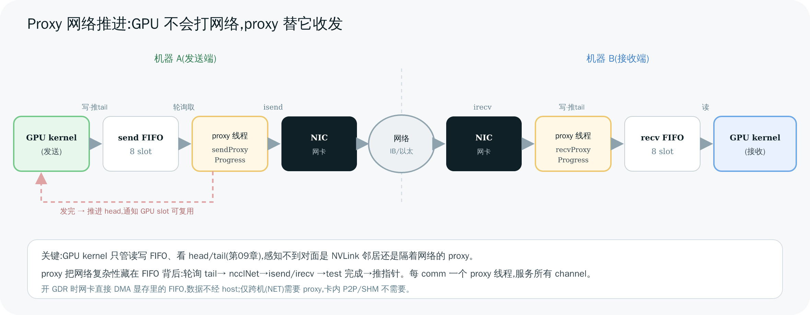

# 10 Proxy 线程与网络推进

> [第 07 章](<./07-transport.md>)留了个伏笔:跨机通信时,GPU kernel 调不了网卡,得靠一个 CPU 后台线程——**proxy**——替它收发网络包。本章把 proxy 讲透:它的主循环长什么样、怎么和 GPU kernel 握手、一个 proxy 服务多少东西。这是 NCCL "GPU 算 + CPU 管网络" 协作模型的最后一块拼图。

---

## 1. 为什么需要 proxy:GPU 不会打网络

回顾约束:**GPU kernel 跑在 device 上,发起不了 InfiniBand verbs 或 socket 这类 host 系统调用。** 但跨机通信必须有人去调网卡。NCCL 的方案:每个 communicator 起一个 **proxy 进度线程**(CPU),由它代劳:

- GPU kernel 把"要发的数据"准备好、写进 FIFO、推进 tail;
- proxy 轮询到,调 `ncclNet->isend` 把它发出去;
- 对端 proxy 调 `ncclNet->irecv` 收下来、写进 FIFO、推进指针;
- 对端 GPU kernel 轮询到数据就绪,继续算。

**卡内(P2P/SHM)不需要 proxy**——GPU 直接读写对端显存/共享内存。proxy 只为 NET transport 服务。

---

## 2. proxy 主循环:轮询所有活跃传输任务

proxy 线程入口是 `ncclProxyProgress`(`proxy.cc:954`),由 `ncclProxyProgressCreate`(`proxy.cc:1032`)在 init 时创建。主循环(`proxy.cc:978`)很朴素:

```c
while (运行中) {
  progressOps(proxyState, state, state->active, &idle);   // 推进所有活跃 op(proxy.cc:801)
  if (该取新 op 了)
    ncclProxyGetPostedOps(...);                            // 从共享池取新提交的 op(:835)
  if (idle) std::this_thread::yield();                     // 没活干就让出 CPU(:1005)
}
```

`progressOps`(`proxy.cc:801`)遍历活跃链表 `state->active`,对每个 op 调它的 transport 专属推进函数:

```c
ret = op->progress(proxyState, op);   // 函数指针 → net 的 sendProxyProgress / recvProxyProgress
```

这个 `progress` 指针在建连时由 `op->connection->tcomm->proxyProgress` 赋值(`proxy.cc:431`)——正是 [第 07 章](<./07-transport.md>) `netTransport` 注册的 `sendProxyProgress`(`net.cc:1304`)/ `recvProxyProgress`(`net.cc:1470`)。op 完成就从活跃链摘除。

> 一句话:**proxy 就是个"事件循环",不停地问每个在途的网络传输"你进展到哪了",并推它往前走一步。**

---

## 3. 数据结构:一个待推进的传输任务

三个结构(`proxy.h`):

- **`ncclProxyOp`**(`proxy.h:73`):一个待 proxy 推进的传输任务。带 `connection`、`nsteps/nbytes/chunkSize`、`sendbuff/recvbuff`、`peer`、`channelId`、`pattern`(Ring/Tree)。
- **`ncclProxyArgs`**(`proxy.h:185`):proxy 实际执行的单位,可**聚合同一 peer 的多个 op**(`subs[]`);带那个 `progress` 函数指针和 `state`(Ready/Progress)。
- **`ncclProxyState` / `ncclProxyProgressState`**(`proxy.h:333/272`):全局/线程状态,含与 GPU 共享的 `opsPool`、活跃链 `active`、空闲对象池 `pool`。

**op 怎么提交给 proxy?** launch 阶段(第 08 章 `ncclLaunchKernelAfter`)调 `ncclProxySaveOp`(`proxy.cc:602`):按通信模式(Ring/Tree…)判断哪些 rank 方向需要走网络,为每个方向 `SaveProxy` → `ncclLocalOpAppend`(`proxy.cc:489`)入本地队列;队列满或收尾时 `ncclProxyPost`(`proxy.cc:477`)把 op 转进共享池并 `notify_one` 唤醒 proxy 线程。

---

## 4. proxy ↔ GPU kernel 握手(核心)

这是把第 09 章 FIFO 同步延伸到"跨机"的关键。以发送方为例:



> 图解源文件:[`14-proxy-progress.svg`](../../_attachments/nccl/src/14-proxy-progress.svg)

```
发送端:
  GPU kernel:  把 chunk 写进发送 FIFO buffer → 推进 tail(我准备好一块了)
       │
  proxy(sendProxyProgress, net.cc:1304):
       ├─ 轮询到 tail 推进(connFifo[slot].size != -1)→ 有数据待发
       ├─ ncclNet->isend(buff, size, ...)   把这块发上网卡(net.cc:1414)
       └─ ncclNet->test() 轮询发送完成 → 推进 head(net.cc:1436)
       │                                     (告诉 GPU:这个 slot 我发完了,可复用)
接收端:
  proxy(recvProxyProgress, net.cc:1470):
       ├─ ncclNet->irecv(...)  从网卡收数据进 FIFO buffer(net.cc:1590)
       └─ 收完 → 推进 tail(告诉本地 GPU kernel:数据到了)
       │
  GPU kernel:  轮询到 tail 推进 → 读这块数据继续算 → 推进 head
```

看出来了吗?**这就是第 09 章的 head/tail FIFO,只不过其中一端从"另一块 GPU"换成了"proxy + 网卡"。** GPU kernel 完全不知道对面是 NVLink 邻居还是隔着网络的 proxy——它只管读写 FIFO、看 head/tail。**proxy 把网络的复杂性藏在 FIFO 背后**,这正是 NCCL transport 抽象的优雅之处。

**GDR(GPUDirect RDMA)** 让这条路更短:开启后网卡直接 DMA 显存里的 FIFO buffer(`net.cc` 的 `gdcSync`),proxy 只管控制面(发起 isend/irecv、轮询完成),数据不经 host 内存。

---

## 5. 一个 proxy 管多少:per-comm 一线程

- **每个 communicator 一个 proxy 进度线程**(`ncclProxyProgressCreate`,`proxy.cc:1035`),线程名 `NCCL Progress%d`(`proxy.cc:968`)。
- 它**服务本 rank 所有 channel 的网络收发**:活跃链里混着各 channel、各 peer 的 op,轮询时一视同仁地推进。
- op 池按 local rank 分区(`proxy.cc:462`)。
- **CPU 亲和性**可用 `NCCL_PROXY_CPUSET`(`proxy.cc:931`)绑定——把 proxy 钉在离网卡近的 NUMA 上能减少延迟(进阶调优)。

> 💡 这也解释了一个现象:NCCL 跨机训练时,**会看到 CPU 上有名为 "NCCL Progress" 的线程在忙**。它不是 bug,正是 proxy 在替 GPU 打理网络。CPU 若被其它进程抢占,proxy 推进变慢,会拖累 NCCL 跨机带宽——这也是为什么 HPC 上常给 NCCL proxy 预留 CPU 核。

---

> 🎯 **面试官会追问**:
> - **为什么跨机要 proxy,卡内不要?** —— GPU kernel 不能调 IB verbs/socket(host 系统调用),跨机必须 CPU 代劳;卡内 P2P/SHM 是 GPU 直接读写对端显存/共享内存,无需中介。
> - **proxy 和 GPU kernel 怎么同步?** —— 还是 head/tail FIFO:kernel 写数据推 tail,proxy 轮询到就发网络、发完推 head;接收端 proxy 收完推 tail 通知 kernel。kernel 感知不到对面是邻居还是网络。
> - **一个 proxy 线程够吗?** —— 每 comm 一个进度线程,服务所有 channel/peer 的网络 op;靠事件循环轮询推进。CPU 被抢占会拖慢它。
> - **GDR 在 proxy 路径里省了什么?** —— 网卡直接 DMA 显存 FIFO,proxy 只发起和轮询完成,数据不经 host,跨机带宽/延迟大幅改善。
> - **proxy 是数据面还是控制面?** —— 介于之间:CPU 线程(像控制面)但站在数据通路上替 kernel 搬网络数据(像数据面)。
> - **为什么生产环境要给 NCCL 留 CPU 核?** —— proxy 进度线程被抢占会成为跨机通信瓶颈;用 `NCCL_PROXY_CPUSET` 绑核可缓解。

---

**上一章** ← [09 Device 端 Kernel 内部](<./09-device-kernels.md>)　|　**下一章** → [11 调优与性能模型](<./11-tuning-and-perf.md>)
