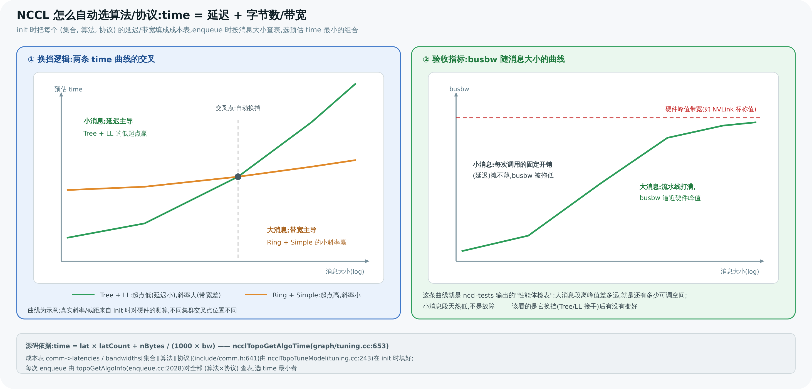

# 11 调优与性能模型

> 前面把"NCCL 怎么自动跑得快"讲完了。本章站在使用者角度:怎么**看**它在干什么(NCCL_DEBUG)、怎么**量**它跑多快(总线带宽)、以及哪些 **NCCL_* 环境变量**能在排障/调优时派上用场。所有变量名都经源码 grep 核实,不编造。

---

## 1. 第一步永远是 NCCL_DEBUG=INFO

排查任何 NCCL 性能/正确性问题,**先打开日志看它实际选了什么**:

```bash
NCCL_DEBUG=INFO ./your_program
```

它会打印:探测到的拓扑、每个集合用的**算法/协议**(Ring/Tree × Simple/LL/LL128)、channel 数、走的网卡、是否启用 GDR 等。配合 `NCCL_DEBUG_SUBSYS` 按子系统过滤(如 `NCCL_DEBUG_SUBSYS=INIT,GRAPH,NET`),`NCCL_DEBUG_FILE` 把日志写到文件。

> 💡 90% 的 NCCL "为什么慢"问题,`NCCL_DEBUG=INFO` 的第一屏就有答案:走错网卡、没开 GDR、拓扑探测残缺、算法选得不对。**先看日志,再动手调。**

---

## 2. 怎么量:总线带宽(busbw)

NCCL 性能不看"我发了多少字节/秒"(算法带宽 algbw),而看 **总线带宽(bus bandwidth, busbw)**。原因:不同算法、不同 N,实际压在链路上的流量不同。以 AllReduce 为例([第 05 章](<./05-ring-allreduce.md>)):

```
busbw = algbw × 2(N−1)/N
```

`nccl-tests`(官方基准)直接报 busbw,它**接近硬件物理带宽上限、与 N 基本无关**,所以是横向比较的正确指标。调优目标就是让 busbw 逼近硬件峰值(如 NVLink 的标称带宽)。

---

## 3. 调优模型回顾:它怎么自动选(第 06 章)

NCCL 在 init 时为每个 (集合, 算法, 协议) 建成本表(`ncclTopoTuneModel`,`tuning.cc:243`),enqueue 时按

```
time = 延迟 + 数据量 / 带宽
```

选 time 最小的组合(`enqueue.cc:2028` 的 `topoGetAlgoInfo`;公式本体在 `ncclTopoGetAlgoTime`,`tuning.cc:653`:`time = lat × latCount + nBytes/(1000 × bw)`)。**小消息延迟主导 → Tree/LL;大消息带宽主导 → Ring/Simple。** 多数情况信任它即可。下面的环境变量是"模型选错"或"排障"时的手动旋钮。

把这两件事画在一起——左边是调优模型"换挡"的原理,右边是你在 nccl-tests 里实际看到的 busbw 曲线:



> 图解源文件:[`19-perf-model.svg`](../../_attachments/nccl/src/19-perf-model.svg)

---

## 4. NCCL_* 环境变量速查(源码核实)

> 下表变量名均在 v2.30.7 源码 grep 到真实注册处(`NCCL_PARAM(...)` 或 `ncclGetEnv(...)`),括注定义文件。

### 调试

| 变量 | 作用 | 源码 |
|------|------|------|
| `NCCL_DEBUG` | 日志级别(`VERSION`/`WARN`/`INFO`/`TRACE`) | `debug.cc:45` |
| `NCCL_DEBUG_SUBSYS` | 按子系统过滤(`INIT,GRAPH,NET,TUNING…`) | `debug.cc:55` |
| `NCCL_DEBUG_FILE` | 日志输出到文件 | `debug.cc:103` |

### 算法 / 协议 / channel / 线程

| 变量 | 作用 | 源码 |
|------|------|------|
| `NCCL_ALGO` | 强制算法(`Ring`/`Tree`/`CollNet*`/`NVLS*`,支持 `^` 取反、`func:` 前缀) | `enqueue.cc:2055` |
| `NCCL_PROTO` | 强制协议(`LL`/`LL128`/`Simple`) | `enqueue.cc:2059` |
| `NCCL_MIN_NCHANNELS` | 最少 channel 数 | `graph/connect.cc:331` |
| `NCCL_MAX_NCHANNELS` | 最多 channel 数 | `graph/connect.cc:332` |
| `NCCL_NTHREADS` | kernel 每 block 线程数 | `graph/tuning.cc:14` |
| `NCCL_BUFFSIZE` | Simple 协议环形 buffer 大小 | `init.cc:814` |
| `NCCL_LL_BUFFSIZE` / `NCCL_LL128_BUFFSIZE` | LL / LL128 buffer 大小 | `init.cc:815/816` |

### 传输开关

| 变量 | 作用 | 源码 |
|------|------|------|
| `NCCL_P2P_LEVEL` | P2P 启用的最远 PATH 阈值 | `graph/paths.cc:289` |
| `NCCL_P2P_DISABLE` | 禁用 P2P transport | `graph/paths.cc:289` |
| `NCCL_SHM_DISABLE` | 禁用共享内存 transport | `transport/shm.cc:55` |
| `NCCL_NET_GDR_LEVEL` | GDR 启用的最远 PATH 阈值 | `graph/paths.cc:512` |
| `NCCL_NET_GDR_READ` | 启用 GDR 读优化 | `graph/paths.cc:460` |

### 网络

| 变量 | 作用 | 源码 |
|------|------|------|
| `NCCL_SOCKET_IFNAME` | 指定 socket 网卡(如 `eth0`、`^docker`) | `misc/socket.cc:196` |
| `NCCL_IB_HCA` | 指定 InfiniBand HCA 设备 | `net_ib/init.cc:317` |
| `NCCL_IB_DISABLE` | 禁用 IB(回退 socket) | `net_ib/init.cc:27` |
| `NCCL_NET` | 选网络插件(`Socket`/`IB`/插件名) | `init.cc:2117` |
| `NCCL_CROSS_NIC` | 允许跨网卡通信 | `graph/search.cc:16` |

### 拓扑

| 变量 | 作用 | 源码 |
|------|------|------|
| `NCCL_TOPO_DUMP_FILE` | 导出探测到的拓扑 XML(**排障神器**) | `init.cc:1135` |
| `NCCL_TOPO_FILE` | 喂入拓扑 XML,跳过探测 | `graph/topo.cc:1774` |
| `NCCL_GRAPH_FILE` | 喂入图搜索结果,跳过搜索 | `graph/search.cc:1111` |

### 其它

| 变量 | 作用 | 源码 |
|------|------|------|
| `NCCL_NVLS_ENABLE` | 启用 NVLS(NVLink SHARP) | `transport/nvls.cc:159` |
| `NCCL_PROXY_CPUSET` | 绑定 proxy 线程 CPU 亲和性 | `proxy.cc:931` |
| `NCCL_LAUNCH_MODE` | kernel 启动模式 | `init.cc:1651` |

---

## 5. 常见调优场景速记

| 症状 | 先查/先调 |
|------|-----------|
| 多机带宽远低于网卡标称 | `NCCL_DEBUG=INFO` 看是否走对网卡 + 是否启用 GDR;`NCCL_IB_HCA`/`NCCL_SOCKET_IFNAME` 指定;`NCCL_NET_GDR_LEVEL` 放宽 |
| 容器里比裸机慢很多 | 拓扑探测残缺:`NCCL_TOPO_DUMP_FILE` 导出对比,必要时 `NCCL_TOPO_FILE` 喂正确拓扑 |
| 小消息延迟高 | 确认用了 Tree/LL(看 INFO);必要时 `NCCL_PROTO=LL` 验证 |
| 单机 NVLink 带宽打不满 | 试 `NCCL_MIN_NCHANNELS` 调高、确认走 NVLink(P2P)而非 SHM/PCIe |
| CPU 抢占导致跨机抖动 | 给 NCCL 留核 + `NCCL_PROXY_CPUSET` 绑定 proxy |
| 怀疑算法选错 | `NCCL_ALGO=Ring`/`Tree` 对比验证(验证完去掉,别长期写死) |

> ⚠️ **强制类变量(`NCCL_ALGO`/`NCCL_PROTO`/`NCCL_*_DISABLE`)用于诊断,别长期写死**。硬件/规模一变,写死的选择可能反而更慢——把决策权还给调优模型通常最优。

---

## 6. 用 nccl-tests 验证

官方 [nccl-tests](https://github.com/NVIDIA/nccl-tests) 是衡量与回归的标准工具:

```bash
# 单机 8 卡 AllReduce,从 8B 到 128MB
./build/all_reduce_perf -b 8 -e 128M -f 2 -g 8
```

关注输出的 **busbw** 列随消息增大的曲线:小消息受延迟限(busbw 低),大消息趋于硬件峰值。这条曲线就是你这套硬件 + NCCL 配置的"性能体检表"。

---

> 🎯 **面试官会追问**:
> - **NCCL 性能为什么看 busbw 不看 algbw?** —— busbw = algbw × 2(N−1)/N,扣掉算法因素后接近物理链路带宽、与 N 无关,可横向比较、可对标硬件峰值。
> - **排查 NCCL 慢的第一步是什么?** —— `NCCL_DEBUG=INFO`,看实际选的算法/协议/网卡/GDR/拓扑,先定位再调。
> - **`NCCL_ALGO=Ring` 该长期设吗?** —— 不该。强制选项用于诊断;长期写死会在硬件/规模变化时变慢,应交回自动调优。
> - **多机带宽上不去先查什么?** —— 网卡选择(`NCCL_IB_HCA`/`NCCL_SOCKET_IFNAME`)、是否 GDR(`NCCL_NET_GDR_LEVEL`)、拓扑是否探全。
> - **容器里 NCCL 变慢的典型原因?** —— 拓扑探测看不到 NVLink/正确 PCI,`NCCL_TOPO_DUMP_FILE` 导出确认,必要时 `NCCL_TOPO_FILE` 喂入。

---

**上一章** ← [10 Proxy 线程与网络推进](<./10-proxy-and-net-progress.md>)　|　**下一章** → [12 附录](<./12-appendix.md>)
