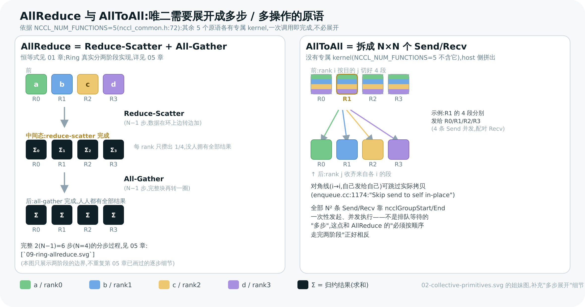
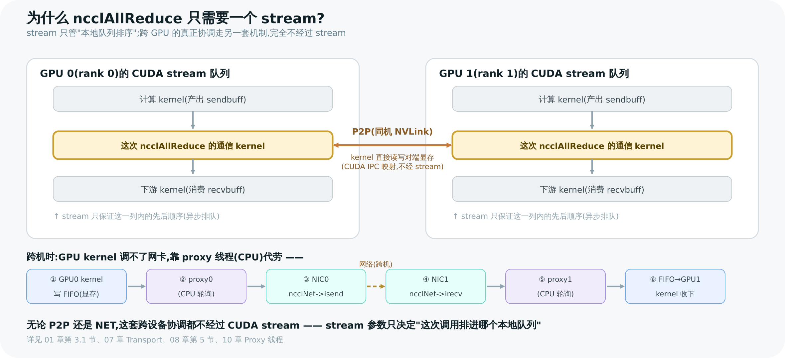
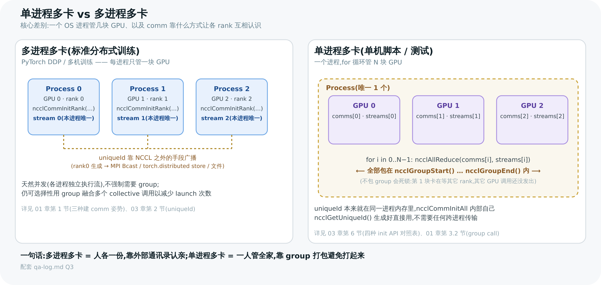

# NCCL 教程学习问答记录

> 这不是教程正文,是**用户在读 [NCCL 学习教程](<./index.md>) 过程中提出的问题**的原始记录,按时间顺序追加。每条问题给出简答 + 详细解释链接,方便以后回顾"当时是怎么想通的"。教程各章末尾的"🎯 面试官会追问"是预设的复习题,和这里的真实提问是两回事——不要混着找。

---

## 2026-07-01

### Q1:02-collective-primitives.svg 里,哪些通信原语需要把多步操作画出来?

**原话**:"针对 02-collective-primitives.svg 这个图解，其中需要多步操作的，要一步步写出来。比如，all reduce这种，就是先规约再分发。"

**简答**:按 `NCCL_NUM_FUNCTIONS=5` 这条源码事实(`src/include/nccl_common.h:72`),Broadcast/Reduce/AllGather/ReduceScatter/AllReduce 各有专属 device kernel,语义上是"一次调用即完成"的原子操作;只有 **AllToAll**(以及 Scatter/Gather)没有专属 kernel,是 host 侧拆成一堆 Send/Recv 跑的。而 **AllReduce** 虽然有专属 kernel,但教程正文本身就写了恒等式 `AllReduce = ReduceScatter + AllGather`,且这不是概念近似——**这正是 NCCL Ring 算法真实的两阶段实现**,值得在图里显式拆开。

**结论**:确定了 02 图里 AllReduce 面板要插入"reduce-scatter 中间态"(Σ0/Σ1/Σ2/Σ3 分散在各 rank)、AllToAll 面板要画出实际的交叉 Send/Recv 路径;其余 5 个原语维持单箭头(语义图,不重复算法图)。

> 图解源文件:[`qa-01-allreduce-alltoall-steps.svg`](../../_attachments/nccl/src/qa-01-allreduce-alltoall-steps.svg)

**详见**:[01 核心概念与 API](<./01-concepts-and-api.md>) 第 2 节(恒等式)、[05 Ring AllReduce 算法深入](<./05-ring-allreduce.md>)(Ring 算法真实分 2(N−1) 步的完整图解,`09-ring-allreduce.svg`,不需要在 02 图里重画)。

---

### Q2:为什么 `ncclAllReduce(sendbuff, recvbuff, count, ncclFloat, ncclSum, comm, stream)` 只需要传一个 `stream`?

**简答**:因为这个 API 的调用粒度是**"一个 rank 的一次本地调用"**,不是"整个 collective 一次性调用"。stream 参数管的只是**这块 GPU 本地队列里的先后顺序**(和产出 `sendbuff`/消费 `recvbuff` 的其它 kernel 排序),跟其它 N−1 个 rank 完全无关——跨 rank 的真正协调根本不走 CUDA stream 机制。

**详细解释**:

1. **调用粒度是"每 rank 一次",不是"每 collective 一次"。** 多进程模式(`ncclCommInitRank`)下每个进程本来就只管一块 GPU,自然只有一个 stream。单进程多卡模式(`ncclCommInitAll`)下,你要显式循环调用 N 次——每个 GPU 各带自己的 `comms[i]`/`streams[i]`,包进 `ncclGroupStart/End` 避免死锁(见 [01 章](<./01-concepts-and-api.md>) 第 3.2 节的代码示例)。所以从来没有"一次调用管 N 块 GPU"这种情况,`stream` 参数天然只描述**这一次调用、这一块 GPU**。

2. **stream 参数的真实作用**:告诉 CUDA"把这个 rank 的本地 collective kernel 排进这条 stream,跟着这条 stream 上之前排的活儿走"(第 01 章 3.1 节:调用异步返回,不代表通信完成,要靠 `cudaStreamSynchronize` 或下游 kernel 在同一 stream 上排队才能拿到正确结果)。它解决的是"这个 GPU 上,通信 kernel 和计算 kernel 谁先谁后",纯粹是**本地排序问题**。

3. **跨 rank 的真正同步,完全绕开了 CUDA stream。** 一次 `ncclAllReduce` 落到 GPU 上是**一次 kernel 启动**(`cuLaunchKernel(fn, grid=nChannels, block, ..., stream, ...)`,[08 章](<./08-enqueue-and-launch.md>) 第 5 节),但这一个 kernel 内部要和其它 N−1 个 rank 交换数据,靠的是:
   - **同机 P2P**([07 章](<./07-transport.md>) 第 3 节):通过 CUDA IPC(`cuMemMap`/`cudaIpcOpenMemHandle`)把对端显存直接映射进本 GPU 的地址空间,kernel 内部**直接读写对端显存**(经 NVLink,零拷贝),用的是 head/tail 指针型 FIFO 做流控,不是 CUDA stream 依赖。
   - **跨机 NET**([07 章](<./07-transport.md>) 第 5 节、[10 章](<./10-proxy-and-net-progress.md>)):kernel 把数据写进一块 FIFO,一个独立的 **proxy 线程**(CPU 后台线程,不受任何 stream 调度)轮询这块 FIFO,调 `ncclNet->isend/irecv` 通过网卡真正发出去——因为 GPU kernel 本身调不了 InfiniBand verbs / socket 这类 host 系统调用。

4. **一句话总结**:CUDA stream 只负责"一个设备的命令队列内部怎么排序",而 collective 通信的跨设备协调是 NCCL **自己在 kernel 内部(P2P 显存直写)和 kernel 外部(proxy 线程)另起的一套机制**实现的,根本不在 CUDA stream 的管辖范围内。所以 API 只需要一个 stream 参数——它只用来回答"这次调用该排在这块 GPU 的哪条队列上",不需要、也没办法用 stream 来表达"和另一块 GPU 同步"。

> 图解源文件:[`qa-02-stream-vs-cross-gpu-sync.svg`](../../_attachments/nccl/src/qa-02-stream-vs-cross-gpu-sync.svg)

**详见**:[01 核心概念与 API](<./01-concepts-and-api.md>) 第 3.1/3.2 节、[07 Transport 传输层](<./07-transport.md>)、[08 Enqueue 与 Kernel 启动](<./08-enqueue-and-launch.md>) 第 5 节、[10 Proxy 线程与网络推进](<./10-proxy-and-net-progress.md>)。

---

### Q3:单进程多卡 和 多进程多卡,到底差在哪?

**简答**:两者的本质差别是**"一个 OS 进程手上管几块 GPU、以及 comm 靠什么方式让各 rank 互相认识"**。多进程多卡是分布式训练的标准姿势(一进程一 GPU,可跨机);单进程多卡是单机脚本/小规模测试的写法(一进程管 N 块 GPU,受限于本机)。

| 维度 | 多进程多卡 | 单进程多卡 |
|------|-----------|-----------|
| 建 comm 用的 API | `ncclCommInitRank(comm, nranks, id, rank)`,**每个进程各调一次**,自报 rank(`nccl.h.in:186`) | `ncclCommInitAll(comms, ndev, devlist)`,**一个进程一次**建好全部 comm(`nccl.h.in:195`, `init.cc:2581`);或手动对每块卡 `cudaSetDevice`+`ncclCommInitRank` 包进 group |
| rank 互相"认识"的方式 | uniqueId 必须靠 **NCCL 之外**的手段广播给各进程(MPI `Bcast`、`torch.distributed` 的 store、文件、环境变量 `NCCL_COMM_ID`)——这是 NCCL 和"全功能 MPI"最大的分工差异([03 章](<./03-init-and-bootstrap.md>) 第 2 节) | uniqueId 本来就在同一进程的内存里,`ncclCommInitAll` 内部自己 `ncclGetUniqueId` 生成好直接用,不需要任何跨进程传输(`init.cc:2625`) |
| 调 collective API 的方式 | 每个进程各自调用一次 `ncclAllReduce(...)`,天然是"1 进程 1 GPU 1 stream"——这正是 Q2 里"为什么只需要一个 stream"的默认场景 | 必须在**一个进程里显式循环调 N 次**(每块 GPU 一次),每次带各自的 `comms[i]`/`streams[i]`,还得包进 `ncclGroupStart/End` |
| 为什么单进程多卡必须用 group? | 天然并发(每进程各自独立的执行流),不强制需要 group 来"触发并发"([01 章](<./01-concepts-and-api.md>) 第 3.2 节) | 若顺序调用会**死锁**:第 1 块卡的调用在等其它 rank,但其它 GPU 的调用还没发出。`ncclCommInitAll` 内部就是自己包了一层 `ncclGroupStart/End`([03 章](<./03-init-and-bootstrap.md>) 第 6 节表格) |
| 部署规模 | 可跨机器,是大规模分布式训练/推理的标准形态(K8s/Slurm 一个进程绑一块卡的调度模型贴合)——PyTorch DDP 走这条 | 局限在**单台机器**、这一个进程能看到的所有 GPU,常见于教程 demo、单机 benchmark、验证脚本 |

**一句话记忆**:多进程多卡是"人各一份、靠外部通讯录认亲";单进程多卡是"一人管全家、靠 group 打包避免打起来"。

> 图解源文件:[`qa-03-single-vs-multi-process.svg`](../../_attachments/nccl/src/qa-03-single-vs-multi-process.svg)

**详见**:[01 核心概念与 API](<./01-concepts-and-api.md>) 第 1 节(创建 communicator 的三种姿势)、第 3.2 节(group call 用途一);[03 通信器初始化与 Bootstrap](<./03-init-and-bootstrap.md>) 第 2 节(uniqueId)、第 6 节(四种 init API 对照表)。

---

### Q4:in-place 模式是什么、怎么运作、有什么缺点?

**简答**:in-place 是指调用集合通信 API 时 `recvbuff`(输出)和 `sendbuff`(输入)指向同一块显存(或同一块里属于自己的那一段),省一份显存和一次本地拷贝。判定条件分两类:**对称原语**(Broadcast/Reduce/AllReduce,输入输出一样大)是简单的 `sendbuff == recvbuff`;**非对称原语**(AllGather/ReduceScatter/Gather/Scatter,一块 buffer 是另一块的 N 倍)则是精确的**偏移公式**,比如 AllGather 要求 `sendbuff == recvbuff + rank·sendcount`。

**怎么运作**(`src/device/all_gather.h:55`):每个 rank 判断"自己数据现在的位置"和"最终该落在 recvbuff 哪个位置"是不是同一块内存——是就 `directSend`(只发,自己那份已经在正确位置);不是就 `directCopySend`(先拷贝到 recvbuff 对应槎位,再发)。所以 in-place 省的不只是显存,还省了每个 rank 一次本地拷贝。

**两个真实缺点**:
1. 偏移算错 = 静默脏数据。NCCL 不报错,只是没走 in-place 分支,数据被拷到错误位置——训练里常表现成偶发梯度错误,难复现。
2. Ring 算法下 in-place 的 AllReduce/Reduce、Tree 算法下任意 in-place 调用,都会**禁用 buffer registration 零拷贝优化**(`register/coll_reg.cc:212-216`)——省了显存,却可能悄悄退到更保守、稍慢的内部路径,不是纯赚不亏。

> 图解源文件:[`qa-04-inplace-offset.svg`](../../_attachments/nccl/src/qa-04-inplace-offset.svg)

**详见**:`src/nccl.h.in:453/481/494/510/527/555/570`(各原语 in-place 判定条件的官方注释)、`src/register/coll_reg.cc:212-217`(buffer registration 禁用条件)。

---

**返回**:[NCCL 学习教程首页](<./index.md>)
