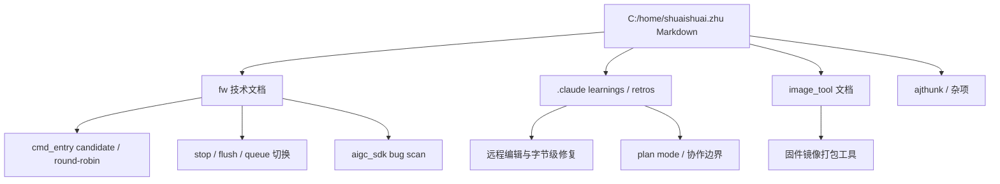

# C-home-shuaishuai-zhu Markdown 知识图谱

把 `C:\home\shuaishuai.zhu` 下 44 个 Markdown 文件整理成 Obsidian 可读的知识入口。完整清单见 [[本地 Markdown 文件索引]]，原始归档位于 `.raw/local-md/C-home-shuaishuai.zhu/`。

## 总体结构

## 三条主线

1. **CP firmware 主线**：[[cmd_entry]]、[[CP stop flush 与 queue 切换]]、[[aigc_sdk Bug 扫描与修复优先级]]。
2. **AI 协作方法主线**：[[AI 协作远程编辑经验]]，重点是远程文件编辑、字节级替换、plan mode 边界和 retros。
3. **工具链主线**：[[image_tool 固件镜像打包工具]]，连接固件镜像打包、签名、CRC、PyInstaller 和服务器工作流。

## 阅读建议

- 先读 [[本地 Markdown 文件索引]] 判断来源与覆盖范围。
- 技术面试复盘优先读 CP 主线，尤其是 candidate/pending、stop/flush、bug 扫描。
- 日常协作规约优先读 [[AI 协作远程编辑经验]]，其中记录了多次真实失败模式和修复方式。
- image_tool 相关维护从 [[image_tool 固件镜像打包工具]] 开始，再跳到原文镜像。

## 关键来源（按主题）

### CP firmware 设计与演进
- 设计文档：`fw/cmd_entry_roundrobin_design.md`、`fw/docs/cp_user_sf_cmd_changes.md`、`fw/wait_host_cmd_architecture.md`
- HCQD 调度与 candidate 缓存：`fw/.claude/learnings/2026-03-31-hcqd-v3.md`、`candidate-cache-pattern.md`、`local-pointer-extraction.md`、`struct-deduplication.md`
- V7 设计 Retros（2026-04-08 集中迭代）：`v7-candidate-driven`、`v7-context`、`v7-doc-update`、`1140`、`1630`、`1730`、`1830`、`2031`
- Bug 报告：`fw/aigc_sdk_bug_report.md`、`fw/aigc_sdk_check_report.md`、`fw/wait_host_cmd_review_report.md`

### AI 协作方法（learnings + retros）
- 远程编辑：`remote-server.md`、`remote-file-editing.md`、`patterns/ssh-remote-file-editing.md`、`patterns/byte-level-file-surgery.md`
- 跨语言转义陷阱：`errors/ssh-heredoc-backslash-expansion.md`、`errors/ssh-python-byte-escaping.md`
- 大文档操作：`patterns/large-document-rewrite.md`、`patterns/multi-point-edit-offset-tracking.md`、`patterns/selective-version-revert.md`
- Plan mode：`errors/plan-mode-silent-detection-failure.md`、`errors/plan-mode-violation-root-cause.md`
- 浏览器/认证：`ajthunk/.claude/learnings/agent-browser-*.md`、`feishu-requires-auth.md`、`ssh-windows-path-export-issue.md`

### image_tool
- `image_tool/README.md`、`image_tool/architecture.md`

完整 44 文件清单与原始路径请到 [[本地 Markdown 文件索引]] 查看。
