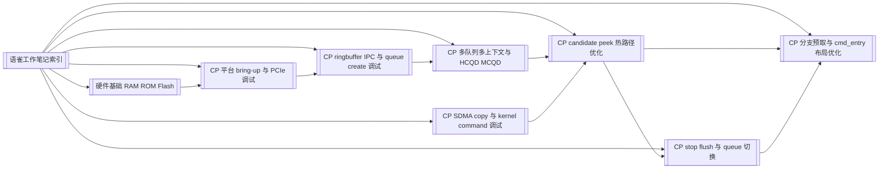

# 语雀工作笔记知识图谱

## 总览

这批工作笔记覆盖 2025-08 到 2026-05 的 CP firmware、KMD/UMD、平台 bring-up、queue 调度和性能优化问题。主线可以概括为：

1. 从平台启动和 CP loader bring-up 开始。
2. 进入 MCQD/HCQD 多队列、多 context、query/bind 调度。
3. 处理 ringbuffer、IPC、queue create 和 host/device 同步。
4. 优化 `cmd_entry`、candidate/peek、stop/flush 等 hot path。
5. 通过波形和日志定位 SDMA copy、fence、branch prefetch 等问题。

## 图谱

## 时间线

| 阶段 | 主题 | 能力沉淀 |
|---|---|---|
| 2025-08 | CP loader boot、多 CP user reset、NOC bus err | 平台启动时序定位 |
| 2025-09 | 多 MCQD 并行、128B 连续存放、HCQD 轮转 | 多队列调度建模 |
| 2025-10 | PCIe server、bootrom、DM1.4 fence、doorbell query | 跨平台 bring-up 排查 |
| 2025-11 | 版本冒烟、CP user、cls bitmap、内部 SDMA/kernel | 最小化回归和模块隔离 |
| 2025-12 | 多 context、HCQD attr/asid、global HCQD id、kernel perf | 多 context 与 id 语义 |
| 2026-01 | 4cls2pe、fence、host/device ringbuffer、波形 | host/device 同步与波形验证 |
| 2026-02 | wait cmd、PZ1 KO、mutex、PCIe remove/rescan | 驱动加载与平台恢复 |
| 2026-03 | ringbuffer wrap、IPC、queue create、KMD/UMD 构建 | queue create 系统排查 |
| 2026-04 | schedule/bind、candidate 多读、stop/flush | 热路径优化设计 |
| 2026-05 | V9 SDMA copy、ret/beqz 预取、goto 布局 | 波形解释和代码布局优化 |

## 关键能力

- 能把问题拆到 UMD/KMD/firmware/hardware/platform 多层。
- 能用波形、valid 位、日志和代码布局互相校验。
- 能从 MAS 规格回到代码实现，例如 MCQD 128B 连续存放、HCQD global id、stop/flush 语义。
- 能把性能优化落到可验证的热路径变化，而不是只做泛泛重构。

## 关联

- [[面试用工作笔记总结]]
- [[CP candidate peek 热路径优化]]
- [[CP 分支预取与 cmd_entry 布局优化]]
- [[CP 平台 bring-up 与 PCIe 调试]]
