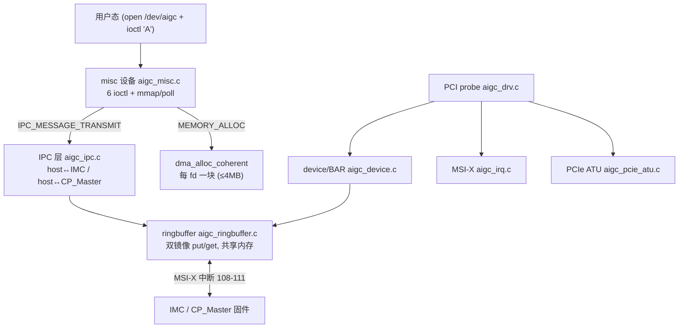

# tiny-kmd 架构知识库

**tiny-kmd**（仓库 `git@192.168.90.119:fw/tiny_kmd.git`，分支 `dev`，源码在 `tinykmd/`，约 2600 行）是
AIGCIC Grace GPU 的一个**最小骨架内核驱动**。和功能完整的 [[wiki/kmd/index|ajthunk kmd]] 相比，它只做最基础
的事：把设备注册成 PCI 设备、映射 BAR、提供一个 misc 字符设备和 6 个 ioctl、以及一套**基于 ringbuffer 的
IPC（host ↔ IMC / CP_Master 固件）**。它是后续把 ajthunk 核心功能逐步移植进来的「底座」。

> 给应届生的一句话：tiny-kmd ≈「能跑起来、能和固件用消息环对话、能分一块 DMA 内存给用户」的最小驱动；
> 它**没有**页表/MMU、命令队列、调度器、fence、HAL、OS 抽象层——这些正是要从 ajthunk 移植过来的部分。

## 与 ajthunk 的关系（一句话对比）

| | tiny-kmd | [[wiki/kmd/index|ajthunk kmd]] |
|---|---|---|
| 定位 | 最小骨架 / IPC 底座 | 完整 GPU 计算驱动 |
| 设备节点 | misc `/dev/aigc`，ioctl magic `'A'` | `/dev/aigcN`，ioctl magic `0x81` |
| 核心 | ringbuffer IPC + DMA 分配 | 上下文/页表/队列/调度/fence/HAL |
| OS 抽象 | 无（直接调 Linux API） | 有（`os_interface.c` 缝隙） |
| HAL | 无（直接 `iowrite32`） | 有（函数指针 ops 表） |
| PCI ID | `0x20da:0x0100` | `0x20da`(EMU)/`0x1234`(ASIC) |

详见 [[wiki/tiny-kmd/gap-vs-ajthunk|缺口对照]]。

## 推荐阅读顺序

1. [[wiki/tiny-kmd/architecture|架构总览]]：三段式（probe → 设备/BAR → IPC → misc/ioctl）+ 一次请求怎么走。
2. [[wiki/tiny-kmd/ipc|IPC 消息环（核心）]]：ringbuffer 双镜像、消息头位域、host↔IMC/CP_Master、同步/异步、订阅分发。
3. [[wiki/tiny-kmd/device|设备与内存]]：PCI probe、BAR 映射、设备内存区、PCIe ATU、DMA 分配。
4. [[wiki/tiny-kmd/ioctl|misc 设备与 ioctl]]：6 个 ioctl 与 file_operations。
5. [[wiki/tiny-kmd/interrupt|中断]]：MSI-X 分配与 IRQ（enable/disable 当前为桩）。
6. [[wiki/tiny-kmd/gap-vs-ajthunk|对照 ajthunk 的缺口]]：要移植什么、从哪接入。
7. [[wiki/tiny-kmd/env|环境与构建]]。

## 总图

## 分区入口

| 分区 | 入口 | 内容 |
|---|---|---|
| 架构 | [[wiki/tiny-kmd/architecture|架构总览]] | 三段式分层、probe 序列、请求路径。 |
| IPC | [[wiki/tiny-kmd/ipc|IPC 消息环]] | ringbuffer、消息格式、命令 ID、同步/异步、订阅。 |
| 设备 | [[wiki/tiny-kmd/device|设备与内存]] | probe、BAR、内存区、ATU、DMA。 |
| ioctl | [[wiki/tiny-kmd/ioctl|misc 设备与 ioctl]] | 6 ioctl、file_ops。 |
| 中断 | [[wiki/tiny-kmd/interrupt|中断]] | MSI-X、IRQ、桩。 |
| 缺口 | [[wiki/tiny-kmd/gap-vs-ajthunk|对照 ajthunk]] | 缺失子系统、移植接入点。 |
| 环境 | [[wiki/tiny-kmd/env|环境与构建]] | 路径、make。 |

## 延伸

- [[wiki/kmd/index|ajthunk KMD 内核驱动知识库]]：要移植过来的核心功能都在这里。
- [[wiki/fw/index|FW 技术知识库]]：IPC 对端（IMC / CP_Master 固件）。
- [Wiki 总索引](<../index.md>)
