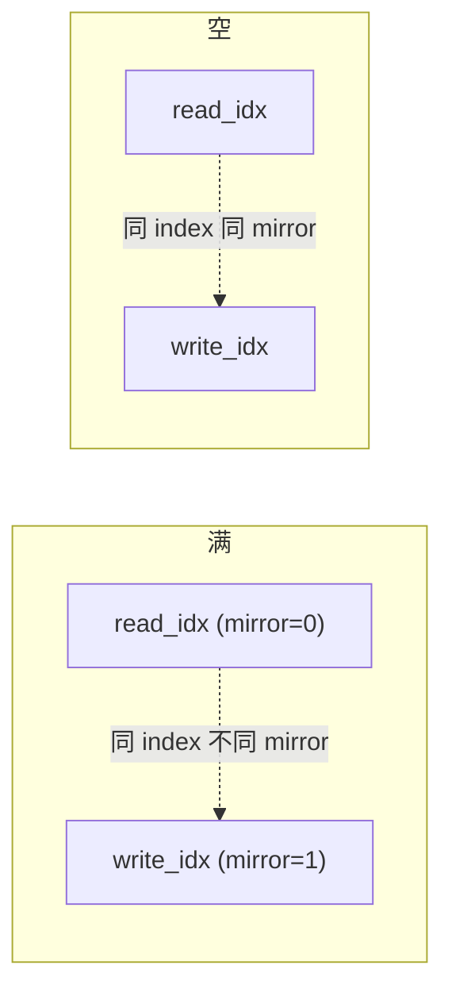
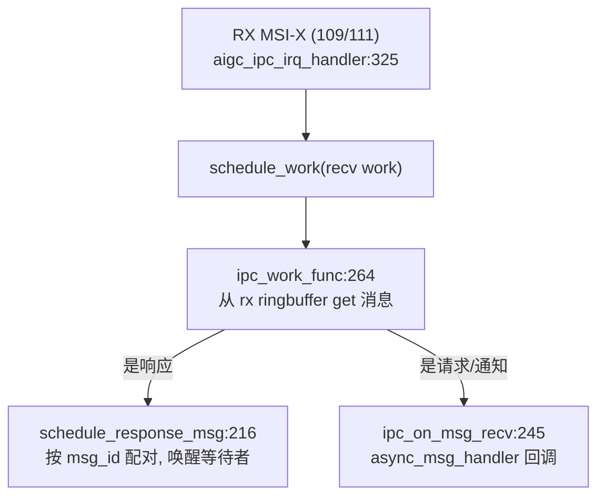

# tiny-kmd IPC 消息环

**文件**: `tinykmd/aigc_ipc.{c,h}`、`aigc_ringbuffer.{c,h}`、`subscribe_list.{c,h}`
**关联**: [[wiki/tiny-kmd/architecture]] | [[wiki/tiny-kmd/interrupt]] | [[wiki/tiny-kmd/ioctl]]

> IPC 是 tiny-kmd 的**核心**：Host 与片上固件（IMC、CP_Master）之间通过映射在共享内存里的 **ringbuffer**
> 交换定长消息，靠 MSI-X 中断互相通知。这是 ajthunk 里相对隐式、而 tiny-kmd 里显式独立的一层。

---

## 两对 IPC 通道

`aigc_ipc_info`（`aigc_ipc.h:154`）持有两条独立的 IPC 控制块：

| 通道 | event_type | TX/RX 偏移（共享内存内） | 中断号 |
|---|---|---|---|
| host ↔ **IMC** | `EVENT_TYPE_HOST_TO_IMC`(0) / `IMC_TO_HOST`(1) | TX `0x0` / RX `0x418` | 触发 108 / 收 109 |
| host ↔ **CP_Master** | `HOST_TO_CP_MASTER`(2) / `CP_MASTER_TO_HOST`(3) | TX `0x830` / RX `0xC48` | 触发 110 / 收 111 |

每条通道是一个 `aigc_ipc_control`（`aigc_ipc.h:125`）：`tx_buffer`/`rx_buffer`（指向共享内存里的 ringbuffer）、
`buff_ops`、`tx_lock`/`rx_lock`、`full_wait_q`、`wait_response_list`（等响应的请求）、`async_msg_handler`（异步回调）。

## ringbuffer：双镜像（mirror bit）

`aigc_ringbuffer.c` 实现的环形缓冲用了一个**镜像位**技巧来区分「满」和「空」（`aigc_ringbuffer.h:21` 的
`union mirror_idx`：最高位是 `mirror`、低 31 位是 `index`）：

- 读写指针相等 **且** mirror 相同 → **空**；
- 读写指针相等 **但** mirror 不同 → **满**。

ops 表 `ringbuffer_ops`（`aigc_ringbuffer.h:59`）：`check / put / get / data_len / space_len`。put/get 直接对
共享内存（`__iomem`）做拷贝，并维护 read/write 指针。**给应届生**：双镜像比「留一个空槽」更省空间，能用满整个环。

## 消息格式：64 位位域头 + 定长 payload

`#pragma pack(1)` 的 `ipc_msg_hdr`（`aigc_ipc.h:99`）是一个 64 位位域，关键字段：

| 字段 | 位 | 含义 |
|---|---|---|
| `event_type` | 5 | 通道/方向（见上表） |
| `event_id` | 8 | 命令 ID（见下） |
| `msg_id` | 8 | 一对请求/响应用同一个 id 配对 |
| `msg_type` | 1 | 0=请求 1=响应 |
| `msg_sync` | 1 | 0=异步 1=同步 |
| `response` | 1 | 是否需要响应 |
| `source`/`target` | 8/8 | 源/目标 ID（IMC=0 / HOST=1 / CP_MASTER=2） |
| `data_size` | 8 | payload 大小（单位 = 1 个 u32 = 4 字节） |
| `error` | 2 | 0 ok / 1 不支持 / 2 无权限 |

`ipc_msg`（`aigc_ipc.h:118`）= header + `u8 data[512]`（`PCIE_IPC_MSG_MAX_DATA_SIZE`）。

### 命令 ID（`enum event_id`，`aigc_ipc.h:70`）

- 通用：`TEST`(0) / `READ_MEM`(1) / `WRITE_MEM`(2)
- IMC↔host：`FW_UPDATE`(32) / `GET_DEVICE_INFO`(127)
- CP↔IMC：`SET_POWER`(128)
- CP↔host：`CREATE/DESTORY_CONTEXT`(160/161) / `CREATE/DESTORY_STREAM`(163/164) / `CREATE/DESTORY_EVENT`(166/167)

> 注意：CP↔host 已经预留了 context/stream/event 的命令 ID——这正是未来对接 ajthunk 上下文/队列/事件的入口。

## 发送一条消息（同步带响应）

`aigc_ipc_transmit()`（`aigc_ipc.c:158`，`EXPORT_SYMBOL`）→ `aigc_ipc_message_transmit()`（`aigc_ipc.c:89`）：

1. 校验请求消息合法（`aigc_ipc_check_request_message`）。
2. 按 `event_type` 选 IMC 还是 CP_Master 通道。
3. 若「请求且需响应」：分配一个 `aigc_ipc_wait_control`，挂进 `wait_response_list`。
4. `aigc_ipc_send_message()` 把消息 `put` 进 tx ringbuffer 并触发 TX 中断通知固件。
5. 需响应则 `wait_event_timeout(rx_wait_q, ..., IPC_TIMEOUT_MS=2000ms)` 等响应；超时返回 `RESPONSE_TIMEOUT`。
6. 返回码：`DONE` / `DONE_WITH_RESPONSE` / `SEND_TIMEOUT` / `RESPONSE_TIMEOUT` / `SELF_ERROR`（`aigc_ipc.h:47`）。

## 收消息：中断 → work → 配对/分发

- RX 中断只 `schedule_work`（下半部），真正取消息在 `ipc_work_func`（`aigc_ipc.c:264`）里做——遵守「中断上半部要短」。
- 响应消息按 `msg_id` 在 `wait_response_list` 里找到对应请求并唤醒（`schedule_response_msg`，`aigc_ipc.c:216`）。
- 非响应（固件主动通知）走 `async_msg_handler`，最终经 [[wiki/tiny-kmd/ioctl|订阅机制]] 分发给订阅了该 `event_id` 的用户进程。

## 异步订阅分发

`aigc_ipc_async_msg_handler_register()`（`aigc_ipc.c:182`，`EXPORT_SYMBOL`）把一个回调装到两条通道上。
misc 层注册的回调会查 `subscribe_list`（`subscribe_list.c`，按 `event_id` 索引的 hlist），把消息推给每个订阅了
该事件的 fd 的 `msg_list` 并唤醒其等待队列——用户态通过 `read()`/`poll()` 取走（见 [[wiki/tiny-kmd/ioctl]]）。

## 延伸

- [[wiki/tiny-kmd/ioctl]]：`IPC_MESSAGE_TRANSMIT` ioctl 与订阅/读取。
- [[wiki/tiny-kmd/interrupt]]：触发/接收用的 MSI-X 向量。
- [[wiki/fw/index|FW 技术知识库]]：对端固件（对比 ajthunk/fw 的 IPC 概念如 [[MCQD]]）。
