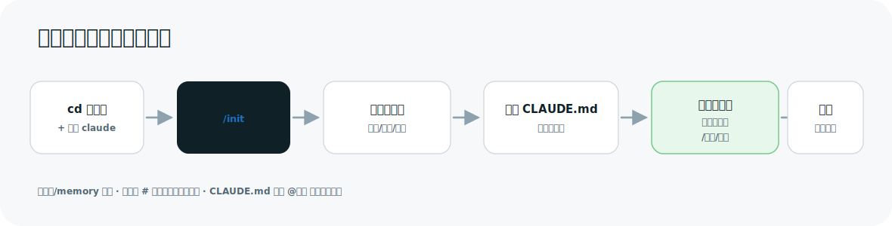
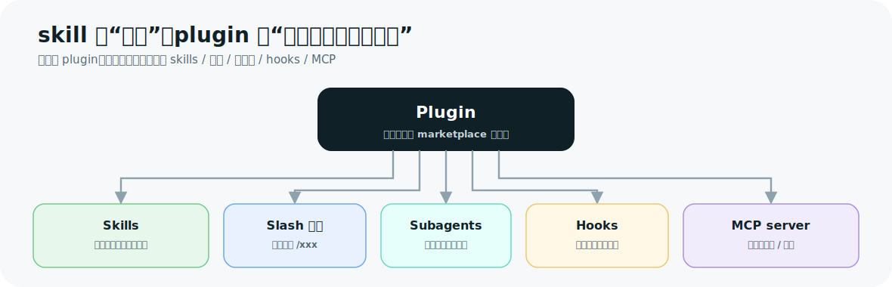
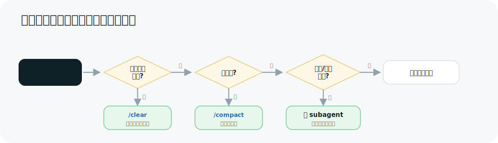

# Claude Code CLI 使用教程

> 这份教程**面向完全没用过 Claude Code 的人**。从“它是什么”讲到能独立用好，配大量图解和可直接照抄的例子。
> Claude Code 迭代很快，命令/界面细节以本机 **`/help`、`/config`** 和官方文档
> `docs.claude.com/en/docs/claude-code` 为最终标准。生成/更新日期：2026-06-10。

---

## 命令速查（先收藏一份）

> 不用记全，先扫一眼知道"有哪些招"，详细见后文对应章节。

**会话里输入 `/` 触发的常用命令：**

| 命令 | 作用 |
|---|---|
| `/help` | 列出所有命令和能力 |
| `/init` | 扫描项目、自动生成 `CLAUDE.md` |
| `/clear` | 清空对话历史（换任务时用） |
| `/compact` | 压缩对话、腾出上下文 |
| `/model` | 切换模型 / 看可用型号 |
| `/config` | 交互式配置界面 |
| `/permissions` | 查看和管理权限规则 |
| `/memory` | 查看 / 编辑生效的 `CLAUDE.md` |
| `/agents` | 查看和管理 subagent |
| `/plugin` | 管理插件和 marketplace |
| `/mcp` | 查看已连接的 MCP server |
| `/cost`、`/usage` | 看 token 消耗与花费 |
| `/review` | 内置代码审查 |

**最该先会的键位 / 符号：**

| 操作 | 作用 |
|---|---|
| `Shift+Tab` | 循环切换权限模式（default → acceptEdits → plan） |
| `Esc` | 立刻打断它当前的动作（最常用） |
| `Ctrl+D` | 退出 |
| `@路径` | 主动把某个文件喂给它，例如 `@src/main.c` |
| `#一句话` | 把这句话追加进项目记忆（写入 `CLAUDE.md`） |
| `think` / `ultrathink` | 让它这一步"想得更深"（思考强度关键词） |

---

## 0. 这份教程怎么读

| 你的情况 | 从哪节开始 |
|---|---|
| 完全没听说过、想先有概念 | §1 它是什么 → §2 五分钟跑通第一次 |
| 装好了，想真正上手干活 | §3 核心工作循环 → §4 权限（最该先懂） |
| 想让它“记住”项目规矩 | §6 CLAUDE.md 专章（user 级 vs 项目级、`/init`） |
| 想给它装能力、扩展功能 | §7 skills 与 plugins（含 superpowers 实战） |
| 想调配置 / 排错 | §8 起的进阶各节 + §16 排错速查 |

**先记住五句话：**

1. **Claude Code 是“在你电脑终端里、能直接读写你代码仓库的 AI 助手”**——它不只是聊天，它会读文件、改文件、跑命令、提交 git。
2. **它的行为被三样东西约束**：①权限模式（你授权它能做什么）②CLAUDE.md（写给它的长期规矩）③settings.json（配置）。先懂这三样，用起来就稳。
3. **上下文（它的“记忆窗口”）是有限的**：聊得越久越贵、越容易忘事。换任务就 `/clear`，脏活丢给“子代理”，规矩沉淀进 CLAUDE.md。
4. **能力靠四件套扩展**：slash 命令（你主动敲 `/xxx`）、skills（按场景触发的操作手册）、subagents（独立干活的小助手）、hooks（自动执行的脚本）；plugins 则把这些打包分发。
5. **不确定就查、别猜**：`/help` 看命令、`/config` 调设置、`/model` 看模型、`claude doctor` 体检。

---

## 1. Claude Code 是什么（全景图）

打个比方：它像一个**坐在你电脑前、能直接动你键盘的结对程序员**。你用大白话提需求，它自己去看代码、动手改、跑测试，改完给你看 diff，你点头才算数。


它和你平时用的网页版 Claude 最大的不同：**它在你的真实项目目录里干活**，能落地成文件改动和 git 提交，而不是只给你一段文字让你自己复制粘贴。

---

## 2. 五分钟跑通第一次

### 第 0 步：安装

| 平台 | 安装命令 |
|---|---|
| macOS / Linux / WSL（推荐原生安装） | `curl -fsSL https://claude.ai/install.sh \| bash` |
| Windows PowerShell | `irm https://claude.ai/install.ps1 \| iex` |
| 任意平台（需 Node.js 18+） | `npm install -g @anthropic-ai/claude-code` |

装完验证：

```bash
claude --version    # 看到版本号就 OK
claude doctor       # 环境体检：PATH、网络、配置
```

### 第 1～5 步：第一次会话


实际操作长这样：

```bash
cd ~/my-project       # 1. 一定要先进到你要干活的项目目录
claude                # 2. 启动；第一次会拉起浏览器登录（见 §5）
```

进入交互界面后，依次输入：

```text
/init                              ← 3. 它会扫描项目、生成一份 CLAUDE.md（见 §6）
这个项目是做什么的？主要入口在哪？      ← 4. 先让它给你讲一遍，建立信任
帮我在 README 末尾加一句安装说明        ← 5. 让它干一件小事
```

它改文件前会**把 diff 给你看**，并问你批不批准。看清楚再选 **Yes / No**。这就是一次完整的 Claude Code 使用。

> 退出：`Ctrl+D`。打断它当前动作（最常用）：按 `Esc`。

---

## 3. 核心工作循环：请求 → 计划 → 编辑 → 验证

这是你 90% 时间都在重复的循环：


三个让效果翻倍的习惯：

- **用 `@` 主动喂文件**：`解释一下 @src/main.c 的启动流程`——比让它满仓库瞎找又快又准。
- **复杂改动先进 plan 模式**（按 `Shift+Tab` 切过去）：先看方案，没问题再放它动手，避免它一头扎错方向。
- **把成功标准说清楚**：与其“修一下这个 bug”，不如“**写一个能复现这个 bug 的测试，然后让它通过**”——给它可验证的目标，它能自己循环到做对。

---

## 4. 权限模型（最该先搞懂的部分）

Claude Code 默认**不会**不经你同意就改文件或跑命令。控制分两层：**模式**（粗粒度）和**规则**（细粒度）。

### 4.1 权限模式 —— 按 `Shift+Tab` 循环切换


| 模式 | 行为 | 什么时候用 |
|---|---|---|
| `default` | 每个写操作 / 命令都要你点确认 | 刚上手、改重要仓库 |
| `acceptEdits` | 自动批准文件编辑（你仍在旁边看 diff 流过） | 你正盯着、快速迭代代码 |
| `plan` | 只分析、只出方案，**绝不动代码** | 探索、定方案阶段 |
| `bypassPermissions` | 全部放行、不再问 | **仅限隔离容器/一次性 VM**，绝不在自己主力机用 |

> 较新版本还有 `auto` 等模式（后台分类器自动批准“安全”操作，但仍拦截 `curl|bash`、推 main、删库等高危动作）。**以本机 `Shift+Tab` 循环里实际出现的为准。**

### 4.2 权限规则 —— 在 settings.json 里精确授权

不想每次都点“同意跑 npm test”？把它写成常驻规则：

```json
{
  "permissions": {
    "allow": [
      "Bash(npm run test)",
      "Bash(git diff:*)",
      "Edit(src/**)"
    ],
    "deny": [
      "Bash(curl:*)",
      "Read(./.env)",
      "Read(./secrets/**)"
    ]
  }
}
```

规则语法是 `工具名(匹配)`：精确 `Bash(npm run test)`、**前缀匹配** `Bash(npm run test:*)`（该命令带任意参数都放行，注意是冒号 `:*`）、路径 `Edit(src/**)`、域名 `WebFetch(domain:github.com)`。会话里用 `/permissions` 查看和管理。

---

## 5. 登录与认证

```bash
claude            # 首次启动拉起浏览器走登录；弹不出浏览器时按提示粘贴登录码
/login            # 会话里重新登录 / 切换账号
/logout           # 登出
```

两类身份：**订阅账号（Pro / Max / Team / Enterprise）** 或 **API Key（Anthropic Console / Bedrock / Vertex）**。常用环境变量：

| 变量 | 用途 |
|---|---|
| `ANTHROPIC_API_KEY` | 用 Console 的 API Key 认证 |
| `ANTHROPIC_BASE_URL` | 走自建网关/代理（如 claude-code-proxy） |
| `CLAUDE_CODE_OAUTH_TOKEN` | 长期 token（`claude setup-token` 生成），给脚本/CI 用 |

> 想把后端换成 DeepSeek / Kimi / GLM / 本地模型，见 [claude-code-proxy](https://github.com/shuaishuaiZhu-ai/claude-code-proxy)。

---

## 6. CLAUDE.md 与项目记忆（重点）

**CLAUDE.md 是你写给 Claude Code 的“长期规矩单”**，每次会话启动会自动读进去。它解决一个核心痛点：**不用每次都重复交代项目背景和你的偏好**。

### 6.1 它分好几层，自动叠加


启动时从上到下全部叠加生效。**越靠下越“贴近当前项目”，冲突时下层补充/细化上层。**（企业级是硬性、不可绕过。）

### 6.2 user 级 vs 项目级 —— 最该分清的两层

这是新手最容易搞混的地方。一句话区分：
**个人级写“我这个人不管在哪个项目都想要的”；项目级写“这个项目所有人都该遵守的”。**

| | 个人级（user） | 项目级（project） |
|---|---|---|
| 位置 | `~/.claude/CLAUDE.md` | 仓库根的 `./CLAUDE.md`（或 `./.claude/CLAUDE.md`） |
| 作用范围 | 你这台机器上的**所有项目** | **仅这一个项目** |
| 是否进 git | **否**（只在你本地） | **是**（提交入库，团队共享） |
| 适合写什么 | 你的通用偏好：回答用中文、改动要小而准、提交前先问 | 这个项目的事实：构建命令、目录结构、命名约定、踩过的坑 |
| 典型例子 | “所有代码注释用中文”“没把握的方案先列出来再动手” | “构建跑 `./build.sh`；测试跑 `pytest -q`；不要碰 `legacy/` 目录” |

> 举个真实例子：一个 Obsidian 知识库项目，根目录的 `CLAUDE.md` 把“先读哪个索引、写新页要同步更新哪些文件”固化成规矩——这就是**项目级**。而你 `~/.claude/CLAUDE.md` 里写的是跨项目的个人风格。

**个人级 `~/.claude/CLAUDE.md` 别从零手写——直接用现成的好模板。** 推荐 Andrej Karpathy 风格的这份（社区整理），它把新手最容易踩的坑固化成 4 条铁律：

- **想清楚再写**：有歧义先问、别假装确定，多个方案先摆出来让你选；
- **够用就好**：只写解决问题的最小代码，不过度设计、不堆没要求的"灵活性"；
- **外科手术式改动**：只动与需求直接相关的代码，别顺手重构/格式化无关部分；
- **目标驱动**：先定义"怎样算做对"（可验证的成功标准），再动手、循环到达标。

一行装好（下载到个人级目录）：

```bash
curl -fsSL https://raw.githubusercontent.com/multica-ai/andrej-karpathy-skills/main/CLAUDE.md -o ~/.claude/CLAUDE.md
```

仓库 [multica-ai/andrej-karpathy-skills](https://github.com/multica-ai/andrej-karpathy-skills)，装完可再按自己习惯增删（比如加一句"默认用中文回答"）。

**可直接照抄的项目级 `./CLAUDE.md`：**

```markdown
# 项目名 X

## 构建与测试
- 构建：`npm run build`
- 测试：`npm test`（提交前必须通过）
- Lint：`npm run lint`

## 约定
- 源码在 `src/`，不要改自动生成的 `dist/`。
- 组件命名用 PascalCase；工具函数放 `src/utils/`。
- 提交信息用中文，遵循 "类型: 摘要" 格式。
```

### 6.3 如何初始化一个工作目录（`/init`）

让 Claude Code 接手一个**已有项目**时，第一件事就是 `/init`：



- `/init` 会读你的 `package.json`、目录结构、README 等，**自动生成一份项目级 CLAUDE.md 草稿**。
- 生成的草稿不一定完美——**务必自己过一遍**，补上它没猜到的构建命令、测试方式、不该碰的目录。
- 之后随时维护：
  - `/memory` —— 查看 / 编辑当前生效的所有 CLAUDE.md。
  - 会话里用 **`#` 开头说一句话**，可快速把它追加进记忆（例如 `# 提交前永远先跑 npm test`）。
  - 在 CLAUDE.md 里用 **`@路径`** 导入其它文件，例如 `@README.md`、`@docs/build.md`。

**写好 CLAUDE.md 的要点：** 短而具体（单文件尽量 < 200 行，太长反而被稀释）；写**可执行**的话（“提交前跑 `npm test`”而不是“记得测试”）；多步骤流程别堆这里，做成 skill（见 §7）。

---

## 7. skills 与 plugins（含 superpowers 实战）

新手最常问：“skill 和 plugin 到底啥区别？” 一句话：

> **skill 是“一项能力 / 一本操作手册”；plugin 是“把一组能力打包分发的安装包”。**
> 你**安装 plugin**，从而**获得它带的一批 skills（以及命令、子代理、hooks、MCP）**。

### 7.1 四种扩展物的关系



| 概念 | 是什么 | 怎么触发 |
|---|---|---|
| **Skill** | 一段带说明的操作手册（`SKILL.md`），平时不占上下文 | Claude 按场景**自动**选用，或你手动调用 |
| **Slash 命令** | 可复用的 prompt 模板 | 你主动敲 `/名字` |
| **Subagent** | 带独立上下文的专职小助手 | Claude 按需派活，或 `/agents` |
| **Plugin** | 把上面这些打包，从 marketplace 安装 | `/plugin install …` |

### 7.2 怎么用 plugin（含官方地址）

在会话里直接管理：

```text
/plugin                                   # 打开插件界面：Discover 浏览 / 安装 / 启停
/plugin marketplace add anthropics/claude-code   # 添加一个 marketplace（owner/repo 形式）
/plugin install <插件名>@<marketplace名>          # 安装某个插件
```

**官方 plugin 地址（请收藏）：**

| 名称 | 地址 | 说明 |
|---|---|---|
| 官方 marketplace 仓库 | `https://github.com/anthropics/claude-plugins-official` | Anthropic 官方维护的高质量插件目录，**启动即默认可用**（名字 `claude-plugins-official`） |
| 官方插件目录页 | `https://claude.com/plugins` | 网页上浏览有哪些插件 |
| Claude Code 主仓库 | `https://github.com/anthropics/claude-code` | 含 `plugins/` 与 `marketplace.json`，也可 `/plugin marketplace add anthropics/claude-code` |

也可以在 settings.json 里声明启用：

```json
{
  "enabledPlugins": { "code-review@claude-plugins-official": true }
}
```

### 7.3 superpowers 实战（以它为例讲“怎么用”）

**superpowers 是什么：** 一套“给编程 agent 用的工作方法论”插件（作者 Jesse Vincent / obra）。它强制 Claude 养成好习惯——**先头脑风暴、再写计划、先写测试再写实现、做完先自审**——而不是上来就乱改。

**安装它（两种来源，二选一）：**

```text
# 方式一：官方 marketplace（最简单，推荐）
/plugin install superpowers@claude-plugins-official

# 方式二：作者社区源
/plugin marketplace add obra/superpowers-marketplace
/plugin install superpowers@superpowers-marketplace
```

> 仓库：`https://github.com/obra/superpowers`、`https://github.com/obra/superpowers-marketplace`。

**装完你多了什么：** 一组 skill（当前 5.1.0 版含 14 个），以及一个会话启动就注入的引导（SessionStart hook）。主要 skill：

| skill | 作用 |
|---|---|
| `brainstorming` | 做任何创造性工作前，先把需求和设计聊清楚 |
| `writing-plans` / `executing-plans` | 写实现计划 / 按计划分步执行并设检查点 |
| `test-driven-development` | 先写测试再写实现 |
| `systematic-debugging` | 遇 bug 先系统排查，别瞎改 |
| `requesting-code-review` / `receiving-code-review` | 完成后请求审查 / 正确对待审查意见 |
| `subagent-driven-development` / `dispatching-parallel-agents` | 用子代理拆活、并行干 |
| `using-git-worktrees` | 用 worktree 隔离开发 |
| `verification-before-completion` | 声称“做完了”之前先跑验证、拿证据 |
| `writing-skills` / `using-superpowers` | 写新 skill / 这套体系本身的用法 |

**一个端到端示范**——你只说一句“给项目加个用户登录功能”，superpowers 会把它串成一条流水线：


这就是“能力（skill）被 plugin 打包、按场景自动串起来”的典型样子。**本会话当前就已经装了 superpowers**——你看到的“先 brainstorm、再 plan、再执行”的节奏正是它在起作用。

> 想自己写 skill / plugin？用 superpowers 自带的 `writing-skills`，或官方的 `claude-md-management`、`claude-code-setup` 等插件。

---

## 8. Slash 命令速查

输入 `/` 触发。常用内置：

| 命令 | 作用 |
|---|---|
| `/help` | 列出所有命令和能力 |
| `/clear` | 清空当前对话历史（保留 CLAUDE.md）——**换任务时常用** |
| `/compact` | 压缩对话腾出上下文（快满时也会自动触发） |
| `/config` | 交互式配置界面 |
| `/model` | 切换模型 / 看可用型号 |
| `/init` | 扫描项目自动生成 CLAUDE.md |
| `/memory` | 查看/编辑当前加载的记忆文件 |
| `/agents` | 查看和管理 subagent |
| `/plugin` | 管理插件和 marketplace |
| `/mcp` | 查看已连接的 MCP server |
| `/permissions` | 查看和管理权限规则 |
| `/cost` / `/usage` | 看 token 消耗与花费 |
| `/review` | 内置代码审查 |
| `/doctor` | 配置/环境体检 |

**自定义命令**：在 `.claude/commands/<名字>.md`（项目级）或 `~/.claude/commands/<名字>.md`（个人级）放一个 Markdown，文件名即命令名，用 `$ARGUMENTS` 接参数：

```markdown
---
description: 跑全套检查并修复
---
请对 $ARGUMENTS 模块：1) 跑 lint 和测试 2) 逐个修好失败项 3) 用 git diff 给我看改动
```

之后输入 `/名字 参数` 即可。

> 让它“想得更深”不是 slash 命令，而是关键词 `think` / `think harder` / `ultrathink`，见 §14.2。

---

## 9. 上下文管理

上下文越长越贵、越易忘事。策略：



- **换任务就 `/clear`**；**快满 `/compact`**；**`/cost`** 随时盯消耗。

---

## 10. Subagents（子代理）

带**独立上下文**的专职小助手。主会话把一块活派给它，它干完只把**结论**带回来——既隔离噪音，又能并行干多件事。

定义在 `.claude/agents/<名字>.md`（项目级）或 `~/.claude/agents/<名字>.md`（个人级）：

```markdown
---
name: researcher
description: 调研型任务：大范围探索代码库、查资料、汇总。需要广度搜索而非精确改动时用。
tools: Read, Grep, Glob, Bash
model: sonnet
---
你是调研专家。彻底探索后只带回结论和关键证据路径，别把文件内容全倒回来。
```

`/agents` 查看管理；Claude 也会**按 description 自动派活**。经验：**要广度搜索/结论**时派 subagent；只查一个已知位置的事实就直接做。

---

## 11. Hooks（生命周期钩子）

在**特定事件**触发时**确定性执行**的脚本（不靠 Claude 自觉，一定会跑）。用来格式化、拦危险操作、跑测试。

常见事件：`PreToolUse`（工具调用前，可拦截）、`PostToolUse`（调用后，如自动 lint）、`UserPromptSubmit`、`Stop`、`SubagentStop`、`SessionStart`/`SessionEnd`、`PreCompact`、`Notification`。

在 settings.json 配置（按事件分组，`matcher` 配工具）：

```json
{
  "hooks": {
    "PostToolUse": [
      { "matcher": "Edit|Write",
        "hooks": [ { "type": "command", "command": "npm run lint --silent" } ] }
    ]
  }
}
```

**“每次 X 都自动 Y”这种需求要靠 hook，而不是指望 Claude 记得。** 具体字段/返回约定以官方 hooks 文档和本机版本为准。

---

## 12. MCP（接入外部工具/数据）

把数据库、浏览器、内部 API 等接进来：

```bash
claude mcp add <名字> -- <启动命令>            # 本地 stdio
claude mcp add --transport http <名字> <url>   # 远程 HTTP
claude mcp list                                # 列出已配置的
```

也可写项目级 `.mcp.json`（可入库共享）。会话里用 `/mcp` 看连接状态，之后用自然语言让 Claude 调用即可。三种传输：stdio（本地，最常见）、SSE、HTTP；远程常需 OAuth，Claude 会引导授权。

---

## 13. settings.json（配置）

分层，优先级从高到低：**企业托管 > 命令行参数 > 项目本地 `.claude/settings.local.json` > 项目 `.claude/settings.json` > 个人 `~/.claude/settings.json`**。

| 文件 | 作用域 | 入库 |
|---|---|---|
| `~/.claude/settings.json` | 个人，所有项目 | 否 |
| `.claude/settings.json` | 项目，团队共享 | 是 |
| `.claude/settings.local.json` | 项目，仅自己 | 否（应进 .gitignore） |

常用键：`model`（默认模型）、`permissions`（模式 + allow/deny）、`env`（环境变量）、`hooks`、`enabledPlugins`、`includeCoAuthoredBy`（提交是否带 Co-Authored-By）。**拿不准的键用 `/config` 在界面里调最稳。**

---

## 14. 模型与思考强度（thinking / effort）

### 14.1 选模型

```text
/model            # 打开选择器 / 看当前可用型号
/model opus       # 最强，复杂推理/长任务
/model sonnet     # 日常编码，均衡
/model haiku      # 快、便宜、轻量任务
```

别名映射到当前版本的具体型号，**以 `/model` 实际列出的为准**。subagent 可在 frontmatter 单独指定更便宜的 `model` 省钱。

### 14.2 让它“想得更深”：thinking / effort

模型决定“用哪个脑子”，**思考强度（effort）决定“想多深”**，两者相互独立。想让某一步多花算力深思，有两种方式：

- **临时（最常用）**：在这条消息里直接写关键词，强度递增：`think` < `think harder` < `ultrathink`，只作用于**下一回合**。
  - 例：`ultrathink 帮我把这个并发 bug 的根因彻底查清楚`
- **长期**：在 `/config` 里调推理强度等级（如 low / medium / high 等），对后续会话生效。

> **别把 `ultrathink` 和 `/ultraplan` 搞混（常见误区）：**
> - `ultrathink` = **提高思考强度**的关键词。
> - `/ultraplan` = plan 模式里**把方案交给云端会话精炼**的功能，**不会**改变本地思考强度。
>
> 想“既认真做计划又深度思考”，就 `ultrathink` + 进入 plan 模式**一起用**，而不是指望某一个自带另一个。

---

## 15. Git / GitHub / CI 集成

会话里直接用大白话驱动 git：`我改了哪些文件？` `帮我提交，写好 commit message` `建个分支 feature/xxx`。

- `/install-github-app`：装 GitHub App，启用 PR 自动审查、在 issue/PR 里 `@claude`。
- CI 里用官方 `anthropics/claude-code-action`，配 `CLAUDE_CODE_OAUTH_TOKEN` 跑审查/修复。
- **无头模式**（脚本化）：`claude -p "总结改动" --output-format json`，用 `--allowedTools` / `--permission-mode` 预先授权避免卡确认。

---

## 16. 最佳实践与排错速查

### 有效习惯
1. 先具体再动手（给目标、约束、可验证的成功标准）。
2. 复杂改动先 `plan` 模式看方案。
3. 权限模式按场景切：敏感 `default`、盯着迭代 `acceptEdits`、探索 `plan`。
4. 激进管上下文：换任务 `/clear`，脏活丢 subagent，规矩进 CLAUDE.md/skill。
5. CLAUDE.md 当“团队约定”养：入库、短小、具体。
6. 自动化用 hook，不靠自觉。
7. 方向不对早 `Esc` 打断、当场说清。

### 常见坑
| 坑 | 怎么修 |
|---|---|
| 需求含糊（“修一下 bug”） | 给复现条件和期望行为 |
| CLAUDE.md 写成长篇 | 拆成 skill / 子目录 CLAUDE.md，主文件保持精简 |
| 全程 `default` 逐个确认很累 | 你在审 diff 就切 `acceptEdits` |
| 指望它记得上次口头约定 | 用 `#` 或写进 CLAUDE.md |
| 密钥写进 prompt/CLAUDE.md | 用环境变量 + `permissions.deny` 挡读取 |

### 排错命令
```bash
claude doctor      # 配置/网络/权限体检（会话外跑）
```
会话内：`/status`（账号/模型/版本）、`/config`、`/memory`（看加载了哪些 CLAUDE.md）、`/mcp`、`/permissions`、`/cost`。

| 现象 | 处理 |
|---|---|
| `command not found: claude` | 检查 `~/.local/bin` 是否在 PATH，或重装 |
| CLAUDE.md 没生效 | `/memory` 看实际加载了什么 |
| 一直弹权限确认 | `Shift+Tab` 切模式，或加 allow 规则 |
| git 命令被拒 | `permissions.allow` 加 `Bash(git:*)`（git 带任意参数） |
| plugin/marketplace 装不上 | 检查网络与 `owner/repo` 拼写，重试 `/plugin marketplace add` |
| OAuth 反复登录 | `/login` 重新认证 |

---

## 17. 关联资源

- 官方文档：https://docs.claude.com/en/docs/claude-code
- 官方插件市场：[anthropics/claude-plugins-official](https://github.com/anthropics/claude-plugins-official) ｜ 网页目录 https://claude.com/plugins
- superpowers：[obra/superpowers](https://github.com/obra/superpowers) ｜ [obra/superpowers-marketplace](https://github.com/obra/superpowers-marketplace)
- 换后端供应商（DeepSeek / Kimi / GLM…）：[claude-code-proxy](https://github.com/shuaishuaiZhu-ai/claude-code-proxy)
- 个人级 CLAUDE.md 模板：[multica-ai/andrej-karpathy-skills](https://github.com/multica-ai/andrej-karpathy-skills)

---

> Claude Code 迭代很快。若文中命令 / 配置 / 插件地址与你本机不一致，以会话内 `/help`、`/config` 和官方文档 `docs.claude.com/en/docs/claude-code` 为准。
