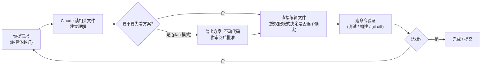
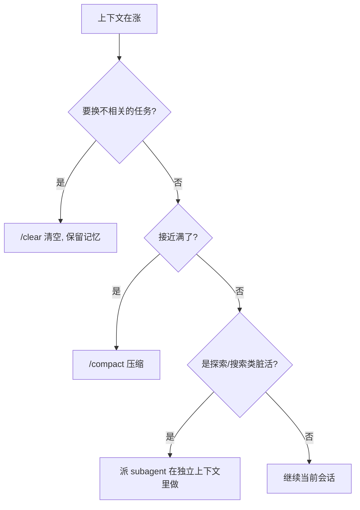

# Claude Code CLI 使用教程

> 这份文档是 **Claude Code（命令行编程助手）** 的入门到精通教程，覆盖安装、登录、会话交互、权限模型、slash 命令、CLAUDE.md 记忆、skills、子代理（subagent）、hooks、MCP、settings.json、插件、模型选择、Git/CI 集成和排错。Claude Code 迭代很快，**最终以本机 `/help`、`/config` 和官方文档 `docs.claude.com/en/docs/claude-code` 为准**。生成日期：2026-06-10。

---

## 1. 先记住五句话

1. **Claude Code 是“在终端里直接读写你代码仓库的 AI 助手”**：它能读文件、改文件、跑命令、提交 git，而不只是聊天。
2. **它的行为受三层东西约束**：权限模式（你授权它能做什么）、CLAUDE.md（项目/个人长期指令）、settings.json（配置）。先把这三样理解清楚，用起来就稳。
3. **上下文是有限资源**：会话越长越贵、越容易忘事。任务切换就 `/clear`，探索性脏活丢给 subagent，长流程沉淀进 CLAUDE.md 或 skill。
4. **能力扩展靠四件套**：slash 命令（你主动触发）、skills（按场景自动/手动触发的操作手册）、subagents（独立上下文的专职小助手）、hooks（生命周期里确定性执行的脚本）。MCP 则把外部工具/数据接进来。
5. **不确定就查，不要猜**：`/help` 列命令、`/config` 调配置、`/model` 看可用模型、`claude doctor` 体检。版本不同细节会变。

---

## 2. 它能干什么 / 不适合干什么

| 适合 | 不适合 / 要小心 |
|---|---|
| 在已有仓库里读代码、定位逻辑、解释链路 | 完全无约束地在生产/宿主机上跑破坏性命令 |
| 写功能、改 bug、补测试，并自己跑命令验证 | 把整个超大代码库一次性塞进上下文 |
| 多文件重构，配合 plan 模式先看方案再动手 | 指望它记住上一个会话里没写进 CLAUDE.md 的约定 |
| git 操作、提交、开 PR、CI 里跑自动化 | 在缺少明确成功标准时“让它自己看着办” |
| 接数据库 / 浏览器 / 内部服务（通过 MCP） | 把密钥明文写进 prompt 或 CLAUDE.md |

---

## 3. 安装与更新

### 安装方式

| 平台 / 方式 | 命令 | 自动更新 |
|---|---|---|
| macOS / Linux / WSL（原生安装，推荐） | `curl -fsSL https://claude.ai/install.sh \| bash` | 是 |
| Windows PowerShell | `irm https://claude.ai/install.ps1 \| iex` | 是 |
| npm（需 Node.js 18+） | `npm install -g @anthropic-ai/claude-code` | 否（手动） |
| Homebrew | `brew install --cask claude-code` | 否 |

原生安装后二进制通常在 `~/.local/bin/claude`（Windows 在 `%USERPROFILE%\.local\bin\claude.exe`）。

### 验证与更新

```bash
claude --version        # 看版本
claude doctor           # 环境体检：PATH、配置、网络、权限
claude update           # 手动更新（原生安装通常会自动更新）
```

> 关掉自动更新：在 settings.json 的 `env` 里设 `DISABLE_AUTOUPDATER=1`。

---

## 4. 登录与认证

Claude Code 支持两类身份：**订阅账号（Pro/Max/Team/Enterprise）** 和 **API Key（Anthropic Console / Bedrock / Vertex）**。

```bash
claude            # 首次启动会拉起浏览器走 OAuth；无法弹浏览器时按提示粘贴登录码
/login            # 会话内重新登录 / 切换账号
/logout           # 登出
```

常用环境变量（优先级高于交互式登录）：

| 变量 | 用途 |
|---|---|
| `ANTHROPIC_API_KEY` | 直接用 Console 的 API Key 认证 |
| `ANTHROPIC_BASE_URL` | 走自建网关 / 代理（例如 claude-code-proxy） |
| `CLAUDE_CODE_OAUTH_TOKEN` | 长期 token（`claude setup-token` 生成），用于脚本/CI |
| `CLAUDE_CODE_USE_BEDROCK` / `CLAUDE_CODE_USE_VERTEX` | 走 AWS Bedrock / Google Vertex |

> 想用第三方模型（DeepSeek、Kimi、GLM、本地模型）替 Claude Code 的后端，可参考本库的 [[tools/claude-code-proxy/index|claude-code-proxy 项目 Wiki]]，它通过 `ANTHROPIC_BASE_URL` 把请求翻译到别的供应商。

---

## 5. 启动与基本交互

### 启动方式

```bash
claude                      # 进入交互式 REPL（最常用）
claude "帮我看看这个项目是干嘛的"   # 带一句话启动
claude -p "总结这个目录"           # print 模式：跑完即退出，适合脚本
claude -c                   # --continue：继续当前目录最近一次会话
claude -r                   # --resume：从历史会话列表里挑一个继续
cat err.log | claude -p "分析这段日志"   # 管道：stdin 作为上下文
```

### 常用快捷键（交互式）

| 按键 | 作用 |
|---|---|
| `Esc` | 打断 Claude 当前动作（最常用，比 Ctrl+C 温和，留在会话里） |
| `Ctrl+C` | 中断 / 再按退出 |
| `Ctrl+D` | 退出会话 |
| `Shift+Tab` | 循环切换权限模式（default → acceptEdits → plan …） |
| `↑ / ↓` | 翻历史输入 |
| `Tab` | 补全 `/` 命令和 skill 名 |
| `@` | 引用文件/目录进上下文，例如 `解释 @src/main.c` |

---

## 6. 核心工作循环：请求 → 计划 → 编辑 → 验证



要点：
- **用 `@文件` 主动喂上下文**，比让它自己满仓库找更省 token、更准。
- **复杂改动先进 plan 模式**（`Shift+Tab` 切过去），看方案没问题再放它动手。
- **把“成功标准”说清楚**：与其说“修一下 bug”，不如说“写一个能复现这个 bug 的测试，然后让它通过”。这条来自本库 [[../../CLAUDE|全局协作规则]] 的 Goal-Driven 思路，对 Claude Code 尤其有效。

---

## 7. 权限模型（最该先搞懂的部分）

Claude Code 默认**不会**未经允许就改文件或跑命令。权限通过**模式**和**规则**两层控制。

### 权限模式（`Shift+Tab` 循环切换）

| 模式 | 行为 | 适用 |
|---|---|---|
| `default` | 每个写操作/命令都要你确认 | 上手期、敏感仓库 |
| `acceptEdits` | 自动批准文件编辑（你仍在旁边看 diff） | 你正盯着、迭代式改代码 |
| `plan` | 只分析、只给方案，**绝不动代码** | 探索、定方案阶段 |
| `bypassPermissions` | 全部放行、不再询问 | **仅限隔离容器/一次性 VM**，绝不要在宿主机用 |

启动时也可指定：`claude --permission-mode plan`。默认模式可写进 settings.json 的 `permissions.defaultMode`。

> 较新版本还引入了 `auto` 等模式（用后台分类器自动批准“安全”操作，但仍拦截 `curl | bash`、推 main、删库等高危动作）。以本机 `Shift+Tab` 循环里实际出现的模式为准。

### 权限规则（settings.json 里精确授权）

```json
{
  "permissions": {
    "allow": [
      "Bash(npm run test)",
      "Bash(git diff:*)",
      "Read(src/**)",
      "Edit(src/**)",
      "WebFetch(domain:github.com)"
    ],
    "deny": [
      "Bash(curl:*)",
      "Read(./.env)",
      "Read(./secrets/**)"
    ]
  }
}
```

规则语法是 `工具名(匹配模式)`：`Bash(npm run test)` 精确匹配、`Bash(npm run *)` 通配、`Read(src/**)` 路径 glob、`WebFetch(domain:github.com)` 限域名。会话里用 `/permissions` 查看和管理当前规则。

---

## 8. Slash 命令

输入 `/` 触发。常用内置命令：

| 命令 | 作用 |
|---|---|
| `/help` | 列出所有命令和能力 |
| `/clear` | 清空当前对话历史（保留 CLAUDE.md 和配置）——**切任务时常用** |
| `/compact` | 压缩对话以腾出上下文（上下文快满时也会自动触发） |
| `/config` | 交互式配置界面（模型、思考、权限等） |
| `/model` | 切换模型 / 查看可用型号 |
| `/init` | 分析当前代码库，自动生成起始 CLAUDE.md |
| `/memory` | 查看/编辑当前加载的所有 CLAUDE.md 记忆文件 |
| `/agents` | 查看和管理 subagent |
| `/mcp` | 查看已连接的 MCP server 及其工具 |
| `/permissions` | 查看和管理权限规则 |
| `/cost` / `/usage` | 查看本次会话的 token 消耗与花费 |
| `/review` | 内置代码审查 |
| `/resume` | 从历史会话里挑一个继续 |
| `/vim` | 切换 vim 键位 |
| `/doctor` | 配置/环境体检 |
| `/install-github-app` | 安装 GitHub App（PR 审查、@claude 提及） |

### 自定义 slash 命令

在 `.claude/commands/<名字>.md`（项目级）或 `~/.claude/commands/<名字>.md`（个人级）放一个 Markdown 文件，文件名即命令名：

```markdown
---
description: 跑全套检查并修复
argument-hint: [模块名]
---

请对 $ARGUMENTS 模块执行：
1. 跑 lint 和测试
2. 把失败项逐个修好
3. 最后用 git diff 给我看改了什么
```

- 用 `$ARGUMENTS` 接收全部参数，`$1`、`$2` 接收位置参数。
- 之后在会话里输入 `/<名字> 参数` 调用。
- 命令文件本质上是“可复用的 prompt 模板”，适合把你反复输入的指令固化下来。

---

## 9. CLAUDE.md 与项目记忆

CLAUDE.md 是 Claude Code 的**长期指令文件**，会话启动时自动加载。它分多层，从上到下叠加：

| 层级 | 位置 | 共享 | 用途 |
|---|---|---|---|
| 企业/组织 | 系统级目录（IT 下发） | 全组织 | 不可绕过的统一规范 |
| 个人 | `~/.claude/CLAUDE.md` | 否 | 你对所有项目的个人偏好 |
| 项目 | 仓库根的 `CLAUDE.md` 或 `.claude/CLAUDE.md` | 是（入库） | 团队共享的项目规范、构建命令、架构 |
| 子目录 | `src/CLAUDE.md` 等 | 是 | Claude 读到该目录文件时才按需加载 |
| 本地覆盖 | `CLAUDE.local.md`（加进 .gitignore） | 否 | 个人的项目级临时偏好 |

常用操作：
- `/init` —— 让 Claude 扫描代码库自动生成起始 CLAUDE.md。
- `/memory` —— 查看/编辑当前生效的所有记忆文件。
- 会话里以 `#` 开头说一句话，可快速把它追加进记忆。
- 在 CLAUDE.md 里用 `@路径` 导入其它文件，例如 `@README.md`、`@docs/build.md`。

**写好 CLAUDE.md 的要点：**
- 短而精，单文件尽量控制在 ~200 行内；太长会挤占上下文、降低遵守度。
- 写**具体可执行**的内容：“提交前跑 `npm test`”，而不是“记得测试”。
- 放：构建/测试命令、目录结构、命名约定、踩过的坑、明确禁止的操作。
- 多步骤流程不要堆在 CLAUDE.md 里，做成 skill（见 §11）。

> 本库根目录的 `CLAUDE.md`、`WIKI.md` 就是项目级 CLAUDE.md 的实例——它把“这是 Obsidian vault、先读 hot.md/index.md、写新页要更新哪些索引”固化成了规范。

---

## 10. 上下文管理

Claude 的上下文窗口有限，会话越长越贵也越容易“忘事”。会话启动时大致装入：系统提示 + 各层 CLAUDE.md + 自动记忆 + 当前 git 仓库信息 + 你的 prompt。

实用策略：
- **任务切换就 `/clear`**：清掉无关历史，保留 CLAUDE.md。
- **快满时 `/compact`**：手动压缩，比等它自动压缩更可控（约 90% 满会自动触发）。
- **探索性脏活丢给 subagent**：在独立上下文里跑，只把结论带回主会话（见 §12）。
- **流程沉淀进 skill / CLAUDE.md**：别让它每次重新摸索。
- **`/cost` 盯消耗**：随时看 token 花在哪。



---

## 11. Skills（技能 / 操作手册）

Skill 是一段带说明的 Markdown（`SKILL.md`），平时不占上下文，**命中场景时才加载**。它把“某类任务怎么做”写成可复用的操作手册，可由 Claude 自动触发，也可你手动调用。

位置：
- 项目级：`.claude/skills/<名字>/SKILL.md`
- 个人级：`~/.claude/skills/<名字>/SKILL.md`
- 插件自带：随插件安装

最简形态：

```markdown
---
name: format
description: 用 prettier 格式化暂存区代码。当用户要求格式化或整理代码风格时使用。
---

# 格式化代码

1. 对暂存的文件跑 prettier
2. 展示 diff
3. 确认后应用
```

要点：
- `description` 写清**什么时候该用**——Claude 靠它判断是否自动触发，所以要把触发场景写明白。
- skill 适合放“多步骤、需要稳定复现”的流程（调试套路、发布流程、文档生成）。
- 与 §8 的自定义命令的区别：自定义命令是“你主动 `/xxx` 触发的 prompt 模板”；skill 更强调“按场景被（自动）选用的完整操作手册”，可带脚本和参考文件。

> 本库已有一篇 [[tools/codex-skills-map|Codex Skills 使用地图]]，讲的是同一套 skill 思想在 Codex 侧的落地，可对照阅读。

---

## 12. Subagents（子代理）

Subagent 是**带独立上下文和独立系统提示的专职小助手**。主会话把一块活儿派给它，它在自己的上下文里干完，只把**结论**带回来——既隔离了噪音，又能并行干多件独立的事。

位置与定义：
- 项目级：`.claude/agents/<名字>.md`
- 个人级：`~/.claude/agents/<名字>.md`

```markdown
---
name: researcher
description: 调研型任务：探索代码库、查资料、汇总发现。需要广度搜索而非精确改动时用。
tools: Read, Grep, Glob, Bash, WebFetch
model: sonnet
---

你是调研专家。围绕给定问题彻底探索，收集证据，最后给出简洁的结论清单，
不要把中间过程的文件内容全倒回来——只带回结论和关键证据路径。
```

frontmatter 常用字段：`name`、`description`（决定何时被派活）、`tools`（允许用的工具）、`model`（可降级到便宜模型省钱）。

用法：
- `/agents` 查看和管理；Claude 也会**根据 description 自动决定**把合适的活派给它。
- 适合：大范围搜索、独立的并行任务、需要“换个视角对抗性复核”的审查。
- 经验法则：**要广度搜索/结论而不要文件堆**时，派 subagent；只是查一个你已知位置的事实，直接做就行。

---

## 13. Hooks（生命周期钩子）

Hook 是在**特定生命周期事件**触发时**确定性执行**的 shell 命令（不依赖 Claude 的判断，一定会跑）。用来做格式化、拦截危险操作、跑测试等自动化。

常见事件：

| 事件 | 触发时机 | 典型用途 |
|---|---|---|
| `PreToolUse` | 工具调用前 | 拦截危险命令（可阻断） |
| `PostToolUse` | 工具调用后 | 编辑后自动 lint/格式化 |
| `UserPromptSubmit` | 用户提交消息前 | 注入额外上下文、校验输入 |
| `Stop` | Claude 即将结束回复 | 收尾检查 |
| `SubagentStop` | subagent 结束 | 汇总/校验子代理结果 |
| `SessionStart` / `SessionEnd` | 会话开始 / 结束 | 加载/落盘上下文 |
| `PreCompact` | 压缩上下文前 | 保存关键信息 |
| `Notification` | 需要用户输入时 | 发通知 |

在 settings.json 里配置（按事件名分组，`matcher` 匹配工具，`hooks` 列出要跑的命令）：

```json
{
  "hooks": {
    "PostToolUse": [
      {
        "matcher": "Edit|Write",
        "hooks": [
          { "type": "command", "command": "npm run lint --silent" }
        ]
      }
    ],
    "PreToolUse": [
      {
        "matcher": "Bash",
        "hooks": [
          { "type": "command", "command": "$CLAUDE_PROJECT_DIR/.claude/guard.sh" }
        ]
      }
    ]
  }
}
```

要点：
- hook 拿到的事件数据通过 **stdin 的 JSON** 传入；hook 可用**退出码**或返回 JSON 来控制流程（如 `PreToolUse` 用非零退出/特定 JSON 阻断该次工具调用）。
- 自动化需求（“每次 X 都 Y”）要靠 hook，而不是指望 Claude 自觉——hook 由 harness 执行，确定会跑。
- 具体可用事件、字段和返回约定以官方 hooks 文档和本机版本为准。

---

## 14. MCP（Model Context Protocol）

MCP 是把**外部工具/数据源**接进 Claude Code 的开放标准：数据库、浏览器、内部 API、第三方服务等。

添加 server：

```bash
claude mcp add <名字> -- <启动命令>         # 本地 stdio server
claude mcp add --transport sse <名字> <url>  # 远程 SSE
claude mcp add --transport http <名字> <url> # 远程 HTTP
claude mcp list                              # 列出已配置的 server
claude mcp remove <名字>
```

也可直接写 `.mcp.json`（项目级、可入库共享）：

```json
{
  "mcpServers": {
    "postgres": {
      "command": "/path/to/postgres-mcp",
      "args": ["--connection-string", "postgresql://..."],
      "env": { "PGPASSWORD": "..." }
    },
    "github": {
      "type": "http",
      "url": "https://mcp.example.com/github"
    }
  }
}
```

要点：
- 三种传输：**stdio**（本地进程，最常见）、**SSE**、**HTTP**。远程 server 常需 OAuth，Claude Code 会引导授权。
- 作用域（scope）：local（仅自己）/ project（入库共享 `.mcp.json`）/ user（本机全局）。
- 会话里用 `/mcp` 查看连接状态和每个 server 暴露的工具；之后用自然语言让 Claude 调用即可。

---

## 15. settings.json（配置）

配置分层，优先级从高到低：**企业托管 > 命令行参数 > 项目本地 `.claude/settings.local.json` > 项目 `.claude/settings.json` > 个人 `~/.claude/settings.json`**。

| 文件 | 作用域 | 入库 |
|---|---|---|
| `~/.claude/settings.json` | 个人，所有项目 | 否 |
| `.claude/settings.json` | 项目，团队共享 | 是 |
| `.claude/settings.local.json` | 项目，仅自己 | 否（应进 .gitignore） |

常用键：

```json
{
  "model": "opus",
  "permissions": {
    "defaultMode": "default",
    "allow": ["Bash(npm run test)", "Edit(src/**)"],
    "deny": ["Read(./.env)"]
  },
  "env": { "DISABLE_AUTOUPDATER": "0" },
  "hooks": { "PostToolUse": [ /* ... */ ] },
  "includeCoAuthoredBy": true,
  "enabledPlugins": { "code-review@claude-plugins-official": true }
}
```

- `model`：新会话默认模型。
- `permissions`：默认模式 + allow/deny 规则（见 §7）。
- `env`：注入会话的环境变量。
- `hooks`：生命周期钩子（见 §13）。
- `includeCoAuthoredBy`：提交信息里是否带 Claude 的 Co-Authored-By。
- `enabledPlugins`：启用哪些插件。

> `permissions`、`hooks`、`env`、`enabledPlugins` 通常可热更新；`model` 等改完用 `/model` 或重开会话生效。不确定的键用 `/config` 在界面里调，最稳。

---

## 16. 插件（Plugins）

插件把 **skills + 命令 + subagents + hooks + MCP server** 打包，从 marketplace 安装、自动更新。

```text
/plugin                 # 打开插件管理界面（浏览 / 安装 / 启停）
```

在 settings.json 里声明启用和自定义 marketplace：

```json
{
  "enabledPlugins": { "security@claude-plugins-official": true },
  "extraKnownMarketplaces": {
    "internal": { "source": { "source": "github", "repo": "company/cc-marketplace" } }
  }
}
```

一个插件可以一次性带来一组配套能力，适合团队统一分发工作流。

---

## 17. 模型选择

```text
/model              # 打开选择器 / 查看当前可用型号
/model opus         # 切到 Opus（最强，复杂推理/长任务）
/model sonnet       # 切到 Sonnet（日常编码，均衡）
/model haiku        # 切到 Haiku（快、便宜、轻量任务）
```

- 别名（`opus`/`sonnet`/`haiku` 等）映射到当前版本的具体型号，**以 `/model` 实际列出的为准**。
- 部分版本支持 1M 长上下文变体、以及 plan 用强模型/执行用快模型的混合策略。
- 子代理可在 frontmatter 里单独指定 `model`，把不需要顶配的活降级省钱。

---

## 18. Git / GitHub / CI 集成

**会话里直接用自然语言驱动 git：**

```text
我改了哪些文件?            # → git status / diff
帮我提交, 写好 commit message
建一个分支 feature/xxx
把最近 5 个提交列出来
```

提交相关约定可写进 CLAUDE.md（比如 commit message 规范、是否带 Co-Authored-By）。

**GitHub App / Actions：**
- `/install-github-app` 安装 GitHub App，启用 PR 自动审查、在 issue/PR 里 `@claude` 提及。
- CI 里用官方 `anthropics/claude-code-action`，配合 `CLAUDE_CODE_OAUTH_TOKEN`，可在流水线里跑审查/修复。

---

## 19. 无头模式 / 自动化 / SDK

print 模式（`-p`）是脚本化的核心：

```bash
claude -p "总结本仓库改动" --output-format json     # 结构化输出, 带 session_id/花费等
claude -p "跑测试并修复" --permission-mode acceptEdits
claude -p "审查" --allowedTools "Read,Bash(git diff:*)"
```

- `--output-format json` / `stream-json`：拿结构化结果，便于脚本解析。
- `--allowedTools` / `--permission-mode`：在非交互场景下预先授权，避免卡在确认。
- 串接会话：先用 json 输出拿 `session_id`，后续 `--resume <id>` 继续。
- 需要更深的程序化集成（构建自己的 agent）时，用 **Claude Agent SDK**（Python / TypeScript）。

---

## 20. 最佳实践与常见坑

**有效习惯：**
1. **先具体，再动手**：把目标、约束、成功标准说清楚，胜过反复纠偏。
2. **复杂改动先 plan 模式**：看方案再放行，避免它一头扎错方向。
3. **权限模式按场景切**：敏感活 `default`，盯着迭代 `acceptEdits`，探索 `plan`。
4. **激进管理上下文**：切任务 `/clear`，脏活丢 subagent，流程进 skill/CLAUDE.md。
5. **CLAUDE.md 当“团队约定”养**：入库、短小、具体、定期修剪。
6. **自动化用 hook，不靠自觉**：“每次提交前跑测试”这种确定性需求写成 hook。
7. **尽早纠偏**：方向不对就 `Esc` 打断、当场说清楚，别等它跑完。

**常见坑：**

| 坑 | 为什么 | 怎么修 |
|---|---|---|
| 需求含糊（“修一下 bug”） | 它得满仓库瞎找，烧上下文还容易改偏 | 给出复现条件和期望行为 |
| CLAUDE.md 写成长篇大论 | 挤占上下文、降低遵守度 | 拆成 skill / 子目录 CLAUDE.md，主文件保持精简 |
| 全程 `default` 模式逐个确认 | 累、慢 | 你在审 diff 就切 `acceptEdits` |
| 指望它记得上次会话的口头约定 | 没写进 CLAUDE.md 就不会持久 | 用 `#` 或写进 CLAUDE.md |
| 上下文爆了会话卡住 | 自动压缩被动触发 | 主动 `/compact`、任务间 `/clear` |
| 密钥写进 prompt/CLAUDE.md | 会进上下文/入库泄露 | 用环境变量 + `permissions.deny` 挡住读取 |

---

## 21. 排错速查

```bash
claude doctor      # 配置/环境/网络体检（在会话外跑）
claude --version
```

会话内：

| 命令 | 看什么 |
|---|---|
| `/status` | 账号类型、当前模型、版本 |
| `/config` | 交互式配置 |
| `/memory` | 当前加载了哪些 CLAUDE.md |
| `/mcp` | MCP server 连接状态 |
| `/permissions` | 当前权限规则 |
| `/cost` | token 消耗与花费 |

| 现象 | 可能原因 / 处理 |
|---|---|
| `command not found: claude` | 不在 PATH，检查 `~/.local/bin` 是否在 PATH，或重装 |
| CLAUDE.md 没生效 | 位置不对，用 `/memory` 看实际加载了什么 |
| 一直弹权限确认 | 模式没切，`Shift+Tab` 或设 `defaultMode`，或加 allow 规则 |
| git 命令被拒 | 给 `permissions.allow` 加 `Bash(git *)` |
| MCP 连不上 | `.mcp.json` 语法/路径错，用 `/mcp` 核对 |
| OAuth 反复登录 | token 过期，`/login` 重新认证 |
| 模型不可用 | 订阅不匹配或型号已退役，用 `/model` 选可用的 |

---

## 22. 关联资源

- 官方文档：`https://docs.claude.com/en/docs/claude-code`
- 本库工具入口：[[tools/index|工具链知识库]]
- Codex 侧对照：[[tools/codex-skills-map|Codex Skills 使用地图]]
- 换后端供应商：[[tools/claude-code-proxy/index|claude-code-proxy 项目 Wiki]]
- AI 协作经验：[[synthesis/AI 协作远程编辑经验]]

## 23. 维护说明

新增/修改本页后需同步更新 [[tools/index|工具链知识库]]、[[index|Wiki 总索引]]（如需）、[[log|Wiki Log]] 和 [[hot|Hot Cache]]。详细规则见 [[meta/wiki-maintenance-rules|Wiki 维护规则]]。Claude Code 迭代快，发现命令/配置与本机实际不符时，以 `/help`、`/config` 和官方文档为准并回写本页。
