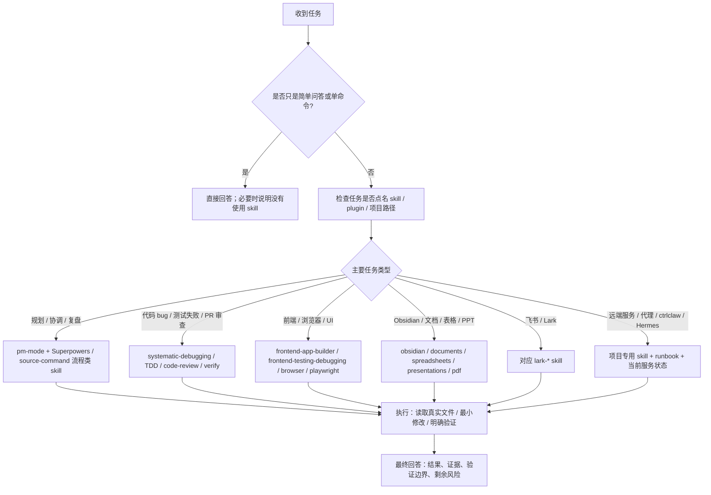

# Codex Skills 使用地图

> 这份文档盘点当前 Codex 能在全局目录和已启用插件目录中发现的真实 SKILL.md，说明它们什么时候会被触发、怎么使用、以及如何选择。生成日期：2026-05-28。

## 1. 先记住三句话

1. **Skill 是本地的任务操作手册**：入口通常是 `SKILL.md`，里面写触发场景、执行步骤、脚本、模板和验证要求。
2. **Skill 不等于自动执行所有事**：命中 skill 后，Codex 会先读取对应 `SKILL.md`，再按里面的流程决定是否读参考文件、运行脚本、调用工具或改文件。
3. **重名 skill 以当前会话暴露的版本和任务上下文为准**：全局目录、Agents 目录和插件 cache 可能有重复；同名重复时优先使用当前会话列出的能力，必要时再看来源路径。

## 2. Codex 会怎样使用 skill

| 阶段 | Codex 实际动作 | 你能期待的结果 |
|---|---|---|
| 识别 | 根据用户点名、任务类型、文件路径、错误类型匹配 skill。 | 明确说明正在使用哪些 skill，以及为什么。 |
| 读取 | 打开对应 `SKILL.md`，只读取完成当前任务所需的步骤和引用文件。 | 不把整个技能库塞进上下文，降低噪音。 |
| 执行 | 按 skill 的 workflow 做调查、计划、编辑、调用工具或运行脚本。 | 行为更稳定，特别适合调试、PM、文档、前端测试、飞书操作。 |
| 验证 | 根据 skill 的要求做最小但有意义的检查。 | 最终回答会区分已验证、未验证和推断。 |

## 3. 选择流程图

## 4. 当前来源总览

- 可发现 SKILL.md 文件数：121
- 去重后 skill 数：100
- 重名 / 多来源 skill 数：21

### 按来源

| 来源 | 文件数 |
|---|---:|
| Agents global | 47 |
| Codex global | 25 |
| Plugin browser@openai-bundled | 1 |
| Plugin build-web-apps@openai-curated | 6 |
| Plugin canva@openai-curated | 3 |
| Plugin claude-code-setup@claude-plugins-official | 1 |
| Plugin claude-md-management@claude-plugins-official | 1 |
| Plugin coderabbit@openai-curated | 1 |
| Plugin documents@openai-primary-runtime | 1 |
| Plugin frontend-design@claude-plugins-official | 1 |
| Plugin hookify@claude-plugins-official | 1 |
| Plugin presentations@openai-primary-runtime | 1 |
| Plugin skill-creator@claude-plugins-official | 1 |
| Plugin spreadsheets@openai-primary-runtime | 1 |
| Plugin supabase@openai-curated | 2 |
| Plugin superpowers@claude-plugins-official | 14 |
| Plugin superpowers@openai-curated | 14 |

### 按用途

| 用途 | 去重 skill 数 |
|---|---:|
| PM / 流程 / Agent 编排 | 24 |
| 代码质量 / 调试 / 审查 | 20 |
| Web / 前端 / 浏览器 | 13 |
| 文档 / 知识库 / 办公内容 | 10 |
| 飞书 / Lark 协作 | 23 |
| 远端运维 / 项目专用 / 媒体 | 6 |
| 媒体 / 设计 / 生成 | 4 |

## 5. 推荐使用顺序

| 场景 | 优先 skill | 使用方式 |
|---|---|---|
| 任务复杂、需要拆解或协调 | `pm-mode`、`superpowers:writing-plans`、`source-command-planning` | 先明确目标、假设、验收标准，再执行。 |
| 遇到 bug、CI 失败、测试失败 | `systematic-debugging`、`test-driven-development`、`verification-before-completion` | 先复现和定位，再写最小修复，最后验证。 |
| 代码审查或 PR 反馈 | `code-review`、`coderabbit:code-review`、`receiving-code-review` | findings 优先，按严重度列文件/行号，避免泛泛总结。 |
| 前端页面、Web App、UI 验证 | `frontend-app-builder`、`frontend-testing-debugging`、`browser`、`playwright` | 构建后用真实浏览器截图/交互验证。 |
| 写入本地知识库 | `obsidian-technical-wiki-writer`、`obsidian-vault-index-maintenance` | 写正文，同时更新总索引、专区索引、Hot Cache、Log。 |
| 飞书 / Lark 操作 | 对应 `lark-*` skill | 先选具体模块：消息、文档、表格、日历、任务、审批、会议等。 |
| 临时代理、隧道、远端服务 | `temporary-proxy-tunnel-lifecycle`、项目专用 skill | 明确 run/stop/status/cleanup，并保护共享服务。 |
| ctrlclaw.online / ComfyUI | `ctrlclaw-comfy-maintenance` | 先查 deployed service 和 health，再改最小范围。 |

## 6. 全量技能清单

### PM / 流程 / Agent 编排

| Skill | 什么时候用 | 来源 |
|---|---|---|
| `brainstorming` | You MUST use this before any creative work - creating features, building components, adding functionality, or modifying behavior. Explores user inten... | superpowers |
| `Cross-Session Learning` | 需要跨会话复用经验、检查历史错误或沉淀记忆时使用。 | Codex global Agents global |
| `dispatching-parallel-agents` | 任务可拆成多个互不依赖调查/实现单元时，用来并行分派子代理。 | superpowers |
| `executing-plans` | Use when you have a written implementation plan to execute in a separate session with review checkpoints | superpowers |
| `finishing-a-development-branch` | Use when implementation is complete, all tests pass, and you need to decide how to integrate the work - guides completion of development work by pres... | superpowers |
| `memory-management-model` | 需要跨会话复用经验、检查历史错误或沉淀记忆时使用。 | Codex global Agents global |
| `plugin-creator` | Create and scaffold plugin directories for Codex with a required `.codex-plugin/plugin.json`, optional plugin folders/files, valid manifest defaults,... | Codex global |
| `pm-mode` | 用于把 Codex 切到 PM / 项目经理工作方式：拆目标、列成功标准、协调执行和验收。 | Codex global |
| `skill-creator` | 创建、改进、评估或安装 Codex skill 时使用。 | Codex global skill-creator |
| `skill-installer` | Install Codex skills into $CODEX_HOME/skills from a curated list or a GitHub repo path. Use when a user asks to list installable skills, install a cu... | Codex global |
| `source-command-brainstorming` | You MUST use this before any creative work - creating features, building components, adding functionality, or modifying behavior. Explores user inten... | Agents global |
| `source-command-dispatching-parallel-agents` | 任务可拆成多个互不依赖调查/实现单元时，用来并行分派子代理。 | Agents global |
| `source-command-execute-plan` | Use when you have a written implementation plan to execute in a separate session with review checkpoints | Agents global |
| `source-command-plan` | Start Manus-style file-based planning. Creates task_plan.md, findings.md, progress.md for complex tasks. | Agents global |
| `source-command-planning` | 多步骤或有风险的任务，先写计划、验收点和回滚/验证路径。 | Agents global |
| `source-command-skill-creator` | 创建、改进、评估或安装 Codex skill 时使用。 | Agents global |
| `source-command-subagent-dev` | 任务可拆成多个互不依赖调查/实现单元时，用来并行分派子代理。 | Agents global |
| `source-command-write-plan` | 多步骤或有风险的任务，先写计划、验收点和回滚/验证路径。 | Agents global |
| `subagent-driven-development` | 任务可拆成多个互不依赖调查/实现单元时，用来并行分派子代理。 | superpowers |
| `using-git-worktrees` | Use when starting feature work that needs isolation from current workspace or before executing implementation plans - ensures an isolated workspace e... | superpowers |
| `using-superpowers` | 每次新对话先检查可用 skill，并按任务触发对应方法论。 | superpowers |
| `writing-hookify-rules` | This skill should be used when the user asks to "create a hookify rule", "write a hook rule", "configure hookify", "add a hookify rule", or needs gui... | hookify |
| `writing-plans` | 多步骤或有风险的任务，先写计划、验收点和回滚/验证路径。 | superpowers |
| `writing-skills` | 创建、改进、评估或安装 Codex skill 时使用。 | superpowers |

### 代码质量 / 调试 / 审查

| Skill | 什么时候用 | 来源 |
|---|---|---|
| `anysearch` | Real-time search engine supporting web search, vertical domain search (23 domains), parallel batch search, and URL content extraction. | Codex global |
| `claude-api` | Build, debug, and optimize Claude API / Anthropic SDK apps. Apps built with this skill should include prompt caching. Also handles migrating existing... | Codex global |
| `code-review` | Reviews code changes using CodeRabbit AI. Use when user asks for code review, PR feedback, code quality checks, security issues, or requests fix-revi... | coderabbit |
| `Codex-api` | Build, debug, and optimize Codex API / Anthropic SDK apps. Apps built with this skill should include prompt caching. Also handles migrating existing ... | Agents global |
| `codex-automation-registry-check` | Use after creating, editing, migrating, renaming, enabling, disabling, or troubleshooting a Codex automation, especially cron/recurring automations, ... | Codex global |
| `mcp-builder` | 创建或调试 MCP server / MCP 能力封装时使用。 | Codex global Agents global |
| `receiving-code-review` | Use when receiving code review feedback, before implementing suggestions, especially if feedback seems unclear or technically questionable - requires... | superpowers |
| `requesting-code-review` | Use when completing tasks, implementing major features, or before merging to verify work meets requirements | superpowers |
| `source-command-systematic-debugging` | 遇到 bug、测试失败、线上异常、不可解释行为时，先复现、分层定位，再修。 | Agents global |
| `source-command-verify` | 准备声明完成、修复、通过前，用来做最后验证和边界说明。 | Agents global |
| `systematic-debugging` | 遇到 bug、测试失败、线上异常、不可解释行为时，先复现、分层定位，再修。 | superpowers |
| `test-driven-development` | 实现 feature 或 bugfix 前，先写能失败的测试，再写最小实现。 | superpowers |
| `understand` | 需要用知识图谱理解代码库、diff、模块或业务域时使用。 | Agents global |
| `understand-chat` | 需要用知识图谱理解代码库、diff、模块或业务域时使用。 | Agents global |
| `understand-diff` | 需要用知识图谱理解代码库、diff、模块或业务域时使用。 | Agents global |
| `understand-domain` | 需要用知识图谱理解代码库、diff、模块或业务域时使用。 | Agents global |
| `understand-explain` | 需要用知识图谱理解代码库、diff、模块或业务域时使用。 | Agents global |
| `understand-knowledge` | 需要用知识图谱理解代码库、diff、模块或业务域时使用。 | Agents global |
| `understand-onboard` | 需要用知识图谱理解代码库、diff、模块或业务域时使用。 | Agents global |
| `verification-before-completion` | 准备声明完成、修复、通过前，用来做最后验证和边界说明。 | superpowers |

### Web / 前端 / 浏览器

| Skill | 什么时候用 | 来源 |
|---|---|---|
| `browser` | 需要真实浏览器打开、点击、截图、检查本地 Web 应用时使用。 | browser |
| `codex-browser-iab-bootstrap` | 需要真实浏览器打开、点击、截图、检查本地 Web 应用时使用。 | Codex global |
| `frontend-app-builder` | 需要构建或调试前端应用、页面、组件、交互和视觉质量时使用。 | build-web-apps |
| `frontend-design` | 需要构建或调试前端应用、页面、组件、交互和视觉质量时使用。 | frontend-design |
| `frontend-testing-debugging` | 需要构建或调试前端应用、页面、组件、交互和视觉质量时使用。 | build-web-apps |
| `playwright` | 需要真实浏览器打开、点击、截图、检查本地 Web 应用时使用。 | Codex global |
| `react-best-practices` | 需要构建或调试前端应用、页面、组件、交互和视觉质量时使用。 | build-web-apps |
| `shadcn` | 需要构建或调试前端应用、页面、组件、交互和视觉质量时使用。 | build-web-apps |
| `stripe-best-practices` | Guides Stripe integration decisions — API selection (Checkout Sessions vs PaymentIntents), Connect platform setup (Accounts v2, controller properties... | build-web-apps |
| `supabase` | Use when doing ANY task involving Supabase. Triggers: Supabase products (Database, Auth, Edge Functions, Realtime, Storage, Vectors, Cron, Queues); c... | supabase |
| `supabase-postgres-best-practices` | Postgres performance optimization and best practices from Supabase. Use this skill when writing, reviewing, or optimizing Postgres queries, schema de... | supabase build-web-apps |
| `understand-dashboard` | 需要用知识图谱理解代码库、diff、模块或业务域时使用。 | Agents global |
| `webapp-testing` | 需要真实浏览器打开、点击、截图、检查本地 Web 应用时使用。 | Codex global Agents global |

### 文档 / 知识库 / 办公内容

| Skill | 什么时候用 | 来源 |
|---|---|---|
| `canva-branded-presentation` | 需要生成、编辑、管理图片/设计/媒体资产时使用。 | canva |
| `codex-reflection-archiver` | Use whenever the user asks for Codex self-reflection, 总结反思, 自我反思, 复盘, 项目总结, project retrospective, automation evolution, prompt evolution, skill evol... | Codex global |
| `documents` | Create, edit, redline, and comment on `.docx`, Word, and Google Docs-targeted document artifacts inside the container, with a strict render-and-verif... | documents |
| `dws` | 管理钉钉产品能力(AI表格/日历/通讯录/群聊与机器人/待办/审批/考勤/日志/DING消息/开放平台文档/钉钉文档/钉钉云盘/AI听记/邮箱/在线电子表格/知识库等)。当用户需要操作表格数据、管理日程会议、查询通讯录、管理群聊、机器人发消息、创建待办、提交审批、查看考勤、提交日报周报（钉钉日志模... | Codex global Agents global |
| `obsidian-technical-wiki-writer` | 需要把结果写入或维护本地 Obsidian wiki 时使用，并同步索引。 | Codex global |
| `obsidian-vault-index-maintenance` | 需要把结果写入或维护本地 Obsidian wiki 时使用，并同步索引。 | Codex global |
| `openai-docs` | Use when the user asks how to build with OpenAI products or APIs and needs up-to-date official documentation with citations, help choosing the latest... | Codex global |
| `pdf` | Use when tasks involve reading, creating, or reviewing PDF files where rendering and layout matter; prefer visual checks by rendering pages (Poppler)... | Codex global |
| `Presentations` | Build PowerPoint PPTX decks with artifact-tool presentation JSX | presentations |
| `Spreadsheets` | Use this skill when a user requests to create, modify, analyze, visualize, or work with spreadsheet files (`.xlsx`, `.xls`, `.csv`, `.tsv`) or Google... | spreadsheets |

### 飞书 / Lark 协作

| Skill | 什么时候用 | 来源 |
|---|---|---|
| `lark-approval` | 需要操作飞书对应模块时使用，例如消息、日历、文档、多维表格、审批、任务或会议。 | Agents global |
| `lark-attendance` | 需要操作飞书对应模块时使用，例如消息、日历、文档、多维表格、审批、任务或会议。 | Agents global |
| `lark-base` | 需要操作飞书对应模块时使用，例如消息、日历、文档、多维表格、审批、任务或会议。 | Agents global |
| `lark-calendar` | 需要操作飞书对应模块时使用，例如消息、日历、文档、多维表格、审批、任务或会议。 | Agents global |
| `lark-contact` | 需要操作飞书对应模块时使用，例如消息、日历、文档、多维表格、审批、任务或会议。 | Agents global |
| `lark-doc` | 需要操作飞书对应模块时使用，例如消息、日历、文档、多维表格、审批、任务或会议。 | Agents global |
| `lark-drive` | 需要操作飞书对应模块时使用，例如消息、日历、文档、多维表格、审批、任务或会议。 | Agents global |
| `lark-event` | 需要操作飞书对应模块时使用，例如消息、日历、文档、多维表格、审批、任务或会议。 | Agents global |
| `lark-im` | 需要操作飞书对应模块时使用，例如消息、日历、文档、多维表格、审批、任务或会议。 | Agents global |
| `lark-mail` | 需要操作飞书对应模块时使用，例如消息、日历、文档、多维表格、审批、任务或会议。 | Agents global |
| `lark-minutes` | 需要操作飞书对应模块时使用，例如消息、日历、文档、多维表格、审批、任务或会议。 | Agents global |
| `lark-okr` | 需要操作飞书对应模块时使用，例如消息、日历、文档、多维表格、审批、任务或会议。 | Agents global |
| `lark-openapi-explorer` | 需要操作飞书对应模块时使用，例如消息、日历、文档、多维表格、审批、任务或会议。 | Agents global |
| `lark-shared` | 需要操作飞书对应模块时使用，例如消息、日历、文档、多维表格、审批、任务或会议。 | Agents global |
| `lark-sheets` | 需要操作飞书对应模块时使用，例如消息、日历、文档、多维表格、审批、任务或会议。 | Agents global |
| `lark-skill-maker` | 需要操作飞书对应模块时使用，例如消息、日历、文档、多维表格、审批、任务或会议。 | Agents global |
| `lark-slides` | 需要操作飞书对应模块时使用，例如消息、日历、文档、多维表格、审批、任务或会议。 | Agents global |
| `lark-task` | 需要操作飞书对应模块时使用，例如消息、日历、文档、多维表格、审批、任务或会议。 | Agents global |
| `lark-vc` | 需要操作飞书对应模块时使用，例如消息、日历、文档、多维表格、审批、任务或会议。 | Agents global |
| `lark-whiteboard` | 需要操作飞书对应模块时使用，例如消息、日历、文档、多维表格、审批、任务或会议。 | Agents global |
| `lark-wiki` | 需要操作飞书对应模块时使用，例如消息、日历、文档、多维表格、审批、任务或会议。 | Agents global |
| `lark-workflow-meeting-summary` | 需要操作飞书对应模块时使用，例如消息、日历、文档、多维表格、审批、任务或会议。 | Agents global |
| `lark-workflow-standup-report` | 需要操作飞书对应模块时使用，例如消息、日历、文档、多维表格、审批、任务或会议。 | Agents global |

### 远端运维 / 项目专用 / 媒体

| Skill | 什么时候用 | 来源 |
|---|---|---|
| `ccproxy-project-convergence-review` | Use after multiple ccproxy, Claude Code Proxy, or claude-code-proxy subtask sessions to consolidate implementation status, tests, docs, provider beha... | Codex global |
| `claude-automation-recommender` | Analyze a codebase and recommend Claude Code automations (hooks, subagents, skills, plugins, MCP servers). Use when user asks for automation recommen... | claude-code-setup |
| `claude-md-improver` | Audit and improve CLAUDE.md files in repositories. Use when user asks to check, audit, update, improve, or fix CLAUDE.md files. Scans for all CLAUDE.... | claude-md-management |
| `codex-session-project-bootstrap` | Use when the user asks to migrate/copy a previous Codex session into the current project, initialize or update AGENTS.md from project responsibilitie... | Codex global |
| `ctrlclaw-comfy-maintenance` | 处理 ctrlclaw.online、ctrlclaw-comfy-app、ComfyUI 工作流或服务状态时使用。 | Codex global |
| `temporary-proxy-tunnel-lifecycle` | 创建、排查、重启或清理临时代理、隧道、转发服务时使用。 | Codex global |

### 媒体 / 设计 / 生成

| Skill | 什么时候用 | 来源 |
|---|---|---|
| `canva-resize-for-all-social-media` | 需要生成、编辑、管理图片/设计/媒体资产时使用。 | canva |
| `canva-translate-design` | 需要生成、编辑、管理图片/设计/媒体资产时使用。 | canva |
| `hatch-pet` | 需要生成、编辑、管理图片/设计/媒体资产时使用。 | Codex global |
| `imagegen` | 需要生成、编辑、管理图片/设计/媒体资产时使用。 | Codex global |

## 7. 重名 skill 怎么理解

同一个 skill 可能来自多个位置，例如全局安装和插件自带版本同时存在。实际使用时按当前会话的 skill 列表和任务触发规则选择；如果行为有差异，优先读取当前会话暴露路径里的 `SKILL.md`。

| Skill | 来源数 | 来源 |
|---|---:|---|
| `brainstorming` | 2 | Plugin superpowers@claude-plugins-official Plugin superpowers@openai-curated |
| `Cross-Session Learning` | 2 | Codex global Agents global |
| `dispatching-parallel-agents` | 2 | Plugin superpowers@claude-plugins-official Plugin superpowers@openai-curated |
| `dws` | 2 | Codex global Agents global |
| `executing-plans` | 2 | Plugin superpowers@claude-plugins-official Plugin superpowers@openai-curated |
| `finishing-a-development-branch` | 2 | Plugin superpowers@claude-plugins-official Plugin superpowers@openai-curated |
| `mcp-builder` | 2 | Codex global Agents global |
| `memory-management-model` | 2 | Codex global Agents global |
| `receiving-code-review` | 2 | Plugin superpowers@claude-plugins-official Plugin superpowers@openai-curated |
| `requesting-code-review` | 2 | Plugin superpowers@claude-plugins-official Plugin superpowers@openai-curated |
| `skill-creator` | 2 | Codex global Plugin skill-creator@claude-plugins-official |
| `subagent-driven-development` | 2 | Plugin superpowers@claude-plugins-official Plugin superpowers@openai-curated |
| `supabase-postgres-best-practices` | 2 | Plugin supabase@openai-curated Plugin build-web-apps@openai-curated |
| `systematic-debugging` | 2 | Plugin superpowers@claude-plugins-official Plugin superpowers@openai-curated |
| `test-driven-development` | 2 | Plugin superpowers@claude-plugins-official Plugin superpowers@openai-curated |
| `using-git-worktrees` | 2 | Plugin superpowers@claude-plugins-official Plugin superpowers@openai-curated |
| `using-superpowers` | 2 | Plugin superpowers@claude-plugins-official Plugin superpowers@openai-curated |
| `verification-before-completion` | 2 | Plugin superpowers@claude-plugins-official Plugin superpowers@openai-curated |
| `webapp-testing` | 2 | Codex global Agents global |
| `writing-plans` | 2 | Plugin superpowers@claude-plugins-official Plugin superpowers@openai-curated |
| `writing-skills` | 2 | Plugin superpowers@claude-plugins-official Plugin superpowers@openai-curated |

## 8. 常见场景速查

| 你说的话 / 任务信号 | Codex 应优先考虑 | 备注 |
|---|---|---|
| “修这个 bug / 测试挂了 / 日志报错” | `systematic-debugging`、`test-driven-development` | 先复现，不直接猜修法。 |
| “review / 看 PR / 找风险” | `code-review` 或 `coderabbit:code-review` | findings 放最前，按严重度排序。 |
| “写到 wiki / Obsidian / 做成文档” | `obsidian-technical-wiki-writer`、`obsidian-vault-index-maintenance` | 需要更新索引和 log。 |
| “打开网页 / 截图 / 点一下 / localhost” | `browser`、`playwright`、`webapp-testing` | 优先真实浏览器验证。 |
| “做一个页面 / app / dashboard / game” | `frontend-app-builder`、`frontend-design` | 先做可用体验，不做空 landing page。 |
| “飞书发消息 / 查日历 / 建表 / 写文档” | 具体 `lark-*` skill | 按模块选，不混用。 |
| “80.116 / Hermes / ctrlclaw.online” | `pm-mode`、项目 runbook、`ctrlclaw-comfy-maintenance` | 远端主机和 deployed service 是事实源。 |
| “把这套流程沉淀成 skill” | `skill-creator`、`writing-skills` | 先确认是否真的重复、可复用、可验证。 |

## 9. 维护方式

1. 新增或删除插件后，重新盘点 `C:\Users\18355\.codex\config.toml` 和对应 cache 下的 `SKILL.md`。
2. 新增全局 skill 后，检查 `C:\Users\18355\.codex\skills` 和 `C:\Users\18355\.agents\skills` 是否出现同名重复。
3. 修改本文后，同步更新 `wiki/tools/index.md`、`wiki/index.md`、`wiki/hot.md`、`wiki/log.md`。
4. 对于版本敏感的插件能力，以当前会话暴露的 skill 列表和真实 `SKILL.md` 内容为准，不只依赖这份静态文档。
